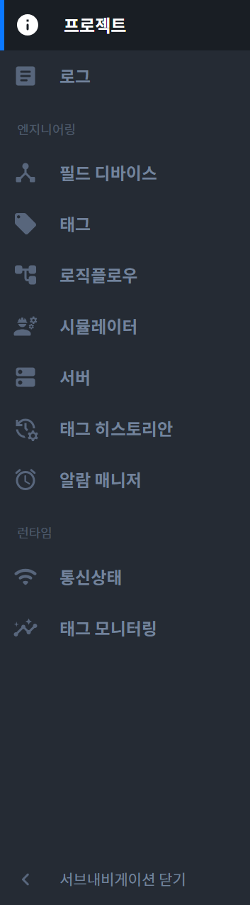

{: .no_toc }
# 메인 내비게이션
프로젝트에 관련된 메뉴가 표시됩니다. 메인 내비게이션에 마우스를 올리면 내비게이션이 확장됩니다. 

- TOC
{:toc}

## 프로젝트
- 프로젝트의 정보를 확인하거나 수정할 수 있습니다. 자세한 내용은 [Project](../../pages/project/)를 참고하시기 바랍니다.

## 로그
- 프로젝트의 로그를 확인할 수 있습니다. 자세한 내용은 [Log](../../pages/project/)를 참고하시기 바랍니다.

## 필드 디바이스
- (...) 자세한 내용은 [Field Device](../../pages/field-device/)를 참고하시기 바랍니다.

## 태그
- (...) 자세한 내용은 [Tag](../../pages/tag/)를 참고하시기 바랍니다.

## 로직 플로우
- (...) 자세한 내용은 [Logic Flow](../../pages/logic-flow/)를 참고하시기 바랍니다.

## 시뮬레이터
- (...) 자세한 내용은 [Simulator](../../pages/simulator/)를 참고하시기 바랍니다.

## 서버
- (...) 자세한 내용은 [Server](../../pages/server/)를 참고하시기 바랍니다.

## 태그 히스토리안
- (...) 자세한 내용은 [Tag Historian](../../pages/tag-historian/)를 참고하시기 바랍니다.

## 알람 매니저
- (...) 자세한 내용은 [Alarm Manager](../../pages/alarm-manager/)를 참고하시기 바랍니다.

## 통신 상태
- (...) 자세한 내용은 [Communication](../../pages/communication/)를 참고하시기 바랍니다.

## 태그 모니터링
- (...) 자세한 내용은 [Monitoring](../../pages/monitoring/)를 참고하시기 바랍니다.

## 서브 내비게이션 버튼
- 보조적으로 사용되는 서브 내비게이션을 닫거나 열 수 있습니다.

