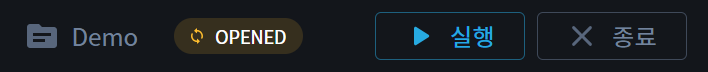
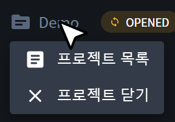
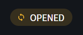

{: .no_toc }
# 프로젝트 바
프로젝트 오픈 시 애플리케이션 바에 프로젝트 바가 표시됩니다. 프로젝트의 상태를 변경할 수 있습니다.

- TOC
{:toc}

## 1. 프로젝트 명
- 현재 오픈된 프로젝트 이름을 표시합니다.
- 클릭 시 다음과 같은 메뉴가 표시됩니다.
  - 프로젝트 목록: 프로젝트 목록 페이지로 이동할 수 있습니다.
  - 프로젝트 닫기: 현재 오픈된 프로젝트를 종료할 수 있습니다.

## 2. 프로젝트 상태
- 프로젝트의 상태를 표시합니다. `OPENED`는 기본 상태이며, 프로젝트 실행 시 `RUNNING` 상태로 변경됩니다.

## 3. 프로젝트 상태 변경 버튼
- 프로젝트의 상태를 변경할 수 있습니다. 프로젝트가 오픈된 상태에서는 `실행` 버튼이 표시되며, 프로젝트 실행시에는 `중지` 버튼이 표시됩니다.

## 4. 프로젝트 종료 버튼
- 현재 오픈된 프로젝트를 종료할 수 있습니다.

