{: .no_toc }
# 테이블
엔티티의 속성을 행과 열의 형태로 나타냅니다. 엔티티를 추가/수정/삭제할 수 있습니다.

- TOC
{:toc}

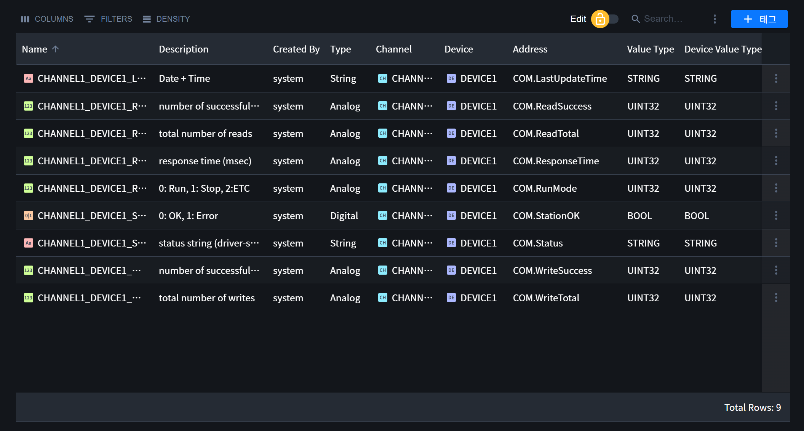

## 1. 툴바
- 테이블을 관리하고 조작할 수 있는 도구 모음입니다.

{: .note }
아이템이 다중 선택된 경우 툴바의 기능을 사용할 수 없습니다.

### 1.1. COLUMNS
- 컬럼을 숨기거나 나타나게 할 수 있습니다. 

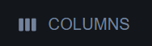

### 1.2. FILTERS
- 컬럼의 특정 조건에 따라 데이터를 필터링 할 수 있습니다. 

### 1.3. DENSITY
- 로우의 높이를 조절할 수 있습니다.

### 1.4. 잠금 기능
- 아이템 상세보기 버튼을 사용하여 오픈된 우측 패널의 속성 수정 여부를 결정합니다. 
- Lock: 아이템의 정보를 나타냅니다.
- Edit: 아이템의 속성을 수정할 수 있습니다.

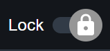
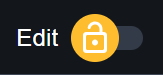

### 1.5. 검색필드
- 테이블의 데이터를 검색어에 따라 필터링합니다.

### 1.6. 메뉴
- 컬럼 헤더 필터의 사용 여부를 설정할 수 있습니다.
- 각 페이지마다 메뉴의 아이템은 상이할 수 있습니다.

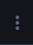

### 1.7. 기타 아이템
- 테이블의 아이템 추가를 위한 버튼 또는 기타 정보를 포함할 수 있습니다.

## 2. 컬럼 (열)

### 2.1. 컬럼 메뉴
- Sort: 해당 컬럼을 기준하여 데이터를 오름차순(ASC) 또는 내림차순(DESC)으로 정렬할 수 있습니다. 
- Pin: 해당 컬럼을 오른쪽 또는 왼쪽에 고정할 수 있습니다.
- Filter: 해당 컬럼에 특정 조건을 설정하고 데이터를 필터링 할 수 있습니다. 
- Column: 해당 컬럼을 숨기거나 나타나게 할 수 있습니다. 

### 2.2. 리사이징
- 컬럼의 길이를 조정할 수 있습니다.
- 컬럼 사이의 바를 클릭한 후 원하는 길이만큼 드래그하면 길이가 조정됩니다.

### 2.3. 컬럼 순서 변경
- 컬럼을 원하는 순서대로 변경할 수 있습니다.
- 순서를 변경하고 싶은 컬럼의 이름을 클릭한 뒤 원하는 컬럼 위치로 드래그하면 순서가 변경됩니다.

### 2.4. 컬럼 헤더 필터
- 테이블 헤더의 컬럼 별 필터에 빠르게 액세스할 수 있는 기능입니다.
- 컬럼 헤더 필터는 초기에 숨겨져 있으며, 테이블 툴바의 메뉴 아이템을 통해 필터를 사용 여부를 설정할 수 있습니다.

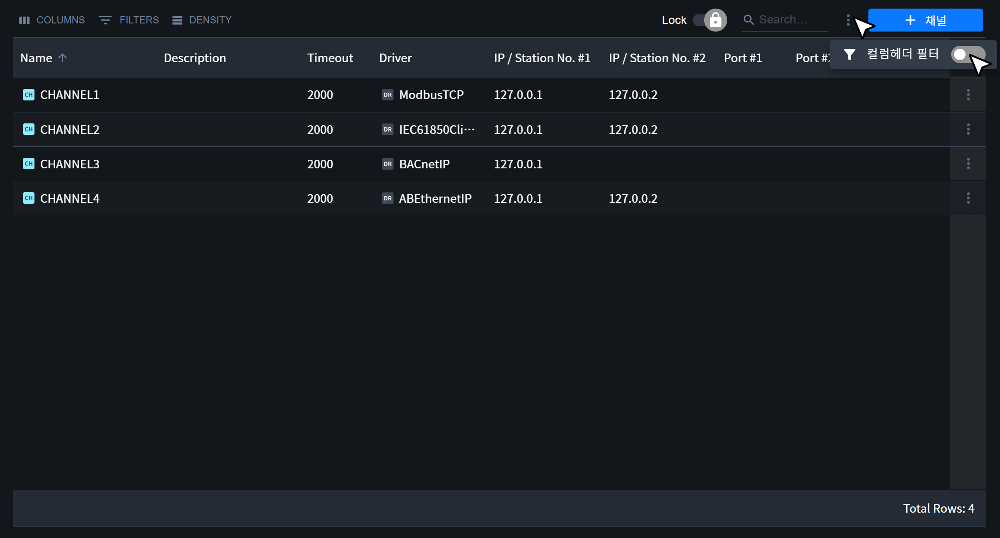

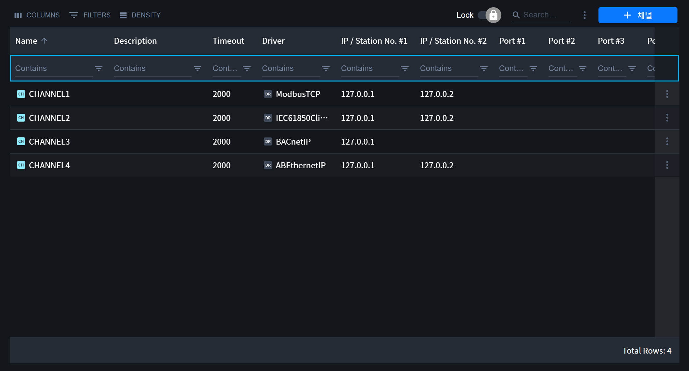

{: .note }
주기적으로 테이블의 데이터가 업데이트되는 페이지(시뮬레이터, 통신상태, 태그 모니터링)에서는 컬럼 헤더 필터의 설정을 변경할 수 없습니다.

## 3. 로우 (행)

### 3.1. 열 정렬
- 데이터를 오름차순(ASC) 또는 내림차순(DESC)으로 정렬할 수 있습니다. 

{: .highlight }
`Ctrl`키를 누른 후 다른 컬럼의 정렬 아이콘을 클릭하면 여러개의 컬럼을 기준으로 정렬할 수 있습니다. 

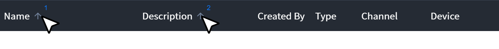

### 3.2. 우측 패널 오픈
- 로우에 마우스를 올리면 우측 패널을 오픈하는 버튼이 보입니다.
- 오픈 버튼을 클릭하면 우측 패널을 통해 해당 아이템의 속성 정보를 확인할 수 있습니다.

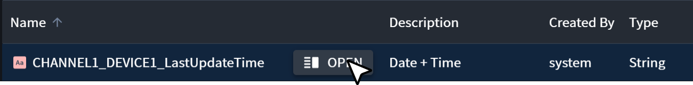

{: .note }
페이지의 특성에 따라 선택적으로 사용할 수 있는 기능입니다.

### 3.3. 하위 아이템 목록
- 아이템이 하위 아이템을 가진 경우 해당 목록 페이지로 이동할 수 있습니다.

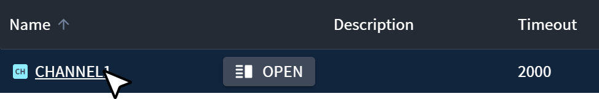

### 3.4. 로우 메뉴
- 아이템을 수정/삭제/복제 하거나 하위 아이템을 추가할 수 있습니다.

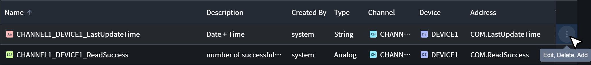

{: .note }
페이지의 특성에 따라 선택적으로 사용할 수 있는 기능입니다.

### 3.5. 전체 로우 수
- 전체 로우 수는 테이블의 우측 하단에 표기됩니다.

## 4. 선택

### 4.1. 아이템 선택
- 로우를 클릭하면 해당 아이템을 선택할 수 있습니다.
- `Ctrl` 키를 누르면서 선택된 아이템을 클릭하면 선택이 해제됩니다. 

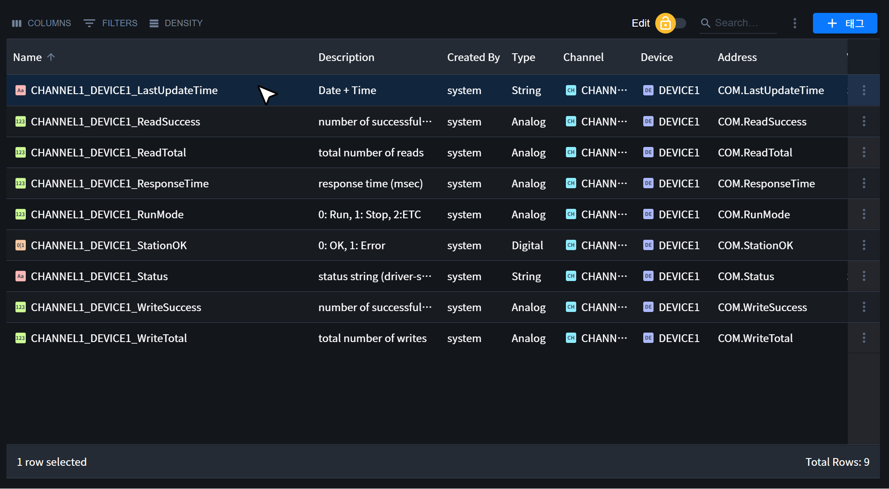

### 4.2. 아이템 다중 선택
- 아이템은 다음과 같은 방법으로 다중 선택 가능합니다.

| Keys                      | Description          |
| :------------------------ | :---------------- |
| `Shift` + `Arrow Up/Down` | 현재 선택된 아이템을 기준으로 화살표 키로 이동하며 다중 선택할 수 있습니다. |
| `Shift` + `Click`         | 현재 선택된 아이템을 기준으로 마우스로 클릭한 아이템까지 다중 선택할 수 있습니다. |
| `Ctrl` + `A`              | 모든 아이템을 선택합니다. |
| `Ctrl` + `Click`          | 클릭한 아이템만 다중 선택할 수 있습니다. |
|`첫번째 행을 클릭` => `SHIFT + END`| 모든 아이템을 선택합니다.|

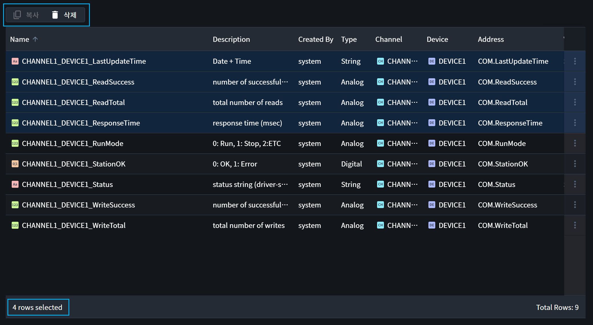

{: .note }
다중 선택 기능 사용 시 툴바에 있던 기본 기능을 사용 불가하며, 다중 선택을 위한 아이템이 테이블 좌측 상단에 표시됩니다.
