{: .no_toc }
# Omron: CS/CJ PLC
- TOC
{:toc}
## 1. 결선도
### 1.1 링크방식: Serial
RS-232C 결선은 다음과 같습니다.

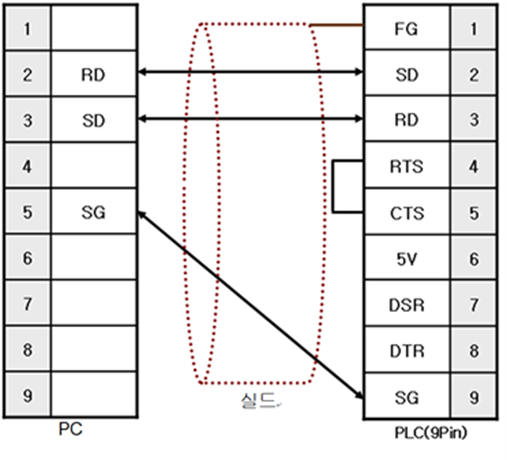

RS-422/485 결선은 다음과 같습니다.

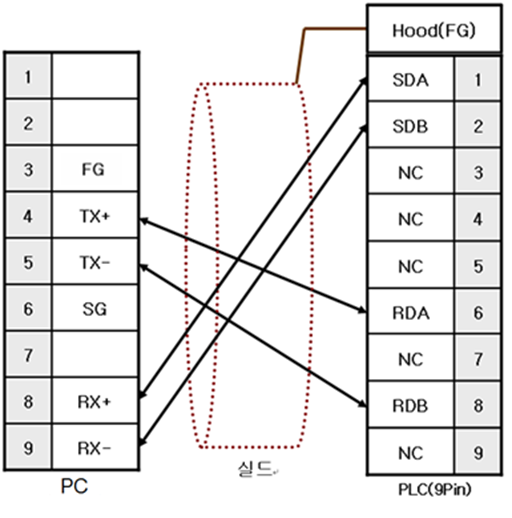

OMRON의 Host Link 프로토콜은 4선식 결선법만 제공하고 2선식 결선법은 제공하지 않습니다.   
다음 그림과 같이 스위치를 ‘4’의 위치로 놓이도록 설정하십시오.    
또한 종단 저항이 내장되어 있으므로 종단 저항 설정 스위치를 ‘ON’으로 설정하십시오.   

통신 모듈마다 설정 스위치가 다르므로 아래의 그림을 참고하여 설정하십시오.

{:.note}
>1. 주의 사항    
>☞ 안정적인 통신을 위해 실드결선을 권장합니다. (자세한 결선법은 OMRON 통신설명서를 참조바랍니다.)   
>☞ RS-422/485 통신 방식을 이용하여 1:N 연결 시에는 종단 스위치는 연결 설정 중 맨 마지막 통신 모듈에만 설정(ON)하십시오.   
>2. 용어 설명    
>☞ Host Link는 호스트 PC와 OMRON PLC 간의 연결을 말하며, EdgeHub는 이 방식을 사용하여 OMRON PLC와 통신을 합니다.   

### 1.2 링크 방식: Ethernet
1. 이더넷 결선
이더넷을 통해 아래와 같이 2가지 형태로 연결할 수 있습니다.

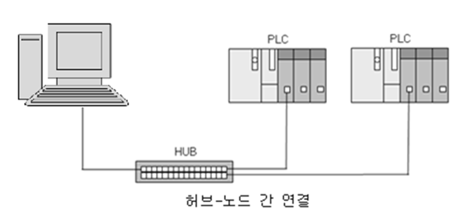

{:.note}
>☞ 허브-노드 간 연결할 때에는 다이렉트 케이블을 사용해야 하며, 1:1 연결할 때에는 크로스 케이블을 사용해야 합니다.

2.	이더넷 케이블
이더넷 케이블은 연결 형태에 따라 2가지 케이블로 나누어 집니다. 허브와 같은 네트워크 장비에 연결하여 랜(LAN)망으로 통신할 때는 다이렉트 케이블을 사용합니다. (허브-노드 간 연결 시)랜 망을 사용하지 않고 기기 간에 직접 연결할 수 있는데, 이 때는 크로스 케이블을 사용합니다.

다이렉트 케이블을 제작하는 방법은 아래와 같습니다.

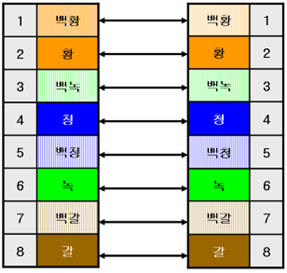 

위의 그림에서 ‘백황’, ‘백녹’, ‘백청’, ‘백갈’은 케이블 피복에 색 띠로 표시되어 있습니다.
예를 들면 ‘백청’은 흰색 피복에 파란색 색 띠로 제작되어 있습니다.

크로스 케이블을 제작하는 방법은 아래와 같습니다.

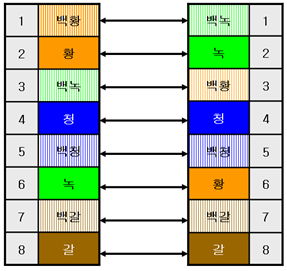 

{:.note}
>☞ 연결 방식에 맞게 사용하십시오.   
>☞ 모듈러 전용 툴을 이용하여 케이블을 제작하십시오. 접촉 불량이 발생할 수 있습니다.    
>☞ 모듈러 잭의 로크(Lock) 부분이 파손되면 RJ45 커넥터(이더넷 커넥터)에 고정이 안되어 접촉 불량이 발생할 수 있습니다.   
>☞ UTP 케이블은 단선 재질이므로 무리하게 케이블을 꺾거나 흔들면 케이블이 끊어지거나 특성이 나빠질 수 있습니다.    
>☞ 케이블 제작 시 플러그 커버(Plug Cover) 사용을 권장합니다.   

## 2. 통신드라이버 설정
### 2.1 링크 방식:Serial 
1. PLC 설정
PLC의 통신 파라미터는 CX-Programmer에서 설정합니다. 자세한 내용은 OMRON 통신 사용설명서를 참조 바랍니다. 여기서는 간단한 통신 설정 방법에 대해 설명 드리겠습니다.

- 1단계: 프로젝트 창에서 ‘IO Table and Unit Setup’을 선택하십시오.

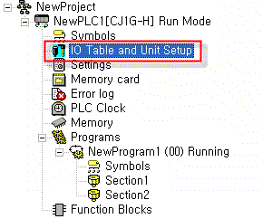

- 2단계: IO 설정 창이 표시되면 아래 예와 같이 PLC에 설치된 통신 모듈을 선택하십시오.

- 3단계: 아래와 같이 통신 설정 창이 표시되면 통신 파라미터를 설정하십시오.

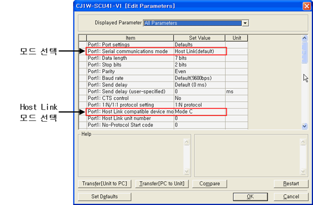

a. 모드(Serial communications mode)를 ‘Host Link’로 선택하십시오.   
b. Host Link 모드(Host Link compatible device mode)를 ‘Mode C’로 선택하십시오.    
c. 기본적인 통신 설정은 위의 그림과 같으나 통신설정을 임의로 변경하시려면 아래 그림과 같이 포트 설정(Port settings)을 ‘Defaults’에서 ‘User settings’으로 설정하십시오.   

- 4단계: 통신 모듈에서 ‘UNIT No.’를 설정하십시오. 이 때 ‘UNIT No.’는 1단계에서 통신모듈을 새로 추가할 때 입력하도록 되어 있습니다. 또한 아래 그림과 같이 IO 설정 창에서도 확인할 수 있습니다.

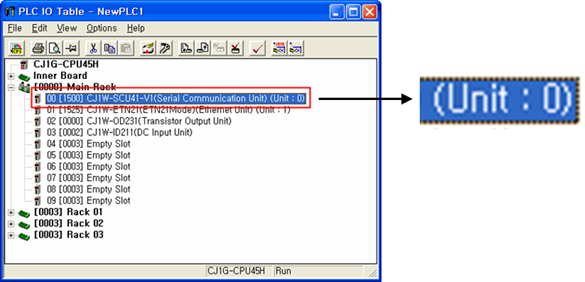

- 5단계: PLC 설정이 완료되었다면 EdgeHub에서 PLC 통신 설정 파라미터와 동일한 값으로 설정하십시오.

{:.note}
>1. PLC 설정 시 주의사항   
>☞ 본 사용설명서는 간단한 설정만 설명하기에 통신 설정 시 반드시 OMRON 통신 사용설명서를 참조 바랍니다.    
>☞ OMRON PLC 설정 부분은 예고 없이 변경될 수 있사오니 통신 설정 전에 반드시 OMRON 통신 사용설명서를 확인하여 주십시오.   
>2. 통신 상태 확인    
>☞ PLC 이더넷 모듈에 SD, RD LED가 있습니다. 정상적으로 통신이 이루어지면 LED가 빠르게 점멸합니다.   

2.	EdgeHub 설정: OmronS
    1. 채널 추가
        자세한 사용법은  [매뉴얼의 Pages-필드디바이스-채널추가](http://localhost:4000/docs/pages/field-device/#31-%EC%B1%84%EB%84%90-%EC%B6%94%EA%B0%80)를 참고해 주세요

        채널추가 리스트에서 “OmronS”를 선택한 후 “확인” 버튼을 누릅니다.

        

    2. 채널 속성 설정

        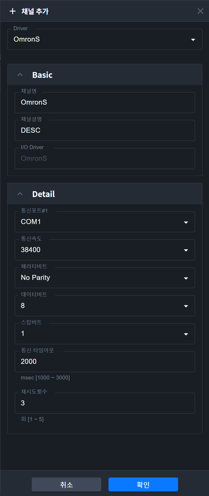

        - 채널 명 : 통신채널 이름을 입력합니다. 
        - 채널 설명 : 통신채널 설명을 입력합니다.
        - 통신포트 #1 : PC의 시리얼 포트를 선택합니다.
        - 통신속도 : 시리얼 통신 속도를 선택합니다.
        - 패리티비트 : 패리티비트를 선택합니다.
        - 데이터비트 : 데이터비트를 선택합니다.
        - 스톱비트 : 스톱비트를 선택합니다.
        - 타임아웃 : 장비에서 데이터를 요청한 후 Time Out으로 처리하게 되는 시간을 말합니다. 통신 오류를 판별하는 근거가 됩니다.
        - 재시도 횟수 : 통신 실패시 재시도하는 횟수를 설정합니다.
        - 저장 : 저장 버튼을 누르면, 설정된 통신 채널 정보가 저장되고 상단의 채널 리스트에 표시 됩니다

    3. Device 추가
        자세한 사용법은  [매뉴얼의 Pages-필드디바이스-디바이스 추가](http://localhost:4000/docs/pages/field-device/#41-%EB%94%94%EB%B0%94%EC%9D%B4%EC%8A%A4-%EC%B6%94%EA%B0%80)를 참고해 주세요

    4. Device 속성 설정

        

        - 디바이스 명 : 디바이스 이름을 입력합니다. 
        - 디바이스 설명 : 디바이스 설명을 입력합니다.
        - PLC CPU 종류 : PLC CPU 종류를 선택합니다.
        - Station 번호 : PLC Cnet 모듈의 국번을 입력합니다.
        - 저장 : 저장하면 메인 화면의 디바이스 트리에 디바이스가 추가됩니다. 메인 화면의 태그 리스트에는 디바이스 관련 시스템 태그들이 자동으로 추가 됩니다

    5. Block 추가
        자세한 사용법은  [매뉴얼의 Pages-필드디바이스-블록 추가](http://localhost:4000/docs/pages/field-device/#51-%EB%B8%94%EB%A1%9D-%EC%B6%94%EA%B0%80)를 참고해 주세요

    6. Block 속성 설정
        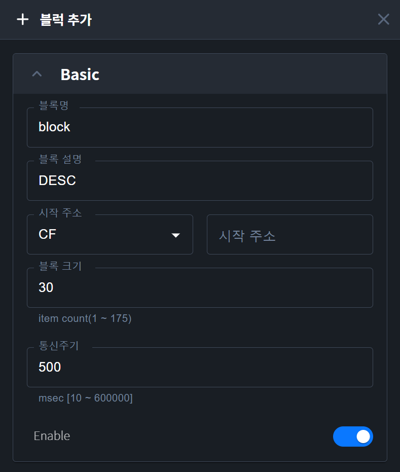 

        - Block 번호 : Block의 고유 번호 입니다. 각각의 Block은 서로 다른 Block 번호를 지정해 주어야 합니다.
        - 설명 : Block 설명을 입력합니다.
        - 시작 Address : Block의 시작 Address를 입력합니다. 
            - 시작Address 	: 메모리타입(CIO,WR,HR,AR,TF,CF,EM0 .....)+시작번지
            - Block 크기 	: 읽어올 갯수 

            예제1) 시작Address : CIO10, Block 크기 : 100 이라 하면, CIO 메모리(0부터 시작)의  10번째 WORD부터 100개의 WORD를 읽어온다.

            예제2) 시작Address : TF20, Block크기 : 20이라 하면, TF 메모리(0부터 시작)의 20번째 상태 Bit부터 20개의 상태 Bit를 읽어온다.

            주의) CIO, LR, HR, AR, TIM, CNT, DM, EM, EM0, EM1, EM2, EM3, EM4, EM5, EM6, EM7, EM8, EM9, EMA, EMB, EMC 은 WORD단위의 디바이스 다.

            주의) TF,CF 는 Bit단위의 디바이스 이다.

            주의) WORD단위의 디바이스는 30개이상, Bit단위의 디바이스는 120개 이상이면, Multi Frame으로 읽게 된다.

        - 통신 주기 : 해당 Block의 데이터 수집 주기를 msec 단위로 입력합니다.
        - Block 크기 : 해당 구별자별 읽고자하는 갯수
        - 저장 : 저장 버튼을 누르면, 설정된 Block 정보가 저장이 되고, 상단의 블록 리스트에 추가 됩니다..
        - 삭제 : 삭제 버튼을 누르면, 현재 선택된 Blcok이 삭제됩니다.

    7.	입출력 주소
        - 아날로그 입력Address 사용예제
        CIO_100 		: CIO영역의 100번째 Word값을 가져온다
        EM7_20000 	: EM7영역의 20000번째 Word값을 가져온다.
        - 디지털 입력Address 사용예제
        CIO_90A		: CIO영역의 90번째 WORD의 10(A)번째 Bit 값을 가져온다.
        EM7_07		: EM7영역의 0번째 WORD의 7번째 Bit 값을 가져온다.
        TF_123		: Timer Flag영역의 123번째 타이머 Completion Flag 값을 가져온다.
        - Omron PLC 메모리 디바이스 맵

        |메모리코드|특성|데이터 형식|CS/CJ CPU 메모리 번지|CV CPU 번지|비고|어드레스 적용예제|
    |:--------|:---|:-------|:---------------------|:---|:----------------|
    |CIO	|CIO Area|	WORD	|0~6143	|0~2555	|-|　	AI : CIO_xxxx (xxxx는 0~6143 의 십진수)  CIO_100 DI : CIO_xxxx0~F (xxxx는 0~6143의 십진수)   CIO_100A|
    |LR	 |CIO1000~CIO1199|WORD|		0~199|	-|	-|　	AI : WR_xxxx (xxxx는 0~511 의 십진수)  WR_100 DI : WR_xxxx0~F(xxxx는 0~511의 십진수)   WR_0F|
    |HR	|Holding Bit Area	|WORD|	0~511	|-|	　-|	AI : HR_xxxx (xxxx는 0~511 의 십진수)  HR_234  DI : HR_xxxx0~F(xxxx는 0~511의 십진수)   HR_19|
    |AR	|Auxiliary Bit Area|WORD|		0~959	|0~959|	0~447(읽기전용), 448~959 (읽기/쓰기)	|AI : AR_xxxx (xxxx는 0~511 의 십진수)  AR_800  DI : AR_xxxx0~F(xxxx는 0~511의 십진수)   AR_9001|
    |TF	|Timer Area	|Completion Flag(BIT)|	0~2047	|0~2047 또는 0~1023|	읽기전용|	DI : TF_xxxx( xxxx는 0~4095의 십진수), TF_2047| 
    |CF	|Counter Area|Completion Flag(BIT)|		0~2047|	0~2047 또는 0~1023|읽기전용|		DI : CF_xxxx( xxxx는 0~4095의 십진수), CF_2048 |
    |TIM|	Timer Area PV	|WORD|	0~2047|	0~2047 또는 0~1023|-|	　	AI : TIM_xxxx ( xxxx는 0~4095의 십진수) TIM_1000|
    |CNT|	Counter Area PV	|WORD|0~2047|	0~2047 또는 0~1023|-|		　	AI : CNT_xxxx ( xxxx는 0~4095의 십진수) CNT_2000|
    |DM	|DM Area|WORD|		0~9999|0~9999|-|	　	AI : DM_xxxxx (xxxxx는 0~32767 의 십진수)  DM_10000  DI : DM_xxxxx0~F(xxxxx는 0~32767의 십진수)   DM_900E|
    |EM0~EM7	|EM Area	|WORD|		0~9999|0~9999|-|	　	AI : EM0_xxxxx (xxxxx는 0~32767 의 십진수)  EM0_9000 DI : EM0_xxxxx0~F(xxxxx는 0~32767의 십진수)   EM0_7000A|
    |EM8~EMC	|EM Area	|WORD|		0~9999|	-|-|　	AI : EMA_xxxxx (xxxxx는 0~32767 의 십진수)  EMA_9000 DI : EMA_xxxxx0~F(xxxxx는 0~32767의 십진수)  EMA_7000A|

### 2.2 링크 방식:Ethernet
1. PLC 설정
PLC의 통신 파라미터는 CX-Programmer에서 설정합니다. 자세한 내용은 OMRON 통신 사용설명서를 참조 바랍니다. 여기서는 간단한 통신 설정 방법에 대해 설명 드리겠습니다.

- 1단계: 프로젝트 창에서 ‘IO Table and Unit Setup’을 선택하십시오.

- 2단계: IO 설정 창이 표시되면 PLC에 설치된 이더넷 통신 모듈을 선택하십시오.

- 3.1단계: 이더넷 모듈은 2가지 통신 프로토콜 형태로 모듈을 설정할 수 있습니다. 먼저 UTP/IP 설정 방법에 대해 설명 드리겠습니다.   
    a. 아래와 같이 표시된 설정 창에서 ‘Auto(dynamic)’ 방식을 선택하십시오.

    

    b. IP 어드레스와 Sub-net Mask를 설정하십시오. Sub-net Mask는 그림과 같이 ‘255.255.255.0’으로 설정하십시오. 또한 IP 어드레스는 EdgeHub와 주소 3자리(XXX.XXX.XXX. ~) 같아야 합니다. (같은 네트워크 내에 연결되어 있어야 함)   
    c. 포트를 ‘Default(9600)’ 로 설정하십시오.

- 3.2단계: TCP/IP 설정 방법에 대해 설명 드리겠습니다.
    a. 아래와 같이 표시된 설정 창에서 ‘Auto(dynamic)’ 방식을 선택하십시오.

    

    b. IP 어드레스와 Sub-net Mask를 설정하십시오. Sub-net Mask는 그림과 같이 ‘255.255.255.0’으로 설정하십시오. 또한 IP 어드레스는 EdgeHub와 주소 3자리(XXX.XXX.XXX. ~) 같아야 합니다. (같은 네트워크 내에 연결되어 있어야 함)
    c. 포트를 ‘Default(9600)’ 설정하십시오. 
    d. 아래 그림과 같이 FINS/TCP Server로 설정하십시오. 기본적으로 설정되어 있으니 확인하여 주십시오.

    

- 4단계: PLC 설정이 완료되었다면 EdgeHub에서 PLC 통신 설정 파라미터와 동일한 값으로 설정하십시오.

{:.note}
>1. 통신 상태 확인   
>☞ PLC 이더넷 모듈에 SD, RD LED가 있습니다. 정상적으로 통신이 이루어지면 LED가 빠르게 점멸합니다.   
>2. PLC 설정 시 주의사항    
>☞ 본 사용설명서는 간단한 설정만 설명하기에 통신 설정 시 반드시 OMRON 통신 사용설명서를 참조 바랍니다.    
>☞ OMRON PLC 설정 부분은 예고 없이 변경될 수 있사오니 통신 설정 전에 반드시 OMRON 통신 사용설명서를 확인하여 주십시오.   

2. EdgeHub 설정
    1. 채널 추가
        자세한 사용법은  [매뉴얼의 Pages-필드디바이스-채널추가](http://localhost:4000/docs/pages/field-device/#31-%EC%B1%84%EB%84%90-%EC%B6%94%EA%B0%80)를 참고해 주세요

        채널추가 리스트에서 “OmronE”를 선택한 후 “확인” 버튼을 누릅니다.

        

    2. 채널 속성 설정

        

        - 채널 명 : 통신채널 이름을 입력합니다. 
        - 채널 설명 : 통신채널 설명을 입력합니다.
        - 로컬 IP Address #1 : PC의 IP Address를 입력합니다.
        - 로컬 IP Address #2 : 라인 이중화를 사용할 경우 사용하게 될 두번째 IP Address를 입력합니다.
        - 타임아웃 : 장비에서 데이터를 요청한 후 Time Out으로 처리하게 되는 시간을 말합니다. 통신 오류를 판별하는 근거가 됩니다.
        - 재시도 횟수 : 통신 실패시 재시도하는 횟수를 설정합니다.
        - 저장 : 저장 버튼을 누르면, 설정된 통신 채널 정보가 저장되고 상단의 채널 리스트에 표시 됩니다. 

    3. Device 추가
        자세한 사용법은  [매뉴얼의 Pages-필드디바이스-디바이스 추가](http://localhost:4000/docs/pages/field-device/#41-%EB%94%94%EB%B0%94%EC%9D%B4%EC%8A%A4-%EC%B6%94%EA%B0%80)를 참고해 주세요

    4. Device 속성 설정

        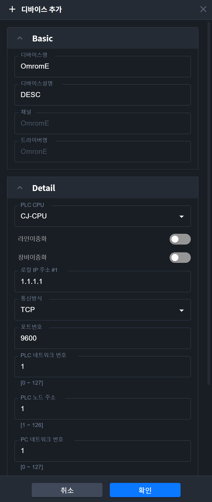

        - Station 이름 : Station 이름을 입력합니다. 
        - Station 설명 : Station 설명을 입력합니다.
        - 라인 이중화 : 라인 이중화를 사용할 경우 체크 합니다. 
         - 장비 이중화 : 장비 이중화를 사용할 경우 체크 합니다. 
        - PLC IP Address #1-1 : PLC 의 IP Address를 입력합니다.
        - PLC IP Address #1-2 : PLC 의 IP Address를 입력합니다. 라인 이중화를 사용할 때 입력합니다.
        - PLC IP Address #2-1 : PLC 의 IP Address를 입력합니다. 장비 이중화를 사용할 때 입력합니다.
         - PLC IP Address #2-2 : PLC 의 IP Address를 입력합니다. 라인 이중화와 장비 이중화를 함께 사용할 때 입력합니다.
        - 통신 방식 : UDP 를 사용하므로 화면상에는 표시하지 않았다.
        - 포트 번호 : FINS는 공장출하시 Default로 9600을 사용하며, 다른 포트로 설정하고 싶다면, PLC설정값을 바꾸어 사용하여도 무방하다. 
        - PLC Network Addr : 통신하고자 하는 Omron PLC 장비의 Network Address를 입력한다. Default ‘1’
        - PLC Node Addr : 통신하고자 하는 Omron PLC 장비의 Node Address를 입력한다. Default ‘1’
        - PC Network Addr : 통신하고 있는 PC(EdgeHub PC)의 Network Address를 입력한다. Default ‘1’
        - PC Node Addr : 통신하고 있는 PC(IEdgeHub PC)의 Node Address를 입력한다. Default ‘100’
        - UnitID : 0~F중 설정 한다. (국번)
        - 저장 : 저장하면 메인 화면의 디바이스 트리에 디바이스가 추가됩니다. 메인 화면의 태그 리스트에는 디바이스 관련 시스템 태그들이 자동으로 추가 됩니다.

    5. Block 추가
        자세한 사용법은  [매뉴얼의 Pages-필드디바이스-블록 추가](http://localhost:4000/docs/pages/field-device/#51-%EB%B8%94%EB%A1%9D-%EC%B6%94%EA%B0%80)를 참고해 주세요

    6. Block 속성 설정
         

        - Block 번호 : Block의 고유 번호 입니다. 각각의 Block은 서로 다른 Block 번호를 지정해 주어야 합니다.
        - 설명 : Block 설명을 입력합니다.
        - 시작 Address : Block의 시작 Address를 입력합니다. 
            - 시작Address 	: 메모리타입(CIO,WR,HR,AR,TF,CF,EM0 .....) + 시작번지
            - Block 크기 	: 읽어올 갯수 

            예제1) 시작Address : CIO10, Block 크기 : 100 이라 하면, CIO 메모리(0부터 시작)의  10번째 WORD부터 100개의 WORD를 읽어온다.

            예제2) 시작Address : TF20, Block크기 : 20이라 하면, TF 메모리(0부터 시작)의 20번째 상태 Bit부터 20개의 상태 Bit를 읽어온다.

            ※	CIO, WR, HR, AR, TIM, CNT, DM, EM, EM0, EM1, EM2, EM3, EM4, EM5, EM6, EM7, EM8, EM9, EMA, EMB, EMC, EM_CURR, DR은 WORD단위의 디바이스이며, IR은 DWORD단위의 디바이스이다.
            TKF, TKS, TF, CF 는 Bit단위의 디바이스 이다.

        - 통신 주기 : 해당 Block의 데이터 수집 주기를 msec 단위로 입력합니다.
        - Block 크기 : 해당 구별자별 읽고자하는 갯수
        - 저장 : 저장 버튼을 누르면, 설정된 Block 정보가 저장이 되고, 상단의 블록 리스트에 추가 됩니다.
        - 삭제 : 삭제 버튼을 누르면, 현재 선택된 Blcok이 삭제됩니다.

    7. 입출력 주소
    -  아날로그 입력Address 사용예제
        CIO_100 		: CIO영역의 100번째 Word값을 가져온다
        EM7_20000 	: EM7영역의 20000번째 Word값을 가져온다.
    -  디지털 입력Address 사용예제
        CIO_90A		: CIO영역의 90번째 WORD의 10(A)번째 Bit 값을 가져온다.
        EM7_07		: EM7영역의 0번째 WORD의 7번째 Bit 값을 가져온다.
        TF_123		: Timer Flag영역의 123번째 타이머 Completion Flag 값을 가져온다.

    - Omron PLC 메모리 디바이스 맵

    |메모리코드|특성|데이터 형식|CS/CJ CPU 메모리 번지|CV CPU 번지|비고|어드레스 적용예제|
    |:--------|:---|:-------|:---------------------|:---|:----------------|
    |CIO	|CIO Area|	WORD	|0~6143	|0~2555	|-|　	AI : CIO_xxxx (xxxx는 0~6143 의 십진수)  CIO_100 DI : CIO_xxxx0~F (xxxx는 0~6143의 십진수)   CIO_100A|
    |LR	 |CIO1000~CIO1199|WORD|		0~199|	-|	-|　	AI : WR_xxxx (xxxx는 0~511 의 십진수)  WR_100 DI : WR_xxxx0~F(xxxx는 0~511의 십진수)   WR_0F|
    |HR	|Holding Bit Area	|WORD|	0~511	|-|	　-|	AI : HR_xxxx (xxxx는 0~511 의 십진수)  HR_234  DI : HR_xxxx0~F(xxxx는 0~511의 십진수)   HR_19|
    |AR	|Auxiliary Bit Area|WORD|		0~959	|0~959|	0~447(읽기전용), 448~959 (읽기/쓰기)	|AI : AR_xxxx (xxxx는 0~511 의 십진수)  AR_800  DI : AR_xxxx0~F(xxxx는 0~511의 십진수)   AR_9001|
    |TF	|Timer Area	|Completion Flag(BIT)|	0~2047	|0~2047 또는 0~1023|	읽기전용|	DI : TF_xxxx( xxxx는 0~4095의 십진수), TF_2047| 
    |CF	|Counter Area|Completion Flag(BIT)|		0~2047|	0~2047 또는 0~1023|읽기전용|		DI : CF_xxxx( xxxx는 0~4095의 십진수), CF_2048 |
    |TIM|	Timer Area PV	|WORD|	0~2047|	0~2047 또는 0~1023|-|	　	AI : TIM_xxxx ( xxxx는 0~4095의 십진수) TIM_1000|
    |CNT|	Counter Area PV	|WORD|0~2047|	0~2047 또는 0~1023|-|		　	AI : CNT_xxxx ( xxxx는 0~4095의 십진수) CNT_2000|
    |DM	|DM Area|WORD|		0~9999|0~9999|-|	　	AI : DM_xxxxx (xxxxx는 0~32767 의 십진수)  DM_10000  DI : DM_xxxxx0~F(xxxxx는 0~32767의 십진수)   DM_900E|
    |EM0~EM7	|EM Area	|WORD|		0~9999|0~9999|-|	　	AI : EM0_xxxxx (xxxxx는 0~32767 의 십진수)  EM0_9000 DI : EM0_xxxxx0~F(xxxxx는 0~32767의 십진수)   EM0_7000A|
    |EM8~EMC	|EM Area	|WORD|		0~9999|	-|-|　	AI : EMA_xxxxx (xxxxx는 0~32767 의 십진수)  EMA_9000 DI : EMA_xxxxx0~F(xxxxx는 0~32767의 십진수)  EMA_7000A|

## 3. 사용 가능 디바이스
사용 가능한 디바이스는 통신드라이버의 입출력 주소를 참고하시기 바랍니다. 

{:.note}
>☞ 디바이스 영역 범위를 벗어나지 않도록 사용하여 주십시오.     
>☞ CPU모듈에 따라 디바이스 범위 차이가 있을 수 있습니다. 각 CPU모듈 사용설명서를 참조 바랍니다.   

  
