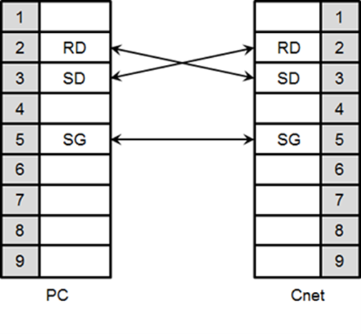
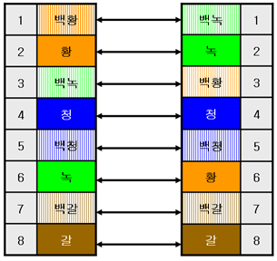
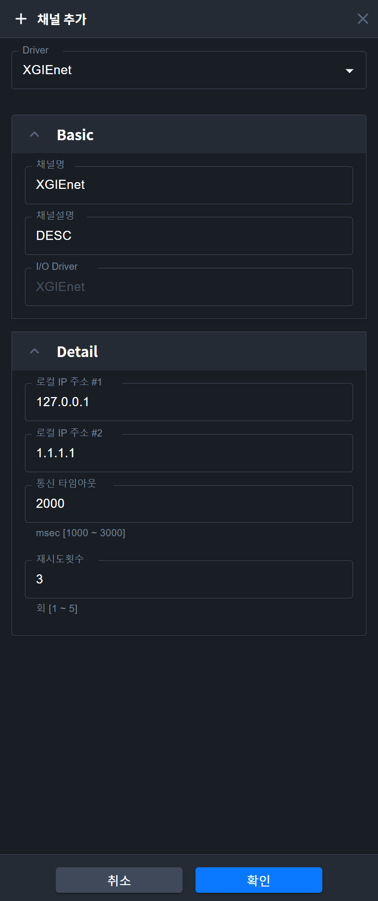
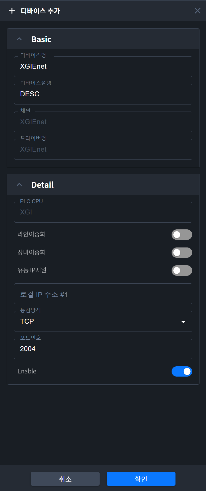
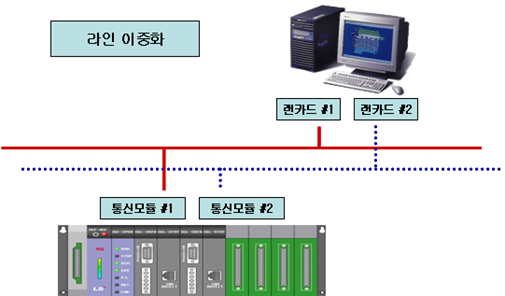

{: .no_toc }
# LS ELECTRIC :XGI PLC (XGREnet 포함)
- TOC
{:toc}

## 1. PLC 목록
접속이 가능한 PLC 목록은 아래와 같습니다.

|PLC 명	| CPU모듈	|접속 방식	|통신 방식	|접속 모듈|	비고|
|:-------|:---------|:--------|:----------|:-------|:-----|
|XGI |	CPUE |링크 방식|RS-232C|	XGL-C22A, XGL-CH2A|Cnet|
|     | CPUH |링크 방식|RS-422/485	|XGL-C42A, XGL-CH2A|Cnet|
|     |  CPUS|링크 방식|이더넷	|XGL-EFMT|-|
|     |  CPUU|||||
|      |  CPUU/D|||||		
|XGR	|CPUH, INC|링크방식|EtherNet/IP	|XGL-EIPT	||
|XGB	|XECH|||||

							

{:.note}
>1. 지원하지 않는 PLC 
>☞ 광 이더넷 모듈(XGL-EFMF)은 지원하지 않습니다.
>2. 용어 설명
>☞ 링크(Link): PLC 통신모듈과 통신하는 것을 말합니다.

## 2. 결선도
### 2.1 링크 방식:Cnet
Cnet은 RS-232C용과 RS-422/485용으로 구분되어 있습니다.
RS-232C Cnet 결선은 다음과 같습니다.

RS-422 결선은 아래와 같습니다.

RS-485 결선은 아래와 같습니다.

{:.note}
>☞ PC에서 RS-422/485 결선을 사용하려면 RS232 to RS422/485 컨버터가 필요합니다.
>☞ PLC의 RS-422/485 포트는 단자대로 되어 있으므로 별도의 컨버터가 필요 없습니다.

### 2.2 링크 방식: FEnet
1. 이더넷 결선
이더넷을 통해 아래와 같이 2가지 형태로 연결할 수 있습니다.

{:.note}
>☞ 허브-노드 간 연결할 때에는 다이렉트 케이블을 사용해야 하며, 1:1 연결할 때에는 크로스 케이블을 사용해야 합니다.

2. 이더넷 케이블
이더넷 케이블은 연결 형태에 따라 2가지 케이블로 나누어 집니다. 허브와 같은 네트워크 장비에 연결하여 랜(LAN)망으로 통신할 때는 다이렉트 케이블을 사용합니다. (허브-노드 간 연결 시)랜 망을 사용하지 않고 기기 간에 직접 연결할 수 있는데, 이 때는 크로스 케이블을 사용합니다.

다이렉트 케이블을 제작하는 방법은 아래와 같습니다.

 

위의 그림에서 ‘백황’, ‘백녹’, ‘백청’, ‘백갈’은 케이블 피복에 색 띠로 표시되어 있습니다.
예를 들면 ‘백청’은 흰색 피복에 파란색 색 띠로 제작되어 있습니다.
크로스 케이블을 제작하는 방법은 아래와 같습니다.

 

{:.note}
>☞ 연결 방식에 맞게 사용하십시오.
>☞ 모듈러 전용 툴을 이용하여 케이블을 제작하십시오. 접촉 불량이 발생할 수 있습니다.
>☞ 모듈러 잭의 로크(Lock) 부분이 파손되면 RJ45 커넥터(이더넷 커넥터)에 고정이 안되어 접촉 불량이 발생할 수 있습니다.
>☞ UTP 케이블은 단선 재질이므로 무리하게 케이블을 꺾거나 흔들면 케이블이 끊어지거나 특성이 나빠질 수 있습니다. 
>☞ 케이블 제작 시 플러그 커버(Plug Cover) 사용을 권장합니다.

## 3. 통신드라이버 설정
### 3.1 링크 방식:Cnet
1. PLC 설정
PLC의 Cnet 통신 파라미터는 XG-PD에서 설정합니다. (XGT Cnet 사용설명서 참조 바랍니다.)
Cnet설정은 다음과 같이 합니다.

 

설정하고자 하는 채널에 통신 파라미터를 설정합니다. 동작 모드는 XGT 서버를 선택하십시오.
설정한 정보를 PLC에 쓰기가 완료되면 PLC를 리셋하여 주십시오.

{:.note}
>1. 통신 상태 확인 
>☞ XG-PD에는 모니터 기능이 있습니다. 이 기능을 사용하시면 통신 데이터를 확인할 수 있습니다.
>☞ Cnet 모듈에 RX, TX LED가 있습니다. 정상적으로 통신이 이루어지면 LED가 빠르게 점멸합니다.
>2. PLC 설정 시 주의사항
>☞ XG-PD에서 통신 파라미터 설정 후 반드시 PLC를 리셋시켜 주십시오.
>☞ 본 설명서에서는 간략하게 설명하고 있습니다. 설정 시 반드시 XGT Cnet 사용설명서를 참조 바랍니다.
>☞ 2개의 채널을 사용하지 않고 1개만 사용할 때에도 다른 채널의 통신 형태를 설정하여 주십시오.

2. EdgeHub 설정: XGInet
    1. 채널 추가
    자세한 사용법은  [매뉴얼의 Pages-필드디바이스-채널추가](http://localhost:4000/docs/pages/field-device/#31-%EC%B1%84%EB%84%90-%EC%B6%94%EA%B0%80)를 참고해 주세요

    채널추가 리스트에서 “XGICnet”를 선택한 후 “확인” 버튼을 누릅니다. 

    

    2. 채널 속성 설정

    

    - 채널 명 : 통신채널 이름을 입력합니다. 
    - 채널 설명 : 통신채널 설명을 입력합니다.
    - 통신포트 #1 : PC의 시리얼 포트를 선택합니다.
    - 통신속도 : 시리얼 통신 속도를 선택합니다.
    - 패리티비트 : 패리티비트를 선택합니다.
    - 데이터비트 : 데이터비트를 선택합니다.
    - 스톱비트 : 스톱비트를 선택합니다.
    - 타임아웃 : 장비에서 데이터를 요청한 후 Time Out으로 처리하게 되는 시간을 말합니다. 통신 오류를 판별하는 근거가 됩니다.
    - 재시도 횟수 : 통신 실패시 재시도하는 횟수를 설정합니다.
    -  저장 : 저장 버튼을 누르면, 설정된 통신 채널 정보가 저장되고 상단의 채널 리스트에 표시 됩니다.

    3. Device 추가
    자세한 사용법은  [매뉴얼의 Pages-필드디바이스-디바이스 추가](http://localhost:4000/docs/pages/field-device/#41-%EB%94%94%EB%B0%94%EC%9D%B4%EC%8A%A4-%EC%B6%94%EA%B0%80)를 참고해 주세요

    4. Device 속성 설정

    

    - 디바이스 명 : 디바이스 이름을 입력합니다. 
    - 디바이스 설명 : 디바이스 설명을 입력합니다.
    - PLC CPU 종류 : PLC CPU 종류를 선택합니다.
    - Station 번호 : PLC Cnet 모듈의 국번을 입력합니다.
    - 저장 : 저장하면 메인 화면의 디바이스 트리에 디바이스가 추가됩니다. 메인 화면의 태그 리스트에는 디바이스 관련 시스템 태그들이 자동으로 추가 됩니다.

    5. Block 추가
    자세한 사용법은  [매뉴얼의 Pages-필드디바이스-블록 추가](http://localhost:4000/docs/pages/field-device/#51-%EB%B8%94%EB%A1%9D-%EC%B6%94%EA%B0%80)를 참고해 주세요

    6. Block 속성 설정

    

    - Block 번호 : Block의 고유 번호 입니다. 각각의 Block은 서로 다른 Block 번호를 지정해 주어야 합니다.
    - 설명 : Block 설명을 입력합니다.
    - 시작 Address : Block의 시작 Address를 입력합니다. 아래와 같은 방법으로 Address를 지정합니다.
        - 올바른 예제: %MW0, %MW20, %IW0.0.0, %QW1.0.0
        - 잘못된 예제: %MW0.0.0, %IW0, %QW0
    - 통신 주기 : 해당 Block의 데이터 수집 주기를 msec 단위로 입력합니다.
    - Block 크기 : 해당 Block의 Block 크기를 Word(2 byte) 단위로 입력합니다.
    - 저장 : 저장 : 저장 버튼을 누르면, 설정된 Block 정보가 저장이 되고, 상단의 블록 리스트에 추가 됩니다.
    - 삭제 : 삭제 버튼을 누르면, 현재 선택된 Blcok이 삭제됩니다.

    7. 입출력 주소
    - 형식
        - 아날로그 : %MX0, %MB0, %MW0, %MD0, %ML0, %IW0.0.0, %QW0.0.0
        - 디지털 : %MB0.0, %MW0.0, %MD0.0, %ML0.0, %IX0.0.0, %QX0.0.0
    - 사용가능한 디바이스
        - A, F, I, M, Q, R, W

### 3.2 링크 방식: FEnet
1. PLC 설정
FEnet 통신 파라미터는 XG-PD에서 설정합니다. (XGT FEnet 사용설명서 참조 바랍니다.)

통신 모듈을 설정할 때는 FEnet으로 설정하십시오.   
IP주소, 게이트웨이 등 통신 파라미터를 설정하십시오. 드라이버 설정에서 XGT 서버를 선택하십시오.

쓰기가 완료되면 PLC를 리셋하십시오. PLC 또는 모듈이 리셋되면 설정이 완료됩니다.

{:.note}
>통신 상태 확인 
>☞ PLC FEnet 모듈에 RX, TX LED가 있습니다. 정상적으로 통신이 이루어지면 LED가 빠르게 점멸합니다.

2. EdgeHub 설정: XGIEnet

     1. 채널 추가
    자세한 사용법은  [매뉴얼의 Pages-필드디바이스-채널추가](http://localhost:4000/docs/pages/field-device/#31-%EC%B1%84%EB%84%90-%EC%B6%94%EA%B0%80)를 참고해 주세요

    채널추가 리스트에서 “XGIEnet”를 선택한 후 “확인” 버튼을 누릅니다. 

    

    2. 채널 속성 설정

    

    - 채널 명 : 통신채널 이름을 입력합니다. 
    - 채널 설명 : 통신채널 설명을 입력합니다.
    - 로컬 IP Address #1 : PC의 IP Address를 입력합니다.
    - 로컬 IP Address #2 : 라인 이중화를 사용할 경우 사용하게 될 두번째 IP Address를 입력합니다.
    - 타임아웃 : 장비에서 데이터를 요청한 후 Time Out으로 처리하게 되는 시간을 말합니다. 통신 오류를 판별하는 근거가 됩니다.
    - 재시도 횟수 : 통신 실패시 재시도하는 횟수를 설정합니다.
    - 저장 : 저장 버튼을 누르면, 설정된 통신 채널 정보가 저장되고 상단의 채널 리스트에 표시 됩니다.

    3. Device 추가
    자세한 사용법은  [매뉴얼의 Pages-필드디바이스-디바이스 추가](http://localhost:4000/docs/pages/field-device/#41-%EB%94%94%EB%B0%94%EC%9D%B4%EC%8A%A4-%EC%B6%94%EA%B0%80)를 참고해 주세요

    4. Device 속성 설정

    

    - 디바이스 명 : 디바이스 이름을 입력합니다. 
    - 디바이스 설명 : 디바이스 설명을 입력합니다.
    - PLC CPU 종류 : PLC CPU 종류를 선택합니다.
    - 라인 이중화 : 라인 이중화를 사용할 경우 체크 합니다. 컴퓨터에 랜카드 2개를 설치하고, PLC에 Enet 통신 모듈을 2개 설치하여, 그림과 같이 네트웍을 분리하여 통신하고자 할 때 사용합니다. 네트웍 라인에 이상이 있을때를 대비하기 위한 이중화 옵션 입니다.

    

    - 장비 이중화 : 장비 이중화를 사용할 경우 체크 합니다. 컴퓨터에 랜카드 1개를 설치하고, PLC에 Enet 통신 모듈을 2개 설치하여, 그림과 같이 통신 모듈이 분리되어 있는 경우 사용합니다. PLC 통신 모듈에 이상이 있을때를 대비하기 위한 이중화 옵션 입니다.

    

    - PLC IP Address #1-1 : PLC 의 IP Address를 입력합니다.
    - PLC IP Address #1-2 : PLC 의 IP Address를 입력합니다. 라인 이중화를 사용할 때 입력합니다.
    - PLC IP Address #2-1 : PLC 의 IP Address를 입력합니다. 장비 이중화를 사용할 때 입력합니다.
    - PLC IP Address #2-2 : PLC 의 IP Address를 입력합니다. 라인 이중화와 장비 이중화를 함께 사용할 때 입력합니다.
    - 통신 방식 : TCP와 UDP 중의 한가지를 선택합니다.
    - 포트 번호 : 통신 방식 선택에 따라 자동으로 입력됩니다.
    - 유동 IP 지원 : 유동 IP 를 사용하고자 할 때, 체크합니다. 이 옵션은, hosts 파일 또는 DNS 서버로 부터 IP 어드레스를 얻어와서 통신할때 사용합니다. 따라서 hosts 파일 또는 DNS 서버에 호스트 이름 또는 URL이 등록되어 있어야 합니다. hosts 파일을 이용하는 방식은 다음과 같습니다. hosts 파일은 C:\WINDOWS\system32\drivers\etc 위치에 있습니다. hosts 파일이 아래와 같이 저장되어 있을 때, 유동 IP 는 다음과 같이 설정합니다. (DNS 서버를 이용할 때도, 설정방식은 동일 합니다.)

    

    

    - 저장 : 저장하면 메인 화면의 디바이스 트리에 디바이스가 추가됩니다. 메인 화면의 태그 리스트에는 디바이스 관련 시스템 태그들이 자동으로 추가 됩니다.

    5. Block 추가
    자세한 사용법은  [매뉴얼의 Pages-필드디바이스-블록 추가](http://localhost:4000/docs/pages/field-device/#51-%EB%B8%94%EB%A1%9D-%EC%B6%94%EA%B0%80)를 참고해 주세요

    6. Block 속성 설정
    

    - Block 번호 : Block의 고유 번호 입니다. 각각의 Block은 서로 다른 Block 번호를 지정해 주어야 합니다.
    - 설명 : Block 설명을 입력합니다.
    - 시작 Address : Block의 시작 Address를 입력합니다. 아래와 같은 방법으로 Address를 지정합니다.
        - 올바른 예제: %MW0, %MW20, %IW0.0.0, %QW1.0.0
        - 잘못된 예제: %MW0.0.0, %IW0, %QW0 
    - 통신 주기 : 해당 Block의 데이터 수집 주기를 msec 단위로 입력합니다.
    - Block 크기 : 해당 Block의 Block 크기를 Word(2 byte) 단위로 입력합니다.
    - 저장 : 저장 : 저장 버튼을 누르면, 설정된 Block 정보가 저장이 되고, 상단의 블록 리스트에 추가 됩니다.
    - 삭제 : 삭제 버튼을 누르면, 현재 선택된 Blcok이 삭제됩니다.

    7. 입출력 주소
    - 형식
        - 아날로그 : %MX0, %MB0, %MW0, %MD0, %ML0, %IW0.0.0, %QW0.0.0
        - 디지털 : %MB0.0, %MW0.0, %MD0.0, %ML0.0, %IX0.0.0, %QX0.0.0
    - 사용가능한 디바이스
        - A, F, I, K, L, M, N, Q, R, U, W

3. EdgeHub 설정: XGREnet
XGIEnet 사용법을 참고하시기 바랍니다.  

PLC가 이중화 구성일 때, XGI / XGR 통신드라이버 동작 차이점

| 항목                                                                               | 내용                                                                           |
|----------------------------------------------------------------------------------|---------------------------------------------------------------------------|
| XGI                                                                              | XGI 라인이중화의 경우, 연결된 두 장비 중 하나의 장비와 통신합니다. 통신중인 장비와 연결이 끊어져야 다른 장비와 통신합니다.     따라서, 절체되는 과정에서 일정시간(약10초)가 소요됩니다.               |
| XGR                                                                              | XGR 장비이중화의 경우, 연결된 두 장비와 모두 통신합니다. A side 는 Data 수집을 위한 통신을 수행하고, B side 는 예비라인으로서 connection을 유지하기 위한 통신을 수행합니다.     따라서, Data 수집 통신 중인 장비와의 통신이 실패하면 바로 예비라인으로 절체되므로 소요되는 시간이 짧습니다.                                       |

## 4.  사용 가능 디바이스
사용가능한 디바이스 아래와 같습니다. 

| 영역  | 크기        | 비트 접점                   | 워드 데이터                  |   
|-----|-----------|-------------------------|-------------------------|
| %IX | 131072 점  | %IX0.0.0 ~ %IX127.15.63 | -                       |   
| %QX | 131072 점  | %QX0.0.0 ~ %QX127.15.63 | -                       |   
| %MX | 2097152 점 | %MX0 ~ %MX2097151       | -                       |   
| %WX | 8388608 점 | %WX0 ~ %WX8388607       | -                       |   
| %FX | 32768 점   | %FX0 ~ %FX32767         | -                       |   
| %KX | 132960 점  | %KX0 ~ %KX132959        | -                       |   
| %LX | 180224 점  | %LX0 ~ %LX180223        | -                       |   
| %RX | 524288 점  | %RX0 ~ %RX524287        | -                       |   
| %AX | 4194304 점 | %AX0 ~ %AX4194303       | -                       |   
| %UX | 1048576 점 | %UX0.0.0 ~ %UX7.15.511  | -                       |   
| %IW | 8192 워드   | -                       | %IW0.0.0 ~ %IW127.15.3  |  
| %QW | 8192 워드   | -                       | %QW0.0.0 ~ %QW127.15.3  |  
| %MW | 131072 워드 | %MW0.0 ~ %MW131071.15   | %MW0 ~ %MW131071        |  
| %WW | 524288 워드 | %WW0.0 ~ %WW512287.15   | %WW0 ~ %WW524287        |  
| %FW | 2048 워드   | %FW0.0 ~ %FW2047.15     | %FW0 ~ %FW2047          |  
| %KW | 8310 워드   | %KW0.0 ~ %FW8309.15     | %KW0 ~ %KW8309          |  
| %LW | 11264 워드  | %LW0.0 ~ %LW11263.15    | %LW0 ~ %LW11263         |  
| %RW | 32768 워드  | %RW0.0 ~ %RW32767.15    | %RW0 ~ %RW32767         |  
| %AW | 262144 워드 | %AW0.0 ~ %AW262143.15   | %AW0 ~ %AW262143        |  
| %UW | 65536 워드 | - | %UW0.0.0 ~ %UW7.15.31 | 

{:.note}
>☞ 디바이스 영역 범위를 벗어나지 않도록 사용하여 주십시오.
>☞ CPU모듈에 따라 디바이스 범위 차이가 있을 수 있습니다. 각 CPU모듈 사용설명서를 참조 바랍니다.

