{: .no_toc }
# Modbus RTU
- TOC
{:toc}

## 1. Modbus 프로토콜 개요
모드버스 프로토콜은 서버-클라이언트 사이의 통신에 사용되는 규격화된 개방형 프로토콜로 펑션 코드에 따라 데이터의 읽기/쓰기로 동작합니다. 모드버스 프로토콜을 사용하는 기기 간 통신은 오직 하나의 클라이언트에서만 처리하는 서버-클라이언트 기능을 사용합니다.

| 특성         | RTU 모드                           |                     |
|------------|----------------------------------|------------------|
| 부호체계       | 8비트 바이너리코드                       |                     |
| 1문자당 데이터 수 | 시작비트                             | 1                   |
|            | 데이터비트                            | 8                   |
|            | 패리티비트                            | Even, Odd, None     |
|            | 정지비트                             | 1 또는 2              |
| 에러체크       | CRC (Cyclical Redundancy Check)  |                     |
| 프레임의 시작    | 3.5 문자(Character) 무응답시간          |                     |

### 1.1 프레임 구조

모드버스 RTU 모드에서의 프레임 구조는 아래 그림과 같습니다. 

| 구분      | 시작        | 국번 | 펑션코드 | 데이터 | 에러체크 | 종료          |
|---------|-----------|----|------|-----|------|------------|
| 크기(바이트) | Idle time | 1  | 1    | N   | 2    | Idle time   |

1. RTU 모드의 특징
- 16진수를 이용하여 통신합니다.
- 시작문자는 국번이고 프레임의 끝은 CRC에러체크로 프레임을 구분합니다.
- 프레임의 시작과 끝에 1비트의 아이들 타임(Idle time)을 추가하여 프레임의 시작과 끝을 구분합니다.
- 프레임간 최소 3.5문자시간(Character time)의 간격(interval)을 가지며 문자간 1.5 문자시간 이상 경과 시 독립적인 프레임으로 인식합니다.

2. 어드레스 영역
- 1바이트로 구성됩니다. 
- XGT Cnet I/F 모듈을 사용시 국번은 0~31번까지 설정이 가능합니다.
- 0국은 클라이언트 국번으로 사용합니다.
- 서버가 응답 시 클라이언트의 응답을 알 수 있도록 응답프레임에 자신의 어드레스를 포함시켜 응답합니다.

3. 데이터 영역
- 16진수(Hex.) 데이터를 이용하여 데이터를 전송하고, 각각의 펑션코드에 따라 데이터의 구조가 변경됩니다.
- 정상적인 프레임의 응답 시에는 응답 데이터로 응답합니다.
- 비정상적인 프레임 수신 시에는 에러코드를 사용하여 응답합니다.

4. 에러 체크 영역
- 2 바이트의 CRC 체크방법을 사용하여 프레임의 정상 여부를 판단합니다. 

5. 모드버스 어드레스 규칙
- 데이터 내의 어드레스는 0부터 시작되며 모드버스 메모리에서 1을 뺀 값과 동일합니다. 즉, 모드버스 어드레스 2는 데이터 내의 어드레스 1과 동일합니다. 

### 1.2 데이터 및 어드레스 표현
모드버스 프로토콜의 데이터 및 어드레스를 표현하는 데 있어서의 특징은 아래와 같습니다.

- 16진수(Hex.) 데이터를 기본 형식으로 사용합니다.
- 각 펑션 코드 별 의미는 아래 표와 같습니다.

| 코드(Hex) | 용 도         | 사용 영역 | 주 소   | 최대응답 데이터    |
|---------|-------------|-------|-------|-----------|---|---|
| 01      | 비트 개별/연속 읽기 | 비트 출력 | 0XXXX | 2000비트      |
| 02      | 비트 개별/연속 읽기 | 비트 입력 | 1XXXX | 2000비트      |
| 03      | 워드 개별/연속 읽기 | 워드 출력 | 4XXXX | 125워드       |
| 04      | 워드 개별/연속 읽기 | 워드 입력 | 3XXXX | 125워드       |
| 05      | 비트 개별 쓰기    | 비트 출력 | 0XXXX | 1비트         |
| 06      | 워드 개별 쓰기    | 워드 출력 | 4XXXX | 1워드         |
| 0F      | 비트 연속 쓰기    | 비트 출력 | 0XXXX | 1968비트      |
| 10      | 워드 연속 쓰기    | 워드 출력 | 4XXXX | 120워드       |

## 2. 결선도
모드버스 통신으로 접속하는 PLC는 제조사에 따라 결선 방식이 틀릴 수 있습니다. 정확한 결선은 각 PLC의 사용설명서를 참조바랍니다. 본 사용설명서에는 LS ELECTRIC XGT PLC와의 결선에 대해 설명 드리겠습니다.

### 2.1 RS-232C
모드버스 통신을 RS-232C 방식으로 연결할 때의 결선 방법은 일반적인 RS-232C 결선법과 동일합니다.

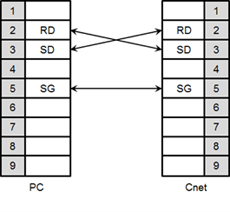

### 2.2 RS-422
모드버스 통신을 RS-422 방식으로 연결할 때의 결선 방법은 일반적인 RS-422 결선법과 동일합니다.

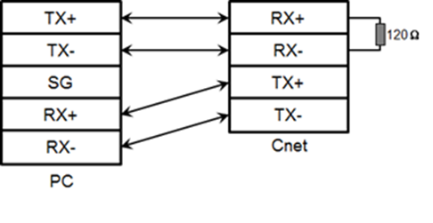

### 3.2 RS-485
모드버스 통신을 RS-485 방식으로 연결할 때의 결선 방법은 일반적인 RS-485 결선법과 동일합니다.

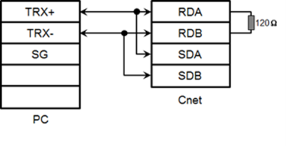

## 3. 통신드라이버 설정
MODBUS(RTU)통신이 지원되는 각종 기기와 RS-232C, RS-422/485 방법으로 접속이 가능합니다. 제조사별 설정방법이 다르므로 자세한 내용은 해당 기기 사용 설명서를 참조 바랍니다.
본 사용설명서에는 LS ELECTRIC의 XGK PLC를 예로 들어 설명하겠습니다.

### 3.1 PLC 설정
PLC(XGK)의 통신 파라미터는 XG-PD에서 설정합니다.

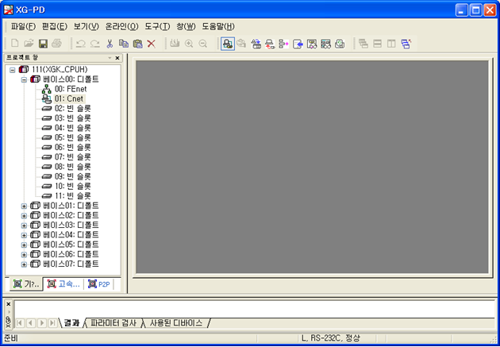

1. 접속 설정
    - [온라인]->[접속설정]을 선택합니다.
    - 사용자 환경에 맞는 접속 옵션을 설정한 후 접속을 클릭합니다. 

2. I/O 정보 읽기
    - [온라인]->[I/O 정보읽기]를 선택하여 현재 베이스에 장착된 모듈의 정보를 읽습니다. 

    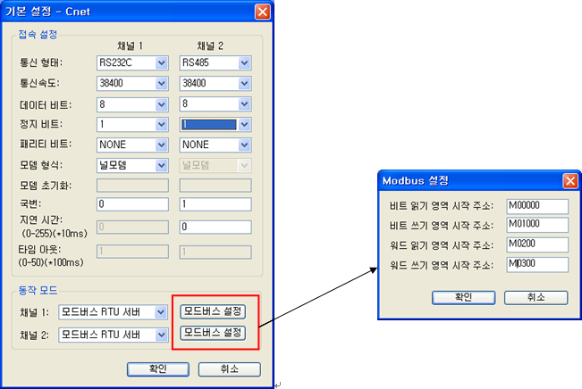

3. 기본설정
    - 해당 Cnet I/F모듈을 더블 클릭하여 기본 설정 창을 실행하고 접속 설정 메뉴의 통신형태, 통신속도, 모뎀 형식, 데이터비트, 정지비트, 국번을 설정합니다.

4. 동작 모드
    - 동작 모드는 RTU 서버를 선택합니다.
    - 모드버스 RTU 서버로 동작모드를 선택한 경우 모드버스 설정이 활성화 됩니다.

5. 모드버스 설정
    - 비트 읽기 영역 시작주소: 비트읽기 영역의 시작주소를 의미하며 5자리로 구성됩니다. 이때 앞의 4자리는 워드 값을 나머지 한자리는 비트 값을 의미합니다.
        예) M00000일 경우: M디바이스 영역의 0번째 워드의 0번째 비트가 비트 읽기 영역의 시작주소로 설정됨을 의미합니다.
    - 비트 쓰기 영역 시작주소: 비트쓰기 영역의 시작주소를 의미하며 5자리로 구성됩니다. 이 때 앞의 4자리는 워드 값을 나머지 한자리는 비트 값을 의미합니다.
        예) M00100 경우: M디바이스 영역의 10번째 워드의 0번째 비트가 비트 읽기 영역의 시작주소로 설정됨을 의미합니다.
    - 워드 읽기 영역 시작주소: 워드읽기 영역의 시작주소를 의미하며 4자리로 구성됩니다.
        예) M00200 경우: M디바이스 영역의 200번째 워드가 워드 읽기영역의 시작주소로 설정됨을 의미합니다.
    - 워드 쓰기 영역 시작주소: 워드쓰기 영역의 시작주소를 의미하며 4자리로 구성됩니다.
        예) M00300 경우: M디바이스 영역의 300번째 워드가 워드 쓰기영역의 시작주소로 설정됨을 의미합니다.

6. 파라미터
    - [온라인] -> [파라미터 쓰기]를 클릭합니다.
    - 기본 설정에서 기본설정을 완료한 모듈을 클릭한 후 확인을 클릭합니다.
    - 확인버튼 클릭 후 파라미터 쓰기 완료 후 해당모듈을 개별 리셋합니다.

7. 동작확인
    - [온라인] -> [시스템 진단]을 클릭합니다.
    - 해당 모듈의 클릭한 후 오른쪽 마우스 버튼을 눌러 프레임 모니터링이나 서비스별 상태를 클릭하여 정상적인 통신 여부를 확인 할 수 있습니다.

### 3.2 EdgeHub 설정: ModbusRTU
 1. 채널 추가
    자세한 사용법은  [매뉴얼의 Pages-필드디바이스-채널추가](http://localhost:4000/docs/pages/field-device/#31-%EC%B1%84%EB%84%90-%EC%B6%94%EA%B0%80)를 참고해 주세요

    채널추가 리스트에서 “ModbusRTU”를 선택한 후 “확인” 버튼을 누릅니다.

    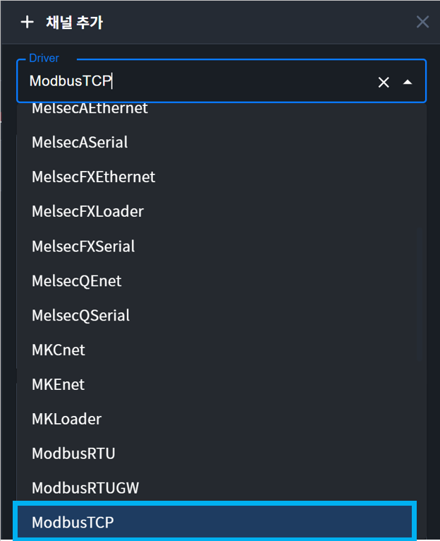

    2. 채널 속성 설정

    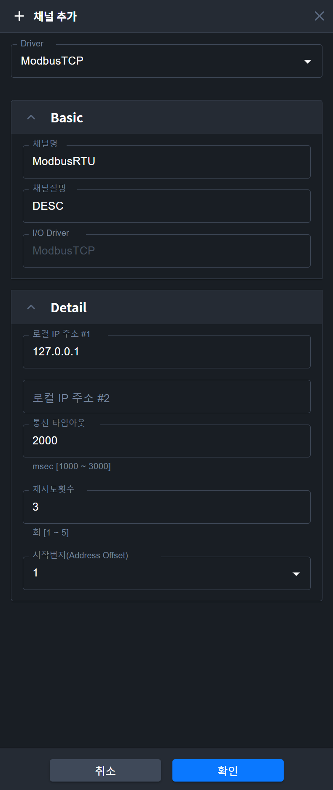

    - 채널 명 : 통신채널 이름을 입력합니다. 
    - 채널 설명 : 통신채널 설명을 입력합니다.
    - 통신포트 #1 : PC의 시리얼 포트를 선택합니다.
    - 통신속도 : 시리얼 통신 속도를 선택합니다.
    - 패리티비트 : 패리티비트를 선택합니다.
    - 데이터비트 : 데이터비트를 선택합니다.
    - 스톱비트 : 스톱비트를 선택합니다.
    - 타임아웃 : 장비에서 데이터를 요청한 후 Time Out으로 처리하게 되는 시간을 말합니다. 통신 오류를 판별하는 근거가 됩니다.
    - 재시도 횟수 : 통신 실패시 재시도하는 횟수를 설정합니다.
    - Address Offset 시작번지 : 0 또는 1을 가진다. 시작번지를 0번부터 또는 시작번지를 1부터 시작하는가의 여부를 설정한다.
    - 저장 : 저장 버튼을 누르면, 설정된 통신 채널 정보가 저장되고 상단의 채널 리스트에 표시 됩니다.

    3. Device 추가
    자세한 사용법은  [매뉴얼의 Pages-필드디바이스-디바이스 추가](http://localhost:4000/docs/pages/field-device/#41-%EB%94%94%EB%B0%94%EC%9D%B4%EC%8A%A4-%EC%B6%94%EA%B0%80)를 참고해 주세요

    4. Device 속성 설정

    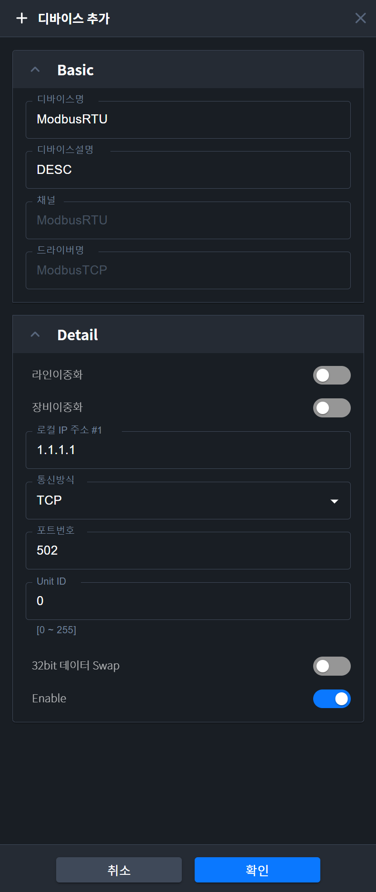

    - 디바이스 명 : 디바이스 이름을 입력합니다. 
    - 디바이스 설명 : 디바이스 설명을 입력합니다.
    - Station 번호 : PLC Cnet 모듈의 국번을 입력합니다.
    - 32Bit데이터 Swap: 32Bit인 경우 [상위워드 + 하위워드] 또는 [하위워드 + 상위워드]의 조합으로 32Bit를 나타낼수 있는데 이를 위하여 상위워드와 하위워드 Swap을 사용합니다. 
    - 저장 : 저장하면 메인 화면의 디바이스 트리에 디바이스가 추가됩니다. 메인 화면의 태그 리스트에는 디바이스 관련 시스템 태그들이 자동으로 추가 됩니다.

    5. Block 추가
    자세한 사용법은  [매뉴얼의 Pages-필드디바이스-블록 추가](http://localhost:4000/docs/pages/field-device/#51-%EB%B8%94%EB%A1%9D-%EC%B6%94%EA%B0%80)를 참고해 주세요

    6. Block 속성 설정
    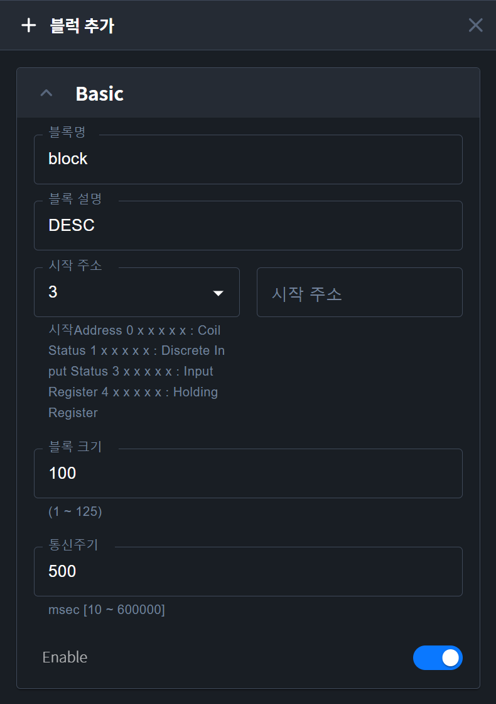 

    - 블록 번호 : Block의 고유 번호 입니다. 각각의 Block은 서로 다른 Block 번호를 지정해 주어야 합니다.
    - Block 설명 : Block 설명을 입력합니다.
    - 시작 Address : Block의 시작 Address를 입력합니다. 4가지 종류가 있으며, 각각 아래와 같은 방법으로 Address를 지정합니다.
        - Address구별자: 0(Coil Status), 1(Discrete Input Status), 3(Input Register), 4(Holding Register) 
        - Address: 0~65535 (채널정보에서 Address Offset 시작번지를 1로 설정하였다면, 1~65536)
    - 통신 주기 : 해당 Block의 데이터 수집 주기를 msec 단위로 입력합니다.
    - Block 크기 : 해당 구별자별 읽고자하는 갯수
    - 저장 : 저장 버튼을 누르면, 설정된 Block 정보가 저장이 되고, 상단의 블록 리스트에 추가 됩니다..
    - 삭제 : 삭제 버튼을 누르면, 현재 선택된 Blcok이 삭제됩니다.

7.	입출력 주소
    1. 아날로그
        구별자(3 또는 4) + 0~65535 
        (채널정보에서 Address Offset 시작주소를 1로 설정하였다면, 1~65536) 

        예1) 3번(Input Register : 읽기만 가능)의 0번지(0~65535중 0)를 읽고 싶다면 
        Address Offset 시작주소를 0으로 설정하였다면, 300000 또는 30으로 설정
        Address Offset 시작주소를 1으로 설정하였다면, 300001 또는 31으로 설정

        예2) 4번(Holding Register)의 17번지(0~65535중 17)를 읽고 싶다면 
        Address Offset 시작주소를 0으로 설정하였다면, 400017 또는 417으로 설정
        Address Offset 시작주소를 1으로 설정하였다면, 400018 또는 418으로 설정

    2. 디지털
        구별자(0 또는 1 또는 3 또는 4) + 0~65535 
        (채널정보에서 Address Offset 시작주소를 1로 설정하였다면, 1~65536)

        예1) 0번(Coil Status : 읽기/쓰기 가능)의 0번지(0~65535중 0)를 읽고 싶다면 
        Address Offset 시작주소를 0으로 설정하였다면, 000000 또는 00으로 설정
        Address Offset 시작주소를 1으로 설정하였다면, 000001 또는 01으로 설정

        예2) 1번(Discrete Input Status : 읽기만 가능)의 17번지(0~65535중 17)를 읽고 싶다면 
        Address Offset 시작주소를 0으로 설정하였다면, 100017 또는 117으로 설정
        Address Offset 시작주소를 1으로 설정하였다면, 100018 또는 118으로 설정

        예3) 3번(Input Register : 읽기만 가능)의 17번지(0~65535중 17)의 10번째 Bit를 읽고 싶다면 
        Address Offset 시작주소를 0으로 설정하였다면, 300017.A 또는 317.A으로 설정
        Address Offset 시작주소를 1으로 설정하였다면, 300018.A 또는 318.A으로 설정

        예4) 4번(Holding Register : 읽기만 가능)의 0번지(0~65535중 17)의 15번째 Bit를 읽고 싶다면 
        Address Offset 시작주소를 0으로 설정하였다면, 300000.F 또는 30.F으로 설정
        Address Offset 시작주소를 1으로 설정하였다면, 300000.F 또는 31.F으로 설정

### 3.3 EdgeHub 설정:ModbusRTUGW
1. 채널 추가
    자세한 사용법은  [매뉴얼의 Pages-필드디바이스-채널추가](http://localhost:4000/docs/pages/field-device/#31-%EC%B1%84%EB%84%90-%EC%B6%94%EA%B0%80)를 참고해 주세요

    채널추가 리스트에서 “ModbusRTUGW”를 선택한 후 “확인” 버튼을 누릅니다.

    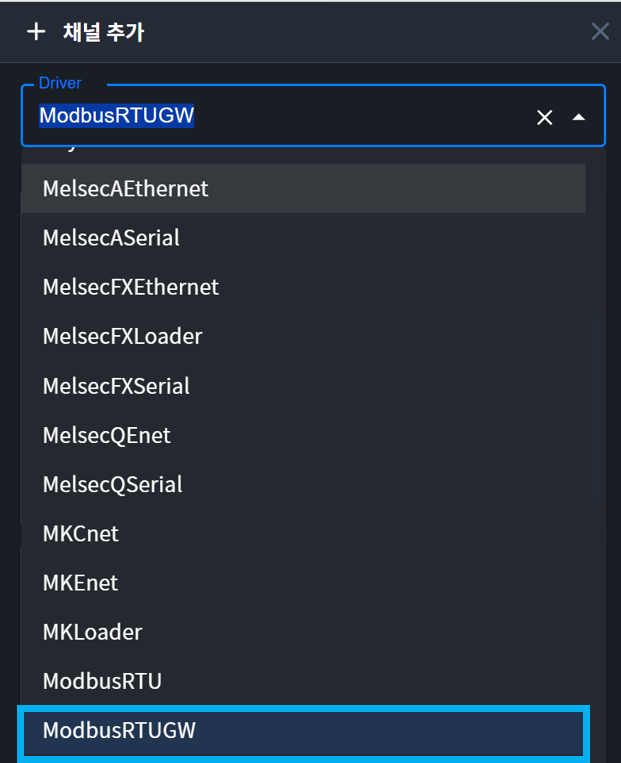

    2. 채널 속성 설정

    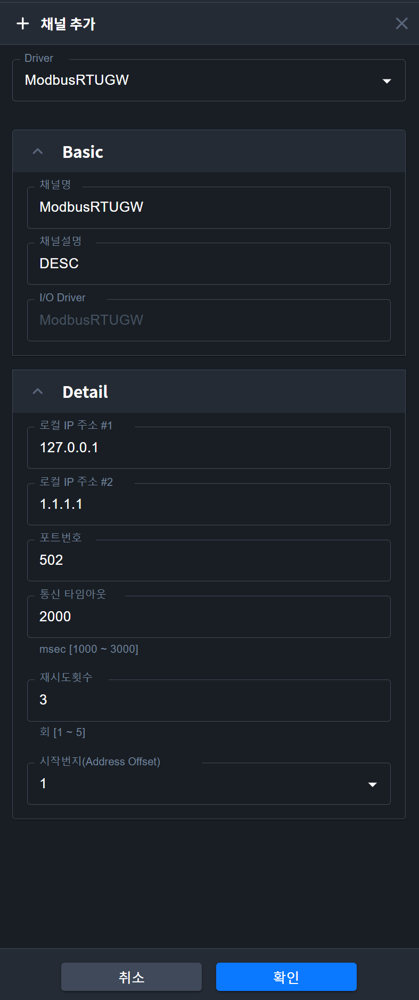

    - 채널 명 : 통신채널 이름을 입력합니다. 
    - 채널 설명 : 통신채널 설명을 입력합니다.
    - PC IP Address : PC의 IP Address를 입력합니다.
    - Device IP Address : PC와 연결할 게이트웨이의 IP Address를 입력합니다.
    - Port No: 게이트웨이의 Port번호를 입력합니다.
    - 타임아웃 : 장비에서 데이터를 요청한 후 Time Out으로 처리하게 되는 시간을 말합니다. 통신 오류를 판별하는 근거가 됩니다.
    - 재시도 횟수 : 통신 실패시 재시도하는 횟수를 설정합니다.
    - Address Offset 시작번지 : 0 또는 1을 가진다. 시작번지를 0번부터 또는 시작번지를 1부터 시작하는가의 여부를 설정한다.
    - 저장 : 저장하면 메인 화면의 디바이스 트리에 디바이스가 추가됩니다. 메인 화면의 태그 리스트에는 디바이스 관련 시스템 태그들이 자동으로 추가 됩니다.

    3. Device 추가
    자세한 사용법은  [매뉴얼의 Pages-필드디바이스-디바이스 추가](http://localhost:4000/docs/pages/field-device/#41-%EB%94%94%EB%B0%94%EC%9D%B4%EC%8A%A4-%EC%B6%94%EA%B0%80)를 참고해 주세요

    4. Device 속성 설정

    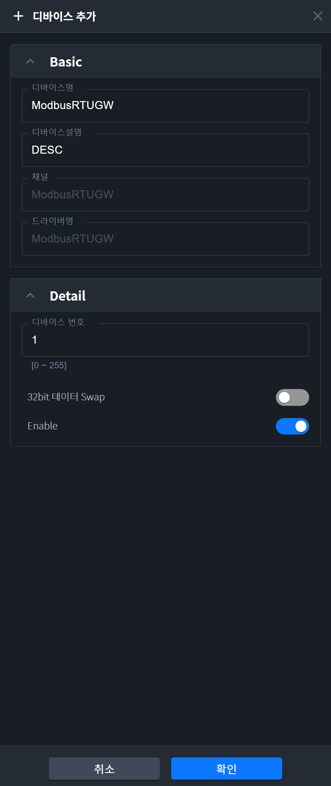

    - 디바이스 명 : 디바이스 이름을 입력합니다. 
    - 디바이스 설명 : 디바이스 설명을 입력합니다.
    - 디바이스 번호 : 통신 모듈의 국번을 입력합니다.
    - 32Bit데이터 Swap: 32Bit인 경우 [상위워드 + 하위워드] 또는 [하위워드 + 상위워드]의 조합으로 32Bit를 나타낼수 있는데 이를 위하여 상위워드와 하위워드 Swap을 사용합니다. 
    - 저장 : 저장하면 메인 화면의 디바이스 트리에 디바이스가 추가됩니다. 메인 화면의 태그 리스트에는 디바이스 관련 시스템 태그들이 자동으로 추가 됩니다.

    5. Block 추가
    자세한 사용법은  [매뉴얼의 Pages-필드디바이스-블록 추가](http://localhost:4000/docs/pages/field-device/#51-%EB%B8%94%EB%A1%9D-%EC%B6%94%EA%B0%80)를 참고해 주세요

    6. Block 속성 설정
    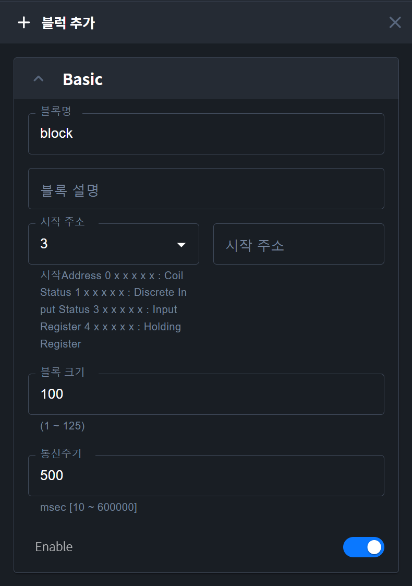 

    - 블록 번호 : Block의 고유 번호 입니다. 각각의 Block은 서로 다른 Block 번호를 지정해 주어야 합니다.
    - Block 설명 : Block 설명을 입력합니다.
    - 시작 Address : Block의 시작 Address를 입력합니다. 4가지 종류가 있으며, 각각 아래와 같은 방법으로 Address를 지정합니다.
        - Address구별자: 0(Coil Status), 1(Discrete Input Status), 3(Input Register), 4(Holding Register) 
        - Address: 0~65535 (채널정보에서 Address Offset 시작번지를 1로 설정하였다면, 1~65536)
    - 통신 주기 : 해당 Block의 데이터 수집 주기를 msec 단위로 입력합니다.
    - Block 크기 : 해당 구별자별 읽고자하는 갯수
    - 저장 : 저장 버튼을 누르면, 설정된 Block 정보가 저장이 되고, 상단의 블록 리스트에 추가 됩니다..
    - 삭제 : 삭제 버튼을 누르면, 현재 선택된 Blcok이 삭제됩니다.

7.	입출력 주소
    1. 아날로그
        구별자(3 또는 4) + 0~65535 
        (채널정보에서 Address Offset 시작주소를 1로 설정하였다면, 1~65536) 

        예1) 3번(Input Register : 읽기만 가능)의 0번지(0~65535중 0)를 읽고 싶다면 
        Address Offset 시작주소를 0으로 설정하였다면, 300000 또는 30으로 설정
        Address Offset 시작주소를 1으로 설정하였다면, 300001 또는 31으로 설정

        예2) 4번(Holding Register)의 17번지(0~65535중 17)를 읽고 싶다면 
        Address Offset 시작주소를 0으로 설정하였다면, 400017 또는 417으로 설정
        Address Offset 시작주소를 1으로 설정하였다면, 400018 또는 418으로 설정

    2. 디지털
        구별자(0 또는 1 또는 3 또는 4) + 0~65535 
        (채널정보에서 Address Offset 시작주소를 1로 설정하였다면, 1~65536)

        예1) 0번(Coil Status : 읽기/쓰기 가능)의 0번지(0~65535중 0)를 읽고 싶다면 
        Address Offset 시작주소를 0으로 설정하였다면, 000000 또는 00으로 설정
        Address Offset 시작주소를 1으로 설정하였다면, 000001 또는 01으로 설정

        예2) 1번(Discrete Input Status : 읽기만 가능)의 17번지(0~65535중 17)를 읽고 싶다면 
        Address Offset 시작주소를 0으로 설정하였다면, 100017 또는 117으로 설정
        Address Offset 시작주소를 1으로 설정하였다면, 100018 또는 118으로 설정

        예3) 3번(Input Register : 읽기만 가능)의 17번지(0~65535중 17)의 10번째 Bit를 읽고 싶다면 
        Address Offset 시작주소를 0으로 설정하였다면, 300017.A 또는 317.A으로 설정
        Address Offset 시작주소를 1으로 설정하였다면, 300018.A 또는 318.A으로 설정

        예4) 4번(Holding Register : 읽기만 가능)의 0번지(0~65535중 17)의 15번째 Bit를 읽고 싶다면 
        Address Offset 시작주소를 0으로 설정하였다면, 300000.F 또는 30.F으로 설정
        Address Offset 시작주소를 1으로 설정하였다면, 300000.F 또는 31.F으로 설정

## 4. 사용 가능 디바이스
사용가능한 디바이스 아래와 같습니다.

| 디바이스    | 접속 가능 영역      ||                 | 비고    |
|---------|-----------|-----------|-----------|-----|---|
|         | 가능 범위     | 읽기(펑션 코드) | 쓰기(펑션 코드) |       |
| 출력 접점   | 0 - 65535 | 가능(01)    | 가능(05)    | -    |
| 입력 접점   | 0 - 65535 | 가능(02)    | 가능(05)    | -     |
| 출력 레지스터 | 0 - 65535 | 가능(03)    | 가능(06,16) | -     |
| 입력 레지스터 | 0 - 65535 | 가능(04)    | 가능(06,16) | -     |

{:.note}
>☞디바이스에 대한 자세한 내용은 모드버스 프로토콜 사용설명서를 사용하십시오.    
>☞ 디바이스 영역 범위를 벗어나지 않도록 사용하여 주십시오.   
>☞ PLC 에 따라 사용 가능한 디바이스 최대값이 다르므로 접속할 PLC 의 사용설명서를 확인하여 주십시오.   

