# DataWorX 설치 및 설정

DataWorX S/W의 설치 및 설정 방법은 다음과 같습니다

## 3.1 DataWorX 설치 및 제거

다음과 같은 순서로 DataWorX S/W의 설치 및 제거를 할 수 있습니다.

### 3.1.1 설치

1. Setup 프로그램을 실행하고 설치될 경로를 묻는 화면이 나타나면 경로를 입력하고 다음으로 진행합니다.  
   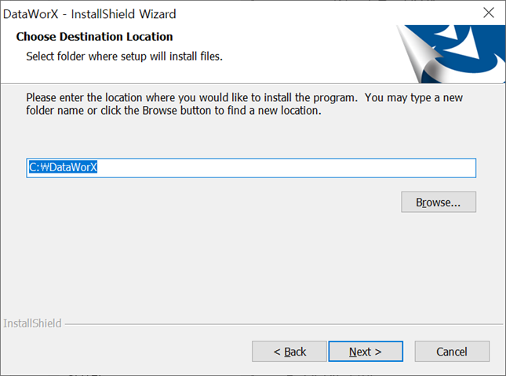

2. 설치를 계속하기 위해서는 라이선스에 동의해야 합니다.  
   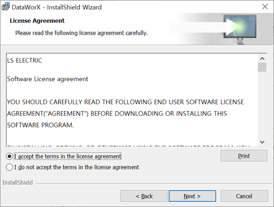

3. 사용자 및 조직 정보를 입력합니다.  
   

4. 설치 옵션을 선택합니다.  
   기본값인 Complete를 선택한 경우 전체 항목을 설치합니다.  
   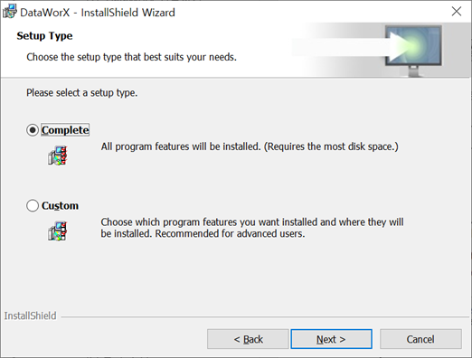

   Custom으로 선택한 경우 항목을 선택하여 설치할 수 있습니다.  
   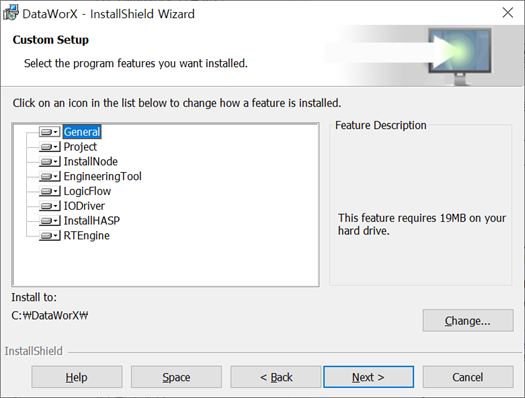

5. Install 버튼을 클릭하여 설치를 진행합니다.  
   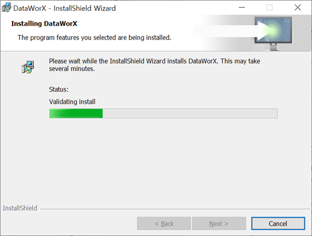

6. HASP device driver를 설치합니다.`(SW라이선스 사용시 필요X)`  
   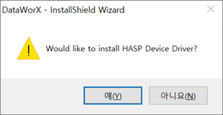  
   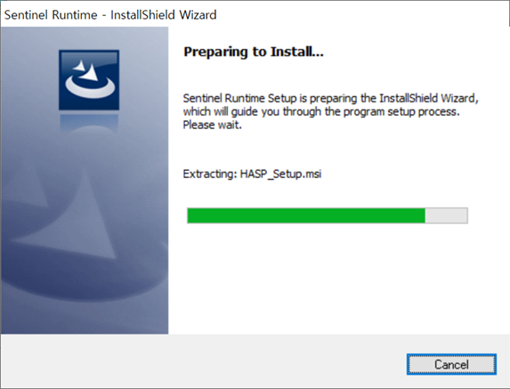  
   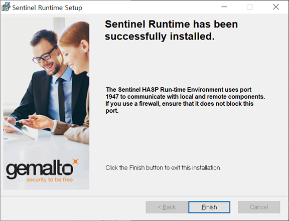

7. Node.js 설치를 진행합니다.  
   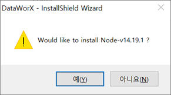  
   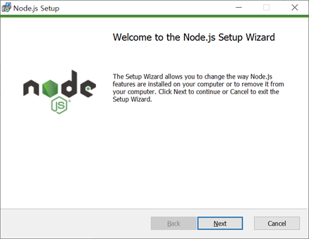
8. 설치 완료  
   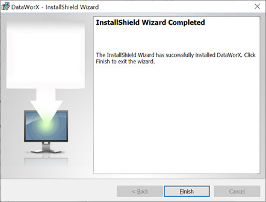

### 3.1.2 제거

1. 제어판을 실행 후 프로그램 및 기능 메뉴로 이동합니다
2. 앱 리스트에서 DataWorX 선택 후 제거를 실행합니다.
3. 사용자에게 확인하는 대화상자가 표시됩니다. 제거 버튼을 클릭합니다.
4. DataWorX 프로그램이 정상적으로 삭제되었는지 확인합니다.

<!-- ## 3.2 환경 설정

### 🛠️ 3.2.1 웹 서버 접속포트 설정 (개발 예정)

웹 서버 접속 포트를 변경하기 위해서는 nginx.conf 파일의 내용을 수정해야 합니다.
설치파일경로\DataWorX\bin\EngineeringTool\Client\conf 폴더하위 nginx.conf 파일을 문서 편집기로 오픈합니다.
server 항목의 listen 항목의 값이 7600 으로 되어있습니다. 이 값을 원하는 값으로 수정합니다.
**수정후에는 DataWorX 서버를 재 기동해야 합니다.**

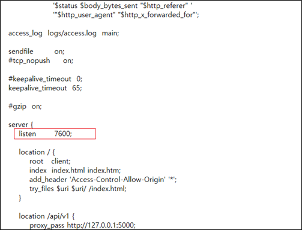

### 🛠️ 3.2.1 SSL 인증서 설정 (개발 예정)

- 설치경로\bin\EngineeringTool 디렉토리의 EdgeHub_SSLConfSetup.exe 프로그램을 실행합니다.
- 해당 화면에서 SSL 적용 여부를 설정할 수 있고, SSL 적용시 인증서 파일을 선택할 수 있습니다.
- 또한 Port 번호를 변경할 수 있습니다.
- 각 경우 변경 버튼을 클릭하여 적용합니다.
  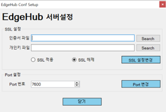 -->
