{: .no_toc }
# 알람 매니저  
DataWorX를 비롯한 SCADA 시스템에서의 알람은 중요한 항목입니다.  
본 매뉴얼에서는 DataWorX에서의 알람 처리 방식 및 알람 그룹과 관련된 항목 설정 등에 대해 설명합니다.  

- TOC
{:toc}

## 1. 알람의 종류 및 운영  

DataWorX에서는 `아날로그 태그`와 `디지털 태그`에 대해서만 알람을 설정할 수 있으며, 태그의 값이 `정상적으로 수집된 경우`에만 알람에 대한 처리를 합니다.  
`알람의 종류` 및 `발생 해제 규칙`은 아래와 같습니다.

| 태그 종류    | 알람 구분 | 알람 종류 | 발생 규칙 | 해제 규칙 |
|----------|----|----|----|----|
|아날로그|경계 알람| HH 알람 |	태그 값이 HH 이상일 때 발생|	이전에 HH 알람이 발생하고, 태그값이 HH 미만일 때 해제|
|||HI 알람|	태그 값이 HI 이상이고, HH보다 작을 때 발생|	이전에 HI 알람이 발생하고, 태그값이 HI보다 작거나 HH 이상일 때 해제|
|||LO 알람|	태그 값이 LO 이하이고, LL보다 클 때 발생|	이전에 LO 알람이 발생하고, 태그값이 LO보다 크거나 LL 이하일 때 해제|
|||LL 알람|	태그 값이 LL 이하일 때 발생|	이전에 LL 알람이 발생하고, 태그값이 LL보다 클 때 해제|
||변화량 알람|	변화량 알람|	태그 값이 과거의 값에 비해서 기준 값 이상으로 편차가 크거나 같을 때 발생|이전에 변화량 알람이 발생하고 태그값이 과거의 값에 비해서 기준값 미만으로 편차가 날 경우에 해제|
||이격 알람|주 이격 알람|	태그 값이 기준 값을 기준으로 하여 주 이격 값 이상으로 차이가 날 경우에 발생|이전에 주 이격 알람이 발생하고, 태그값이 기준값을 기준으로 하여 주 이격 값 미만으로 차이가 날 때 해제|
|||보조 이격 알람|태그 값이 기준 값을 기준으로 하여 보조 이격 값 이상이고, 주이격 값 미만으로 차이가 날 때 발생|이전에 보조 이격 알람이 발생하고, 태그값이 기준값을 기준으로 하여 주 이격 값 이상이거나 보조 이격 값 미만으로 차이가 날 때 해제|
|디지털|디지털 알람|ON 알람|태그의 값이 ON일 때 발생|이전에 ON 알람이 발생하고, 태그의 값이 OFF 일 때 해제|
|||OFF 알람|태그의 값이 OFF일 때 발생|이전에 OFF 알람이 발생하고, 태그의 값이 ON 일 때 해제|
|||ON → OFF 알람|태그의 값이 ON에서 OFF로 바뀔 때 발생|	발생과 동시에 해제|
|||OFF → ON 알람|태그의 값이 OFF에서 ON으로 바뀔 때 발생|발생과 동시에 해제|
|||변화 알람|태그 값이 변할 때 발생|발생과 동시에 해제|

### 1.1 아날로그 알람  
아날로그 태그의 알람 종류로는 `경계 알람, 변화량 알람, 이격 알람`의 세가지가 존재합니다.  
경계알람은 `HH, HI, LO, LL` 알람 네가지의 종류가 있으며, 이격 알람은 `주 이격 알람과 보조 이격 알람`으로 구분됩니다.  

1. `경계 알람`  
    `경계 알람`은 `아날로그태그`의 알람중 가장 많이 사용되는 알람입니다.  
    사용자는 태그의 엔지니어링 시에 `경계 알람`을 위한 `HH, HI, LO, LL`의 네 가지 경계 값을 설정할 수 있습니다. 이렇게 태그 값의 영역을 수평으로 나누어 각 영역에 태그의 값이 위치하게 되면 해당 알람이 `발생`하고, 값이 해당 영역을 벗어나게 되면 해당 알람이 `해제`되는 규칙을 갖습니다.  

    각 영역의 경계 알람이 발생하는 조건은 다음과 같습니다.  

    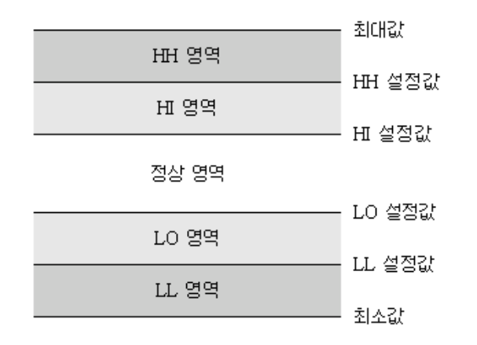

    | 조건   | 설명 |
    |----------|----|
    |HH 알람| 태그의 값이 HH 영역에 있는 경우|
    |HI 알람| 태그의 값이 HI 영역에 있는 경우|
    |LO 알람| 태그의 값이 LO 영역에 있는 경우|
    |LL 알람| 태그의 값이 LL 영역에 있는 경우|

    그리고 각 경계는 `불감대(Deadband)` 영역을 가질 수 있습니다.  
    알람 `Deadband 값을 설정한 경우` 태그값의 증감 및 위치 영역에 따라 `Deadband 룰`이 적용됩니다.  
    Deadband 룰이 적용된 경계 알람의 예는 다음과 같습니다.  

    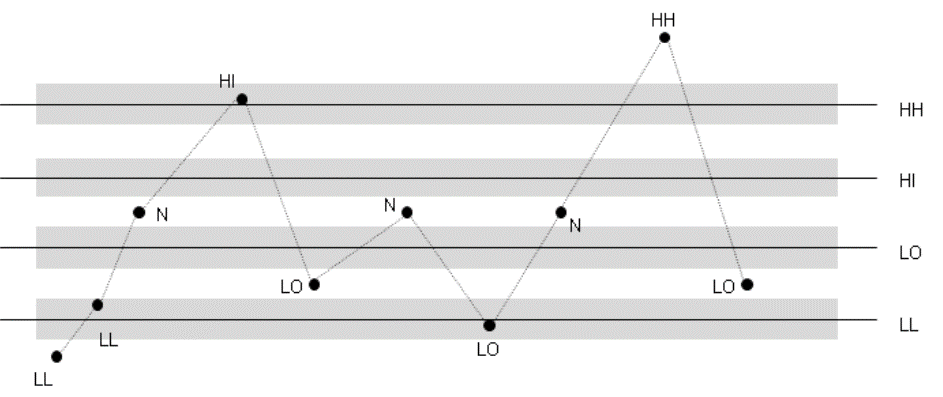

2. `변화량 알람`  
    `변화량 알람`은 태그의 `현재 값`이 `과거의 값`과 비교하여 태그 속성 항목에 설정된 `변화값 이상`으로 값이 변화하는 경우 발생하는 알람입니다.  
    마찬가지로 `변화 알람이 발생`한 경우, 이후의 값이 설정된 변화값 미만으로 값이 변화하는 경우, 변화량 알람은 `해제`됩니다. 이 알람은 태그의 값이 크게 변화하면 안되는 경우 설정할 수 있습니다.  
    변화량 알람은 `불감대(Deadband) 영역`의 룰이 적용되지 않습니다.  
    아래 그림에서 보듯이 가로의 △t 는 태그가 수집된 주기를 의미하며(절대 시간은 아닙니다.) △V는 값의 차이를 의미합니다.  
    그림에서 보듯이 `이전 값과 현재 값`의 변화가 `설정된 변화값 이상`으로 커지는 경우 해당 `알람이 발생`합니다.  

    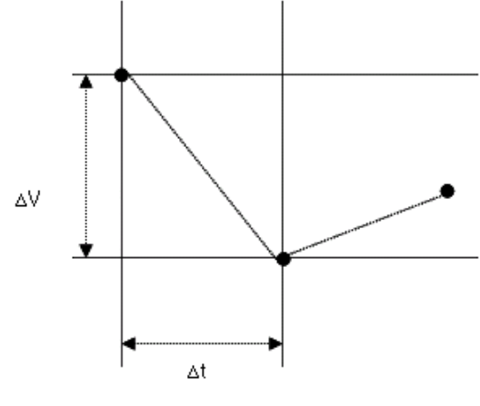

3. `이격 알람`  
    `이격 알람`은 태그의 값이 기준값을 기준으로 하여 `주 이격`과 `보조 이격`의 차이를 이용하여 발생하는 알람입니다. `이격 알람`은 경계 알람과 마찬가지로 알람 `불감대(Deadband) 룰`이 적용됩니다.  
    이격 알람은 경계 알람과 비슷하지만 다른 점은 다음과 같습니다.  
    - `이격 알람`은 경계 알람과 같은 상하의 구분이 없습니다.  
    - 기준 값은 `절대값` 혹은 `상대값(다른 태그의 값)` 으로 설정이 가능합니다.  

    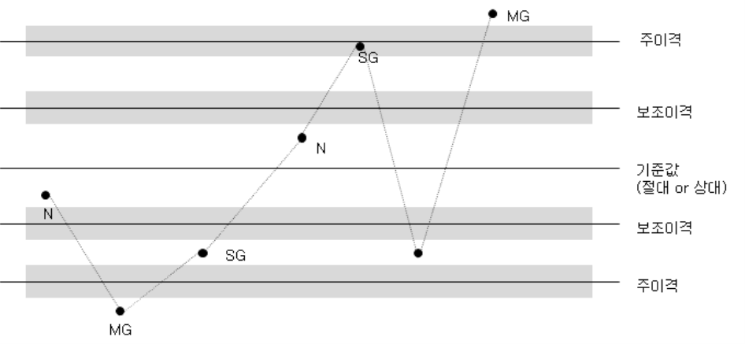


### 1.2 디지털 알람  
디지털 알람은 태그가 디지털인 경우에만 해당하며 `이전 값`과 `현재 값`에 따라 알람을 발생시킵니다.  
디지털 알람의 종류로는 `ON 알람, OFF 알람, ON→OFF 알람, OFF→ON 알람, 변화알람`의 다섯 가지 종류가 있습니다.  

| 태그 종류    | 알람 구분 | 
|----------|----|
|ON 알람|	태그의 값이 ON 일 때 발생합니다.<BR/>태그의 값이 OFF 일 때 해제됩니다.|
|OFF 알람|	태그의 값이 OFF 일 때 발생합니다.<BR/>태그의 값이 ON 일 때 해제됩니다.|
|ON → OFF 알람|	태그의 값이 ON에서 OFF로 바뀔 때 발생하며 동시에 해제됩니다.|
|OFF → ON 알람|	태그의 값이 OFF에서 ON으로 바뀔 때 발생하며 동시에 해제됩니다.|
|변화 알람|	태그의 값이 변화할 때 발생하며 동시에 해제됩니다.|

### 1.3 알람 지연  
1. `알람 지연` 설명  
    `알람 지연`이란 현장의 값이 `이상 상태`를 보이는 경우, 이를 바로 알람 처리를 하는 것이 아니라 `태그의 알람 지연 시간`을 설정하여 `알람 발생`시 설정된 시간이 지난 후의 값을 `최초의 알람 발생 시점 이전의 값과 비교`하여 알람을 `발생`시키는 기능입니다.  
    `알람 지연 기능`의 설명은 다음과 같습니다.  

    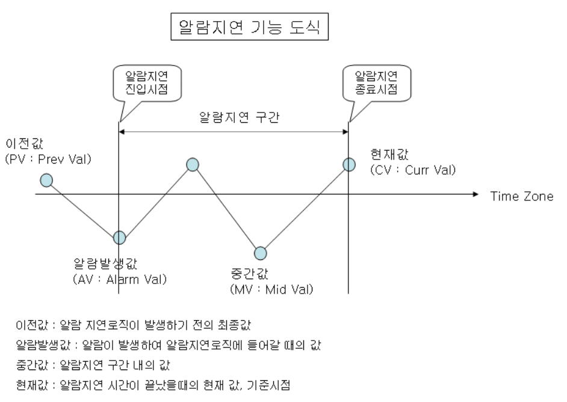

2. `알람 지연` 설정  
    `알람 지연 기능`을 사용하기 위해서는 다음의 두 가지 항목을 설정해야 합니다.  
    우선 태그 편집시 `알람 설정 속성창`에서 `지연 시간 값`을 입력합니다. 이 값은 각 태그에 대해서 개별 설정하는 항목입니다.  

    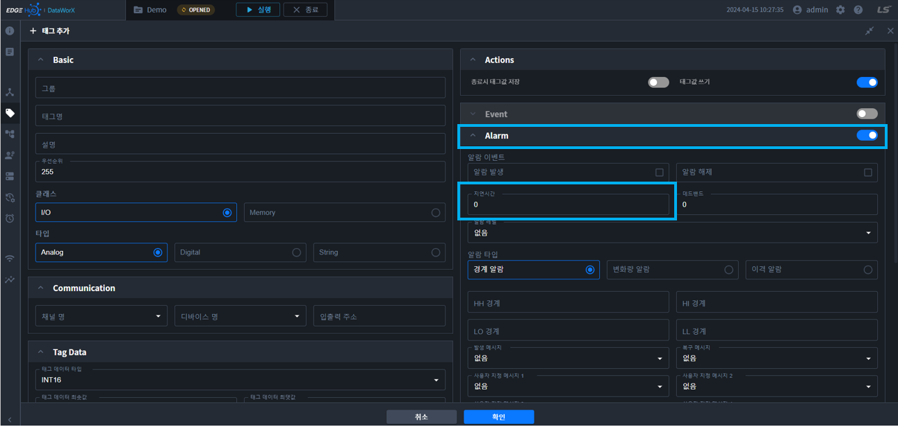

    `알람 지연 시간`은 `해당 태그의 모든 알람`에 대해서 적용됩니다.  
    다음 설정할 항목은 `DataWorX 프로젝트`의 `Config 폴더`에서 `ehDataProcess.ini` 파일을 메모장이나 기타 편집 툴로 오픈합니다.  
    ini 설정 파일에서 다음 항목의 값을 `1(TRUE)로 설정`한 후 저장합니다.  

    ```js
    DP_ALARMDELAY_FLAG=1
    ```


    DataWorX 런타임을 기동시키면 알람 지연 시간이 적용되었음을 확인할 수 있습니다.  

    {: .important }
    `알람 지연 시간` 설정은 DataWorX 런타임 적용시 `상당한 부하`를 야기시킬 수 있습니다.  
    `알람 지연 시간` 설정은 꼭 필요한 경우에만 사용해야 합니다.

## 2. 알람 매니저 설정  
`알람 그룹`은 태그를 논리적 집합으로 구분하고 관리 포인트 별로 일괄동작을 수행하기 위한 역할을 수행합니다. `발생된 알람`은 유저가 알람 그룹 별로 필터링하여 조회하거나 `LogicFlow`에서 처리 동작을 정의할 수 있습니다.  

### 2.1 알람 그룹 관리  
메뉴 트리에서 `알람 매니저`를 선택합니다. 기존에 등록된 알람 그룹이 있는 경우, 알람 매니저 트리의 하위 메뉴로` 알람 그룹 리스트`가 표시됩니다.  

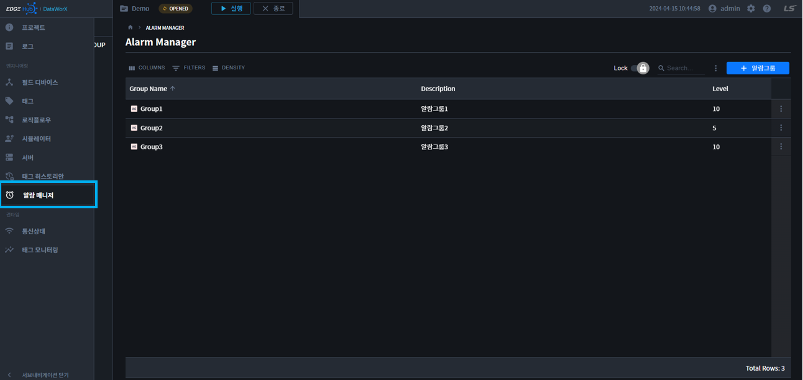

1. `알람 그룹 속성`  
    `알람 그룹 속성`은 다음과 같습니다.  

    | 속성 | 설명 |
    |----------|----|
    |알람 그룹 명| 필수 입력 항목으로서 알람 그룹의 이름을 입력합니다.|
    |알람 그룹 설명| 알람 그룹에 대한 설명을 입력합니다.|
    |등급| 알람 그룹의 등급을 입력합니다. `(1~10)`<BR/>태그 설정시 태그의 `알람 등급이 정해지지 않은 경우`에는 알람 그룹의 등급을 사용합니다.|

    {: .highlight }
    하기 이미지는, `태그의 알람등급이 정해지지 않은 경우` 입니다.  

    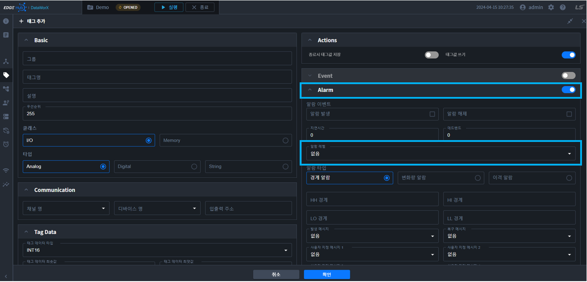

2. `알람 그룹 추가`  

    1. 알람그룹 `추가 버튼`을 클릭합니다.  

        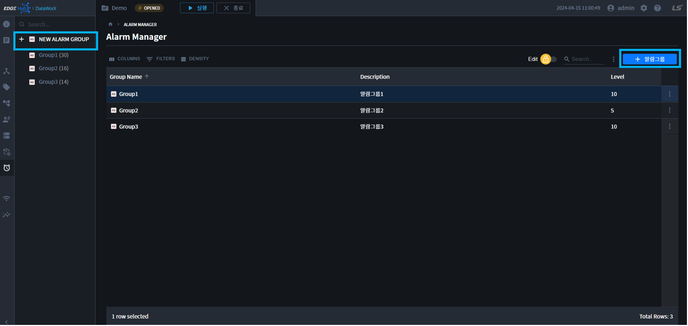

    2. 알람그룹 설정정보를 입력합니다.  

        

    3. 확인을 누르면 알람그룹이 저장됩니다.  

3. `알람 그룹 수정`  

    1. 알람그룹 수정은 `트리 더보기` 또는 `테이블 더보기` 또는 `Toggle Edit -> OPEN`으로 열 수 있습니다.  

    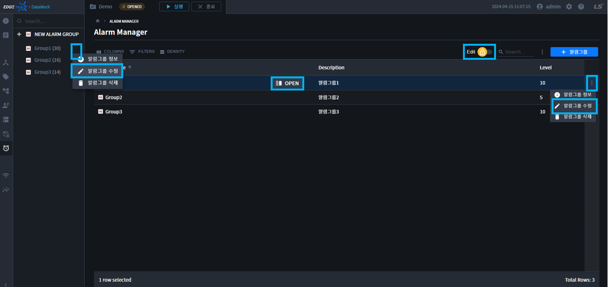

    2. 알람그룹 설정정보를 입력합니다.  

        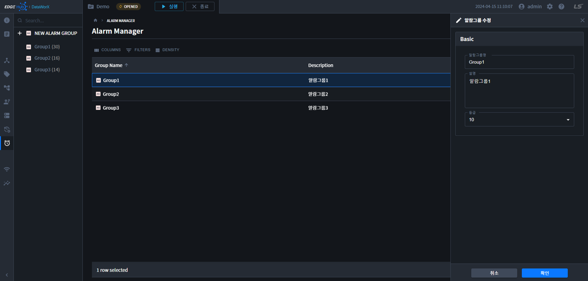

    3. 확인을 누르면 알람그룹 저장됩니다.  

4. `알람 그룹 정보`  

    1. 알람그룹 정보는 `트리 더보기` 또는 `테이블 더보기` 또는 `Toggle Lock -> OPEN`으로 열 수 있습니다.  

        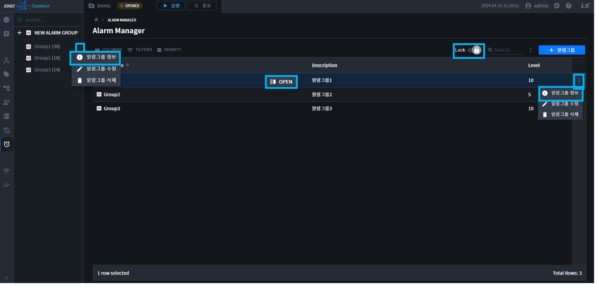

    2. 알람그룹 정보를 확인합니다.

        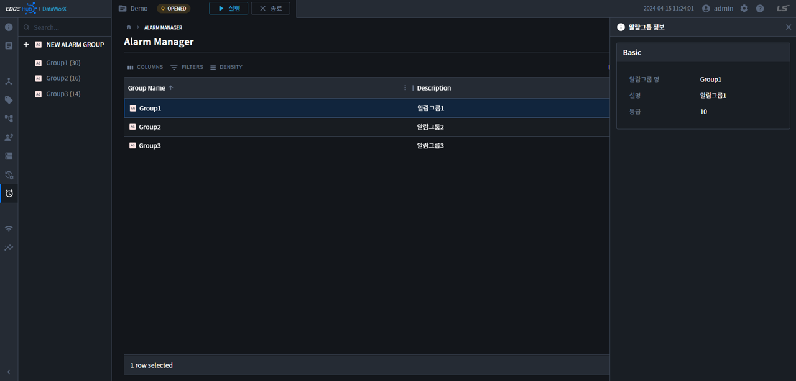

5. `알람 그룹 삭제`

    1. 알람그룹 삭제는 `트리 더보기` 또는 `테이블 더보기`에서 삭제할 수 있습니다.

        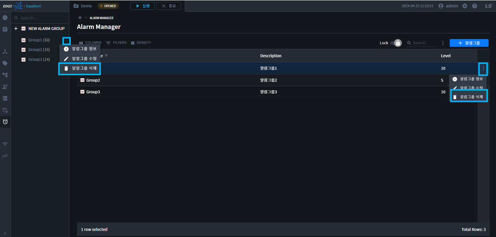

    2. 버튼을 클릭하면, 삭제 확인 모달이 표시됩니다.

        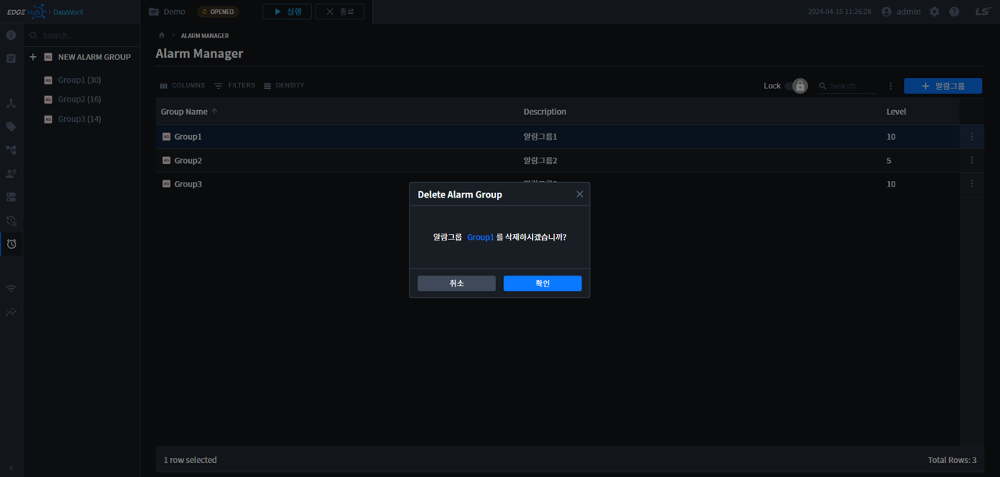

    3. 확인을 누르면 알람그룹 삭제 됩니다.

### 2.2 알람 그룹 설정
알람그룹 추가가 완료되면, 각 알람그룹에 태그를 추가/삭제할 수 있습니다.  
알람그룹 설정페이지는 `트리 모델명 클릭` 또는 `테이블 모델명 클릭`으로 이동할 수 있습니다.  

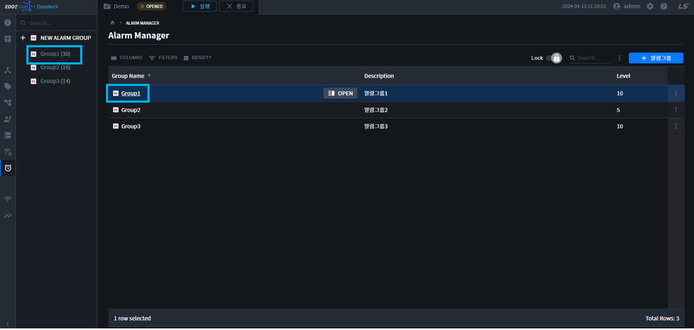

1. `알람태그 추가 `  
    1. 태그등록 버튼을 클릭합니다.

        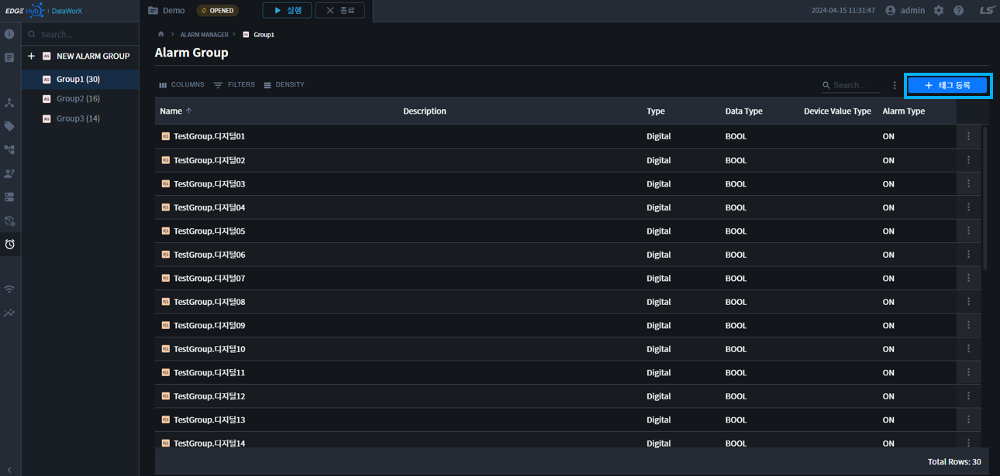

    2. 태그 목록 페이지에서 등록하고 싶은 `태그들을 선택`한 후, `저장 버튼`을 클릭합니다.

        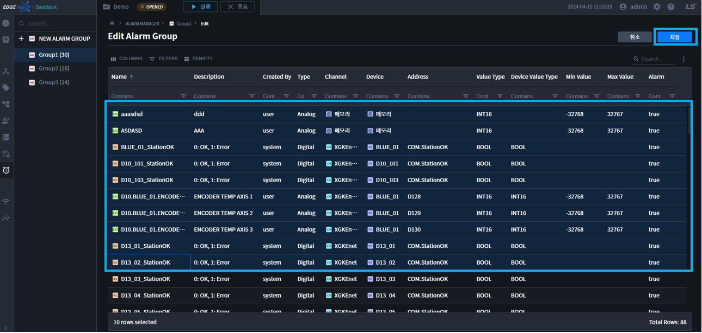

    3. 태그가 등록되었음을 확인할 수 있습니다.

        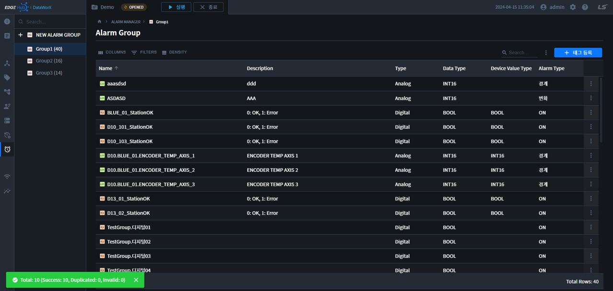

    {: .highlight }
    `태그설정`에서 `알람설정된 태그`만, 추가할 수 있습니다.  

2. `알람태그 삭제`  
    1. 등록태그 삭제는 `테이블리스트 선택 + 삭제` 또는 `테이블 더보기`를 통해 삭제할 수 있습니다.  

        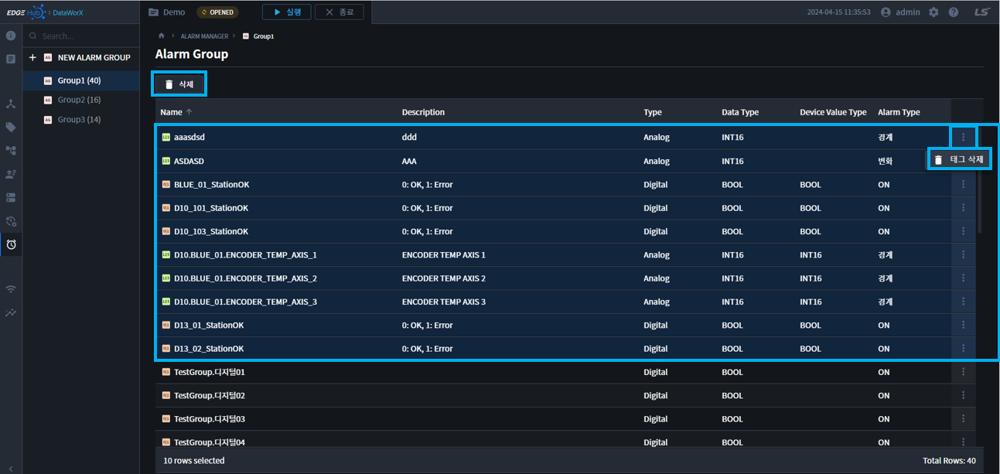

    2. 버튼을 클릭하면 삭제 모달이 표시됩니다.  

        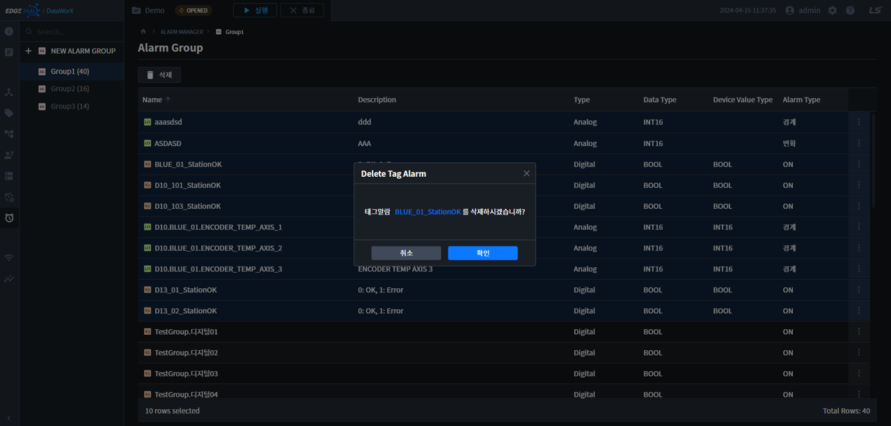

    3. 확인 버튼을 클릭하면, 등록 태그가 삭제됩니다.  


