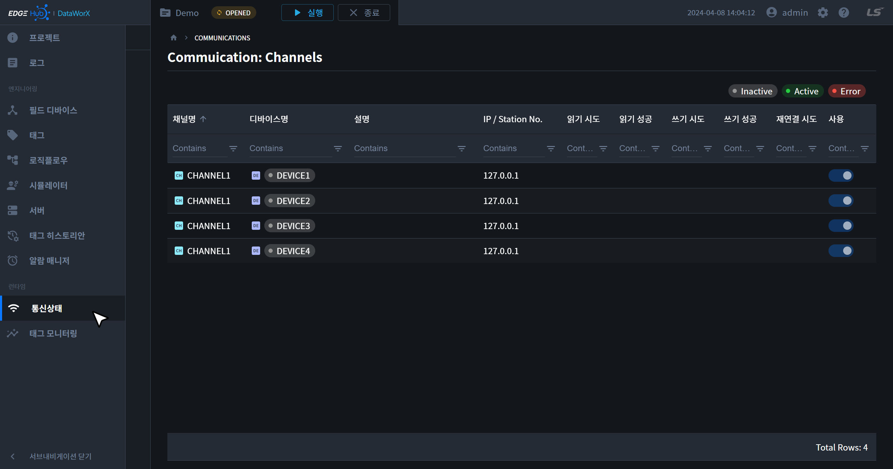
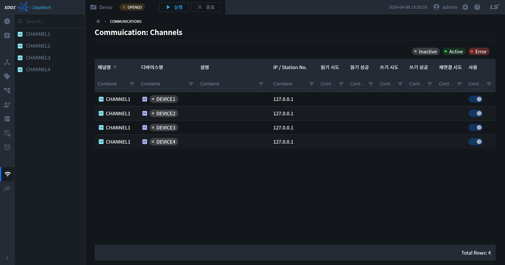
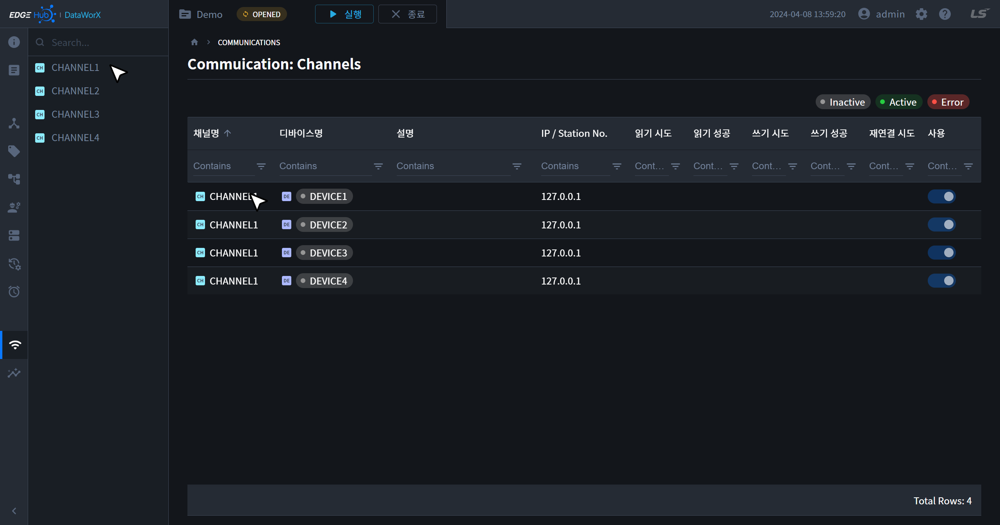
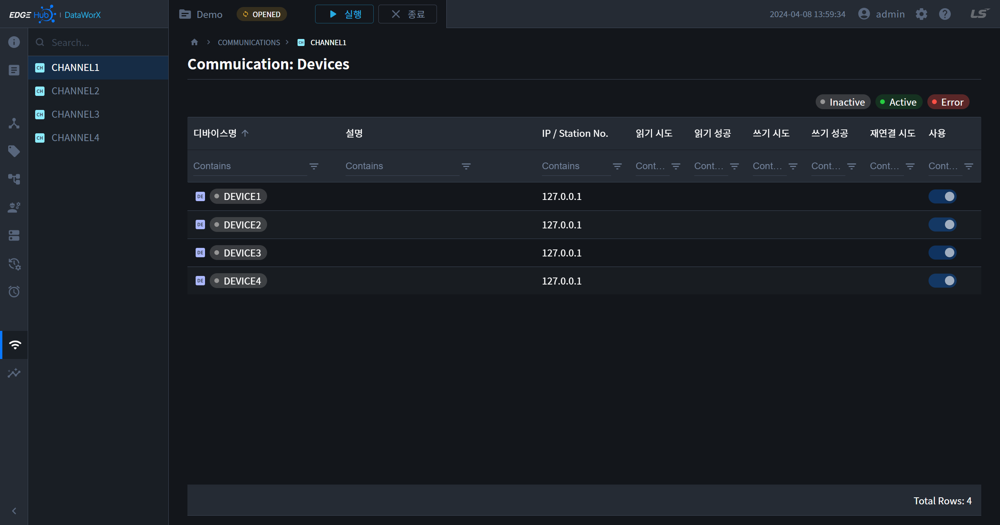

{: .no_toc }
# 통신 상태
실행 중인 프로젝트와 연결된 디바이스의 상태를 감시하거나 디바이스 사용 여부를 설정할 수 있습니다. 좌측 메인 내비게이션을 통해 해당 페이지로 이동할 수 있습니다.

- TOC
{:toc}

## 1. 디바이스 상태

| 상태                                         | 설명 |
| :------------------------------------------- | :--- |
| Inactive | 프로젝트가 실행되지 않은 상태 및 통신 미시도 상태 |
| Active  | 프로젝트가 실행되어 디바이스가 연결된 상태 |
| Error     | 프로젝트가 실행되었으나 디바이스와의 연결에 문제가 있는 상태 |

## 2. 디바이스 사용 설정
- 테이블 내 사용 컬럼의 토글 스위치를 클릭하면 디바이스 사용 여부를 설정할 수 있습니다.

{: .note }
🚧 디바이스 사용 설정 기능은 추후 지원 예정입니다. 🚧 

## 3. 디바이스 전체 목록
- 프로젝트에 연결된 모든 디바이스의 상태를 확인할 수 있습니다.

## 4. 채널 별 디바이스 목록
- 서브 내비게이션의 채널명 또는 테이블의 채널명을 클릭하면 해당 채널의 디바이스 상태를 확인할 수 있습니다.

## 5. 속성 설명  
테이블 속성 설명은 다음과 같습니다.

| 속성                                         | 설명 |
| :------------------------------------------- | :--- |
|채널명| 채널 명을 표시합니다.|
|디바이스명| 디바이스 명을 표시합니다. 글씨 색에 따라 상태를 나타냅니다.|
|설명|디바이스 설명입니다.|
|IP/Station No. | 통신 프로토콜의 종류에 따라 IP 통신은 IP를 표시하며, Serial통신은 StationNumber를 표시합니다.|
|읽기 시도| 장비 읽기 시도 횟수(Project Run시 표시 정보)|
|읽기 성공| 장비 읽기 시도 성공 횟수(Project Run시 표시 정보)|
|쓰기 시도| 장비 쓰기 시도 횟수(Project Run시 표시 정보)|
|쓰기 성공| 장비 쓰기 시도 성공 횟수(Project Run시 표시 정보)|
|재연결 시도| 통신연결 재시도 횟수(Project Run시 표시 정보)|
|사용| 현재 통신 연결 Enable로 설정하였는지 표시|

{: .note }
정상통신 상태를 확인할 시, `재연결시도, 읽기 시도, 읽기 성공`을 확인합니다.  
`재연결시도`가 지속적으로 증가할 경우, `Device 설정정보`를 재확인합니다.  
`읽기 시도`와 `읽기성공`의 숫자가 다른 경우, `태그설정정보`를 재확인합니다.  
