{: .no_toc }
# 블럭
블록은 DataWorX에 물리적으로 연결된 하위 필드 디바이스들의 `통신수집 단위 및 주기`를 설정합니다.
블록은 PLC, Inverter, 전력량계 등의 기기의 `한번에 수집하는 범위와 주기`를 설정합니다.
예시: `메모리 주소 타입(Address Type), 시작 주소(Start Address), 길이(Length), 주기(Period) 등`을 설정하여 데이터를 수집합니다.

{: .important }
해당 설정에서 `블록단위로 수집`하고, `태그`에서 해당 범위내의 주소값을 입력하여 사용합니다.  
블록에서 `설정한 범위내에 없는 주소`는 태그 설정에서 사용할 수 없습니다.  
블록길이의 `Max Size`는 `기기종류와 타입별`로 상이합니다.  
디바이스와 프로토콜 종류에 따라, `블록이 설정이 없는 경우`가 있습니다.

블록 관리를 위한, 블록 리스트 이동 방법은 다음과 같습니다.

1. 왼쪽 Naviagation Tree에서 `FIELD DEVICES`을 누릅니다.
2. 왼쪽 Sub Navigation Tree에서 원하는 `디바이스명'을 누릅니다.

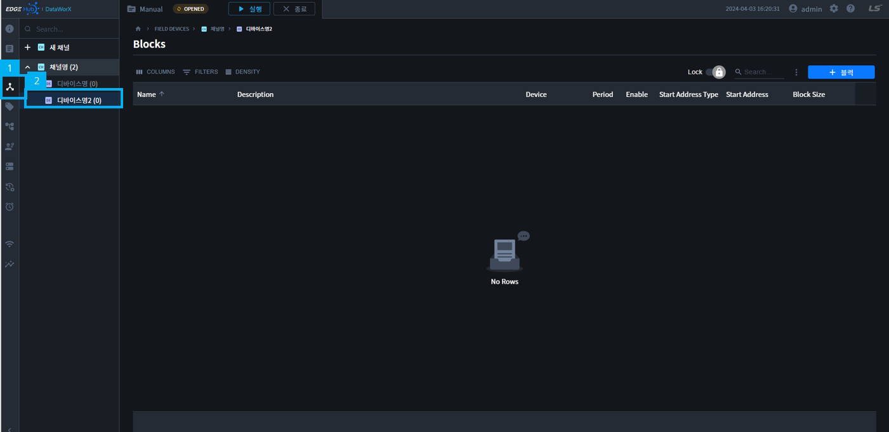

- TOC
{:toc}

## 블록 추가

1. 블록 추가 버튼을 클릭하여, 블록을 추가할 수 있습니다. 추가 방법은 2가지가 있습니다.

    1. 블록 리스트 테이블 상단의 블록 추가버튼을 클릭합니다.

    2. 왼쪽트리의 디바이스명 더보기에서 블록을 추가합니다.

    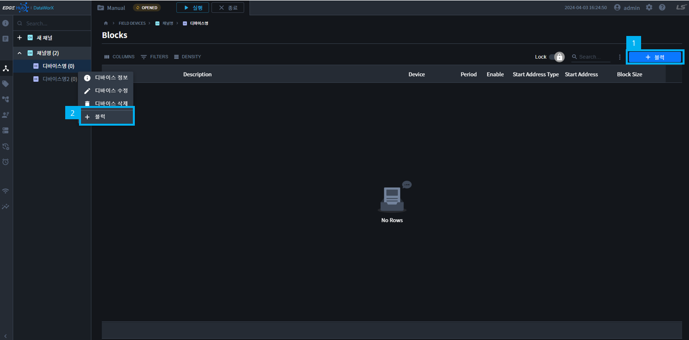

2. 블록명과 필요한 데이터를 입력하고 확인 버튼을 눌러 블록을 추가합니다.

    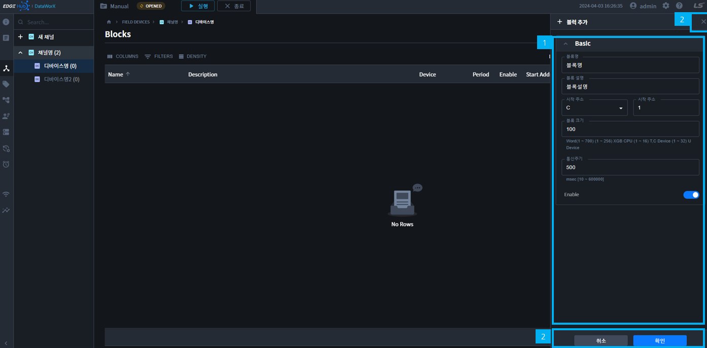

    {: .note }
    Enable 토글을 OFF한 경우에는, 블록이 데이터를 수집 하지 않습니다.

## 블록 수정

1. 블록 수정 화면으로 이동하여, 블록을 수정할 수 있습니다. 수정 방법은 2가지가 있습니다.

    1. 테이블 상단의 Toolbar 위치의 Toggle 버튼을 이용할 수 있습니다.

        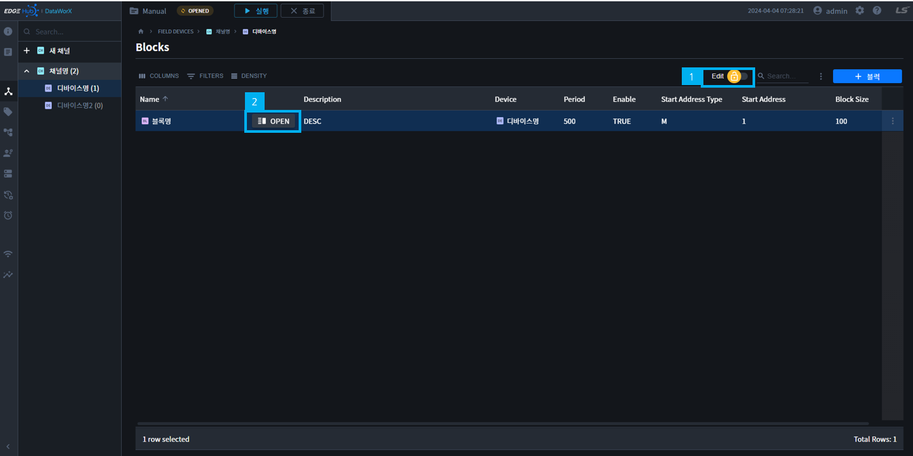

        1. Toggle 버튼을 `Edit`으로 변경  

        2. 테이블 블록명에 마우스를 올리면 나오는 `OPEN 버튼`을 누릅니다.

    2. 테이블 행 맨 오른쪽의, 더보기 버튼을 클릭하여 `블록 수정`을 누릅니다.

        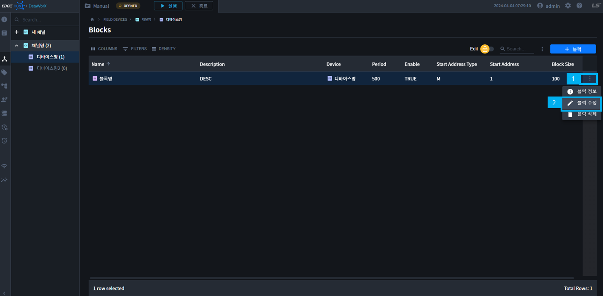

2. 블록의 Basic(기본정보)/Detail(상세정보)를 수정 후, 확인 버튼을 눌러 수정 내용을 저장합니다.

    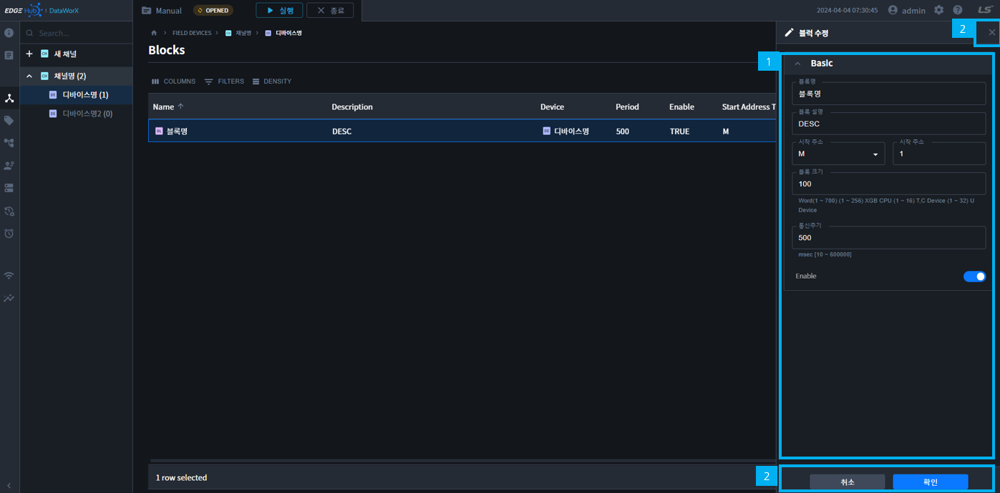

## 블록 정보

1. 블록 정보화면을 열어 블록 정보를 확인할 수 있습니다. 여는방법은 2가지가 있습니다.
    1. 테이블 상단의 Toolbar 위치의 Toggle 버튼을 이용할 수 있습니다.

        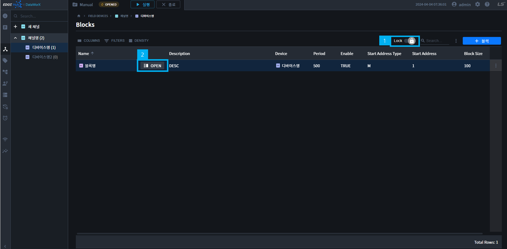

        1. Toggle 버튼을 `Lock`으로 변경  

        2. 테이블 블록명에 마우스를 올리면 나오는 `OPEN 버튼`을 누릅니다.

    2. 테이블 행 맨 오른쪽의, 더보기 버튼을 클릭하여 `블록 정보`를 누릅니다.

        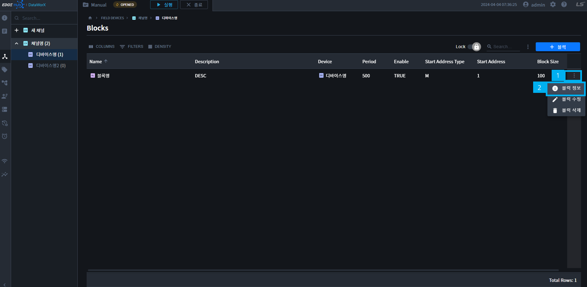

2. 블록의 Basic(기본정보)/Detail(상세정보)를 확인할 수 있습니다.

    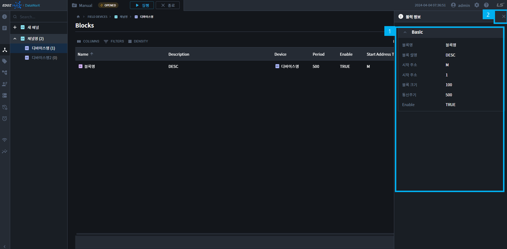

## 블록 삭제

1. 블록 삭제 버튼을 클릭하여, 블록을 삭제할 수 있습니다. 삭제 방법은 2가지가 있습니다.

    1. 테이블 행 맨 오른쪽의, 더보기 버튼을 클릭하여 `블록 삭제`를 누릅니다.

        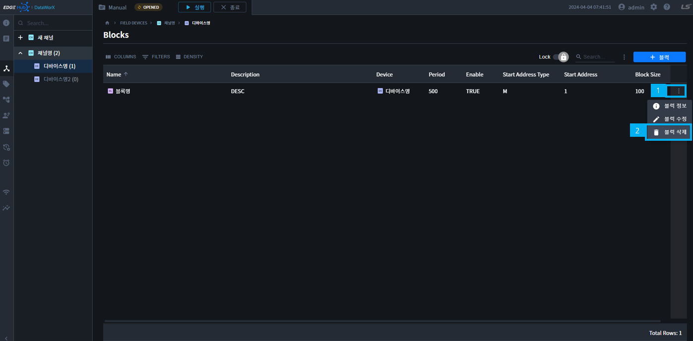

    2. 다중삭제의 경우 테이블 리스트를 복수개 선택하여 사용 가능합니다.

        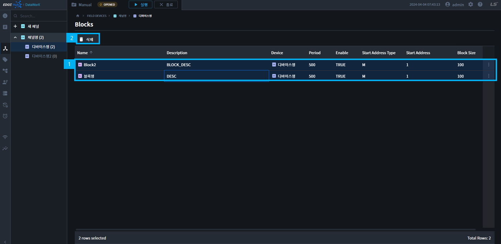

        1. 테이블 행을 클릭하여 다중 선택을 합니다.

            {: .highlight }
            `CTRL + A`로 전체 선택을 사용할 수 있습니다.  
            `SHIFT + Click`으로 여러개를 선택할 수 있습니다.  
            `CTRL + Click`으로 다중선택할 수 있습니다.  

        2. 테이블 상단에 나오는 `삭제 버튼`을 누릅니다.

2. Delete Blocks 모달의 확인버튼을 클릭하면, 삭제가 완료됩니다.

    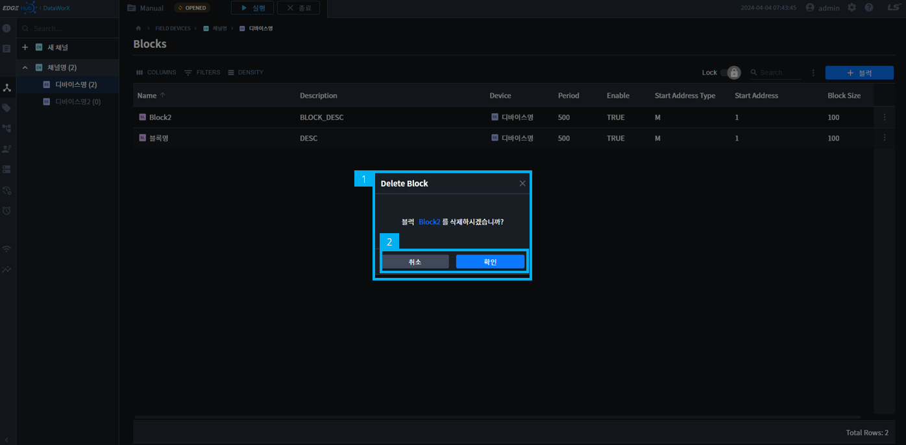