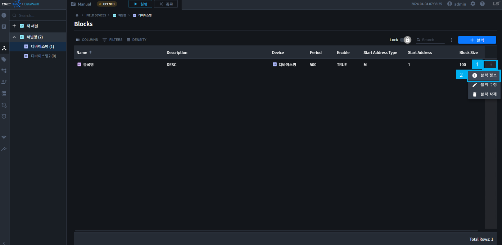

# Field Device

## 1 개요  
Field Device는 DataWorX에서 사용할 채널, 디바이스, 블록을 등록하고 관리하기 위한 메뉴입니다. 장비로부터 데이터를 수집하여 상위 프로세스로 전송하는 S/W입니다. Field Device 메뉴에서 통신채널, 디바이스, 통신블록을 추가/설정 할 수 있습니다.

## 2 드라이버 리스트  
현재 DataWorX에서 지원되는 디바이스 드라이버의 목록은 다음과 같습니다.

| 번호 | 통신 드라이버          | 설명                                 | PROTOCOL           | 제조사 |
|----|------------------|------------------------------------|--------------------|--------------|
| 1  | ModbusTCP        | ModbusTCP                          | TCP/UDP            | 공통           |
| 2  | XGKEnet          | XGKEnet                            | TCP/UDP            | LS ELECTRIC  |
| 3  | BACnetIP         | BACnetIP                           | UDP                | 공통           |
| 4  | ModbusRTU        | ModbusRTU                          | RS232/422/485      | 공통           |
| 5  | MelsecQEnet      | MITSUBISHI Q 시리즈 Ethernet        | TCP/UDP            | MITSUBISHI   |
| 6  | OmronE           | Omron Ethernet (FINS)              | TCP/UDP            | Omron        |
| 7  | ModbusRTUGW      | ModbusRTUGW                        | TCP/UDP            | 공통           |
| 8  | ABEthernetIP     | Allen-Bradley Ethernet/IP          | TCP/UDP            | ABB          |
| 9  | SiemensISOEnet   | Siemens ISO Ethernet               | TCP/UDP            | Siemens      |
| 10 | MelsecQSerial    | MITSUBISHI Q 시리즈 Serial          | RS232/422/485      | MITSUBISHI   |
| 11 | OmronS           | Omron CJ/CS Serial (Host Link)     | RS232/422/485      | Omron        |
| 12 | KeyenceE         | KEYENCE Ethernet                   | TCP/UDP            | KEYENCE      |
| 13 | MKEnet           | MASTER-K S Series Ethenet          | TCP/UDP            | LS ELECTRIC  |
| 14 | GlofaEnet        | GLOFA-GM Enet                      | TCP/UDP            | LS ELECTRIC  |
| 15 | MKCnet           | MASTER-K S Series Computer Link    | RS232/422/485      | LS ELECTRIC  |
| 16 | MelsecFXEthernet | MITSUBISHI FX Ethernet             | TCP/UDP            | MITSUBISHI   |
| 17 | GlofaCnet        | GLOFA-GM Cnet                      | RS232/422/485      | LS ELECTRIC  |
| 18 | MelsecFXSerial   | MITSUBISHI FX Serial               | RS232/422/485      | MITSUBISHI   |
| 19 | SiemensRK512     | Siemens RK512                      | RS232/422/485      | Siemens      |
| 20 | NaisS            | Panasonic Nais (FP 시리즈) Serial     | RS232/422/485      | Panasonic    |
| 21 | NXCCU            | Allen-Bradley NX-CCU               | RS232/422/485      | ABB          |
| 22 | OPCUAClient      | OPCUAClient                        | TCP/UDP            | 공통           |
| 23 | XGIEnet          | XGIEnet                            | TCP/UDP            | LS ELECTRIC  |
| 24 | XGREnet          | XGREnet                            | TCP/UDP            | LS ELECTRIC  |
| 25 | XGKCnet          | XGK Cnet                           | RS232/422/485      | LS ELECTRIC  |
| 26 | XGICnet          | XGI Cnet                           | RS232/422/485      | LS ELECTRIC  |
| 27 | XGKLoader        | XGK Loader                         | RS232              | LS ELECTRIC  |
| 28 | XGILoader        | XGI Loader                         | RS232              | LS ELECTRIC  |
| 29 | GlofaLoader      | GLOFA-GM Loader                    | RS232/422/485      | LS ELECTRIC  |
| 30 | MKLoader         | MASTER-K S Series Loader Port      | RS232              | LS ELECTRIC  |
| 31 | MelsecFXLoader   | MITSUBISHI FX Loader               | RS232/422/485      | MITSUBISHI   |
| 32 | MelsecASerial    | MITSUBISHI A Serial                | RS232/422/485      | MITSUBISHI   |
| 33 | MelsecAEthernet  | MITSUBISHI A Ethernet              | TCP/UDP            | MITSUBISHI   |
| 34 | CimonEnet        | CIMON Ethernet                     | TCP/UDP            | CIMON        |
| 35 | YASHSEnetSvr     | YASKAWA High-Speed Ethernet Server | TCP/UDP            | YASKAWA      |
| 36 | IEC61850Client   | IEC61850Client                     | TCP/UDP            | Common       |
| 37 | DNPMasterE       | DNPMaster Ethernet                 | TCP/UDP            | Common       |
| 38 | DNPMasterS       | DNPMaster Serial                   | RS232/422/485      | Common       |

## 3 채널(Channel) 관리
DataWorX는 물리적인 디바이스와 통신하기 위해서 프로그램에서 사용하기 위한 드라이버 및 통신에 대한 각종 설정을 채널이라는 단위로 관리합니다.

채널 관리를 위한, 채널리스트 이동 방법은 하기와 같습니다.

1. 왼쪽 Naviagation Tree에서 `FIELD DEVICES`을 누릅니다.

2. Field Deivce 내에서 이동은, Bradcrumbs의 `FIELD DEVICES`를 클릭하면, 채널목록으로 이동됩니다.

### 3.1 채널 추가  

1. Field Device 트리에서 Field Device를 클릭 후, 추가 버튼을 누르면 추가할 채널의 드라이버를 추가하는 패널이 열립니다.

    

2. 원하는 채널 드라이버를 선택합니다.

    

2. 채널 유형별 채널의 Basic(기본정보)/Detail(상세정보)를 입력하는 채널 속성 화면이 열립니다.

    

3. 채널명과 필요한 데이터를 입력하고 저장 버튼을 눌러 채널을 추가합니다.

### 3.2 채널 수정

1. 채널 수정화면을 열어 수정을 시작합니다. 채널 수정을 여는방법은 3가지가 있습니다.

    1. 테이블 상단의 Toolbar 위치의 Toggle 버튼을 이용할 수 있습니다.

        

        1. Toggle 버튼을 `Edit`로 변경  

        2. 테이블 채널명에 마우스를 올리면 나오는 `OPEN 버튼을 누릅니다.

    2. 테이블 행 맨 오른쪽의, 더보기 버튼을 클릭하여 `채널 수정`을 누릅니다.

        

    3. Field Device Tree의 채널명 오른편의 `더보기` > `채널 수정`을 이용할 수 있습니다.

        

2. 채널의 Basic(기본정보)/Detail(상세정보)를 수정 후, 확인 버튼을 눌러 수정 내용을 저장합니다.

    

### 3.3 채널 정보

1. 채널 정보화면을 열어 채널 정보를 확인할 수 있습니다. 채널 정보를 여는방법은 3가지가 있습니다.
    1. 테이블 상단의 Toolbar 위치의 Toggle 버튼을 이용할 수 있습니다.

        

        1. Toggle 버튼을 `Lock`으로 변경  

        2. 테이블 채널명에 마우스를 올리면 나오는 `OPEN 버튼`을 누릅니다.

    2. 테이블 행 맨 오른쪽의, 더보기 버튼을 클릭하여 `채널 정보`를 누릅니다.

        

    3. Field Device Tree의 채널명 오른편의 `더보기` > `채널 정보`를 이용할 수 있습니다.

        

2. 채널의 Basic(기본정보)/Detail(상세정보)를 확인할 수 있습니다.

    

### 3.4 채널 삭제

1. 채널 삭제 버튼을 클릭하여, 채널을 삭제할 수 있습니다. 채널 삭제 방법은 3가지가 있습니다.

    1. 테이블 행 맨 오른쪽의, 더보기 버튼을 클릭하여 `채널 삭제`를 누릅니다.

        

    2. Field Device Tree의 채널명 오른편의 `더보기` > `채널 삭제`을 이용할 수 있습니다.

        

    3. 다중삭제의 경우 테이블 리스트를 복수개 선택하여 사용 가능합니다.

        

        1. 테이블 행을 클릭하여 다중 선택을 합니다.

            {: .highlight }
            `CTRL + A`로 전체 선택을 사용할 수 있습니다.  
            `SHIFT + Click`으로 여러개를 선택할 수 있습니다.  
            `CTRL + Click`으로 다중선택할 수 있습니다.  

        2. 테이블 상단에 나오는 `삭제 버튼`을 누릅니다.

2. Delete Channels 모달의 확인버튼을 클릭하면, 삭제가 완료됩니다.

    

## 4 디바이스(Device) 관리
디바이스는 DataWorX에 물리적으로 연결된 하위 필드 디바이스를 의미합니다.  
디바이스는 PLC, Inverter, 전력량계 등의 단위 기기일 수도 있으며, 다른 시스템 및 서버 등 데이터를 수집하는 모든 대상을 DataWorX 입장에서는 디바이스로 관리합니다.

디바이스 관리를 위한, 디바이스리스트 이동 방법은 하기와 같습니다.

1. 왼쪽 Naviagation Tree에서 `FIELD DEVICES`을 누릅니다.

2. 왼쪽 Sub Navigation Tree에서 원하는 `채널명'을 누릅니다.

3. Field Deivce 내에서 이동은, Bradcrumbs의 `채널명`을 클릭하면, 해당 채널의 디바이스 목록으로 이동됩니다.

### 4.1 디바이스 추가

1. 디바이스 추가 버튼을 클릭하여, 디바이스를 추가할 수 있습니다. 추가 방법은 2가지가 있습니다.

    1. 디바이스 리스트 테이블 상단의 디바이스 추가버튼을 클릭합니다.

    2. 왼쪽트리의 채널명 더보기에서 디바이스를 추가합니다.

    

2. 디바이스명과 필요한 데이터를 입력하고 확인 버튼을 눌러 디바이스를 추가합니다.

    

    {: .note }
    Enable 토글을 OFF한 경우에는, 디바이스가 수집을 하지 않습니다.

### 4.2 디바이스 수정

1. 디바이스 수정 버튼을 클릭하여, 디바이스를 수정할 수 있습니다. 수정 방법은 3가지가 있습니다.

    1. 테이블 상단의 Toolbar 위치의 Toggle 버튼을 이용할 수 있습니다.

        

        1. Toggle 버튼을 `Edit`으로 변경  

        2. 테이블 디바이스명에 마우스를 올리면 나오는 `OPEN 버튼`을 누릅니다.

    2. 테이블 행 맨 오른쪽의, 더보기 버튼을 클릭하여 `디바이스 수정`을 누릅니다.

        

    3. Field Device Tree의 디바이스명 오른편의 `더보기` > `디바이스 수정`을 이용할 수 있습니다.

        

2. 디바이스의 Basic(기본정보)/Detail(상세정보)를 수정 후, 확인 버튼을 눌러 수정 내용을 저장합니다.

    

### 4.3 디바이스 정보

1. 디바이스 정보화면을 열어 디바이스 정보를 확인할 수 있습니다. 디바이스 정보를 여는방법은 3가지가 있습니다.
    1. 테이블 상단의 Toolbar 위치의 Toggle 버튼을 이용할 수 있습니다.

        

        1. Toggle 버튼을 `Lock`으로 변경  

        2. 테이블 디바이스명에 마우스를 올리면 나오는 `OPEN 버튼`을 누릅니다.

    2. 테이블 행 맨 오른쪽의, 더보기 버튼을 클릭하여 `디바이스 정보`를 누릅니다.

        

    3. Field Device Tree의 디바이스명 오른편의 `더보기` > `디바이스 정보`를 이용할 수 있습니다.

        

2. 디바이스의 Basic(기본정보)/Detail(상세정보)를 확인할 수 있습니다.

    

### 4.4 디바이스 삭제

1. 디바이스 삭제 버튼을 클릭하여, 디바이스를 삭제할 수 있습니다. 삭제 방법은 3가지가 있습니다.

    1. 테이블 행 맨 오른쪽의, 더보기 버튼을 클릭하여 `디바이스 삭제`를 누릅니다.

        

    2. Field Device Tree의 디바이스명 오른편의 `더보기` > `디바이스 삭제`을 이용할 수 있습니다.

        

    3. 다중삭제의 경우 테이블 리스트를 복수개 선택하여 사용 가능합니다.

        

        1. 테이블 행을 클릭하여 다중 선택을 합니다.

            {: .highlight }
            `CTRL + A`로 전체 선택을 사용할 수 있습니다.  
            `SHIFT + Click`으로 여러개를 선택할 수 있습니다.  
            `CTRL + Click`으로 다중선택할 수 있습니다.  

        2. 테이블 상단에 나오는 `삭제 버튼`을 누릅니다.

2. Delete Devices 모달의 확인버튼을 클릭하면, 삭제가 완료됩니다.

    

## 5 블록(Block) 관리

블록은 DataWorX에 물리적으로 연결된 하위 필드 디바이스들의 `통신수집 단위 및 주기`를 설정합니다.  
블록은 PLC, Inverter, 전력량계 등의 기기의 `한번에 수집하는 범위와 주기`를 설정합니다. 
예시: `메모리 주소 타입(Address Type), 시작 주소(Start Address), 길이(Length), 주기(Period) 등`을 설정하여 데이터를 수집합니다.

{: .important }
해당 설정에서 `블록단위로 수집`하고, `태그`에서 해당 범위내의 주소값을 입력하여 사용합니다.  
블록에서 `설정한 범위내에 없는 주소`는 태그 설정에서 사용할 수 없습니다.  
블록길이의 `Max Size`는 `기기종류와 타입별`로 상이합니다.  
디바이스와 프로토콜 종류에 따라, `블록이 설정이 없는 경우`가 있습니다.

블록 관리를 위한, 블록 리스트 이동 방법은 하기와 같습니다.

1. 왼쪽 Naviagation Tree에서 `FIELD DEVICES`을 누릅니다.

2. 왼쪽 Sub Navigation Tree에서 원하는 `디바이스명'을 누릅니다.

### 5.1 블록 추가

1. 블록 추가 버튼을 클릭하여, 블록을 추가할 수 있습니다. 추가 방법은 2가지가 있습니다.

    1. 블록 리스트 테이블 상단의 블록 추가버튼을 클릭합니다.

    2. 왼쪽트리의 디바이스명 더보기에서 블록을 추가합니다.

    

2. 블록명과 필요한 데이터를 입력하고 확인 버튼을 눌러 블록을 추가합니다.

    

    {: .note }
    Enable 토글을 OFF한 경우에는, 블록이 데이터를 수집 하지 않습니다.

### 5.2 블록 수정

1. 블록 수정 화면으로 이동하여, 블록을 수정할 수 있습니다. 수정 방법은 2가지가 있습니다.

    1. 테이블 상단의 Toolbar 위치의 Toggle 버튼을 이용할 수 있습니다.

        

        1. Toggle 버튼을 `Edit`으로 변경  

        2. 테이블 블록명에 마우스를 올리면 나오는 `OPEN 버튼`을 누릅니다.

    2. 테이블 행 맨 오른쪽의, 더보기 버튼을 클릭하여 `블록 수정`을 누릅니다.

        

2. 블록의 Basic(기본정보)/Detail(상세정보)를 수정 후, 확인 버튼을 눌러 수정 내용을 저장합니다.

    

### 5.3 블록 정보

1. 블록 정보화면을 열어 블록 정보를 확인할 수 있습니다. 여는방법은 2가지가 있습니다.
    1. 테이블 상단의 Toolbar 위치의 Toggle 버튼을 이용할 수 있습니다.

        

        1. Toggle 버튼을 `Lock`으로 변경  

        2. 테이블 블록명에 마우스를 올리면 나오는 `OPEN 버튼`을 누릅니다.

    2. 테이블 행 맨 오른쪽의, 더보기 버튼을 클릭하여 `블록 정보`를 누릅니다.

        

2. 블록의 Basic(기본정보)/Detail(상세정보)를 확인할 수 있습니다.

    

### 5.4 블록 삭제

1. 블록 삭제 버튼을 클릭하여, 블록을 삭제할 수 있습니다. 삭제 방법은 2가지가 있습니다.

    1. 테이블 행 맨 오른쪽의, 더보기 버튼을 클릭하여 `블록 삭제`를 누릅니다.

        

    2. 다중삭제의 경우 테이블 리스트를 복수개 선택하여 사용 가능합니다.

        

        1. 테이블 행을 클릭하여 다중 선택을 합니다.

            {: .highlight }
            `CTRL + A`로 전체 선택을 사용할 수 있습니다.  
            `SHIFT + Click`으로 여러개를 선택할 수 있습니다.  
            `CTRL + Click`으로 다중선택할 수 있습니다.  

        2. 테이블 상단에 나오는 `삭제 버튼`을 누릅니다.

2. Delete Blocks 모달의 확인버튼을 클릭하면, 삭제가 완료됩니다.

    