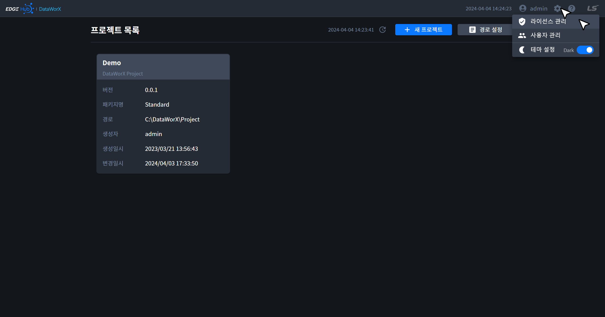
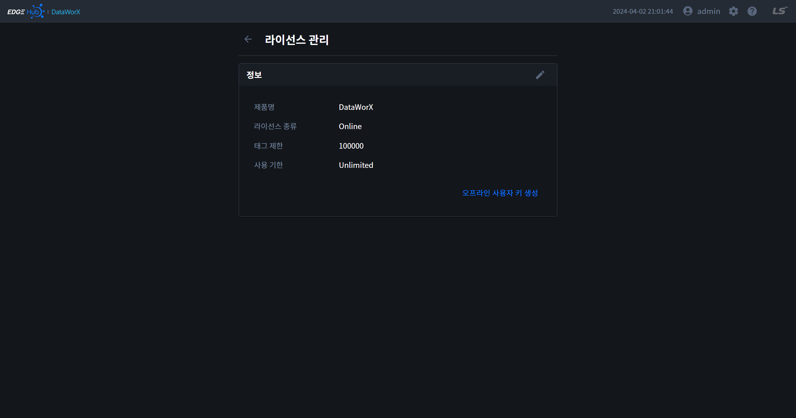
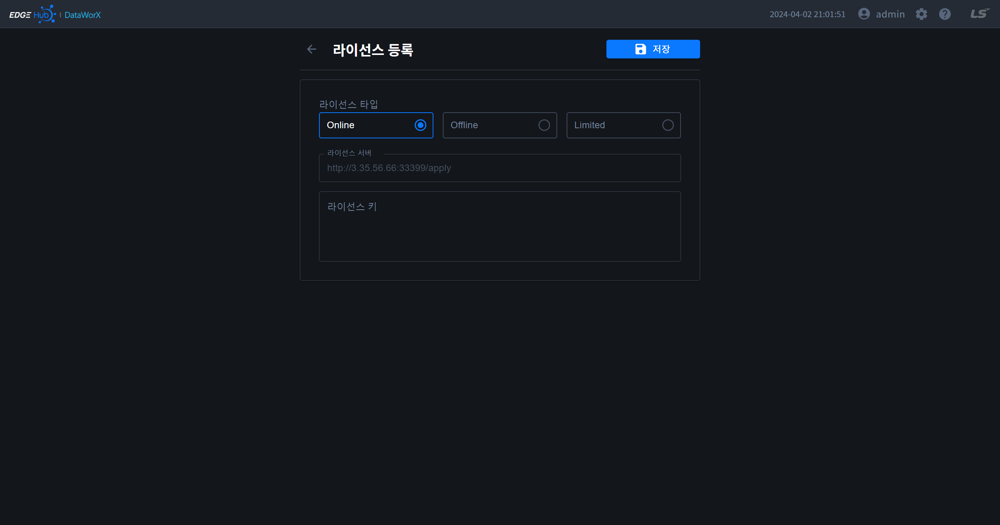
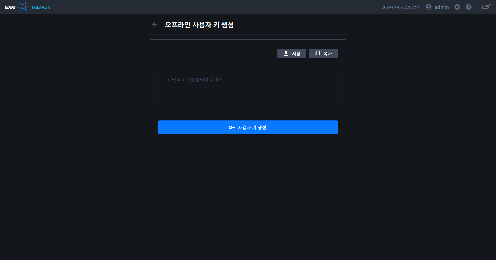

{: .no_toc }
# 라이선스
DataWorX 라이선스 관리를 위한 페이지입니다. 애플리케이션 바를 통해 해당 페이지로 이동할 수 있습니다.

{: .note }
해당 페이지는 관리자 권한만 사용 가능합니다.

{: .highlight }
라이선스를 등록하지 않은 경우 DataWorX 설치일로부터 14일간 태그 100개를 사용할 수 있는 `Trial` 라이선스가 자동 부여됩니다. 14일 이후부터는 라이선스를 등록해야 DataWorX 사용이 가능합니다.

- TOC
{:toc}

## 라이선스 정보
- 현재 등록된 라이선스 정보를 확인할 수 있습니다.

## 라이선스 등록
- 라이선스 타입을 선택한 뒤 LSE에서 받은 라이선스 키를 입력하고 저장버튼을 클릭하면 라이선스가 등록됩니다.

| 라이선스 타입 | 설명         |
| :----------: | :----------- |
| Online       | DataWorX가 설치된 PC가 라이선스 서버와 통신이 가능한 경우, 사용기한 제한없이 애플리케이션을 사용할 수 있습니다. |
| Offline      | DataWorX가 설치된 PC가 라이선스 서버와 통신이 불가한 경우, 오프라인 사용자키를 생성한 후 LSE에 보내면 라이선스 키를 발급 받을 수 있습니다. 사용기한 제한없이 애플리케이션을 사용할 수 있습니다. |
| Limited      | DataWorX가 설치된 PC가 라이선스 서버와 통신이 가능한 경우, 제한된 기간 내에 애플리케이션을 사용할 수 있습니다. |

## 오프라인 사용자 키 생성
1. 라이선스 관리 카드 하단 우측에 `오프라인 사용자 키 생성` 버튼을 클릭하여 페이지를 이동합니다.
2. 페이지 하단에 `사용자 키 생성`을 클릭하여 사용자 키를 생성합니다. 
3. `저장` 버튼을 클릭하여 사용자 키를 로컬에 다운로드(`DataWorX_Information.sif`)하거나 `복사` 버튼을 클릭하여 사용자 키를 복사합니다.
4. 생성한 사용자 키를 LSE 측에 전달하면 오프라인 라이선스 키를 발급 받을 수 있습니다.

## 라이선스 서버 수정
- 라이선스 서버 주소는 `[DataWorX 설치경로]/bin/EngineeringTool/Server/template/server.conf`에 저장되어 있으며 필요에 따라 변경할 수 있습니다.
- 주소 변경 후 브라우저에서 새로고침을 하면 변경된 서버 주소를 확인할 수 있습니다. 
