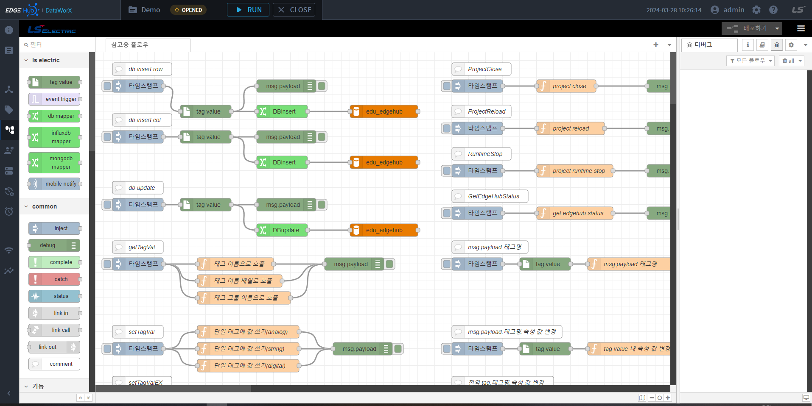

{: .no_toc }
# 로직 플로우

LogicFlow는 DataWorX의 구성요소 중 하나입니다.
추가 가능한 다양한 노드(컴포넌트)를 활용하여 흐름관계로 구성하고, 이벤트 기반의 모델링을 통해 사용자가 필요로 하는 데이터 조회, 가공, 입력 등의 기능을 빠르게 구현할 수 있으며, 작성된 어플리케이션은 런타임 중 편집과 배포가 가능 하도록 되어 있습니다.
LogicFlow는 Nodejs런타임 환경에서 구동이 가능하며, Html5지원 브라우저에서 편집기 사용이 가능합니다.
각 노드의 자세한 설명은 하위 페이지를 참고 바랍니다.

- TOC
{:toc}

## 기능
- 다양한 기능의 기본 노드를 제공하며, 필요시 추가로 노드를 설치할 수 있습니다
- DataWorX의 태그 인터페이스를 사용할 수 있습니다.
- LogicFlow의 실시간 데이터를 외부 DB로 내보낼 수 있습니다.

## 구성  
LogicFlow편집기는 웹브라우저 상에서 동작하며, LogicFlow런타임에서 동작 할 플로우를 작성할 수 있는 다양한 기능을 제공합니다.

LogicFlow 편집기의 화면 구성에 대한 설명은 다음과 같습니다.  

✅ **팔레트**: 플로우 작성시 사용 가능한 노드의 목록이며, 작업영역에 마우스로 끌어넣어 사용할 수 있습니다.  
✅ **작업영역**: 추가된 노드의 위치, 속성, 흐름 연결 등을 작성할 수 있는 탭 영역으로, 플로우 단위로 이루어져 있습니다.  
✅ **속성영역**: 선택된 노드의 도움말 또는 속성 설정값을 변경하는 화면이 표시됩니다.  
✅ **배포버튼**: 플로우 내용을 편집 후 배포하기 버튼을 누르면, 변경내용이 반영된 런타임 동작이 수행됩니다.  
✅ **메뉴버튼**: 메뉴버튼을 눌러 팔레트관리 및 편집기 환경설정을 변경할 수 있습니다. 
{: .highlight }
## 실행   
DataWorX에 통합되어 실행되며, 엔지니어링 도구를 통해 편집기능을 사용할 수 있습니다.
<!-- 🛠️ 다국어 지원 (개발예정)
브라우저의 언어 환경에 따라 자동으로 언어 적용이 되며, 사용자의 필요에 따라 
[상단메뉴] - [콤보박스]에서 수동으로 언어 변경이 가능합니다. 
Korean Ver  

English Ver  
 -->

## 추가 노드 설치
추가 라이브러리 노드를 사용할 수 있으며, [메뉴] – [팔렛트 관리] – [팔렛트]에서 다운로드 및 설치가 가능합니다.

{: .note}

> LogicFlow 화면이 정상적으로 나타나지 않을 경우 브라우저의 새로고침(F5) 기능을 이용하여 화면을 다시 표시할 수 있습니다.  

<!-- TODO: NEED TO CHECK! -->
<!-- > LogicFlow 연동 설정 방법은 4.1.4의 (3)번 “LogicFlow 설정”을 참고해주시기 바랍니다. -->
