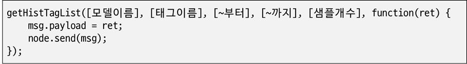
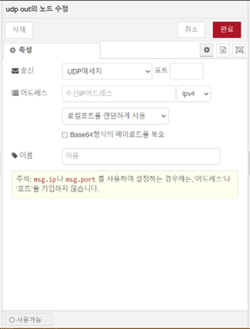
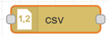

# LogicFlow

LogicFlow는 DataWorX의 구성요소 중 하나입니다. 추가 가능한 다양한 노드(컴포넌트)를 활용하여 흐름관계로 구성하고, 이벤트 기반의 모델링을 통해 사용자가 필요로 하는 데이터 조회, 가공, 입력 등의 기능을 빠르게 구현할 수 있으며, 작성된 어플리케이션은 런타임 중 편집과 배포가 가능 하도록 되어 있습니다.  
LogicFlow는 Nodejs런타임 환경에서 구동이 가능하며, Html5지원 브라우저에서 편집기 사용이 가능합니다.

## 1 LogicFlow 편집기

### 1.1 개요

1. 기능
   - 다양한 기능의 기본 노드를 제공하며, 필요시 추가로 노드를 설치할 수 있습니다
   - DataWorX의 태그 인터페이스를 사용할 수 있습니다.
   - LogicFlow의 실시간 데이터를 외부 DB로 내보낼 수 있습니다.
2. 구성  
    LogicFlow편집기는 웹브라우저 상에서 동작하며, LogicFlow런타임에서 동작 할 플로우를 작성할 수 있는 다양한 기능을 제공합니다.

    
    LogicFlow 편집기의 화면 구성에 대한 설명은 다음과 같습니다.  
    
    ✅ **팔레트**: 플로우 작성시 사용 가능한 노드의 목록이며, 작업영역에 마우스로 끌어넣어 사용할 수 있습니다.  
    ✅ **작업영역**: 추가된 노드의 위치, 속성, 흐름 연결 등을 작성할 수 있는 탭 영역으로, 플로우 단위로 이루어져 있습니다.  
    ✅ **속성영역**: 선택된 노드의 도움말 또는 속성 설정값을 변경하는 화면이 표시됩니다.  
    ✅ **배포버튼**: 플로우 내용을 편집 후 배포하기 버튼을 누르면, 변경내용이 반영된 런타임 동작이 수행됩니다.  
    ✅ **메뉴버튼**: 메뉴버튼을 눌러 팔레트관리 및 편집기 환경설정을 변경할 수 있습니다. 
    {: .highlight }
3. 실행   
    DataWorX에 통합되어 실행되며, 엔지니어링 도구를 통해 편집기능을 사용할 수 있습니다.
<!-- 4. 🛠️ 다국어 지원 (개발예정)
    브라우저의 언어 환경에 따라 자동으로 언어 적용이 되며, 사용자의 필요에 따라 
    [상단메뉴] - [콤보박스]에서 수동으로 언어 변경이 가능합니다. 
    Korean Ver  
    
    English Ver  
    
    -->

4. 추가 노드의 설치  
    추가 라이브러리 노드를 사용할 수 있으며, [메뉴] – [팔렛트 관리] – [팔렛트]에서 다운로드 및 설치가 가능합니다.

{: .note}

> LogicFlow 화면이 정상적으로 나타나지 않을 경우 브라우저의 새로고침(F5) 기능을 이용하여 화면을 다시 표시할 수 있습니다.  
> LogicFlow 연동 설정 방법은 4.1.4의 (3)번 “LogicFlow 설정”을 참고해주시기 바랍니다.

## 2 DataWorX 전용노드

### 2.1 tag value 노드

1.  노드 개요  
    노드에 입력이 발생할 때 마다, DataWorX의 태그값을 읽어 플로우로 가져오는 노드입니다.
    태그 및 태그그룹을 선택할 수 있으며, 아래 형태의 실시간 태그값이 msg.payload로 출력됩니다.

    | 속성   | 내용         | 타입                                                                                                     |
    | :----- | :----------- | :------------------------------------------------------------------------------------------------------- |
    | name   | 태그이름     | string                                                                                                   |
    | value  | 태그값       | string OR number OR boolean                                                                              |
    | kind   | 태그종류     | string<BR/>(analog, digital, string, structure, block, group)                                            |
    | type   | 값타입       | string<BR/>(null, bool, int8, int16, int32, int64, uint8, uint16, uint32, uint64, float, double, string) |
    | status | 태그상태     | number                                                                                                   |
    | uptime | 업데이트시각 | date                                                                                                     |

2.  노드 사용  
    tag value노드를 마우스로 끌어 작업영역에 놓습니다.  
      

    작업영역에서 해당 노드를 더블클릭하면 노드의 속성 수정 화면이 표시됩니다.  

    
    - 태그 커넥션: DataWorX와 실시간 태그 값을 주고 받기 위해서는 연결 설정을 하여야 합니다.
    - 이름: 플로우 편집 화면에 표시될 이름을 설정합니다.
    - 출력형식: 출력으로 내보낼 태그값 모음의 형태를 설정합니다.
    - 태그목록: 가져올 태그 이름 목록입니다. “추가” 버튼을 클릭하여 태그를 선택할 수 있습니다.

    {: .note}

    > 태그값 출력 형식은 “오브젝트”,“연관배열” 두가지 형태가 있으며, 그림과 같은 경우  
    > “오브젝트’일때 “msg.payload.OBSERVER.Ana1”로,  
    > “연관배열’일때 “msg.payload[‘OBSERVER.Ana1’]”로 태그값을 읽을 수 있습니다.  

3.  태그 선택기  
    “태그선택” 버튼을 클릭하면 태그선택 팝업이 표시됩니다.

    

    원하는 태그 또는 태그그룹을 선택 후 “목록에 추가” 버튼을 클릭하여 태그목록에 추가합니다.  
    태그목록의 정리가 완료되면 “선택확인” 버튼을 사용하여 설정에 적용합니다.  
    여러 항목을 선택하기 위해 “shift” 및 “ctrl”키를 사용할 수 있습니다.  

    {: .note}

    > 태그목록 항목에 태그를 지정하는 경우 태그값 오브젝트를 가져오며,  
    > 태그그룹을 지정하는 경우 하위의 모든 태그 오브젝트를 가져옵니다.

4.  globalContext의 사용  
    tag value 노드는 흐름 연결과 별개로 업데이트 되는 실시간 태그값을 globalContext에 반영하며,
    “global.tag.태그이름”을 사용하여 다른 노드에서 태그 값을 참조 할 수 있습니다.

    

    globalContext에 존재하는“OBSERVER.Ana1” 태그값을 inject노드에서 사용하는 설정 예시입니다.

### 2.2 event trigger 노드
1. 노드 개요  
    DataWorX에서 발생하는 이벤트를 수신하고, 해당 이벤트 정보를 출력으로 내보냅니다.  
    시스템이벤트 및 태그이벤트를 필터링하여 수신할 수 있습니다.  
2. 노드 사용  
    event trigger노드를 마우스로 끌어 작업영역에 놓습니다.

    

    노드를 더블클릭하여 노드의 속성 수정 화면을 표시합니다.

    

    - 커넥션: DataWorX 이벤트서버의 접속환경을 설정합니다.
    - 이름: 플로우 편집 화면에 표시될 이름을 설정합니다.
    - 시스템: 시스템이벤트 중 수신할 항목을 선택합니다.
    - 태그이벤트 목록: 수신할 이벤트 종류와 태그를 선택하여 항목을 추가합니다.

3. 태그 선택기  
    “추가” 버튼을 누르면 태그선택 팝업이 표시됩니다.  
    
    툴바의 오른쪽에 위치한 이벤트 종류 선택 콤보박스를 통하여 필터링할 이벤트 종류를 선택하면, 해당 이벤트를 발생시키도록 설정되어있는 태그의 목록만 표시됩니다.  

    원하는 태그를 선택 후 “선택확인” 버튼을 누르면 태그이벤트 목록에 추가됩니다.  
    여러 항목을 선택하기 위해 “shift” 및 “ctrl”키를 사용할 수 있습니다.  

### 2.3 db mapper 노드
1. 노드 개요  
    db mapper노드는 msg로 전달받은 데이터를 SQL쿼리 문장으로 변환하여 msg.topic으로 출력합니다.  
    선택용 입력도구로 설정 후 버튼을 클릭하여 SQL문장을 생성하거나, 편집기에 직접 입력하여 사용이 가능합니다.  
    맵핑 방식은 아래와 같이 4가지 형태로 구분할 수 있습니다.  

    | 커맨드        | 타입          | 타입 |
    | :----------- | :---------------- | :---- |
    | INSERT           | COLUMN | 속성값이 테이블의 각각 필드에 맵핑되는 INSERT 쿼리문을 생성합니다.  |
    | "" | ROW   | 오브젝트의 각각 속성값이 하나의 레코드로 입력되는 INSERT 쿼리문을 생성합니다. |
    | UPDATE           | COLUMN    | 테이블내 필드의 값을 설정한 속성값으로 UPDATE하는 쿼리문을 생성합니다.  |
    | ""           | ROW | 레코드의 각각 필드값을 오브젝트의 속성값으로 UPDATE하는 쿼리문을 생성합니다. |

2. 노드 사용  
    db mapper노드를 마우스로 끌어 작업영역에 놓습니다.  

    

    작업영역에서 해당 노드를 더블클릭하면 노드의 속성 수정 화면이 표시됩니다.  

    1. COLUMN타입  

        

        - 이름: 플로우 편집 화면에 표시될 이름을 설정합니다.
        - 테이블: 쿼리를 수행할 대상 테이블 이름을 설정합니다.
        - 커맨드: INSERT 또는 UPDATE 커맨드를 선택합니다.
        - 타입: “COLUMN” 맵핑타입을 선택합니다.
        - 맵핑항목: 소스가 될 속성이름과 대상이 될 컬럼이름을 설정합니다.  
            - “태그선택” 버튼을 누르면 태그선택기 팝업이 표시됩니다.  
            - CSV파일로 가져오기 및 내보내기 가 가능합니다.  
        - SQL생성: 버튼을 누르면 설정한 내용에 맞게 SQL문장이 생성됩니다.

    1. ROW 타입

        

        - 이름: 플로우 편집 화면에 표시될 이름을 설정합니다.
        - 테이블: 쿼리를 수행할 대상 테이블 이름을 설정합니다.
        - 커맨드: INSERT 또는 UPDATE 커맨드를 선택합니다.
        - 타입: “ROW” 맵핑타입을 선택합니다.
        - 맵핑항목: 소스가 될 오브젝트 이름을 설정합니다.
            - “태그선택” 버튼을 누르면 태그선택기 팝업이 표시됩니다.
            - CSV파일로 가져오기 및 내보내기 가 가능합니다.
        - 필드맵핑: 각각 오브젝트의 속성과 맵핑 될 컬럼 이름을 설정합니다.
        - SQL생성: 버튼을 누르면 설정한 내용에 맞게 SQL문장이 생성됩니다.

    {: .note}

    > UPDATE커맨드의 COLUMN 타입맵핑 설정 시 생성되는 SQL문장에는 WHERE문이 포함되지 않으므로, 쿼리 실행 시 모든 행에 반영됩니다.

3. 태그 선택기  
    “태그선택” 버튼을 누르면 태그선택 팝업이 표시됩니다.
    
    

    원하는 태그를 선택 후 “선택확인” 버튼을 누르면 맵핑항목 목록에 추가됩니다.
    여러 항목을 선택하기 위해 “shift” 및 “ctrl”키를 사용할 수 있습니다.

    {: .note}

    > db mapper의 태그 선택기의 태그 목록은 흐름으로 연결된 tag value노드의 선택 항목의 범위에 한하여 표시됩니다.

4. 테이블 및 컬럼 정보 조회  
    사용하려는 데이터베이스의 테이블 및 컬럼정보를 노드 편집 중에 참조할 수 있는 기능입니다.

    db mapper노드에 mysql노드를 연결합니다.

    

    db mapper노드를 더블클릭하여 노드의 속성 수정 화면을 표시합니다.

    

    데이터베이스의 테이블 및 컬럼 정보 목록이 콤보박스에 나타나면, 선택하여 설정할 수 있습니다.

    {: .note}

    > 테이블 및 컬럼 정보 조회는 db mapper의 노드에 연결된 노드 중 mysql노드가 1개만 존재할 때 동작합니다.

### 2.4 influxdb mapper 노드  
1. 노드 개요  
    msg로 전달받은 데이터를 influxdb batch노드의 입력 형식에 맞게 맵핑하여 msg로 출력합니다.
2. 노드 사용  
    node-red-contrib-influxdb 라이브러리의 influxdb batch노드와 연결하여 사용합니다.

    

    influxdb mapper노드를 더블클릭하여 노드의 속성 수정 화면을 표시합니다.

    

    - 이름: 플로우 편집 화면에 표시될 이름을 설정합니다.
    - 측정: influxdb에 저장되는 Measurement이름을 설정합니다.
    - 태그맵핑: influxdb의 tag key 이름과 tag value로 기록될 맵핑항목들을 설정합니다.
    - 필드맵핑: influxdb의 field key 이름과 field value로 기록될 맵핑항목들을 설정합니다.

3. 출력  
    예시에 따른 influxdb mapper의 출력은 아래의 형식과 같습니다.

    

4. 태그 선택기
    태그 선택기를 통하여 항목 추가가 가능하며, 사용방법은 db mapper와 동일합니다.

    {: .note}

    > influxdb의 ‘태그’와 DataWorX의 ‘태그’를 혼동하지 않도록 주의합니다.

### 2.5 mongodb mapper 노드
1. 노드 개요  
    msg로 전달받은 데이터를 mongodb out노드의 입력 형식에 맞게 맵핑하여 msg로 출력합니다.
2. 노드 사용  
    node-red-node-mongodb 라이브러리의 mongodb out노드와 연결하여 사용합니다.

    

    mongodb mapper노드를 더블클릭하여 노드의 속성 수정 화면을 표시합니다.

    

    - 이름: 플로우 편집 화면에 표시될 이름을 설정합니다.
    - 맵핑항목:
        - 값: 입력받은 값을 원래의 속성이름으로 맵핑하여 출력합니다.
        - 대입: 입력받은 값을 설정한 속성이름으로 맵핑하여 출력합니다.
3. 출력  
    예시에 따른 mongodb mapper의 출력은 아래의 형식과 같습니다.

    

4. 태그 선택기 
    태그 선택기를 통하여 항목 추가가 가능하며, 사용방법은 db mapper와 동일합니다.

### 2.6 mobile notify 노드
1. 노드 개요  
    입력받은 msg.payload의 내용을 SMS또는 카카오친구톡으로 발송하는 노드입니다.
2. 노드 사용  
    mobile notify노드를 마우스로 끌어 작업영역에 놓습니다.

    

    노드를 더블클릭하여 속성수정 화면을 표시합니다.
    1. 노드 설정 

        

        - 발송채널: 메세지 발송서비스 채널설정을 선택합니다.
        - 이름: 플로우 편집 화면에 표시될 이름을 설정합니다.
        - 수신목록: 메세지를 수신받을 전화번호를 설정합니다.
    2. 발송채널 설정  

        

        - Api키: 메세지 서비스업체(CoolSms)에서 발급받은 Api키를 입력합니다.
        - Api시크릿: 메세지 서비스업체(CoolSms)에서 발급받은 Api시크릿을 입력합니다.
        - 발송번호: 메세지 발신자로 표시될 전화번호를 입력합니다.
        - 카카오톡: 카카오톡에서 발급받은 pfid를 입력합니다.
            - ‘카카오톡으로 발송’이 체크되어있는 경우 SMS대신 카카오 알림톡으로 발송됩니다.

{: .note}

> mobile notify노드를 사용하기 위해서는 메세지 전송서비스 CoolSms(https://coolsms.co.kr/)에 등록된 계정이 필요합니다.

### 2.7 function 노드
1. 노드 개요  
    전달된 msg에 대해 JavaScript 코드를 수행하는 노드이며,  
    LogicFlow는 스크립트 내에서 DataWorX 태그 인터페이스를 사용할 수 있습니다.  

2. 노드 사용  
    function노드를 마우스로 끌어 작업영역에 놓습니다.  

    

    작업영역에서 해당 노드를 더블클릭하면 노드의 속성 수정 화면이 표시됩니다.

    

    

    - 이름: 플로우 편집 화면에 표시될 이름을 설정합니다.
    - 코드: 런타임 시 수행할 JavaScript코드를 입력합니다.
    - 출력수: 노드의 출력 수를 설정하고 msg를 배열로 내보내면 요소들은 각각의 출력으로 전달됩니다.

3. 태그 함수  
    1. getTagVal함수  
        DataWorX의 실시간 태그값을 즉시 가져오는 함수이며, 아래와 같이 여러 형태로 호출이 가능합니다

        - 태그 이름으로 호출
            ```js
            getTagVal("BLUE_01_LastUpdateTime", function(value) {
                msg.payload = value;
                node.send(msg);
            })
            ```
            “BLUE_01_LastUpdateTime”태그의 값을 가져와서 출력으로 내보내는 스크립트입니다.

            

            ↑getTagVal 결과

        - 태그 이름 배열로 호출
            ```js
            getTagVal(["BLUE_01_LastUpdateTime", "BLUE_01_StationOK"], function(tagValue) {
                msg.payload = tagValue;
                node.send(msg);
            })
            ```
            “BLUE_01_LastUpdateTime”,“BLUE_01_ReadSuccess” 두 태그의 값을 가져와서 출력으로 내보내는 스크립트입니다.
            
            

            ↑getTagVal 결과

        - 태그 그룹 이름으로 호출
             ```js
            getTagVal("D10.BLUE_01", function(value) {
                msg.payload = value;
                node.send(msg);
            })
            ```
            “감시화면” 그룹 내 모든 태그의 값을 가져와서 출력으로 내보내는 스크립트입니다.

            

            ↑getTagVal 결과

        {: .note}
        > 태그 그룹으로 호출하는 경우, 결과 데이터는 계층형 오브젝트로 반환됩니다.
    
    2. setTagVal함수   
        DataWorX의 태그에 값 쓰기를 수행하는 함수입니다.  
        ```js
        setTagVal("TAG_analog", 99, function(value) {
            msg.payload = value;
            node.send(msg);
        })
        setTagVal("TAG_digital", 1, function(value) {
            msg.payload = value;
            node.send(msg);
        })
        setTagVal("TAG_string", "DX", function(value) {
            msg.payload = value;
            node.send(msg);
        })
        ```
        “TAG_analog”, “TAG_digital”, “TAG_string” 태그에 값 쓰기를 수행하고 처리결과를 출력으로 내보내는 스크립트 입니다.  
        결과(ret): { retno: DLL RETURN값 }  
            - 상태값: 0(완료)

        

        ↑setTagValEX 노드 결과

    3. setTagValEx함수  
        DataWorX의 다수의 태그에 일괄 값 쓰기를 수행하는 함수입니다.  
        ```js
        setTagVal([{name: "TAG_string", value: "DataWorX"},
            {name: "TAG_digital", value: 0},
            {name: "TAG_analog", value: 10}], function(value) {
            msg.payload = value;
            node.send(msg);
        });
        ```
        “TAG_string”, ”TAG_digital”, ”TAG_analog” 태그에 값 쓰기를 수행하고 처리결과를 출력으로 내보내는 스크립트 입니다.  
        결과(ret): { retno: DLL RETURN값 }  
            - 상태값: 0(완료)

        

        ↑setTagValEX 노드 결과

4. DataWorX 프로젝트 함수  
    1. ProjectClose함수  
        DataWorX프로젝트 닫기를 수행하는 함수입니다.

        

        ```js
        projectClose(0, function(ret) {
            msg.payload = ret;
            node.send(msg);
        })
        ```
        모드: EH_PRJTYPE_STANDALONE = 0, EH_PRJTYPE_SERVER = 1, EH_PRJTYPE_CLIENT = 2 
        결과(ret): DLL RETURN값

    2. ProjectReload함수  
        DataWorX프로젝트를 다시 로딩하는 함수입니다.

        

        ```js
        projectReload(0, function(ret) {
            msg.payload = ret;
            node.send(msg);
        })
        ```
        모드: EH_PRJTYPE_STANDALONE = 0, EH_PRJTYPE_SERVER = 1, EH_PRJTYPE_CLIENT = 2
        결과(ret): DLL RETURN값

    3. Runtime Start함수  
        EdgeHub런타임을 시작하는 함수입니다.  
        프로젝트 경로 예시: C:\DataWorX\Project\Demo 


        ```js
        projectRuntimeStart(0, ['프로젝트경로'] function(ret) {
            msg.payload = ret;
            node.send(msg);
        })
        ```
        모드: EH_PRJTYPE_STANDALONE = 0, EH_PRJTYPE_SERVER = 1, EH_PRJTYPE_CLIENT = 2
        프로젝트경로: .lspx파일의 로컬 경로
        결과(ret): DLL RETURN값

    4. Runtime Stop함수  
        DataWorX런타임을 중지하는 함수입니다.

        

        ```js
        projectRuntimeStop(0, function(ret) {
            msg.payload = ret;
            node.send(msg);
        })
        ```
        모드: EH_PRJTYPE_STANDALONE = 0, EH_PRJTYPE_SERVER = 1, EH_PRJTYPE_CLIENT = 2
        프로젝트경로: .lspx파일의 로컬 경로
        결과(ret): DLL RETURN값

    5. GetEdgeHubStatus함수  
        DataWorX의 구동상태를 확인하는 함수입니다.
        ```js
        getEdgeHubStatus(function(ret) {
            msg.payload = ret;
            node.send(msg);
        })
        ```
        결과(ret): { retno: DLL RETURN값, status: 상태값 }
        * 상태값: 0(Closed), 1(Opened), 2(Running)

        

        ↑getEdgeHubStatus 결과

5. 이력 데이터 조회
    1. getHistTagList 함수
        이력태그 데이터 목록을 조회하는 함수입니다.

        
    
        ```js
        getHistTagList('정주기 1분 샘플', 'TestGroup.아나로그01', '2024-03-19', 100, function(ret) {
            msg.payload = ret;
            node.send(msg);
        })
        ```

        - 모델이름: 조회할 이력모델 이름
        - 태그이름: 조회할 이력모델태그 이름
        - ~부터: 조회시간 범위(Date타입)
        - ~까지: 조회시간 범위(Date타입)
        - 샘플개수: 조회시간 범위 내에서 샘플링 할 개수
        - 결과(ret): 태그 이력데이터 목록
        
        

    2. 🛠️ getHistAlarmList 함수
        이력알람 목록을 조회하는 함수입니다.

        
    
        ```js
        getHistAlarmList(function(ret) {
            msg.payload = ret;
            node.send(msg);
        })
        ```
        - ~부터: 조회시간 범위(Date타입)
        - ~까지: 조회시간 범위(Date타입)
        - 필터: 조회조건이 추가로 필요한 경우 object 형태의 인자로 전달하며, 조건이 필요하지 않은 경우에는 입력하지 않습니다.

        **조회필터 속성 정보**

        | 속성        | 타입          | 타입 |
        | :---------- | :---------------- | :---- |
        | alarmType   | number | 0x40(발생), 0x20(해제), 0x10(인지), 0x04(프로세스), 0x02(시스템), 0x10(이벤트)  |
        | alarmLevel | number | 주어진 LEVEL이상만 조회  |
        | tagName     | number | 알람태그 이름 조건   |
        | tagType     | number | 1:아날로그, 2:디지털, 3:문자열 |
        | alarmKind   | number | 0x01:HH, 0x02:HI, 0x04:LO, 0x08:LL, 0x10:CHANGEVAL, 0x20:MGAP, 0x40:SUBGAP  |

6. 실시간 알람 및 인지  
    1. getAlarmList 함수  
        실시간 알람 목록을 조회하는 함수입니다.

        

        ```js
        getAlarmList(function(ret) {
            msg.payload = ret;
            node.send(msg);
        })
        ```

        결과(ret): { retno: DLL RETURN값, status: 상태값 }

        

    2. ackAlarm 함수  
        지정한 알람을 인지처리하는 함수입니다.

        

        ```js
        ackAlarm('hskim6', '0', '10.13.114.224', ['TestGorup.아나로그01', 'TestGroup.아나로그02'], function(ret) {
            msg.payload = ret;
            node.send(msg);
        })
        ```
        - 인지사용자: 인지처리시 등록할 사용자 ID
        - 인지LEVEL: 인지처리시 등록할 사용자 LEVEL
        - IP주소: 인지처리시 등록할 IP주소
        - 태그이름목록: 인지처리할 태그이름 배열
        - 결과(ret): DLL RETURN값 

        


    3. ackAlarmaAll 함수  
        모든 알람을 인지처리하는 함수입니다.

        

        ```js
        ackAlarmAll('hskim6', '0', '10.13.114.224', function(ret) {
            msg.payload = ret;
            node.send(msg);
        })
        ```

        - 인지사용자: 인지처리시 등록할 사용자 ID
        - 인지LEVEL: 인지처리시 등록할 사용자 LEVEL
        - IP주소: 인지처리시 등록할 IP주소
        - 결과(ret): DLL RETURN값

        

7. 전역 태그값 참조  
    런타임에 동작중인 모든 tag value노드는 태그값 업데이트 시점에 태그값을 globalContext에 반영하고 있으며,  
    이 태그값은 흐름연결 유무에 관계없이 function노드의 스크립트에서 참조하 여 사용할 수 있습니다.  
    ```js
    msg.payload = tag.D10.BLUE_01.ENCODER_TEMP_AXIS_1;
    return msg;
    ```
    위 스크립트 코드는 ”D10.BLUE_01.ENCODER_TEMP_AXIS_1” 태그값을 참조하여, 출력으로 내보내는 예시 입니다.  
    - 태그이름 자동완성  
        스크립트 편집기에서 “tag.” 입력 시 사용가능한 태그이름이 자동완성 목록에 표시됩니다.

        

        태그그룹 구분자 “.”의 커서위치에서 “ctrl+space”를 입력하여 목록을 표시할 수 있습니다.

    {: .note}

    > 자동완성 목록은 tag value노드에 설정되어 globalContext에 업데이트중인 태그 항목에 한해서 표시됩니다

## 3 LogicFlow 기본 노드
### 3.1 inject 노드
1. 노드 개요  
    수동 또는 일정 간격으로 메시지를 전송하여 flow를 시작 시키는 역할을 수행합니다.  
    메시지 페이로드에는 문자열, 현재 시각, JavaScript 객체 등 다양한 값을 지정할 수 있습니다.  

2. 노드 사용  
    Inject 노드를 마우스로 끌어 작업영역에 놓습니다.  

    

    작업영역에서 해당 노드를 더블클릭하면 노드의 속성 수정 화면이 표시됩니다.  

    

    - 페이로드: 지정한 메시지 페이로드를 출력으로 사용하여 플로우를 시작합니다.
        페이로드의 기본값은 현재시각의 타임스탬프를 1970년 1월1일부터 경과한 밀리초로 표현한 값입니다. 문자열, 수치, 논리값, JavaScript오브젝트 등을 페이로드로 설정할 수 있습니다.
    - 토픽: 임의로 지정가능한 프로퍼티입니다. 데이터페이스 query 또는 MQTT의 토픽을 설정할 경우 사용할 수 있습니다.
    - 반복: 지정된 간격, 혹은 스케쥴에 따라 메시지를 송출하도록 설정합니다. “지정한 시간간격”, “지정한 시간간격, 일시”, “지정한 일시” 등을 설정할 수 있습니다.
    - 이름: 노드에 표시되는 이름을 설정합니다. 이름이 없을 경우 페이로드 타입/값이 노드에 표시됩니다.

### 3.2 debug 노드
1. 노드 개요  
    사이드바의 '디버그'탭에 선택한 메시지 프로퍼티의 값을 표시합니다.  
    태그 및 태그그룹을 선택할 수 있으며, 아래 형태의 실시간 태그값이 msg.payload로 출력됩니다.  
    노드 우측의 버튼으로 출력을 On/Off 설정할 수 있습니다.  

2. 노드 사용  
    debug 노드를 마우스로 끌어 작업영역에 놓습니다.  

    

    작업영역에서 해당 노드를 더블클릭하면 노드의 속성 수정 화면이 표시됩니다.

    

    - 대상: 출력 대상을 설정합니다. 기본값은 메시지 페이로드입니다. 지정한 프로퍼티 또는 메시지 전체를 출력할 수 있습니다.
    - 출력대상: 기본값은 디버그 창입니다. 시스템 콘솔이나 노드의 상태로 출력하도록 선택할 수 있습니다
    - 노드의 상태로 표시된 예)

         

    - 이름: 노드에 표시되는 이름을 설정합니다. 이름이 없을 경우 출력으로 설정된 값이 노드에 표시됩니다.
    
### 3.3 complete 노드
1. 노드 개요  
    complete 노드에 설정한 노드가 메시지 처리를 마쳤을 때 런타임에 알리면 complete 노드는 연결된 flow를 트리거 할 수 있습니다.  

2. 노드 사용  
    complete 노드를 마우스로 끌어 작업영역에 놓습니다.  

    

    작업영역에서 해당 노드를 더블클릭하면 노드의 속성 수정 화면이 표시됩니다.  

    

    - Select nodes: 화면에서 노드를 선택할 경우 사용합니다.
    - 리스트: 화면에 삽입된 노드 리스트를 표시합니다. 체크박스를 설정하면 해당 노드의 종료를 기다립니다.  
        다수를 설정하면 OR 조건으로 어느 하나의 노드가 완료되면 동작합니다. 
        설정한 노드에서 사용하거나 구성한 msg를 complete 노드에 연결된 다음 노드에서 가지고 와서 처리할 수 있습니다.  
        이메일 전송 노드와 같이 출력 포트가 없는 노드와 함께 사용할 수 있습니다. 단, 모든 노드가 이 이벤트를 지원하는 것은 아닙니다.  
        Node-RED 1.0에 도입된 대로 이 기능을 지원하도록 구현되었는지 여부에 따라 다릅니다.  

### 3.4 catch 노드
1. 노드 개요  
    같은 탭내의 노드가 송출한 에러를 캐치합니다. 메시지 처리중에 노드가 에러를 송출했을 경우,  
    플로우 실행은 기본적으로 정지합니다. 이 노드를 사용하면, 에러를 캐치하고 대응하는 플로우로 처리시킬 수 있습니다.  
    오류가 발생한 경우 msg.error 프로퍼티가 추가됩니다. error 프로퍼티의 내용은 다음과 같습니다.  

    | 프로퍼티 이름       | 내용          |
    | :----------- | :---------------- |
    | error.message           | 에러 메시지 |
    | error.source.id | 에러를 보낸 노드의 id   |
    | error.source.type           | 에러를 보낸 노드의 종류     |
    | error.source.name          | 에러를 보낸 노드의 명칭(설정되어 있는 경우) |


2. 노드 사용  
    catch 노드를 마우스로 끌어 작업영역에 놓습니다.
    
    

    작업영역에서 해당 노드를 더블클릭하면 노드의 속성 수정 화면이 표시됩니다.

     

    - 에러 취득처: 모든 노드로부터 에러를 취득하는 것이 기본 설정입니다.  
        “모든 노드”로 설정 시 “Catch노드로 처리된 에러를 무시” 체크 박스를 설정할 수 있습니다. 이는 다른 Catch 노드에서 처리한 에러를 무시하겠다는 의미입니다.  
        에러 취득처를 “선택  한 노드”로 설정한 경우 노드를 선택할 수 있는 리스트가 표시됩니다.  
    - 이름: 노드에 표시되는 이름을 설정합니다. 이름이 없을 경우, “모두” 또는 선택한 노드의 개수가 catch 단어와 함께 표시됩니다.

### 3.5 status 노드
1. 노드 개요  
    같은 탭내 노드의 상태 메시지를 취득합니다. 기본값으로는, 같은 워크스페이스 탭내의 모든 노드의 스테이터스를 취득합니다.  
    특정 노드의 스테이터스를 취득 대상으로 설정할 수도 있습니다.   
    msg.status 프로퍼티의 내용은 다음과 같습니다.  

    | 프로퍼티 이름       | 내용          |
    | :----------- | :---------------- |
    | status.text           | 상태 문자열 |
    | status.source.type | 상태를 표시한 노드의 종류  |
    | status.source.id          | 상태를 표시한 노드의 id     |
    | status.source.name        | 상태를 표시한 노드의 명칭(설정되어 있는 경우) |

2. 노드 사용  
    status 노드를 마우스로 끌어 작업영역에 놓습니다.
    
    

    작업영역에서 해당 노드를 더블클릭하면 노드의 속성 수정 화면이 표시됩니다.

     

    - 상태취득처: 모든 노드로부터 상태를 취득하는 것이 기본 설정입니다.  
        상태취득처를 “선택한 노드”로 설정한 경우 노드를 선택할 수 있는 리스트가 표시됩니다.
    - 이름: 노드에 표시되는 이름을 설정합니다. 이름이 없을 경우, “모두” 또는 선택한 노드의 개수가 status 단어와 함께 표시됩니다.

### 3.6 link in 노드
1. 노드 개요  
    Flow 간에 가상의 링크를 작성합니다. 임의의 탭 상에 존재하는 link out 노드에 접속할 수 있습니다.  
    link 노드를 선택하면 연결된 link 노드가 표시됩니다. link in의 설정 창에는 link out 노드들이 표시되며 체크하여 링크할 수 있습니다.  
    이 접속은 직접 링크한 것과 동일하에 작동합니다.  
    link out에서 출력한 메시지를 받아서 다음 노드에 전달하는 역할을 수행합니다.  

     

2. 노드 사용  
    link in 노드를 마우스로 끌어 작업영역에 놓습니다.
    
     

    작업영역에서 해당 노드를 더블클릭하면 노드의 속성 수정 화면이 표시됩니다.

    

    - 이름: link out 노드의 리스트에 표시되는 이름을 설정합니다. 이름이 없을 경우, 임의의 영숫자 조합의 ID가 리스트에 표시됩니다.

### 3.7 link out 노드
1. 노드 개요  
    Flow 간에 가상의 링크를 작성합니다. 임의의 탭 상에 존재하는 link in 노드에 접속할 수 있습니다.  
    link 노드를 선택하면 연결된 link 노드가 표시됩니다. link out의 설정 창에는 link in 노드들이 표시되며 체크하여 링크할 수 있습니다.  
    이 접속은 직접 링크한 것과 동일하에 작동합니다. 메시지를 link in 노드에 전달하는 역할을 수행합니다.

    

2. 노드 사용  
    link out 노드를 마우스로 끌어 작업영역에 놓습니다.
    
    

    작업영역에서 해당 노드를 더블클릭하면 노드의 속성 수정 화면이 표시됩니다.

    

    - 이름: link in 노드의 리스트에 표시되는 이름을 설정합니다. 이름이 없을 경우, 임의의 영숫자 조합의 ID가 리스트에 표시됩니다.

### 3.8 comment 노드
1. 노드 개요  
    Flow에 코멘트를 기술하기 위해 사용합니다. 이름과 내용을 입력할 수 있으며, 내용 항목은 사이드 패널에 표시됩니다.

2. 노드 사용  
    comment 노드를 마우스로 끌어 작업영역에 놓습니다.
    
    

    작업영역에서 해당 노드를 더블클릭하면 노드의 속성 수정 화면이 표시됩니다.

    

    - 이름: 노드에 표시되는 이름을 설정합니다. 이름이 없을 경우, “comment” 단어가 표시됩니다.
    - 편집기: 일반 텍스트 기반의 경량 마크업 언어인 Markdown 형식으로 내용을 작성할 수 있습니다. 입력한 내용은 사이드 패널에 표시됩니다.
    
    

### 3.9 function 노드
1. 노드 개요  
    수신 메시지에 대한 처리를 실시하는 JavaScript 코드(함수 본체)를 작성합니다.  
    입력되는 메시지는 msg라는 명칭의 JavaScript 객체로 전달됩니다. msg 오브젝트는 msg.payload 프로퍼티에 메시지 본체를 유지합니다.  
    일반적으로 코드에서는 msg 오브젝트를 반환합니다. 후속 flow의 실행을 정지하고 싶은 경우 msg 오브젝트를 반환하지 않습니다.  

2. 노드 사용  
    function 노드를 마우스로 끌어 작업영역에 놓습니다.
    
    

    작업영역에서 해당 노드를 더블클릭하면 노드의 속성 수정 화면이 표시됩니다.

    

    - 이름: 노드에 표시되는 이름을 설정합니다. 이름이 없을 경우, 공백이 표시됩니다.
    - 라이브러리 열기: 저장되어 있는 라이브러리를 가져올 수 있습니다.
    - 라이브러리로 저장: 현재 작성된 함수를 저장할 수 있습니다.
    - 코드: JavaScript로 함수 내용을 작성합니다.
    - 출력 수: 출력 단의 개수를 설정합니다. 단일 메시지의 경우 첫 출력단에 접속된 노드에 전달됩니다. 출력 단의 개수가 다수인 경우 출력 메시지의 배열을 반환하도록 구성하며 배열 순서에 따라 출력단의 순서에 대응하여 출력됩니다.

3. 메시지 송신  
    Flow 내의 다음 노드에 메시지를 전달하기 위해서는 메시지를 반환(return msg)하거나, node.send(msg)를 호출합니다.  
    반환/send 대상은 다음과 같습니다.  
    - 단일 메시지 오브벡트 – 첫 출력에 접속된 노드에 전달합니다.  
    - 메시지 오브젝트의 배열 – 대응하는 출력에 접속된 노드에 전달됩니다.  
    메시지 배열이 출력 대상인 경우 복수의 메시지가 대응하는 출력으로 전달됩니다. 반환 값이 null 인 경우 메시지는 전달되지 않습니다.  
    ```js
    var msg1 = { payload: “msg01 – out1” };
    var msg2 = { payload: “msg02 – out2” };
    return [ msg1, msg2 ];
    ```

    

4. 로그 출력과 에러처리  
    로그 정보의 출력, 에러 출력을 실행하려면 다음 함수를 사용합니다. 
    - node.log(“로그 메시지”)
    - node.warn(“경고”)
    - node.error(“에러”)
    catch 노드를 이용하여 에러를 처리할 수 있습니다. catch 노드로 처리하기 위해서는 msg를 node.error의 제2 인수로 전달합니다.  
    - node.error(“에러”, msg)  

### 3.10 switch 노드
1. 노드 개요  
    프로퍼티 값에 의해 메시지를 분류합니다. 수신한 메시지에 대해 지정된 룰을 순서대로 평가하여 매치된 룰에 대응하는 출력 포트에 메시지를 송출합니다.  
    룰을 모두 평가하거나 처음 매치된 룰에서 멈추는 것을 설정할 수 있습니다.  

2. 노드 사용  
    switch 노드를 마우스로 끌어 작업영역에 놓습니다.
    
    

    작업영역에서 해당 노드를 더블클릭하면 노드의 속성 수정 화면이 표시됩니다.

    

    - 이름: 노드에 표시되는 이름을 설정합니다. 이름이 없을 경우, “switch” 단어가 표시됩니다.
    - 프로퍼티: 평가 룰의 대상을 설정합니다. msg, flow, global 컨텍스트 프로퍼티 등을 설정할 수 있습니다. 또한 JSONata expression 또는 환경 변수를 대상으로 설정할 수 있습니다.
    - 분류 룰: 분류 룰을 선택합니다. Value rule 또는 Sequence rule을 선택할 수 있습니다.
    - 비교 대상: 분류 룰에 따라 비교할 대상과 값을 설정합니다.
    - 출력단: 숫자는 출력단의 순서를 표시합니다. 예를 들어 1은 첫번째 출력단으로 출력됨을 의미합니다.  
    예) 두번째 룰을 만족하는 경우 메시지는 아래 그램의 func2로 전달됩니다.

    

    - 삭제버튼: 해당 항목을 삭제합니다.
    - +추가: 분류 룰 항목을 추가합니다.
    - 모든 조건을 적용: “모든 조건을 적용”과 “처음 맞은 조건으로 종료” 중에 선택할 수 있습니다. “모든 조건을 적용”을 설정한 경우, 조건에 맞는 모든 출력단으로 메시지를 전달합니다. “처음 맞는 조건으로 종료”를 설정한 경우, 조건에 맞는 항목을 만날 경우 해당 출력단에만 메시지를 전달하고 종료합니다.
    - 메시지열의 보정: 옵션을 지정하면, 매치한 각 룰에 대해 새로운 메시지를 생성합니다.

3. 분류 툴  
    분류 룰은 아래의 4개로 나뉩니다.  
    - Value rule: 지정된 프로퍼티에 대해 값을 평가합니다. 설정할 수 있는 룰에는 “==”, “!=”, “<”, “<=”, “>”, “>=”, “is true”, “is false”, “is null” 등이 있습니다.
    -	Sequence rule: 메시지 열에 대해 적용(메시지 열을 split 노드 등으로 생성), head, index between, tail 등 타입을 선택할 수 있습니다. Head는 앞에서부터 인덱스를, tail은 뒤에서부터 인덱스를 가리킵니다. Index between은 설정한 2개의 인덱스 사이의 메시지 열을 의미합니다.
    -	JSONata expression: 메시지 전체에 대해 평가를 수행하여 결과가 true인 경우에 매치
    -	그 외: 이 전의 룰에 매치되는 것이 없는 경우에 적용

### 3.11 change 노드
1. 노드 개요  
    메시지, flow context, global context의 프로퍼티를 변경, 삭제, 이동합니다. 룰을 여려개 지정한 경우, 정의된 순서로 적용됩니다.

2. 노드 사용  
    change 노드를 마우스로 끌어 작업영역에 놓습니다.
    
    

    작업영역에서 해당 노드를 더블클릭하면 노드의 속성 수정 화면이 표시됩니다.

    

    - 이름: 노드에 표시되는 이름을 설정합니다. 이름이 없을 경우, 선택한 룰과 대상값이 표시됩니다.
    - 룰: 값의 대입, 값의 치환, 값의 삭제, 값이 이동 중 하나를 선택할 수 있습니다. 값의 치환을 선택할 경우 검색할 문자열과 치환 후의 문자열 항목이 표시됩니다.
    - +추가: 룰 항목을 추가할 수 있습니다. 

### 3.12 range 노드
1. 노드 개요  
    수치를 다른 범위 값으로 변환합니다.

2. 노드 사용  
    range 노드를 마우스로 끌어 작업영역에 놓습니다.
    
    

    작업영역에서 해당 노드를 더블클릭하면 노드의 속성 수정 화면이 표시됩니다.

    

    - 프로퍼티: 메시지의 payload를 설정합니다. payload에는 수치를 지정합니다. 수치 이외를 지정한 경우에는 수치로 변환합니다. 변환할 수 없는 경우에는 에러를 발생합니다.
    - 동작: 수치를 변환하기 위한 동작은 3가지 중 선택할 수 있습니다.  
        - “msg.payload의 값을 확대/축소”: 수치를 선형 스케일링합니다. 결과 값은 노드에 설정한 범위 내로 한정하지 않습니다.  
        - “입력값의 범위외의 값을 최소값/최대값으로 확대/축소”: 값이 지정된 범위 밖의 값으로 변하지 않도록 합니다.  

        예) 입력값 범위: 0~99, 출력값 범위: 0~50인 경우, 100이 입력으로 들어오면 입력값 범위를 벗어나므로 출력 최대값 50으로 처리된다. 입력갑이 -1이 입력된 경우 출력값은 0으로 출력된다.
        - “입력값의 범위외의 값을 범위폭으로 나눈 나머지로 해서 확대/축소”: 결과를 범위폭으로 나눕니다.  

        예) 입력값 범위: 0~99, 출력값 범위: 0~50인 경우, 100이 입력으로 들어오면 입력값 법위를 벗어나므로 입력값 범위폭인 99으로 나눈다. 나머지 1을 출력값 범위에 확대/축소 처리하면 0.5가 출력된다. 
    - 입력값의 범위: 입력값의 최소값과 최대값을 입력합니다.
    - 출력값의 범위: 출력값의 최소값과 최대값을 입력합니다. 
    - 이름: 노드에 표시되는 이름을 설정합니다. 이름이 없을 경우, 출력값의 범위가 표시됩니다

### 3.13 template 노드
1. 노드 개요  
    템플릿에 기초하여 프로퍼티를 설정합니다.

2. 노드 사용  
    template 노드를 마우스로 끌어 작업영역에 놓습니다.
    
    

    작업영역에서 해당 노드를 더블클릭하면 노드의 속성 수정 화면이 표시됩니다.

    

    - 이름: 노드에 표시되는 이름을 설정합니다. 이름이 없을 경우, “template” 단어가 표시됩니다.
    - 프로퍼티: 메시지의 payload를 설정합니다. 템플릿에 적용하기 위한 정보를 포함한 메시지 오브젝트입니다. 예) 메시지에 다음과 같은 JSON 객체를 설정할 수 있습니다.
    ```js
    msg = {
        date: "월요일",
        payload: {
            name: "홍길동"
        }
    };
    ```
    - 템플릿: 출력 메시지를 생성하기 위한 템플릿입니다. Mustache 형식을 기본값으로 이용합니다.
    Mustache 형식은 중괄호({}) 2개로 JSON 객체의 속성이름을 감싸도록 구성됩니다. 해당 속성의 값이 실제 메시지를 구성하는데 사용됩니다.

    예) 안녕하세요, {{payload.name}}씨. 오늘은 {{date}}입니다.

    - </>형식: 템플릿에서 나타나는 “/”를 Mustach템플릿으로 처리할 것인지, 평문으로 처리할 것인지 설정합니다. Mustache 템플릿 형식으로 설정한 경우 Mustache section의 종료 표시 식별자로 처리됩니다.
    - 출력형식: 평문, JSON, YAML 형식 중 선택할 수 있습니다.

    평문의 예) 안녕하세요, 홍길동씨, 오늘은 월요일입니다.

### 3.14 delay 노드
1. 노드 개요  
    노드를 통과하는 메시지를 지연, 혹은 유량을 제한합니다.

2. 노드 사용  
    delay 노드를 마우스로 끌어 작업영역에 놓습니다
    
    

    작업영역에서 해당 노드를 더블클릭하면 노드의 속성 수정 화면이 표시됩니다.

    

    - 동작: 메시지 지연 또는 메시지의 유량제한을 선택할 수 있습니다.

    메시지에 reset 프로퍼티를 임의의 값으로 설정하여 수신하게되면 노드가 유지하고 있는 모든 메시지를 클리어 합니다. Reset 수신 상태는 노드의 상태값으로 표시됩니다.
    ```js
    msg.reset = 1; 
    ```

    

    - 메시지 지연: 지연 시간은 고정값, 범위내의 난수값, 메시지 마다의 동적인 지정값 중 하나를 지정할 수 있습니다.
    - 고정값: 고정값이 지난 후 큐에 쌓인 메시지를 처리합니다. 설정된 고정값은 노드 이름에 표시되며, 메시지가 큐에 쌓이면 상태값에 사각형이 표시됩니다

    

    - 난수값: 설정된 범위 내에서 랜덤 값을 생성하여 지연 시작을 설정하게 됩니다.

    

    위와 같이 설정된 경우, 15~20초 사이에서 랜덤 값을 생성하여 메시지를 지연시키게 됩니다.  
    생성된 랜덤 값은 노드의 상태값에 표시됩니다.  

    

    - 메시지 마다의 동적인 지정값: msg.delay에 지연 시간을 메시지 마다 설정합니다. 설정하는 시간은 밀리세컨드 값입니다. 변수에 설정된 지연 시간은 노드의 상태값에 표시됩니다.

    

    - 메시지의 유량제한: 메시지는 지정된 시간 간격내에 분산되어 송신합니다. 큐에 남은 메시지 수는 노드의 스테이터스에 표시됩니다. 받은 중간 메시지를 파기할 수 있습니다. 유량제한은 모든 메시지에 적용할 수도 있고, msg.topic값으로 그룹화하여 적용할 수도 있습니다. 그룹화하면, 중간 메시지는 자동적으로 파기됩니다. 지정한 시간 후에 큐 선두의 토픽 메시지를 출력할지, 지정한 시간 후에 큐에 있는 모든 토픽 메시지를 출력할지 설정할 수 있습니다

     

    - 이름: 노드에 표시되는 이름을 설정합니다. 이름이 없을 경우, 현재 설정한 내용이 표시됩니다.  

   예) 유량제한 초당 1개의 메시지를 설정한 경우 “limit 1 msg/s”으로 표시됩니다.

### 3.15 trigger 노드
1. 노드 개요  
    메시지를 송신하면 다른 메시지를 송신합니다. 지연 혹은 초기화가 지정되지 않은 경우에는 다음 2번째 메시지를 송신할 수도 있습니다.  
    reset 프로퍼티를 갖는 메시지를 받으면, 준비중인 대기나 반복을 클리어하여 메시지 송신은 실행되지 않습니다. Flow 내에서 타임아웃을 작성하는데 이용합니다.

2. 노드 사용  
    trigger 노드를 마우스로 끌어 작업영역에 놓습니다.
    
    

    작업영역에서 해당 노드를 더블클릭하면 노드의 속성 수정 화면이 표시됩니다.

    

    - 송신 데이터: 초기 송신 데이터를 설정합니다. 없음을 설정할 수도 있습니다.
    - 송신후의 처리: 초기 송신 데이터를 송신한 후 다음 3개의 옵션을 설정할 수 있습니다.

    1. 초기화될 때까지 대기: trigger노드가 외부 메시지에 의해 트리거되면, 초기 송신 데이터를 송신한 후 reset을 대기합니다. Reset을 대기하는 상태는 노드의 상태 표시에 사각형으로 표시됩니다. 대기 중에는 외부에서 메시지가 수신되어도 아무런 동작을 수행하지 않습니다. msg.reset 속성을 갖는 메시지가 송신되면 외부 메시지에 의한 트리거를 대기하는 상태가 됩니다. 즉, trigger & block 형태로 동작하게 됩니다.

     

    2. 지정한 시간 대기: 노드의 기본값으로 설정되어 있는 옵션입니다. 초기 송신 데이터를 송신 후 설정한 시간을 대기합니다. 대기한 시간이 경과하면 재송신 데이터를 송신하게 됩니다. 예를 들어 초기 송신 데이터를 없음으로 설정하고 “새로운 메시지를 받앗을 때 지연을 연장”을 체크하게되면 타이머로 사용할 수 있습니다. 
    
    예) 센서 데이터가 10초마다 수신되어야한다면, 10초가 경과하여도 데이터 메시지가 수신되지 않으면 “타임아웃 발생” 메시지를 송신하게 설정할 수 있습니다.

    

    3. 지정한 시간 간격마다 송신을 반복: 지정한 시간마다 초기 송신 메시지를 반복하여 송신합니다. msg.reset 을 수신하면 동작이 reset되어 중지됩니다. Reset된 후에는 외부에서 메시지를 수신하면 재시작하게 됩니다.
    
    

    - 이름: 노드에 표시되는 이름을 설정합니다. 이름이 없을 경우, 현재 설정한 내용이 표시됩니다.

   예) 5초마다 재송신을 설정한 경우 “resend every 5s”으로 표시됩니다.

### 3.16 exec 노드
1. 노드 개요  
    시스템 커맨드를 실행하여 출력을 반환합니다. 커맨드 완료까지 기다릴지, 커맨드가 출력을 실행할 때마다 메시지를 출력할지 지정할 수 있습니다. 실행대상의 커맨드는 노드의 설정 혹은 수신 메시지에서 지정합니다.

2. 노드 사용  
    exec 노드를 마우스로 끌어 작업영역에 놓습니다.
    
    

    작업영역에서 해당 노드를 더블클릭하면 노드의 속성 수정 화면이 표시됩니다.

    

    - 커맨드: 실행할 시스템 커맨드를 입력합니다. 커맨드 혹은 파라미터가 공백을 포함하는 경우에는 앞뒤에 인용부를 붙입니다.
    - 인수: 커맨드의 인수값을 설정합니다. mag.payload를 인수로 설정할 수 있습니다. 
    - 출력: 출력 메시지 표시 방식을 선택할 수 있습니다.
        - 커맨드 종료시-exec모드: 출력 메시지는 커맨드의 실행이 완료된 후 출력됩니다.
        - 커맨드 실행 중-spawn모드: 1행이 실행될 때마다 출력 메시지를 반환합니다.	
    - 타임아웃: 지정한 시간(초) 이내에 커맨드가 완료되지 않는 경우, 프로세스를 자동적으로 정지합니다.
    - 이름: 노드에 표시되는 이름을 설정합니다. 이름이 없을 경우, 현재 설정한 커맨드 내용이 표시됩니다.
    - 출력: exec 노드는 3개의 출력단을 가지고 있습니다.
        - 표준출력(stdout): 커맨드의 표준 출력
        - 표준 에러 출력(stderr): 커맨드의 표준 에러 출력
        - 반환코드(return code): 리턴코드, message, signal 프로퍼티를 포함하는 오브젝트
    
    

    - 프로세스 정지: msg.kill을 수신하면, 실행 중인 프로세스를 정지할 수 있습니다. msg.kill에는 송출할 시그널 종류를 지정할 수 있습니다. 예를 들면, SIGINT, SIGQUIT, SIGHUP 등입니다. 빈 문자열이 지정된 경우에는 SIGTERM을 지정한 것으로 간주됩니다. 노드가 1개 이상의 프로세스를 실행하고 있는 경우, msg.pid에 정지 대상의 PID 를 지정해야 합니다

### 3.17 rbe 노드
1. 노드 개요  
    RBE(예외 보고) 노드 - 페이로드가 변경된 경우에만 데이터를 전달합니다. 값이 지정된 양만큼 변경되지 않는 한 차단하거나 무시할 수도 있습니다(dead 와 narrowband 모드)

2. 노드 사용  
    rbe 노드를 마우스로 끌어 작업영역에 놓습니다.
    
    

    작업영역에서 해당 노드를 더블클릭하면 노드의 속성 수정 화면이 표시됩니다.

    

    - Mode: payload의 값이 변경된 경우 다음 노드로 메시지를 전달합니다. 변경이 없으면 차단됩니다. 설정할 수 있는 모드는 다음과 같습니다.
        1. 값이 변하지 않으면 차단
        2. 값이 변하지 않으면 차단, 단 초기값은 무시
        3. 설정한 값보다 크거나 같게 값이 변하지 않으면 차단
        4. 설정한 값보다 크게 값이 변하지 않으면 차단
        5. 설정한 값보다 크거나 같게 값이 변하면 차단
        6. 설정한 값보다 크게 값이 변하면 차단

### 3.18 mqtt in 노드
1. 노드 개요  
    MQTT 브로커에 접속하여 지정한 토픽의 메시지를 구독합니다.

2. 노드 사용  
    mqtt in 노드를 마우스로 끌어 작업영역에 놓습니다.
    
    

    작업영역에서 해당 노드를 더블클릭하면 노드의 속성 수정 화면이 표시됩니다.

    

    - 서버: 우측의 편집 버튼을 클릭하면 서버 접속 설정을 생성할 수 있습니다. 서버 접속 설정은 mqtt in과 mqtt out에서 재이용할 수 있습니다

    1. 접속  

    

    - 서버: mqtt 브로커 서버의 주소를 입력합니다.
    - 포트: mqtt 브로커 서버의 포트를 입력합니다. 디폴트값은 1883 입니다.
    - 사용TLS: 인증서 기반의 암호화 통신할 경우 체크하여 인증서 설정을 추가할 수 있습니다. 체크하게되면 인증서 설정할 수 있는 편집 버튼이 표시됩니다.
    - 프로토콜: 프로토콜을 선택할 수 있습니다. V3.1, V3.1.1, V5 중에서 선택합니다.
    - 클라이언트: 클라이언트 ID를 입력합니다. ID를 자동생성하는 경우에는 입력하지 않습니다.
    - 킵 얼라이브 시간: Keep Alive는 초 단위로 측정 한 시간 간격입니다. 서버가 Keep Alive 시간 기간의 1.5 배 이내에 클라이언트로부터 Control Packet을받지 못하면 네트웍 연결이 끊어진 것처럼 Client 와의 연결을 끊습니다. 이 Keep Alive 값을 0으로 설정하면 연결 유지 매커니즘이 해제된다

    2. 세큐리티
    
    

    - 유저: 사용자 ID를 입력합니다.
    - 패스워드: 사용자 암호를 입력합니다.

    3. 메시지
        
    

    - 접속 시, 중단 시, 예기치 않은 중단 시 사용할 메시지를 설정합니다
    - 토픽: mqtt의 토픽을 입력합니다. “/”를 사용하여 계층을 구분합니다.
    - QoS: 통신 품질에 대하여 설정할 수 있습니다.
        - 0: 최대 1번 도착
        - 1: 1번 이상 도착
        - 2: 1번만 도착

### 3.19 mqtt out 노드
1. 노드 개요  
    mqtt 브로커에 접속하여 메시지를 발행합니다.

2. 노드 사용  
    mqtt out 노드를 마우스로 끌어 작업영역에 놓습니다.
    
    

    작업영역에서 해당 노드를 더블클릭하면 노드의 속성 수정 화면이 표시됩니다.

    

    - 서버: 우측의 편집 버튼을 클릭하면 서버 접속 설정을 생성할 수 있습니다. 서버 접속 설정은 mqtt in과 mqtt out에서 재이용할 수 있습니다.
    - 토픽: 발행 대상의 mqtt 토픽입니다. msq.payload의 값을 사용하여 발행하며 보통 단순한 텍스트 형태이지만, 바이너리 버퍼를 발행하는 것도 가능합니다.
    - QoS: 0: 최대 1번 도착, 1: 1번 이상 도착, 2: 1번만 도착
    - 보존: true인 경우 메시지를 브로커에 보존합니다. 브로커에 보존한 토픽을 클리어하려면, 보존 플래그를 설정하여 해당 토픽에 빈 메시지를 발행합니다.

    
### 3.20 http in 노드
1. 노드 개요  
    http 엔드 포인트를 작성하여 Web 서비스를 구성합니다.

2. 노드 사용  
    http in 노드를 마우스로 끌어 작업영역에 놓습니다.
    
    

    작업영역에서 해당 노드를 더블클릭하면 노드의 속성 수정 화면이 표시됩니다.

    

    - 메소드: GET, POST, PUT, DELETE, PATCH 등의 메소드를 선택할 수 있습니다.
        - GET: 리소스 조회에 사용
        - POST: 요청된 자원을 생성하기 위해 사용
        - PUT: 기존 정보를 UPDATE할 때 주로 사용
        - DELETE: 특정 리소스의 삭제를 요청하는데 사용
        - PATCH: 리소스를 부분적으로 UPDATE하는 경우 사용
    - URL: url은 /api의 상대 경로로 입력됩니다. 예) /user 로 입력하면 실제 서비스되는 url은 /api/user 가 됩니다.
    - 요청 메시지의 구성
        - msg.payload: GET 요청의 경우, 쿼리 파라미터로 구성된 오브젝트, 그 외의 경우 HTTP 요청의 본체를 가리킵니다.
        - msg.req: HTTP 요청 오브젝트, 다음과 같은 속성을 포함합니다.
    - body: 요청 본체
    - headers: HTTP 요청 헤더를 포함한 오브젝트
    - query: 쿼리 파라미터를 포함한 오브젝트 예) /user?id=userid&pasword=userpass 와 같이 구성된 경우, id,password 등의 쿼리 파라미터는 msg.req.query에 저장됩니다. 
    - params: route 파라미터를 포함한 오브젝트,   
        예) /user/:name 와 같이 이름있는 파라미터를 지정한 경우 해당 값은 msg.req.params에 저장됩니다.
    - cookies: 요청 쿠키를 포함한 오브젝트
    - files: POST 요청에서 파일의 업로드가 설정으로 유효화 되어 있는 경우, 업로드 대상 파일

### 3.21 http response 노드
1. 노드 개요  
    http In 노드에서 받은 요청에 대한 응답을 반환합니다. http in 노드로 시작하여, 응답 메시지를 구성하는 노드(예, function 노드)에서 응답 메시지를 구성한 결과를 받아서 응답을 요청한 곳으로 전송하는 역할을 수행합니다.

2. 노드 사용  
    http response 노드를 마우스로 끌어 작업영역에 놓습니다.
    
    

    작업영역에서 해당 노드를 더블클릭하면 노드의 속성 수정 화면이 표시됩니다.

    

    - 상태코드: http 응답 상태 코드를 지정할 수 있습니다. 지정하지 않을 경우, msg.statusCode의 값이 사용됩니다.
    - 헤더: 헤더를 지정할 수 있습니다. “+추가” 버튼을 클릭하면 헤더 항목을 추가할 수 있습니다.
    - 입력 메시지의 구성
        - msg.payload: 응답 본체
        - msg.statusCode: 설정하면 응답 상태 코드로 합니다. 기본값은 200 입니다.
        - msg.headers: 설정하면 응답 HTTP 헤더로 합니다.
        - msg.cookies: 설정하면 쿠키를 설정 또는 삭제하기 위해 사용합니다. 쿠키를 삭제하려면 value에 null을 설정합니다.
            ```js
            mmsg.cookies = {
                name: ‘nick’,
                session: {
                    value: ‘1234’,
                    maxAge: 9000000
                }
            }

            ```

### 3.22 http request 노드
1. 노드 개요  
    http 요청을 송신하여 응답을 반환합니다.

2. 노드 사용  
    http request 노드를 마우스로 끌어 작업영역에 놓습니다.
    
    

    작업영역에서 해당 노드를 더블클릭하면 노드의 속성 수정 화면이 표시됩니다.

    

    - 메소드: GET, POST, PUT, DELETE, PATCH 등의 메소드를 선택할 수 있습니다.
        - GET: 리소스 조회에 사용
        - POST: 요청된 자원을 생성하기 위해 사용
        - PUT: 기존 정보를 UPDATE할 때 주로 사용
        - DELETE: 특정 리소스의 삭제를 요청하는데 사용
        - HEAD: 웹 서버 다운 여부 또는 웹 서버 정보 확인을 위해 사용, 웹 서버는 헤더만 전송한다.
    - URL: 노드 설정에서 url 프로퍼티를 지정할 경우, mustache 형식의 태그를 포함할 수 있습니다.  
        예를 들어 url이  example.com/{{{topic}}} 인 경우, msg.topic의 값에 의해 치환작업을 자동적으로 실행합니다.
    - 페이로드: 입력 payload를 처리하는 방법을 설정합니다.
        - Ignore: 페이로드를 전송하지 않습니다.
        - Append to query-string paremeters: 쿼리 스트링 파라미터에 붙여 전송합니다.
        - Send as request body: 요청 본체로써 전송합니다.
    - SSL/TLS 접속을 유효화: 체크하면 보안 통신을 위한 인증서 정보를 설정할 수 있습니다.
    - 인증을 사용: 체크할 경우: 인증 종류와 Id/password를 설정할 수 있습니다. 인증이 필요한 사이트에 접속 시 적용할 수 있습니다.
    - Enable connection keep-alive: 체크하여 keep-alive 설정을 할 수 있습니다.
    - 프록시를 사용: 체크하면 프록시 정보를 설정할 수 있습니다.
    - 출력형식: UTF8문자열, 바이너리버퍼, JSON오브젝트 중 선택하여 설정할 수 있습니다. 
    - 입력 메시지 구성
        - url: 노드 설정에서 지정하지 않은 경우, 이 프로퍼티로 요청 url을 설정합니다.
        - method: 노드 설정에서 지정하지 않은 경우, 이 프로퍼티로 요청에 사용할 HTTP 메소드를 설정합니다. GET, PUT, POST, PATCH, DELETE 중 하나를 지정해 주시기 바랍니다.
        - headers: 요청의 HTTP 헤더를 지정합니다.
        - cookies: 설정하면 요청과 함께 쿠키를 보낼 수 있습니다.
        - payload: 요청 본체로써 보내는 데이터
        - rejectUnauthorized: false를 설정하면 자기 서명 증명서를 사용하는 https사이트로 요청을 허가합니다.
        followredirects: false를 설정하면 리다이렉트를 하지 않습니다. 기본값은 true 입니다.
    - 출력 메시지 구성
        - payload: 응답 본체, 반환할 본체 데이터를 문자열, JSON 문자열로서 해석할 결과, 바이너리버퍼 그대로, 어떤 것으로 할지를 노드 설정에서 지정할 수 있습니다.
        - statusCode: 응답 상태 코드 또는 요청에 따른 에러코드
        - headers: 응답 헤더를 포함하는 오브젝트
        - responseUrl: 요청 처리시에 리다이렉트가 발생한 경우, 이 프로퍼티가 마지막으로 리다이렉트된 url을 표시합니다. 리다이렉트가 일어나지 않았을 경우, 첫 요청 url을 표시합니다.
        - responseCookies: 응답이 쿠키를 포함하는 경우, 이 프로퍼티는 각 쿠키의 이름/값을 포함하는 오브젝트를 표시합니다.
        - redirectList: 요청이 1번 이상 리다이렉트된 경우, 이 프로퍼티에 정보가 축적됩니다.

### 3.23 websocket in 노드
1. 노드 개요  
    기본값으로 WebSocket에 의해 수신한 데이터는 msg.payload에 저장됩니다. 서버 역할을 수행하여 데이터를 수신한 수 있으며, 클라이언트 역할을 수행하여 데이터를 수신할 수도 있습니다.

2. 노드 사용  
    websocket in 노드를 마우스로 끌어 작업영역에 놓습니다.
    
    

    작업영역에서 해당 노드를 더블클릭하면 노드의 속성 수정 화면이 표시됩니다.

    

    - 종류: 대기 또는 접속을 선택할 수 있습니다.
    - 패스: 종류에 따라 설정이 달라집니다. 
        - websocket-listener의 노드타입 추가: 종류를 대기로 선택할 경우에 해당합니다. 패스를 설정하고 해당 패스에 대하여 값이 입력되는 것을 기다립니다. 즉, 서버로 동작합니다. 패스의 예) /ws/example로 설정한 경우 실제 대기 url은 /api/ws/example이 됩니다.
        - websocket-client의 노트타입 추가: 종류를 접속으로 선택한 경우에 해당합니다. 접속하고자하는 websocket 서버의 리스닝 url을 입력합니다. 예) ws://127.0.0.1:1880/api/ws/example

### 3.24 websocket out 노드
1. 노드 개요  
    기본값으로 msg.payload를 WebSocket 통하여 송신합니다. 서버 역할을 수행하여 데이터를 송신한 수 있으며, 클라이언트 역할을 수행하여 데이터를 송신할 수도 있습니다.

2. 노드 사용  
    websocket out 노드를 마우스로 끌어 작업영역에 놓습니다.
    
    

    작업영역에서 해당 노드를 더블클릭하면 노드의 속성 수정 화면이 표시됩니다.

    

    - 종류: 대기 또는 접속을 선택할 수 있습니다.
    - 패스: 종류에 따라 설정이 달라집니다. 
        - websocket-listener의 노드타입 추가: 종류를 대기로 선택할 경우에 해당합니다. 패스를 설정하고 해당 패스에 대하여 클라이언트 접속을 기다립니다. 즉, 서버로 동작합니다. 패스의 예) /ws/example로 설정한 경우 실제 대기 url은 /api/ws/example이 됩니다.
        - 노드의 입력으로 들어온 payload 값을 접속된 클라이언트에게 전송합니다. 
        websocket-client의 노트타입 추가: 종류를 접속으로 선택한 경우에 해당합니다. 접속하고자하는 websocket 서버의 리스닝 url을 입력합니다. 예) ws://127.0.0.1:1880/api/ws/example 
        노드 입력으로 들어온 payload 값을 접속한 서버로 전송하게 됩니다.

### 3.25 tcp in 노드
1. 노드 개요  
    메시지를 TCP로부터의 입력을 수행합니다. 리모트 TCP 포트에 접속하거나, 외부로부터의 접속을 접수합니다. 즉, TCP 클라이언트로 동작하면서 값을 받거나, TCP 서버로 동작하면서 값을 받아들입니다.

2. 노드 사용  
    tcp in 노드를 마우스로 끌어 작업영역에 놓습니다.
    
    

    작업영역에서 해당 노드를 더블클릭하면 노드의 속성 수정 화면이 표시됩니다.

    

    - 종류: 대기 또는 접속을 선택할 수 있습니다.  
    대기를 선택한 경우, 대기할 포트값을 입력하여야 합니다. 접속을 선택한 경우, 접속할 호스트 주소와 포트값을 입력하여야 합니다.

    

    - 출력: 스트림 또는 단일을 선택할 수 있습니다. 각각에 대하여 공히 데이터 형식은 문자열, 바이너리 버퍼, Base64 문자열 중 선택할 수 있습니다.
        - 스트림: 통신 연결된 상태에서 데이터를 주기적, 간헐적으로 입력되는 데이터를 입력 처리할 수 있습니다. 나누는 문자를 설정하면 해당 구분자로 끊어서 처리할 수 있습니다. 예) “/”로 설정한 경우 입력되는 메시지는 “this/is/a/test/”로 입력되면 각각이 구분되어 입력 처리됩니다.
        - 단일: 통신이 완료되어야 입력 데이터가 flush되어 입력 처리할 수 있습니다. 예를 들어 tcp out 클라이언트에서 “메시지를 송신할 때마다 접속을 절단”을 선택하고, 단일 출력으로 설정된 tcp in 서버에서 메시지가 입력될 때마다 단일 입력 데이터를 처리할 수 있게 됩니다.
    - 토픽: 다음 단계로 전달되는 메시지의 토픽을 입력한 값으로 설정합니다.

### 3.26 tcp out 노드
1. 노드 개요  
    TCP로의 출력을 수행합니다. 리모트 TCP포트로 접속, 외부로부터의 접속을 접수, 혹은 TCP In 노드에서 받은 메세지로의 리플라이를 수행합니다.

2. 노드 사용  
    tcp out 노드를 마우스로 끌어 작업영역에 놓습니다.
    
    

    작업영역에서 해당 노드를 더블클릭하면 노드의 속성 수정 화면이 표시됩니다.

    

    - 종류: 대기, 접속 또는 TCP응답을 선택할 수 있습니다.
        - 대기를 선택한 경우, 대기할 포트값을 입력하여야 합니다. 
        - 접속을 선택한 경우, 접속할 호스트 주소와 포트값을 입력하여야 합니다.
    
    

    - TCP 응답의 경우 TCP in 노드에 접속한 상대방으로 응답 메시지를 보낼 수 있습니다.
        
    

    예) 1번은 tcp in 서버입니다. 2번은 tcp out(tcp 응답)입니다. 3번은 메시지 생성자입니다. 3번에서 메시지를 생성하여 2번에 전달하면 2번은 1번에 접속한 모든 클라이언트로 메시지를 전송하게 됩니다. 1번에서 받은 메시지를 수정하여 응답하게 되는 경우에는 메시지를 보낸 클라이언트에게만 메시지를 전송합니다. 즉, msg._session 속성 항목이 존재하지 않은 경우, 접속한 모든 클라이언트에게 송신합니다

    

    - 메시지를 송신할 때마다 접속을 절단: 데이터를 송신한 후 연결을 끊고 다시 연결하는 동작을 합니다. 보내는 데이터는 flush되어 모두 전송됩니다.
    - Base64메시지의 복호: msg.payload가 바이너리 데이터를 Base64인코딩의 문자열로 변환한 것일 경우, Base64디코딩 옵션을 지정하면 데이터를 바이너리로 변환하여 송신합니다.

### 3.27 tcp request 노드
1. 노드 개요  
    간단한 TCP리퀘스트 노드. msg.payload를 서버의 TCP포트에 송신하여, 응답을 기다립니다. 서버 접속, “request” 송신, “response” 수신을 수행합니다.

2. 노드 사용  
    tcp request 노드를 마우스로 끌어 작업영역에 놓습니다.
    
    

    작업영역에서 해당 노드를 더블클릭하면 노드의 속성 수정 화면이 표시됩니다.

    

    - 서버/포트: 접속할 서버의 ip address 및 포트 정보를 입력합니다. 포트 번호를 공백으로 설정한 경우, msg.host 및 msg.port 프로퍼티를 설정해야 합니다.
    - 반환값: 반환값은 버퍼형식으로 msg.payload에 출력됩니다. 문자열로 취급하기 위해서는 .toString()을 사용하시가 바랍니다. 반환값을 처리하는 동작을 선택할 수 있습니다.
        - 지정시간 후: 첫번째 응답을 받은 후 지정한 시간(밀리초)을 대기한 후 결과를 반환합니다.
        - 지정문자의 수신 시: 설정한 문자열이 도착한 경우 결과를 반환합니다.  
    
    

    - 지정 개수의 문자열: 반환된 문자의 수가 지정한 문자 개수를 초과할 경우 결과를 반환합니다.
        
    

    - 없음 - 접속을 유지: 별도의 동작 조건이 없음을 의미합니다. 응답이 도착할 경우 즉시 결과를 반환합니다.
    - 즉시 – 응답을 기다리지 않음: 요청을 송신한 후 응답을 기다리지 않고 접속을 즉시 삭제합니다.

### 3.28 udp in 노드
1. 노드 개요  
    UDP입력 노드. msg.payload에 버퍼, 문자열, 혹은 Base64인코딩 문자열을 생성합니다. 멀티캐스트를 지원합니다.

2. 노드 사용  
    udp in 노드를 마우스로 끌어 작업영역에 놓습니다.
    
    

    작업영역에서 해당 노드를 더블클릭하면 노드의 속성 수정 화면이 표시됩니다.

    

    - 대기: UDP 메시지 또는 멀티캐스트 메시지 중 선택할 수 있습니다. UDP 메시지는 UniCasting을 의미합니다.
    - 포트/종류: 데이터를 수신할 포트를 설정합니다. 종류는 ipv4 또는 ipv6 중 선택할 수 있습니다.
    - 출력: 바이너리 버퍼, 문자열, Base64문자열 중 선택할 수 있습니다.

### 3.29 udp out 노드
1. 노드 개요  
    msg.payload를 지정된 UDP 호스트와 포트에 송신합니다. 멀티캐스트를 지원합니다.

2. 노드 사용  
    udp out 노드를 마우스로 끌어 작업영역에 놓습니다.
    
    

    작업영역에서 해당 노드를 더블클릭하면 노드의 속성 수정 화면이 표시됩니다.

    

    - 송신/포트: UDP 메시지, 브로드캐스트 메시지 또는 멀티캐스트 메시지 중 선택할 수 있습니다. 데이터를 수신할 호스트의 포트 정보를 입력합니다.
    - 어드레스: 데이터를 수신할 호스트의 IP 주소를 입력합니다. 주소 타입을 ipv4/ipv6 중 선택할 수 있습니다. 기본값은 ipv4입니다.

### 3.30 split 노드
1. 노드 개요  
    메시지를 메세지를 메세지열로 분할합니다. 이 노드는, 메세지열을 구성하는 메세지에 대해 공통 처리를 수행하고, join노드에서 하나의 메세지로 정리하는 플로우를 작성할 때에 유용합니다. msg.parts프로퍼티를 사용하여 원래의 메세지와 메세지열과의 대응관계를 기억합니다.

2. 노드 사용  
    split 노드를 마우스로 끌어 작업영역에 놓습니다.
    
    

    작업영역에서 해당 노드를 더블클릭하면 노드의 속성 수정 화면이 표시됩니다.

    

    - 문자열/버퍼: 문자열 또는 문자열 버퍼의 경우 입력한 구분자(예, \n)를 사용하여 분할합니다.
    - 배열: 배열의 경우 입력한 크기값에 따라 분할을 수행합니다.
    - 오브젝트: key/value 쌍으로 수신한 객체에 대하여 분할을 수행합니다.

### 3.31 join 노드
1. 노드 개요  
    메세지열를 결합하여 하나의 메세지로 만듭니다.

2. 노드 사용  
    join 노드를 마우스로 끌어 작업영역에 놓습니다.
    
    

    작업영역에서 해당 노드를 더블클릭하면 노드의 속성 수정 화면이 표시됩니다.

    

    - 동작: 메세지의 결합에는 다음 3개의 모드를 이용할 수 있습니다.
        - 자동: split노드와 조합하여, split과 역으로 메세지를 결합하는 처리를 수행합니다.
        - 수동: 메세지열을 다양한 방법으로 결합합니다.
            - 문자열혹은 버퍼 - 지정한 문자열 혹은 버퍼값을 기준으로 나누어 각 메세지의 지정된 프로퍼티를 결합
            - 배열 - 지정프로퍼티 혹은 메세지 전체를 요소로 하는 배열
            - key/value오브젝트 - 입력메세지의 지정된 프로퍼티 값을 키로 하여, 프로퍼티값을 스토어한 오브젝트
            - 통합오브젝트 - 각 메세지의 프로퍼티를 하나의 오브젝트로 통합
    - 열의 집약: 메세지열에 대해 지정한 식을 적용하여, 하나의 메세지로 집약합니다.
    
    

    - 집약식  
        메세지그룹을 구성하는 각 메세지에 적용되는 JSONata식. 식의 평가결과는 다음 호출때에 집약값으로 전달합니다.
        $A 집약값
        $I 그룹 내의 메세지 순서
        $N 그룹 내의 메세지 수
    - 초기값  
        집약의 초기값($A)
    - 최종조정식
        메세지그룹의 집약이 완료된 후에 적용되는 JSONata식. 임의로 지정가능 합니다. 식에는 아래의 특수변수를 참조할 수 있습니다.
            $A 집약값
            $N 그룹 내의 메세지 수
    - 입력 메시지: 입력 메시지의 구성은 다음과 같습니다.
        - msg.parts: 자동적으로 메세지열을 결합하기 위해서는, 모든 메세지가 이 프로퍼티를 갖고 있어야합니다. split노드로 이 프로퍼티를 생성할 수 있지만, 독자적으로 생성해도 무관합니다. parts프로퍼티는 아래의 프로퍼티를 포함합니다.
            - id - 메세지그룹의 식별자
            - index - 그룹 내의 순서
            - count - 그룹을 구성하는 메세지 수
            - type - 메세지 타입 - string/array/object/buffer
            - ch - 문자열 혹은 버퍼인 경우, 메세지를 분할할 때 사용한 문자열 혹은 바이트배열
            - key - 오브젝트인 경우, 메세지가 생성된 부분의 키
            - len - 메세지를 고정된 길이로 분할한 경우의 길이
        - msg.complete: 설정되어 있는 경우, 유지하고 있는 메세지를 결합하여 송신합니다.

### 3.32 sort 노드
1. 노드 개요  
    메세지 열 혹은 배열형의 페이로드를 정렬합니다.  
    split노드와 조합하여 메세지의 순서를 정렬할 수 있습니다.


2. 노드 사용  
    sort 노드를 마우스로 끌어 작업영역에 놓습니다.
    
    

    작업영역에서 해당 노드를 더블클릭하면 노드의 속성 수정 화면이 표시됩니다.

    

    - 대상: 정렬의 대상을 지정합니다. 기본값으로 msg.payload을 설정합니다. 수신한 메세지가 msg.parts프로퍼티를 갖고있는 것을 상정하고 있습니다. split노드로 이 프로퍼티를 생성할 수 있지만, 독자적으로 생성해도 무관합니다. parts프로퍼티는 아래의 프로퍼티를 포함합니다.
        - id - 메세지 그룹의 식별자
        - index - 그룹내의 순서
        -  count - 그룹을 구성하는 메세지의 수
    - 키: 메세지의 정렬을 수행하기 위한 정렬키는 payload프로퍼티 혹은 JSONata식을 이용할 수 있습니다.
        - 요소의 값: 키를 요소의 값으로 설정한 경우 객체 내부의 요소의 값을 정렬 키로 실행합니다.  
            예) 입력 객체  
            ```js 
                [200, 250, 216, 220]
            ```
            
            

        - JSONata: 대상 객체의 특정 프로퍼티를 정렬키로 설정할 수 있습니다.  
            예) 입력 객체  
            ```js 
            [
                {
                    "test": "yes",
                    "Distance": 240
                },
                {
                    "test": "yes",
                    "Distance": 220
                },
                {
                    "test": "yes",
                    "Distance": 200
                },
                {
                    "test": "yes",
                    "Distance": 240
                },
                {
                    "test": "yes",
                    "Distance": 260
                },
                {
                    "test": "yes",
                    "Distance": 215
                }
            ]
            ```
        - 정렬 키 설정
                    
        

        - 출력결과

        

        - 순서: 아래의 정렬순서를 지정할 수 있습니다.
            - 오름차순
            - 내림차순

### 3.33 batch 노드
1. 노드 개요  
    다양한 규칙에 따라 일련의 메시지를 생성합니다.

2. 노드 사용  
    batch 노드를 마우스로 끌어 작업영역에 놓습니다.
    
    

    작업영역에서 해당 노드를 더블클릭하면 노드의 속성 수정 화면이 표시됩니다.

    

    - 모드: 메시지 시퀀스를 생성하는 세 가지 모드가 있습니다.
        - 메시지 수
        메시지를 주어진 길이의 시퀀스로 그룹화합니다. 겹침 옵션은 한 시퀀스 끝에 있는 메시지가 다음 시퀀스 시작 시 반복되어야 하는 메시지 수를 지정합니다.
        - 시간 간격
        지정된 간격 내에 도착하는 메시지를 그룹화합니다. 간격 내에 메시지가 도착하지 않으면 노드는 선택적으로 빈 메시지를 보낼 수 있습니다.
        - 시퀀스 연결
        들어오는 시퀀스를 연결하여 메시지 시퀀스를 만듭니다. 각 메시지에는 해당 시퀀스를 식별하는 msg.topic 속성과 msg.parts 속성이 있어야 합니다. 노드는 연결된 순서 시퀀스를 식별하기 위해 주제 값 목록으로 구성됩니다.
    - 메시지 저장: 이 노드는 시퀀스 간에 작업하기 위해 내부적으로 메시지를 버퍼링합니다. 런타임 설정 nodeMessageBufferMaxLength를 사용하여 버퍼링할 메시지 노드 수를 제한할 수 있습니다. msg.reset 속성이 설정된 메시지를 수신하면 버퍼링된 메시지가 삭제되고 전송되지 않습니다.

### 3.34 csv 노드
1. 노드 개요  
    CSV형식의 문자열과 그 JavaScript오브젝트 표현의 사이에서 쌍방향의 변환을 수행합니다. 입력은 msg.payload에  JavaScript오브젝트, 오브젝트의 배열, CSV문자열의 형태로 전달받게 됩니다.

2. 노드 사용  
    csv 노드를 마우스로 끌어 작업영역에 놓습니다.
    
    

    작업영역에서 해당 노드를 더블클릭하면 노드의 속성 수정 화면이 표시됩니다.

    

    - 열 이름: '열 이름'에 컬럼명의 리스트를 지정할 수 있습니다. CSV에서 오브젝트로 변환을 수행할 때, 컬럼명을 프로퍼티명으로 사용합니다. '열 이름'대신에 CSV데이터의 첫번째 행에 컬럼명을 포함시킬 수 도 있습니다. CSV로의 변환을 수행할 때에는, 오브젝트에서 취득해야 할 프로퍼티와 그 순서를 '열 이름'을 참조하여 결정합니다. 입력이 배열인 경우에는, '열 이름'은 컬럼명을 나타내는 행의 출력이 지정된 경우에만 사용합니다.
    나누는문자(구분자)가 콤마가 아닌 경우에도 열 이름은 콤마로 구분하여 입력하여야 합니다.
    - 나누는문자: csv 문자열의 각항목을 나누는 문자를 선택합니다. 기본값은 콤마입니다. 탭, 공백, 콜론콜론, 세미콜론 등을 선택할 수 있습니다.
    - 출력 payload: 입력이 문자열인 경우, CSV로서 해석하여 CSV의 각 행을 키/값으로 구성된 JavaScript오브젝트를 생성합니다. 각 행마다 메세지를 송신할지, 오브젝트의 배열로 된 하나의 메세지를 송신할지를 선택할 수 있습니다.  
    입력이 JavaScript오브젝트인 경우, CSV문자열로의 변환을 수행합니다.  
    입력이 기본형인 배열의 경우, 1행의 CSV문자열로 변환합니다.  
    입력이 배열의 배열, 혹은 오브젝트의 배열인 경우, 복수행의 CSV문자열로 변환합니다.  
    CVS문자열의 경우, 처음의 몇 개의 행을 무시하도록 설정할 수 있습니다.  
    아래 예1)의 경우에서 2행을 무시하도록 설정하면 마지막 행인 40,50,60만이 출력에 포함되어 처리됩니다.  
    - 예시)	입력이 csv인 경우: msg.payload = "a,b,c\n10,20,30\n40,50,60";
        - 출력1) 열 이름을 입력하지 않은 경우

        

        - 출력2) 열 이름을 “a,b,c”로 입력만 한 경우

        

        - 출력3) 출력2의 설정에 더하여 “첫번째 행에 열 이름을 포함”을 체크한 경우

        

        - 출력4) 출력3의 설정에 더하여 “출력”설정을 “배열화한 1개의 메시지”로 설정한 경우
        
                   

    - 예시) 입력이 JavaScript오브젝트인 경우: 
        ```js 
        msg.payload = [
            {a:10, b:20, c:30},
            {a:40, b:50, c:60},
            {a:70, b:80, c:90}
        ];
         ```
        - 출력1) 오브젝트에서 CSV로 변환에서 출력을 “never send column headers”로 선택한 경우
                    
              

        - 출력2) 출력을 “always send column headers”로 선택한 경우
                
                

### 3.35 html 노드
1. 노드 개요  
    CSS 선택기를 사용하여 msg.payload에 있는 html 문서에서 요소를 추출합니다.

2. 노드 사용  
    html 노드를 마우스로 끌어 작업영역에 놓습니다.
    
    

    작업영역에서 해당 노드를 더블클릭하면 노드의 속성 수정 화면이 표시됩니다.

    

    - 프로퍼티: 요소를 추출한 HTML을 담고 있는 프로퍼티 요소를 입력합니다. 기본값은 payload 입니다.
    - 추출한 요소: 추출한 html 요소를 입력합니다. 노드 속성에서 입력하지 않은 경우, msg.select 프로퍼티에 추출한 요소를 설정할 수 있습니다.
    - 출력: 결과는, 페이로드에 매치된 요소의 배열을 포함하는 단일 메세지, 혹은 매치된 요소 마다의 메세지 중 하나를 선택할 수 있습니다. 복수의 메세지를 송신하는 경우, 메세지에는 parts를 설정합니다.

### 3.36 json 노드
1. 노드 개요  
    JSON문자열과 JavaScript오브젝트과의 사이에서 상호변환을 수행합니다.

2. 노드 사용  
    json 노드를 마우스로 끌어 작업영역에 놓습니다.
    
    

    작업영역에서 해당 노드를 더블클릭하면 노드의 속성 수정 화면이 표시됩니다.

    

    - 동작: 다음 3가지 동작 중 선택할 수 있습니다.
        - JSON문자열과 오브젝트간의 상호변환: 자동으로 상호변환을 수행합니다. 기본값으로 설정되어 있습니다. 
        - 예) 입력이 JavaScript 오브젝트 인 경우
            ```js 
            msg.payload = [
                {a:10, b:20, c:30},
                {a:40, b:50, c:60},
                {a:70, b:80, c:90}
            ];
            ```

            출력은 다음과 같습니다.

            ```js 
             "[{"a":10,"b":20,"c":30},{"a":40,"b":50,"c":60},{"a":70,"b":80,"c":90}]"
            ```
       
        - 항상 JSON문자열로 변환: 강제로 JSON문자열로 변환을 수행합니다. JSON문자열로 결과를 출력하는 것을 보증하고자 하는 경우 선택합니다.
        - 항상 JavaScript오브젝트로 변환: JavaScript오브젝트로 결과를 출력하는 것을 보증하고자 하는 경우 선택합니다. 예) 입력이 JSON문자열인 경우 JavaScript오브젝트로 변환합니다. 입력이 JavaScript오브젝트인 경우 해당 JavaScript오브젝트를 그대로 출력합니다.
    - 프로퍼티: 기본적으로 msg.payload를 대상으로 동작합니다. 필요한 경우, 다른 프로퍼티를 설정할 수 있습니다.

### 3.37 xml 노드
1. 노드 개요  
    XML문자열과 JavaScript오브젝트와의 사이에서 상호변환을 수행합니다.

2. 노드 사용  
    xml 노드를 마우스로 끌어 작업영역에 놓습니다.
    
    

    작업영역에서 해당 노드를 더블클릭하면 노드의 속성 수정 화면이 표시됩니다.

    

    - 프로퍼티: JavaScript오브젝트 또는 XML문자열을 담고 있는 프로퍼티를 설정합니다. 기본값은 payload입니다. 입력이 문자열인 경우, XML로써 해석하여 JavaScript오브젝트로 변환합니다.
        입력이 JavaScript오브젝트인 경우, XML문자열로 변환합니다.
    - XML에서 오브젝트로 변환:  

        XML와 오브젝트의 사이에서의 변환을 수행할 경우, 기본값으로는 XML속성은 $이라는 명칭의 프로퍼티에 추가합니다. 텍스트의 내용은 _라는 이름의 프로퍼티에 추가합니다. 이러한 프로퍼티명은 노드의 설정에서 변경가능합니다.  
        예로 아래의 XML의 변환결과를 표시합니다.

        ```js
        <p class="tag">Hello World</p>
        ```

        ```js   
        {
        "p": {
            "$": {
                "class": "tag"
            }
        },
        "_": "Hello World"
        }
        ```

### 3.38 yaml 노드
1. 노드 개요  
    YAML형식의 문자열과 JavaScript오브젝트 사이에서 상호변환을 수행합니다.

2. 노드 사용  
    yaml 노드를 마우스로 끌어 작업영역에 놓습니다.
    
    

    작업영역에서 해당 노드를 더블클릭하면 노드의 속성 수정 화면이 표시됩니다.

    

    - 프로퍼티: JavaScript오브젝트 혹은 YAML형식문자열.
    - 출력:
        입력이 YAML형식의 문자열인 경우, JavaScript오브젝트로 변환합니다.
        입력이 JavaScript오브젝트인 경우, YAML형식의 문자열로 변환합니다.
        예) JavaScript오브젝트 입력된 경우
        ```js
        {"a":1, "b":[1, 2, 3]}
        ```
    - 출력 YAML 문자열
        ```yaml
        {
            "a":1
            "b":
                - 1
                - 2
                - 3
        }
        ```

### 3.39 file 노드
1. 노드 개요  
    msg.payload를 파일로 내보냅니다. 내보내기는, 파일의 마지막에 추가 혹은 기존 내용의 치환을 선택할 수 있습니다. 또한, 파일을 삭제하는 것도 가능합니다.

2. 노드 사용  
    file 노드를 마우스로 끌어 작업영역에 놓습니다.
    
    

    작업영역에서 해당 노드를 더블클릭하면 노드의 속성 수정 화면이 표시됩니다.

    

    - 파일명: 파일명을 절대 경로를 포함하여 작성합니다. 파일명만 작성할 경우 LogicFlow 실행 디렉토리에서의 상태패스가 설정됩니다. 대상 파일명을 노드에 설정하지않은 경우, msg.filename 프로퍼티로 파일을 지정할 수 있습니다. msg.filename을 사용할 경우 동작을 수행한 후 매번 파일을 닫습니다. 성능의 저하를 초래할 수 있으므로 파일명을 노드에 설정하는 것이 바람직합니다.  
    파일이 존재하지 않을 경우 자동 생성됩니다. 

    파일명 예) c:\temp\myfile  
    - 동작: 동작은 다음 셋 중에 선택할 수 있습니다.
        - 파일에 추가: msg.payload 내용을 파일에 추가합니다.
        - 파일을 덮어쓰기: msg.payload 내용으로 파일 내용을 덮어씁니다.
        - 파일을 삭제: 해당 파일을 삭제합니다.
    - 메시지의 입력마다 줄바꿈을 추가: 체크할 경우 메시지를 파일에 추가한 후 개행문자(\n)을 추가합니다. 기본값으로 체크되어 있습니다.
    - 디렉토리가 존재하지 않을 경우에 작성: 체크할 경우 디렉토리가 존재하지 않을 경우 해당 디렉토리를 작성하는 동작을 수행합니다.
    - 인코딩: 텍스트 인코딩을 선택할 수 있습니다.

### 3.40 file in 노드
1. 노드 개요  
    파일 내용을 문자열 혹은 바이너리버퍼로 불러옵니다.

2. 노드 사용  
    file in 노드를 마우스로 끌어 작업영역에 놓습니다
    
    

    작업영역에서 해당 노드를 더블클릭하면 노드의 속성 수정 화면이 표시됩니다.

    

    - 파일명: 파일이름은 절대패스에서 지정할 것을 권장합니다. 절대패스를 지정하지 않는 경우에는, Node-RED프로세스의 워킹디렉토리로부터의 상대패스로서 취급합니다. 파일명을 노드에 설정하지 않고 msg.filename 프로퍼티로 설정할 수 있습니다. 이 경우 노드의 상태표시줄에 파일명이 표시됩니다.
    
    

    - 출력형식: 문자열, 행마다의 메시지, 바이너리버퍼 등을 선택할 수 있습니다. 문자열로 선택할 경우 파일 내용이 하나의 문자열로 전달됩니다. 행마다의 메시지로 선택할 경우, 파일의 각 행마다 메시지를 생성하여 전달하게 됩니다.
    - Encoding: 파일 내용이 문자열인 경우, 인코딩을 선택할 수 있습니다.
    - 오류처리: 파일 읽기 오류가 발생하는 경우 Catch 노드를 사용하여 처리할 것을 권장합니다.

### 3.41 watch 노드
1. 노드 개요  
    디렉토리 혹은 파일의 변화를 감지합니다.

2. 노드 사용  
    watch 노드를 마우스로 끌어 작업영역에 놓습니다.
    
    

    작업영역에서 해당 노드를 더블클릭하면 노드의 속성 수정 화면이 표시됩니다.

    

    - 파일: 절대경로를 포함하는 파일명이나 디렉토리명을 입력합니다. 복수일 경우 콤마로 나누어 입력합니다. 경로가 공백을 포함하는 경우, 인용부를 이용해 "..." 형태로 입력하시기 바랍니다.
    - 서브디렉토리를 재귀적으로 감시: 체크할 경우 하위의 서브 디렉토리를 모두 감시 대상으로 설정합니다.
    - 출력:
    실제로 변경된 파일의 풀패스명을 msg.payload으로, 감지대상 리스트의 문자열을 msg.topic으로 반환합니다.
    msg.file은 변경된 파일의 파일명을 나타냅니다. msg.type은 변경된 대상의 종류(file 혹은 directory)를, msg.size는 파일사이즈(바이트 수)를 나타냅니다.
    
    

### 3.42 tail 노드
1. 노드 개요  
    구성된 파일에 추가할 항목을 감시합니다.

2. 노드 사용  
    tail 노드를 마우스로 끌어 작업영역에 놓습니다.
    
    

    작업영역에서 해당 노드를 더블클릭하면 노드의 속성 수정 화면이 표시됩니다.

     

    - Filename: 추가되는 내용을 감시할 파일명을 입력합니다. msg.filename 프로퍼티에 파일명을 설정할 수 있습니다. msg.filename에 공백문자 “”가 입력된 경우 동작을 중지합니다.
    - File type: 출력의 타입을 설정합니다. 문자열과 바이너리버퍼를 선택할 수 있습니다.
    - Split on: 다수의 문자열이 추가된 경우에 분리 문자열에 의해 다수의 메시지로 분리하여 출력합니다. 기본 설정값은 캐리지리턴(\r) 또는 뉴라인(\n)에 의해 분리하도록 설정되어 있습니다. 예를 들어 “/”를 구분자로 설정하고, “입력1/입력2/입력3” 이 파일에 추가되면 3개의 문자열(입력1, 입력2, 입력3)로 구분하여 출력합니다.

### 3.43 mysql 노드
1. 노드 개요  
    mysql 데이터베이스를 읽고 쓰기 위해 사용하는 노드입니다.

2. 노드 사용  
    mysql 노드를 마우스로 끌어 작업영역에 놓습니다
    
    

    작업영역에서 해당 노드를 더블클릭하면 노드의 속성 수정 화면이 표시됩니다.

     

    - Database: mysql 데이터베이스 접속정보를 설정합니다. 우측의 연필이 표시된 버튼을 클릭하면 설정창이 표시됩니다.
    
     

    - Host: 접속하고자 하는 mysql이 설치된 서버의 주소를 입력합니다. LogicFlow와 동일한 서버에 설치되어 있을 경우 “127.0.0.1”을 입력할 수 있습니다.
    - Port: mysql 서비스 포트를 입력합니다. 기본값은 3306입니다.
    - User: mysql에 접속할 사용자 계정을 입력합니다.
    - Password: 사용자의 패스워드를 입력합니다.
    - Database: 접속하고자 하는 mysql 데이터베이스명을 입력합니다.

