{: .no_toc }
# LSE 노드

- TOC
{:toc}

## tag value

1.  노드 개요  
    노드에 입력이 발생할 때 마다, DataWorX의 태그값을 읽어 플로우로 가져오는 노드입니다.
    태그 및 태그그룹을 선택할 수 있으며, 아래 형태의 실시간 태그값이 msg.payload로 출력됩니다.

    | 속성   | 내용         | 타입                                                                                                     |
    | :----- | :----------- | :------------------------------------------------------------------------------------------------------- |
    | name   | 태그이름     | string                                                                                                   |
    | value  | 태그값       | string OR number OR boolean                                                                              |
    | kind   | 태그종류     | string<BR/>(analog, digital, string, structure, block, group)                                            |
    | type   | 값타입       | string<BR/>(null, bool, int8, int16, int32, int64, uint8, uint16, uint32, uint64, float, double, string) |
    | status | 태그상태     | number                                                                                                   |
    | uptime | 업데이트시각 | date                                                                                                     |

2.  노드 사용  
    tag value노드를 마우스로 끌어 작업영역에 놓습니다.  
    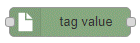  

    작업영역에서 해당 노드를 더블클릭하면 노드의 속성 수정 화면이 표시됩니다.  

    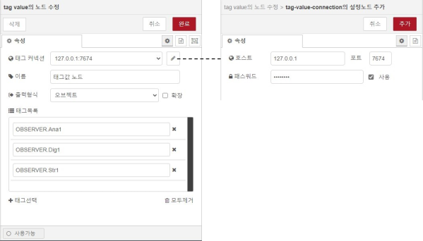
    - 태그 커넥션: DataWorX와 실시간 태그 값을 주고 받기 위해서는 연결 설정을 하여야 합니다.
    - 이름: 플로우 편집 화면에 표시될 이름을 설정합니다.
    - 출력형식: 출력으로 내보낼 태그값 모음의 형태를 설정합니다.
    - 태그목록: 가져올 태그 이름 목록입니다. “추가” 버튼을 클릭하여 태그를 선택할 수 있습니다.

    {: .note}

    > 태그값 출력 형식은 “오브젝트”,“연관배열” 두가지 형태가 있으며, 그림과 같은 경우  
    > “오브젝트’일때 “msg.payload.OBSERVER.Ana1”로,  
    > “연관배열’일때 “msg.payload[‘OBSERVER.Ana1’]”로 태그값을 읽을 수 있습니다.  

3.  태그 선택기  
    “태그선택” 버튼을 클릭하면 태그선택 팝업이 표시됩니다.

    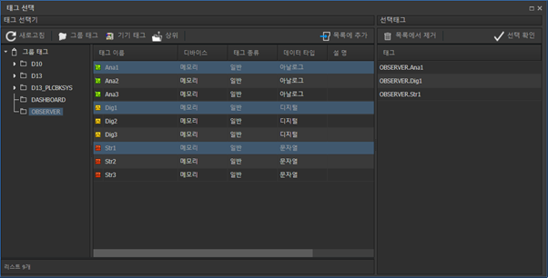

    원하는 태그 또는 태그그룹을 선택 후 “목록에 추가” 버튼을 클릭하여 태그목록에 추가합니다.  
    태그목록의 정리가 완료되면 “선택확인” 버튼을 사용하여 설정에 적용합니다.  
    여러 항목을 선택하기 위해 “shift” 및 “ctrl”키를 사용할 수 있습니다.  

    {: .note}

    > 태그목록 항목에 태그를 지정하는 경우 태그값 오브젝트를 가져오며,  
    > 태그그룹을 지정하는 경우 하위의 모든 태그 오브젝트를 가져옵니다.

4.  globalContext의 사용  
    tag value 노드는 흐름 연결과 별개로 업데이트 되는 실시간 태그값을 globalContext에 반영하며,
    “global.tag.태그이름”을 사용하여 다른 노드에서 태그 값을 참조 할 수 있습니다.

    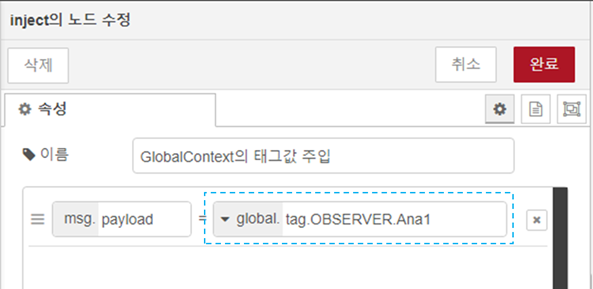

    globalContext에 존재하는“OBSERVER.Ana1” 태그값을 inject노드에서 사용하는 설정 예시입니다.

## event trigger
1. 노드 개요  
    DataWorX에서 발생하는 이벤트를 수신하고, 해당 이벤트 정보를 출력으로 내보냅니다.  
    시스템이벤트 및 태그이벤트를 필터링하여 수신할 수 있습니다.  
2. 노드 사용  
    event trigger노드를 마우스로 끌어 작업영역에 놓습니다.

    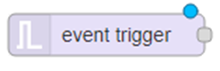

    노드를 더블클릭하여 노드의 속성 수정 화면을 표시합니다.

    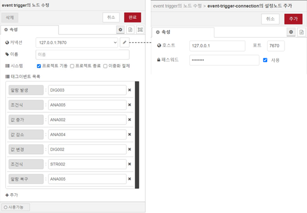

    - 커넥션: DataWorX 이벤트서버의 접속환경을 설정합니다.
    - 이름: 플로우 편집 화면에 표시될 이름을 설정합니다.
    - 시스템: 시스템이벤트 중 수신할 항목을 선택합니다.
    - 태그이벤트 목록: 수신할 이벤트 종류와 태그를 선택하여 항목을 추가합니다.

3. 태그 선택기  
    “추가” 버튼을 누르면 태그선택 팝업이 표시됩니다.  
    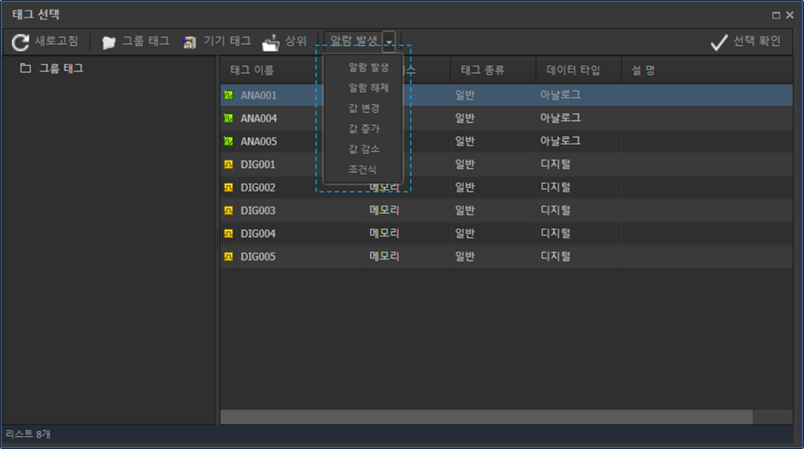
    툴바의 오른쪽에 위치한 이벤트 종류 선택 콤보박스를 통하여 필터링할 이벤트 종류를 선택하면, 해당 이벤트를 발생시키도록 설정되어있는 태그의 목록만 표시됩니다.  

    원하는 태그를 선택 후 “선택확인” 버튼을 누르면 태그이벤트 목록에 추가됩니다.  
    여러 항목을 선택하기 위해 “shift” 및 “ctrl”키를 사용할 수 있습니다.  

## db mapper
1. 노드 개요  
    db mapper노드는 msg로 전달받은 데이터를 SQL쿼리 문장으로 변환하여 msg.topic으로 출력합니다.  
    선택용 입력도구로 설정 후 버튼을 클릭하여 SQL문장을 생성하거나, 편집기에 직접 입력하여 사용이 가능합니다.  
    맵핑 방식은 아래와 같이 4가지 형태로 구분할 수 있습니다.  

    | 커맨드        | 타입          | 타입 |
    | :----------- | :---------------- | :---- |
    | INSERT           | COLUMN | 속성값이 테이블의 각각 필드에 맵핑되는 INSERT 쿼리문을 생성합니다.  |
    | "" | ROW   | 오브젝트의 각각 속성값이 하나의 레코드로 입력되는 INSERT 쿼리문을 생성합니다. |
    | UPDATE           | COLUMN    | 테이블내 필드의 값을 설정한 속성값으로 UPDATE하는 쿼리문을 생성합니다.  |
    | ""           | ROW | 레코드의 각각 필드값을 오브젝트의 속성값으로 UPDATE하는 쿼리문을 생성합니다. |

2. 노드 사용  
    db mapper노드를 마우스로 끌어 작업영역에 놓습니다.  

    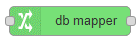

    작업영역에서 해당 노드를 더블클릭하면 노드의 속성 수정 화면이 표시됩니다.  

    1. COLUMN타입  

        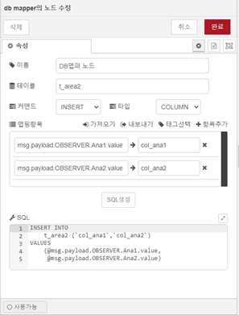

        - 이름: 플로우 편집 화면에 표시될 이름을 설정합니다.
        - 테이블: 쿼리를 수행할 대상 테이블 이름을 설정합니다.
        - 커맨드: INSERT 또는 UPDATE 커맨드를 선택합니다.
        - 타입: “COLUMN” 맵핑타입을 선택합니다.
        - 맵핑항목: 소스가 될 속성이름과 대상이 될 컬럼이름을 설정합니다.  
            - “태그선택” 버튼을 누르면 태그선택기 팝업이 표시됩니다.  
            - CSV파일로 가져오기 및 내보내기 가 가능합니다.  
        - SQL생성: 버튼을 누르면 설정한 내용에 맞게 SQL문장이 생성됩니다.

    1. ROW 타입

        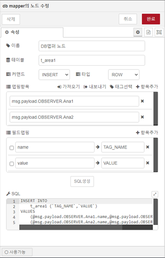

        - 이름: 플로우 편집 화면에 표시될 이름을 설정합니다.
        - 테이블: 쿼리를 수행할 대상 테이블 이름을 설정합니다.
        - 커맨드: INSERT 또는 UPDATE 커맨드를 선택합니다.
        - 타입: “ROW” 맵핑타입을 선택합니다.
        - 맵핑항목: 소스가 될 오브젝트 이름을 설정합니다.
            - “태그선택” 버튼을 누르면 태그선택기 팝업이 표시됩니다.
            - CSV파일로 가져오기 및 내보내기 가 가능합니다.
        - 필드맵핑: 각각 오브젝트의 속성과 맵핑 될 컬럼 이름을 설정합니다.
        - SQL생성: 버튼을 누르면 설정한 내용에 맞게 SQL문장이 생성됩니다.

    {: .note}

    > UPDATE커맨드의 COLUMN 타입맵핑 설정 시 생성되는 SQL문장에는 WHERE문이 포함되지 않으므로, 쿼리 실행 시 모든 행에 반영됩니다.

3. 태그 선택기  
    “태그선택” 버튼을 누르면 태그선택 팝업이 표시됩니다.
    
    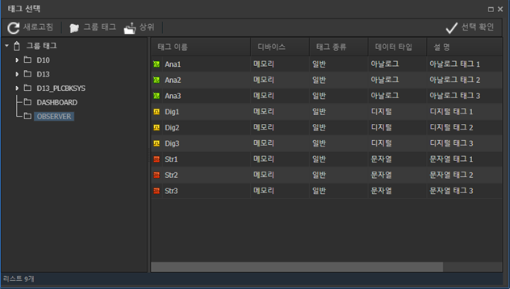

    원하는 태그를 선택 후 “선택확인” 버튼을 누르면 맵핑항목 목록에 추가됩니다.
    여러 항목을 선택하기 위해 “shift” 및 “ctrl”키를 사용할 수 있습니다.

    {: .note}

    > db mapper의 태그 선택기의 태그 목록은 흐름으로 연결된 tag value노드의 선택 항목의 범위에 한하여 표시됩니다.

4. 테이블 및 컬럼 정보 조회  
    사용하려는 데이터베이스의 테이블 및 컬럼정보를 노드 편집 중에 참조할 수 있는 기능입니다.

    db mapper노드에 mysql노드를 연결합니다.

    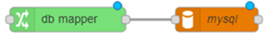

    db mapper노드를 더블클릭하여 노드의 속성 수정 화면을 표시합니다.

    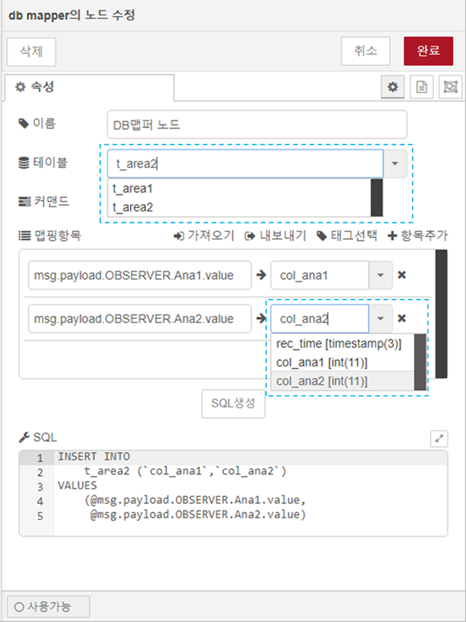

    데이터베이스의 테이블 및 컬럼 정보 목록이 콤보박스에 나타나면, 선택하여 설정할 수 있습니다.

    {: .note}

    > 테이블 및 컬럼 정보 조회는 db mapper의 노드에 연결된 노드 중 mysql노드가 1개만 존재할 때 동작합니다.

## influxdb mapper  
1. 노드 개요  
    msg로 전달받은 데이터를 influxdb batch노드의 입력 형식에 맞게 맵핑하여 msg로 출력합니다.
2. 노드 사용  
    node-red-contrib-influxdb 라이브러리의 influxdb batch노드와 연결하여 사용합니다.

    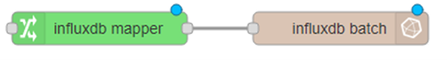

    influxdb mapper노드를 더블클릭하여 노드의 속성 수정 화면을 표시합니다.

    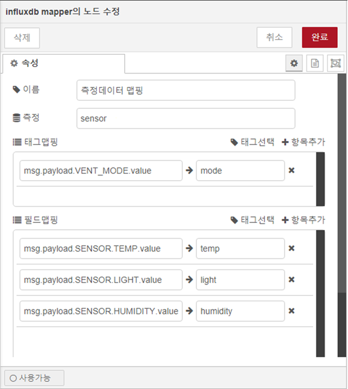

    - 이름: 플로우 편집 화면에 표시될 이름을 설정합니다.
    - 측정: influxdb에 저장되는 Measurement이름을 설정합니다.
    - 태그맵핑: influxdb의 tag key 이름과 tag value로 기록될 맵핑항목들을 설정합니다.
    - 필드맵핑: influxdb의 field key 이름과 field value로 기록될 맵핑항목들을 설정합니다.

3. 출력  
    예시에 따른 influxdb mapper의 출력은 아래의 형식과 같습니다.

    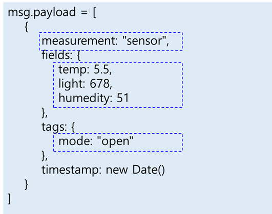

4. 태그 선택기
    태그 선택기를 통하여 항목 추가가 가능하며, 사용방법은 db mapper와 동일합니다.

    {: .note}

    > influxdb의 ‘태그’와 DataWorX의 ‘태그’를 혼동하지 않도록 주의합니다.

## mongodb mapper
1. 노드 개요  
    msg로 전달받은 데이터를 mongodb out노드의 입력 형식에 맞게 맵핑하여 msg로 출력합니다.
2. 노드 사용  
    node-red-node-mongodb 라이브러리의 mongodb out노드와 연결하여 사용합니다.

    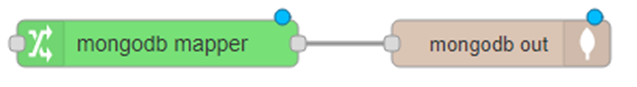

    mongodb mapper노드를 더블클릭하여 노드의 속성 수정 화면을 표시합니다.

    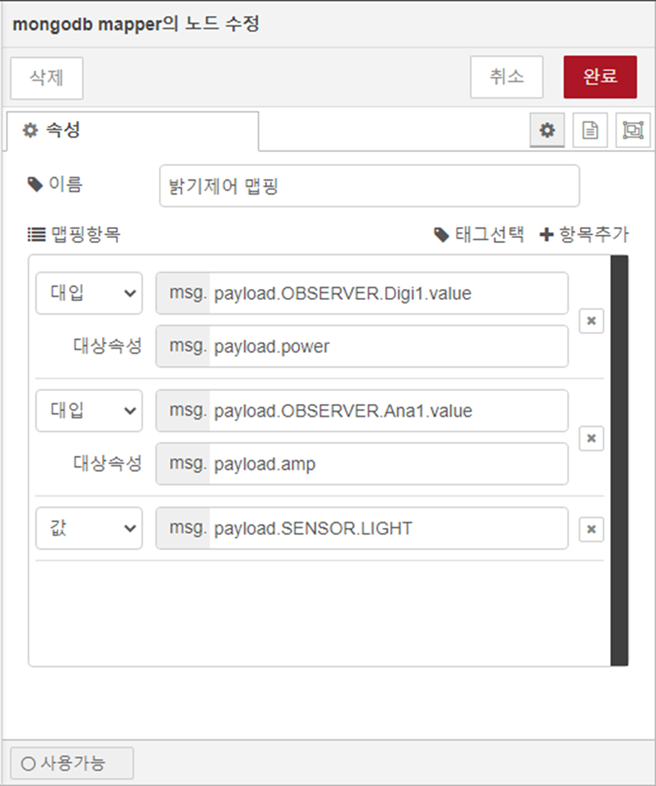

    - 이름: 플로우 편집 화면에 표시될 이름을 설정합니다.
    - 맵핑항목:
        - 값: 입력받은 값을 원래의 속성이름으로 맵핑하여 출력합니다.
        - 대입: 입력받은 값을 설정한 속성이름으로 맵핑하여 출력합니다.
3. 출력  
    예시에 따른 mongodb mapper의 출력은 아래의 형식과 같습니다.

    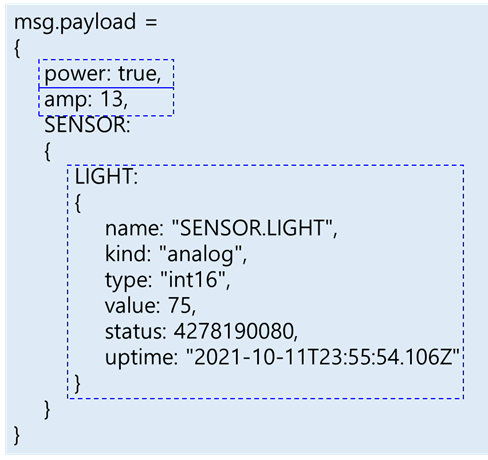

4. 태그 선택기 
    태그 선택기를 통하여 항목 추가가 가능하며, 사용방법은 db mapper와 동일합니다.

## mobile notify
1. 노드 개요  
    입력받은 msg.payload의 내용을 SMS또는 카카오친구톡으로 발송하는 노드입니다.
2. 노드 사용  
    mobile notify노드를 마우스로 끌어 작업영역에 놓습니다.

    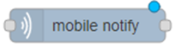

    노드를 더블클릭하여 속성수정 화면을 표시합니다.
    1. 노드 설정 

        

        - 발송채널: 메세지 발송서비스 채널설정을 선택합니다.
        - 이름: 플로우 편집 화면에 표시될 이름을 설정합니다.
        - 수신목록: 메세지를 수신받을 전화번호를 설정합니다.
    2. 발송채널 설정  

        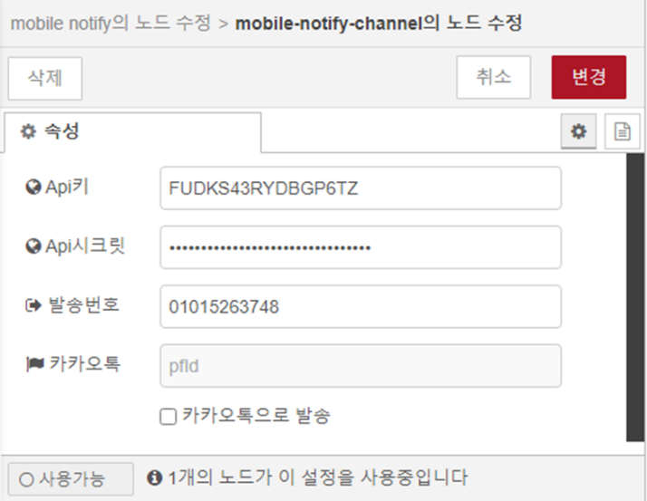

        - Api키: 메세지 서비스업체(CoolSms)에서 발급받은 Api키를 입력합니다.
        - Api시크릿: 메세지 서비스업체(CoolSms)에서 발급받은 Api시크릿을 입력합니다.
        - 발송번호: 메세지 발신자로 표시될 전화번호를 입력합니다.
        - 카카오톡: 카카오톡에서 발급받은 pfid를 입력합니다.
            - ‘카카오톡으로 발송’이 체크되어있는 경우 SMS대신 카카오 알림톡으로 발송됩니다.

{: .note}

> mobile notify노드를 사용하기 위해서는 메세지 전송서비스 CoolSms(https://coolsms.co.kr/)에 등록된 계정이 필요합니다.

## function
1. 노드 개요  
    전달된 msg에 대해 JavaScript 코드를 수행하는 노드이며,  
    LogicFlow는 스크립트 내에서 DataWorX 태그 인터페이스를 사용할 수 있습니다.  

2. 노드 사용  
    function노드를 마우스로 끌어 작업영역에 놓습니다.  

    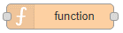

    작업영역에서 해당 노드를 더블클릭하면 노드의 속성 수정 화면이 표시됩니다.

    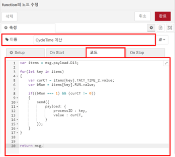

    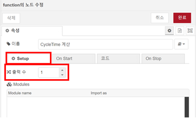

    - 이름: 플로우 편집 화면에 표시될 이름을 설정합니다.
    - 코드: 런타임 시 수행할 JavaScript코드를 입력합니다.
    - 출력수: 노드의 출력 수를 설정하고 msg를 배열로 내보내면 요소들은 각각의 출력으로 전달됩니다.

3. 태그 함수  
    1. getTagVal함수  
        DataWorX의 실시간 태그값을 즉시 가져오는 함수이며, 아래와 같이 여러 형태로 호출이 가능합니다

        - 태그 이름으로 호출
            ```js
            getTagVal("BLUE_01_LastUpdateTime", function(value) {
                msg.payload = value;
                node.send(msg);
            })
            ```
            “BLUE_01_LastUpdateTime”태그의 값을 가져와서 출력으로 내보내는 스크립트입니다.

            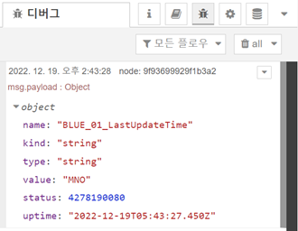

            ↑getTagVal 결과

        - 태그 이름 배열로 호출
            ```js
            getTagVal(["BLUE_01_LastUpdateTime", "BLUE_01_StationOK"], function(tagValue) {
                msg.payload = tagValue;
                node.send(msg);
            })
            ```
            “BLUE_01_LastUpdateTime”,“BLUE_01_ReadSuccess” 두 태그의 값을 가져와서 출력으로 내보내는 스크립트입니다.
            
            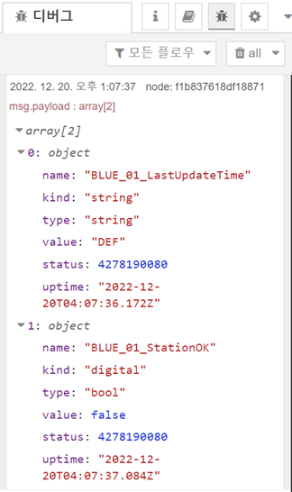

            ↑getTagVal 결과

        - 태그 그룹 이름으로 호출
             ```js
            getTagVal("D10.BLUE_01", function(value) {
                msg.payload = value;
                node.send(msg);
            })
            ```
            “감시화면” 그룹 내 모든 태그의 값을 가져와서 출력으로 내보내는 스크립트입니다.

            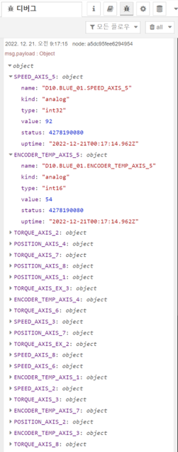

            ↑getTagVal 결과

        {: .note}
        > 태그 그룹으로 호출하는 경우, 결과 데이터는 계층형 오브젝트로 반환됩니다.
    
    2. setTagVal함수   
        DataWorX의 태그에 값 쓰기를 수행하는 함수입니다.  
        ```js
        setTagVal("TAG_analog", 99, function(value) {
            msg.payload = value;
            node.send(msg);
        })
        setTagVal("TAG_digital", 1, function(value) {
            msg.payload = value;
            node.send(msg);
        })
        setTagVal("TAG_string", "DX", function(value) {
            msg.payload = value;
            node.send(msg);
        })
        ```
        “TAG_analog”, “TAG_digital”, “TAG_string” 태그에 값 쓰기를 수행하고 처리결과를 출력으로 내보내는 스크립트 입니다.  
        결과(ret): { retno: DLL RETURN값 }  
            - 상태값: 0(완료)

        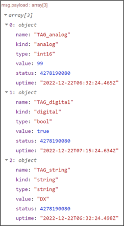

        ↑setTagValEX 노드 결과

    3. setTagValEx함수  
        DataWorX의 다수의 태그에 일괄 값 쓰기를 수행하는 함수입니다.  
        ```js
        setTagVal([{name: "TAG_string", value: "DataWorX"},
            {name: "TAG_digital", value: 0},
            {name: "TAG_analog", value: 10}], function(value) {
            msg.payload = value;
            node.send(msg);
        });
        ```
        “TAG_string”, ”TAG_digital”, ”TAG_analog” 태그에 값 쓰기를 수행하고 처리결과를 출력으로 내보내는 스크립트 입니다.  
        결과(ret): { retno: DLL RETURN값 }  
            - 상태값: 0(완료)

        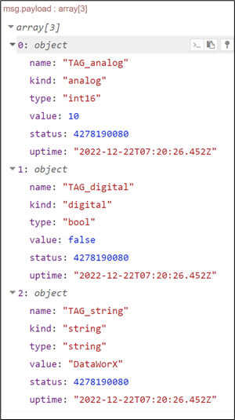

        ↑setTagValEX 노드 결과

4. DataWorX 프로젝트 함수  
    1. ProjectClose함수  
        DataWorX프로젝트 닫기를 수행하는 함수입니다.

        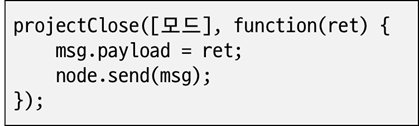

        ```js
        projectClose(0, function(ret) {
            msg.payload = ret;
            node.send(msg);
        })
        ```
        모드: EH_PRJTYPE_STANDALONE = 0, EH_PRJTYPE_SERVER = 1, EH_PRJTYPE_CLIENT = 2 
        결과(ret): DLL RETURN값

    2. ProjectReload함수  
        DataWorX프로젝트를 다시 로딩하는 함수입니다.

        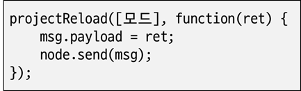

        ```js
        projectReload(0, function(ret) {
            msg.payload = ret;
            node.send(msg);
        })
        ```
        모드: EH_PRJTYPE_STANDALONE = 0, EH_PRJTYPE_SERVER = 1, EH_PRJTYPE_CLIENT = 2
        결과(ret): DLL RETURN값

    3. Runtime Start함수  
        EdgeHub런타임을 시작하는 함수입니다.  
        프로젝트 경로 예시: C:\DataWorX\Project\Demo 


        ```js
        projectRuntimeStart(0, ['프로젝트경로'] function(ret) {
            msg.payload = ret;
            node.send(msg);
        })
        ```
        모드: EH_PRJTYPE_STANDALONE = 0, EH_PRJTYPE_SERVER = 1, EH_PRJTYPE_CLIENT = 2
        프로젝트경로: .lspx파일의 로컬 경로
        결과(ret): DLL RETURN값

    4. Runtime Stop함수  
        DataWorX런타임을 중지하는 함수입니다.

        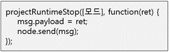

        ```js
        projectRuntimeStop(0, function(ret) {
            msg.payload = ret;
            node.send(msg);
        })
        ```
        모드: EH_PRJTYPE_STANDALONE = 0, EH_PRJTYPE_SERVER = 1, EH_PRJTYPE_CLIENT = 2
        프로젝트경로: .lspx파일의 로컬 경로
        결과(ret): DLL RETURN값

    5. GetEdgeHubStatus함수  
        DataWorX의 구동상태를 확인하는 함수입니다.
        ```js
        getEdgeHubStatus(function(ret) {
            msg.payload = ret;
            node.send(msg);
        })
        ```
        결과(ret): { retno: DLL RETURN값, status: 상태값 }
        * 상태값: 0(Closed), 1(Opened), 2(Running)

        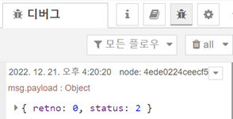

        ↑getEdgeHubStatus 결과

5. 이력 데이터 조회
    1. getHistTagList 함수
        이력태그 데이터 목록을 조회하는 함수입니다.

        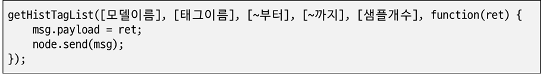
    
        ```js
        getHistTagList('정주기 1분 샘플', 'TestGroup.아나로그01', '2024-03-19', 100, function(ret) {
            msg.payload = ret;
            node.send(msg);
        })
        ```

        - 모델이름: 조회할 이력모델 이름
        - 태그이름: 조회할 이력모델태그 이름
        - ~부터: 조회시간 범위(Date타입)
        - ~까지: 조회시간 범위(Date타입)
        - 샘플개수: 조회시간 범위 내에서 샘플링 할 개수
        - 결과(ret): 태그 이력데이터 목록
        
        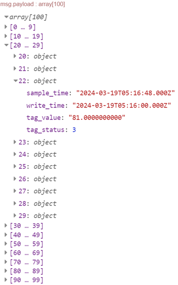

    2. 🛠️ getHistAlarmList 함수
        이력알람 목록을 조회하는 함수입니다.

        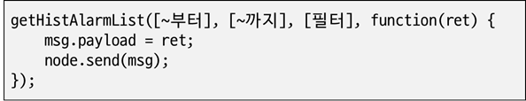
    
        ```js
        getHistAlarmList(function(ret) {
            msg.payload = ret;
            node.send(msg);
        })
        ```
        - ~부터: 조회시간 범위(Date타입)
        - ~까지: 조회시간 범위(Date타입)
        - 필터: 조회조건이 추가로 필요한 경우 object 형태의 인자로 전달하며, 조건이 필요하지 않은 경우에는 입력하지 않습니다.

        **조회필터 속성 정보**

        | 속성        | 타입          | 타입 |
        | :---------- | :---------------- | :---- |
        | alarmType   | number | 0x40(발생), 0x20(해제), 0x10(인지), 0x04(프로세스), 0x02(시스템), 0x10(이벤트)  |
        | alarmLevel | number | 주어진 LEVEL이상만 조회  |
        | tagName     | number | 알람태그 이름 조건   |
        | tagType     | number | 1:아날로그, 2:디지털, 3:문자열 |
        | alarmKind   | number | 0x01:HH, 0x02:HI, 0x04:LO, 0x08:LL, 0x10:CHANGEVAL, 0x20:MGAP, 0x40:SUBGAP  |

6. 실시간 알람 및 인지  
    1. getAlarmList 함수  
        실시간 알람 목록을 조회하는 함수입니다.

        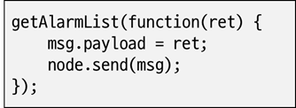

        ```js
        getAlarmList(function(ret) {
            msg.payload = ret;
            node.send(msg);
        })
        ```

        결과(ret): { retno: DLL RETURN값, status: 상태값 }

        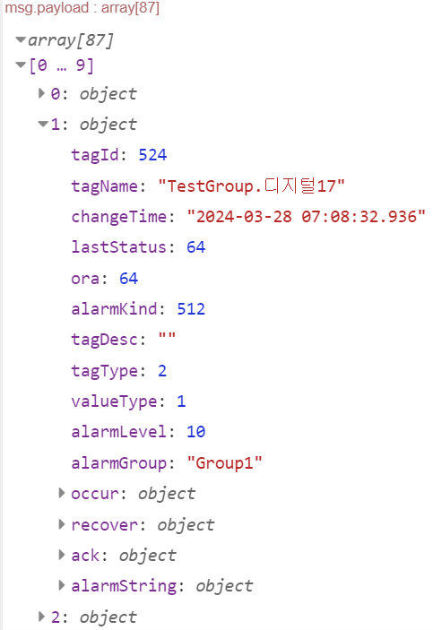

    2. ackAlarm 함수  
        지정한 알람을 인지처리하는 함수입니다.

        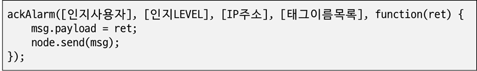

        ```js
        ackAlarm('hskim6', '0', '10.13.114.224', ['TestGorup.아나로그01', 'TestGroup.아나로그02'], function(ret) {
            msg.payload = ret;
            node.send(msg);
        })
        ```
        - 인지사용자: 인지처리시 등록할 사용자 ID
        - 인지LEVEL: 인지처리시 등록할 사용자 LEVEL
        - IP주소: 인지처리시 등록할 IP주소
        - 태그이름목록: 인지처리할 태그이름 배열
        - 결과(ret): DLL RETURN값 

        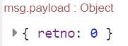


    3. ackAlarmaAll 함수  
        모든 알람을 인지처리하는 함수입니다.

        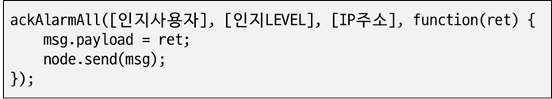

        ```js
        ackAlarmAll('hskim6', '0', '10.13.114.224', function(ret) {
            msg.payload = ret;
            node.send(msg);
        })
        ```

        - 인지사용자: 인지처리시 등록할 사용자 ID
        - 인지LEVEL: 인지처리시 등록할 사용자 LEVEL
        - IP주소: 인지처리시 등록할 IP주소
        - 결과(ret): DLL RETURN값

        

7. 전역 태그값 참조  
    런타임에 동작중인 모든 tag value노드는 태그값 업데이트 시점에 태그값을 globalContext에 반영하고 있으며,  
    이 태그값은 흐름연결 유무에 관계없이 function노드의 스크립트에서 참조하 여 사용할 수 있습니다.  
    ```js
    msg.payload = tag.D10.BLUE_01.ENCODER_TEMP_AXIS_1;
    return msg;
    ```
    위 스크립트 코드는 ”D10.BLUE_01.ENCODER_TEMP_AXIS_1” 태그값을 참조하여, 출력으로 내보내는 예시 입니다.  
    - 태그이름 자동완성  
        스크립트 편집기에서 “tag.” 입력 시 사용가능한 태그이름이 자동완성 목록에 표시됩니다.

        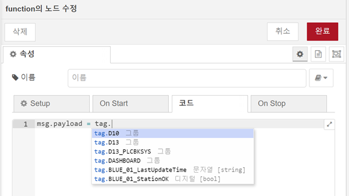

        태그그룹 구분자 “.”의 커서위치에서 “ctrl+space”를 입력하여 목록을 표시할 수 있습니다.

    {: .note}

    > 자동완성 목록은 tag value노드에 설정되어 globalContext에 업데이트중인 태그 항목에 한해서 표시됩니다
