{: .no_toc }
# Parser 노드

- TOC
{:toc}


## csv
1. 노드 개요  
    CSV형식의 문자열과 그 JavaScript오브젝트 표현의 사이에서 쌍방향의 변환을 수행합니다. 입력은 msg.payload에  JavaScript오브젝트, 오브젝트의 배열, CSV문자열의 형태로 전달받게 됩니다.

2. 노드 사용  
    csv 노드를 마우스로 끌어 작업영역에 놓습니다.
    
    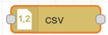

    작업영역에서 해당 노드를 더블클릭하면 노드의 속성 수정 화면이 표시됩니다.

    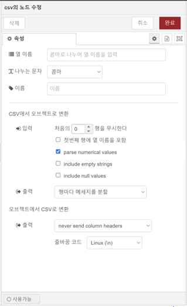

    - 열 이름: '열 이름'에 컬럼명의 리스트를 지정할 수 있습니다. CSV에서 오브젝트로 변환을 수행할 때, 컬럼명을 프로퍼티명으로 사용합니다. '열 이름'대신에 CSV데이터의 첫번째 행에 컬럼명을 포함시킬 수 도 있습니다. CSV로의 변환을 수행할 때에는, 오브젝트에서 취득해야 할 프로퍼티와 그 순서를 '열 이름'을 참조하여 결정합니다. 입력이 배열인 경우에는, '열 이름'은 컬럼명을 나타내는 행의 출력이 지정된 경우에만 사용합니다.
    나누는문자(구분자)가 콤마가 아닌 경우에도 열 이름은 콤마로 구분하여 입력하여야 합니다.
    - 나누는문자: csv 문자열의 각항목을 나누는 문자를 선택합니다. 기본값은 콤마입니다. 탭, 공백, 콜론콜론, 세미콜론 등을 선택할 수 있습니다.
    - 출력 payload: 입력이 문자열인 경우, CSV로서 해석하여 CSV의 각 행을 키/값으로 구성된 JavaScript오브젝트를 생성합니다. 각 행마다 메세지를 송신할지, 오브젝트의 배열로 된 하나의 메세지를 송신할지를 선택할 수 있습니다.  
    입력이 JavaScript오브젝트인 경우, CSV문자열로의 변환을 수행합니다.  
    입력이 기본형인 배열의 경우, 1행의 CSV문자열로 변환합니다.  
    입력이 배열의 배열, 혹은 오브젝트의 배열인 경우, 복수행의 CSV문자열로 변환합니다.  
    CVS문자열의 경우, 처음의 몇 개의 행을 무시하도록 설정할 수 있습니다.  
    아래 예1)의 경우에서 2행을 무시하도록 설정하면 마지막 행인 40,50,60만이 출력에 포함되어 처리됩니다.  
    - 예시)	입력이 csv인 경우: msg.payload = "a,b,c\n10,20,30\n40,50,60";
        - 출력1) 열 이름을 입력하지 않은 경우

        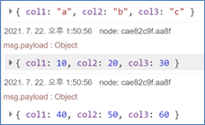

        - 출력2) 열 이름을 “a,b,c”로 입력만 한 경우

        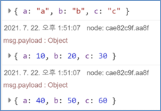

        - 출력3) 출력2의 설정에 더하여 “첫번째 행에 열 이름을 포함”을 체크한 경우

        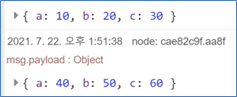

        - 출력4) 출력3의 설정에 더하여 “출력”설정을 “배열화한 1개의 메시지”로 설정한 경우
        
        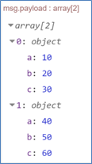           

    - 예시) 입력이 JavaScript오브젝트인 경우: 
        ```js 
        msg.payload = [
            {a:10, b:20, c:30},
            {a:40, b:50, c:60},
            {a:70, b:80, c:90}
        ];
         ```
        - 출력1) 오브젝트에서 CSV로 변환에서 출력을 “never send column headers”로 선택한 경우
                    
        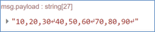      

        - 출력2) 출력을 “always send column headers”로 선택한 경우
                
        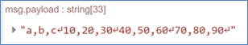        

## html
1. 노드 개요  
    CSS 선택기를 사용하여 msg.payload에 있는 html 문서에서 요소를 추출합니다.

2. 노드 사용  
    html 노드를 마우스로 끌어 작업영역에 놓습니다.
    
    

    작업영역에서 해당 노드를 더블클릭하면 노드의 속성 수정 화면이 표시됩니다.

    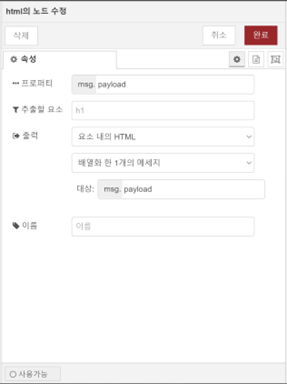

    - 프로퍼티: 요소를 추출한 HTML을 담고 있는 프로퍼티 요소를 입력합니다. 기본값은 payload 입니다.
    - 추출한 요소: 추출한 html 요소를 입력합니다. 노드 속성에서 입력하지 않은 경우, msg.select 프로퍼티에 추출한 요소를 설정할 수 있습니다.
    - 출력: 결과는, 페이로드에 매치된 요소의 배열을 포함하는 단일 메세지, 혹은 매치된 요소 마다의 메세지 중 하나를 선택할 수 있습니다. 복수의 메세지를 송신하는 경우, 메세지에는 parts를 설정합니다.

## json
1. 노드 개요  
    JSON문자열과 JavaScript오브젝트과의 사이에서 상호변환을 수행합니다.

2. 노드 사용  
    json 노드를 마우스로 끌어 작업영역에 놓습니다.
    
    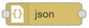

    작업영역에서 해당 노드를 더블클릭하면 노드의 속성 수정 화면이 표시됩니다.

    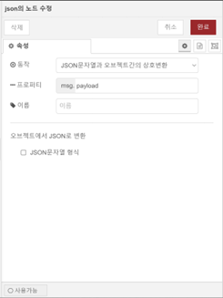

    - 동작: 다음 3가지 동작 중 선택할 수 있습니다.
        - JSON문자열과 오브젝트간의 상호변환: 자동으로 상호변환을 수행합니다. 기본값으로 설정되어 있습니다. 
        - 예) 입력이 JavaScript 오브젝트 인 경우
            ```js 
            msg.payload = [
                {a:10, b:20, c:30},
                {a:40, b:50, c:60},
                {a:70, b:80, c:90}
            ];
            ```

            출력은 다음과 같습니다.

            ```js 
             "[{"a":10,"b":20,"c":30},{"a":40,"b":50,"c":60},{"a":70,"b":80,"c":90}]"
            ```
       
        - 항상 JSON문자열로 변환: 강제로 JSON문자열로 변환을 수행합니다. JSON문자열로 결과를 출력하는 것을 보증하고자 하는 경우 선택합니다.
        - 항상 JavaScript오브젝트로 변환: JavaScript오브젝트로 결과를 출력하는 것을 보증하고자 하는 경우 선택합니다. 예) 입력이 JSON문자열인 경우 JavaScript오브젝트로 변환합니다. 입력이 JavaScript오브젝트인 경우 해당 JavaScript오브젝트를 그대로 출력합니다.
    - 프로퍼티: 기본적으로 msg.payload를 대상으로 동작합니다. 필요한 경우, 다른 프로퍼티를 설정할 수 있습니다.

## xml
1. 노드 개요  
    XML문자열과 JavaScript오브젝트와의 사이에서 상호변환을 수행합니다.

2. 노드 사용  
    xml 노드를 마우스로 끌어 작업영역에 놓습니다.
    
    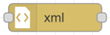

    작업영역에서 해당 노드를 더블클릭하면 노드의 속성 수정 화면이 표시됩니다.

    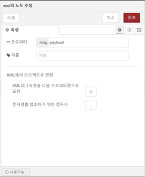

    - 프로퍼티: JavaScript오브젝트 또는 XML문자열을 담고 있는 프로퍼티를 설정합니다. 기본값은 payload입니다. 입력이 문자열인 경우, XML로써 해석하여 JavaScript오브젝트로 변환합니다.
        입력이 JavaScript오브젝트인 경우, XML문자열로 변환합니다.
    - XML에서 오브젝트로 변환:  

        XML와 오브젝트의 사이에서의 변환을 수행할 경우, 기본값으로는 XML속성은 $이라는 명칭의 프로퍼티에 추가합니다. 텍스트의 내용은 _라는 이름의 프로퍼티에 추가합니다. 이러한 프로퍼티명은 노드의 설정에서 변경가능합니다.  
        예로 아래의 XML의 변환결과를 표시합니다.

        ```js
        <p class="tag">Hello World</p>
        ```

        ```js   
        {
        "p": {
            "$": {
                "class": "tag"
            }
        },
        "_": "Hello World"
        }
        ```

## yaml
1. 노드 개요  
    YAML형식의 문자열과 JavaScript오브젝트 사이에서 상호변환을 수행합니다.

2. 노드 사용  
    yaml 노드를 마우스로 끌어 작업영역에 놓습니다.
    
    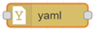

    작업영역에서 해당 노드를 더블클릭하면 노드의 속성 수정 화면이 표시됩니다.

    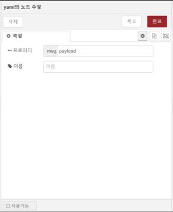

    - 프로퍼티: JavaScript오브젝트 혹은 YAML형식문자열.
    - 출력:
        입력이 YAML형식의 문자열인 경우, JavaScript오브젝트로 변환합니다.
        입력이 JavaScript오브젝트인 경우, YAML형식의 문자열로 변환합니다.
        예) JavaScript오브젝트 입력된 경우
        ```js
        {"a":1, "b":[1, 2, 3]}
        ```
    - 출력 YAML 문자열
        ```yaml
        {
            "a":1
            "b":
                - 1
                - 2
                - 3
        }
        ```


