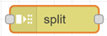
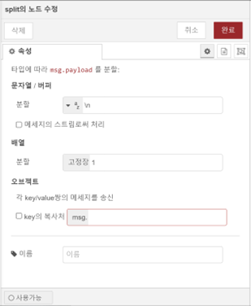
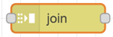
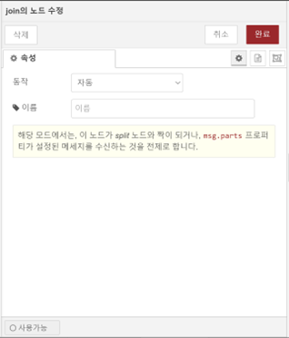
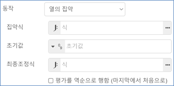
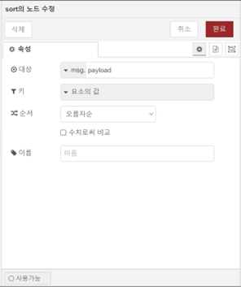
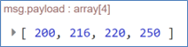
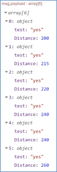
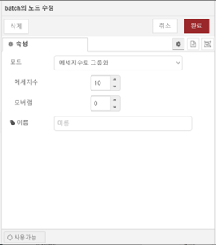

{: .no_toc }
# Sequence 노드

- TOC
{:toc}


## split
1. 노드 개요  
    메시지를 메세지를 메세지열로 분할합니다. 이 노드는, 메세지열을 구성하는 메세지에 대해 공통 처리를 수행하고, join노드에서 하나의 메세지로 정리하는 플로우를 작성할 때에 유용합니다. msg.parts프로퍼티를 사용하여 원래의 메세지와 메세지열과의 대응관계를 기억합니다.

2. 노드 사용  
    split 노드를 마우스로 끌어 작업영역에 놓습니다.
    
    

    작업영역에서 해당 노드를 더블클릭하면 노드의 속성 수정 화면이 표시됩니다.

    

    - 문자열/버퍼: 문자열 또는 문자열 버퍼의 경우 입력한 구분자(예, \n)를 사용하여 분할합니다.
    - 배열: 배열의 경우 입력한 크기값에 따라 분할을 수행합니다.
    - 오브젝트: key/value 쌍으로 수신한 객체에 대하여 분할을 수행합니다.

## join
1. 노드 개요  
    메세지열를 결합하여 하나의 메세지로 만듭니다.

2. 노드 사용  
    join 노드를 마우스로 끌어 작업영역에 놓습니다.
    
    

    작업영역에서 해당 노드를 더블클릭하면 노드의 속성 수정 화면이 표시됩니다.

    

    - 동작: 메세지의 결합에는 다음 3개의 모드를 이용할 수 있습니다.
        - 자동: split노드와 조합하여, split과 역으로 메세지를 결합하는 처리를 수행합니다.
        - 수동: 메세지열을 다양한 방법으로 결합합니다.
            - 문자열혹은 버퍼 - 지정한 문자열 혹은 버퍼값을 기준으로 나누어 각 메세지의 지정된 프로퍼티를 결합
            - 배열 - 지정프로퍼티 혹은 메세지 전체를 요소로 하는 배열
            - key/value오브젝트 - 입력메세지의 지정된 프로퍼티 값을 키로 하여, 프로퍼티값을 스토어한 오브젝트
            - 통합오브젝트 - 각 메세지의 프로퍼티를 하나의 오브젝트로 통합
    - 열의 집약: 메세지열에 대해 지정한 식을 적용하여, 하나의 메세지로 집약합니다.
    
    

    - 집약식  
        메세지그룹을 구성하는 각 메세지에 적용되는 JSONata식. 식의 평가결과는 다음 호출때에 집약값으로 전달합니다.
        $A 집약값
        $I 그룹 내의 메세지 순서
        $N 그룹 내의 메세지 수
    - 초기값  
        집약의 초기값($A)
    - 최종조정식
        메세지그룹의 집약이 완료된 후에 적용되는 JSONata식. 임의로 지정가능 합니다. 식에는 아래의 특수변수를 참조할 수 있습니다.
            $A 집약값
            $N 그룹 내의 메세지 수
    - 입력 메시지: 입력 메시지의 구성은 다음과 같습니다.
        - msg.parts: 자동적으로 메세지열을 결합하기 위해서는, 모든 메세지가 이 프로퍼티를 갖고 있어야합니다. split노드로 이 프로퍼티를 생성할 수 있지만, 독자적으로 생성해도 무관합니다. parts프로퍼티는 아래의 프로퍼티를 포함합니다.
            - id - 메세지그룹의 식별자
            - index - 그룹 내의 순서
            - count - 그룹을 구성하는 메세지 수
            - type - 메세지 타입 - string/array/object/buffer
            - ch - 문자열 혹은 버퍼인 경우, 메세지를 분할할 때 사용한 문자열 혹은 바이트배열
            - key - 오브젝트인 경우, 메세지가 생성된 부분의 키
            - len - 메세지를 고정된 길이로 분할한 경우의 길이
        - msg.complete: 설정되어 있는 경우, 유지하고 있는 메세지를 결합하여 송신합니다.

## sort
1. 노드 개요  
    메세지 열 혹은 배열형의 페이로드를 정렬합니다.  
    split노드와 조합하여 메세지의 순서를 정렬할 수 있습니다.


2. 노드 사용  
    sort 노드를 마우스로 끌어 작업영역에 놓습니다.
    
    

    작업영역에서 해당 노드를 더블클릭하면 노드의 속성 수정 화면이 표시됩니다.

    

    - 대상: 정렬의 대상을 지정합니다. 기본값으로 msg.payload을 설정합니다. 수신한 메세지가 msg.parts프로퍼티를 갖고있는 것을 상정하고 있습니다. split노드로 이 프로퍼티를 생성할 수 있지만, 독자적으로 생성해도 무관합니다. parts프로퍼티는 아래의 프로퍼티를 포함합니다.
        - id - 메세지 그룹의 식별자
        - index - 그룹내의 순서
        -  count - 그룹을 구성하는 메세지의 수
    - 키: 메세지의 정렬을 수행하기 위한 정렬키는 payload프로퍼티 혹은 JSONata식을 이용할 수 있습니다.
        - 요소의 값: 키를 요소의 값으로 설정한 경우 객체 내부의 요소의 값을 정렬 키로 실행합니다.  
            예) 입력 객체  
            ```js 
                [200, 250, 216, 220]
            ```
            
            

        - JSONata: 대상 객체의 특정 프로퍼티를 정렬키로 설정할 수 있습니다.  
            예) 입력 객체  
            ```js 
            [
                {
                    "test": "yes",
                    "Distance": 240
                },
                {
                    "test": "yes",
                    "Distance": 220
                },
                {
                    "test": "yes",
                    "Distance": 200
                },
                {
                    "test": "yes",
                    "Distance": 240
                },
                {
                    "test": "yes",
                    "Distance": 260
                },
                {
                    "test": "yes",
                    "Distance": 215
                }
            ]
            ```
        - 정렬 키 설정
                    
        

        - 출력결과

        

        - 순서: 아래의 정렬순서를 지정할 수 있습니다.
            - 오름차순
            - 내림차순

## batch
1. 노드 개요  
    다양한 규칙에 따라 일련의 메시지를 생성합니다.

2. 노드 사용  
    batch 노드를 마우스로 끌어 작업영역에 놓습니다.
    
    

    작업영역에서 해당 노드를 더블클릭하면 노드의 속성 수정 화면이 표시됩니다.

    

    - 모드: 메시지 시퀀스를 생성하는 세 가지 모드가 있습니다.
        - 메시지 수
        메시지를 주어진 길이의 시퀀스로 그룹화합니다. 겹침 옵션은 한 시퀀스 끝에 있는 메시지가 다음 시퀀스 시작 시 반복되어야 하는 메시지 수를 지정합니다.
        - 시간 간격
        지정된 간격 내에 도착하는 메시지를 그룹화합니다. 간격 내에 메시지가 도착하지 않으면 노드는 선택적으로 빈 메시지를 보낼 수 있습니다.
        - 시퀀스 연결
        들어오는 시퀀스를 연결하여 메시지 시퀀스를 만듭니다. 각 메시지에는 해당 시퀀스를 식별하는 msg.topic 속성과 msg.parts 속성이 있어야 합니다. 노드는 연결된 순서 시퀀스를 식별하기 위해 주제 값 목록으로 구성됩니다.
    - 메시지 저장: 이 노드는 시퀀스 간에 작업하기 위해 내부적으로 메시지를 버퍼링합니다. 런타임 설정 nodeMessageBufferMaxLength를 사용하여 버퍼링할 메시지 노드 수를 제한할 수 있습니다. msg.reset 속성이 설정된 메시지를 수신하면 버퍼링된 메시지가 삭제되고 전송되지 않습니다.


