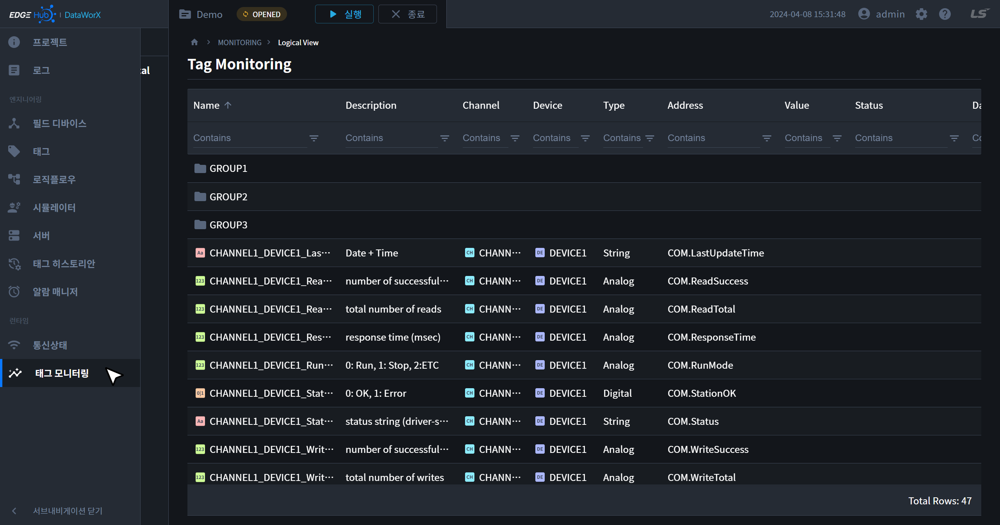
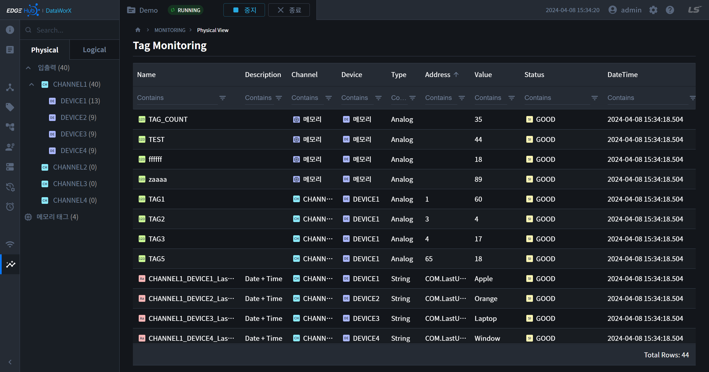
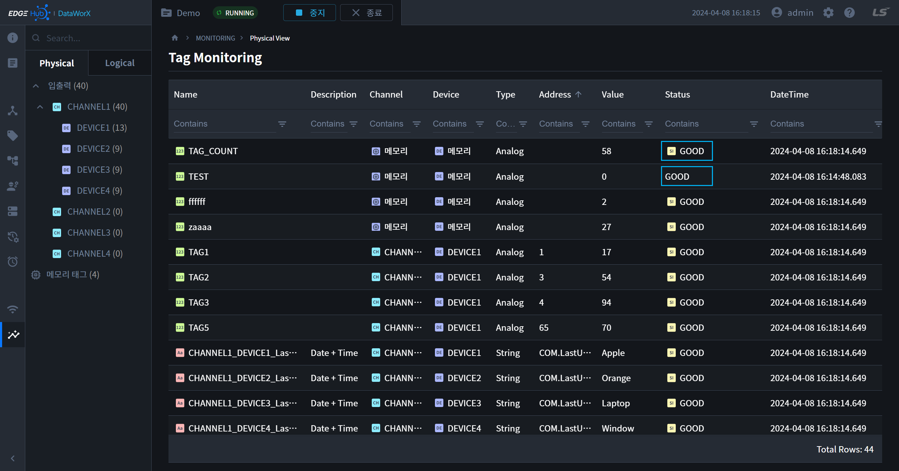
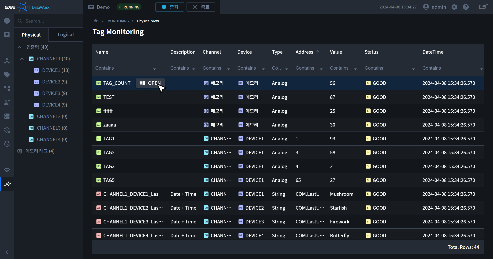
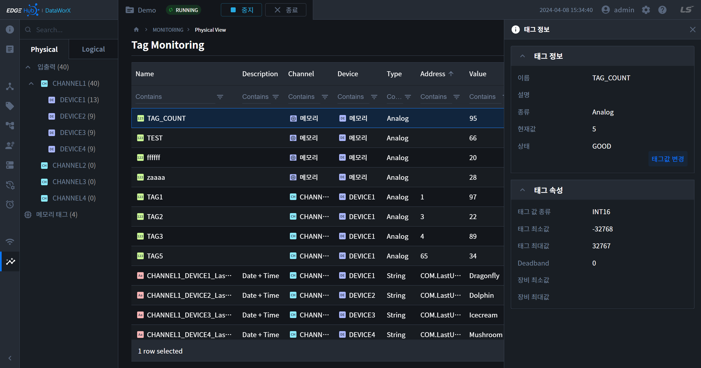
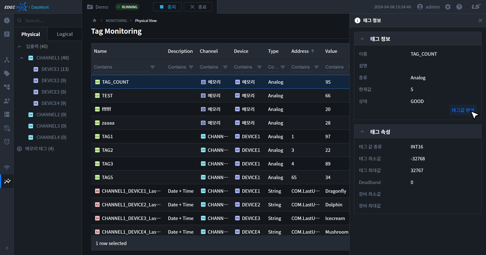
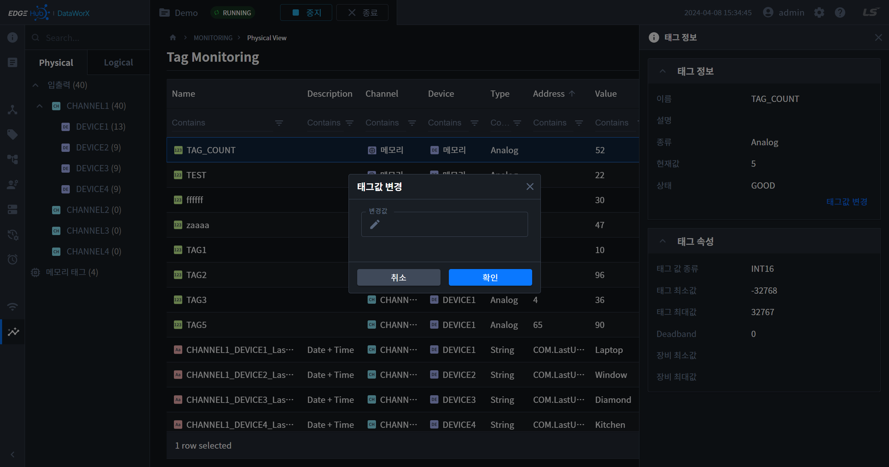

{: .no_toc }
# 태그 모니터링
실행 중인 프로젝트의 태그 값과 상태를 감시하거나 태그 값을 제어할 수 있습니다. 좌측 메인 내비게이션을 통해 해당 페이지로 이동할 수 있습니다.

- TOC
{:toc}

 

## 1. 태그 목록
- 태그 목록은 태그 페이지와 구조가 거의 비슷합니다. 좌측의 서브 내비게이션 또는 테이블의 헤더를 통해 태그를 필터링할 수 있습니다.
- 태그 페이지와는 다르게 테이블은 툴바가 없으며, 모니터링을 위한 컬럼이 추가되어 있습니다.

 

## 2. 태그 값/상태/업데이트 시간

### 2.1. 태그 값
- 현재 태그 값이 나타납니다.
<!-- TODO: `-` 에 대한 내용 작성하기 -->
- 태그 값에 시뮬레이션이 적용된 경우 다음과 같이 상태 앞에 아이콘 `SI`이 표기됩니다.

 

### 2.2. 태그 상태
- 
- 태그 상태에 대한 내용은 다음과 같습니다.

| 상태                         | 설명 |
| :--------------------------- | :-- |
| SCAN START : `[상세 내용]`    | 최초 통신 시도|
| SCAN STOP                    | 최초 통신 연결 불가 |
| -                            | 미동작상태 |
| GOOD                         | 정상 |
| UNKNOWN                      | 알 수 없음|
| IO BAD : `[상세 내용]`        | 최초 통신 연결이후, 현재 통신 불가 |
| ENG BAD : `[상세 내용]`       | 장비, 공업치 데이터의 범위를 넘었을 경우|
| ANALOG ALARM : `[상세 내용]`  | 아날로그 알람 표시|
| DIGITAL ALARM : `[상세 내용]` | 디지털 알람 표시|
| ALARM DELAY                  | 알람 딜레이 표시|

### 2.3. 업데이트 시간
- 태그 값이 업데이트된 시간을 나타냅니다.

## 3. 태그 정보
- 테이블의 태그 아이템에 마우스를 올리면 태그 이름 컬럼의 우측에 `OPEN` 버튼이 나타납니다. 버튼을 클릭하면 우측 패널에서 태그 정보를 확인할 수 있습니다.

 

 

- 태그 속성

| 상태                         | 설명 |
| :--------------------------- | :-- |
| 이름 | 태그명, 그룹명을 표시합니다. |
| 설명 | 태그 또는 그룹의 설명을 표시합니다. |
| 종류 | Analog, Digital, String을 표시하며, 그룹은 미표시됩니다.|
| 현재값 | Project가 Run일때만 표시되며, 시뮬레이션 값 또는 실제 수집데이터를 표시합니다. |
| 상태 | Project가 Run일때만 표시되며, 데이터의 상태를 표시합니다. |
| 변경버튼 | Project가 Run 상태이면서, 계정 권한이 Admin, Engineering이며, Tag 설정시 Write Flag가 체크된 태그만 클릭이 활성화 됩니다. |
| 태그ID | 그룹일 경우만 표시되는 값입니다.. |
|태그값 종류| 태그의 Value Type이 표시됩니다.|
|태그 최솟값| 태그의 공업치 데이터의 태그 최솟값이 표시됩니다.|
|태그 최댓값| 태그의 공업치 데이터의 태그 최댓값이 표시됩니다.|
|장비 최솟값| 수집되는 장비의 최소 설정 값이 표시됩니다.|
|장비 최댓값| 수집되는 장비의 최대 설정 값이 표시됩니다.|
|Deadband|  태그정보의 종류가 Analog일 때만 표시되며, Analog 상세의 소수점 DeadBand값을 표시됩니다.|

## 4. 태그값 제어
- 태그 정보 패널에서 태그 정보 카드의 우측 하단에 있는 `태그값 변경` 텍스트 버튼을 클릭하면 태그값을 변경할 수 있습니다.

 

 

{: .note }
프로젝트가 `실행 중`일 때만 태그값을 제어할 수 있습니다.  
`계정권한`이 `Admin, Engineering`일때만 태그값을 제어할 수 있습니다.  
Tag 설정이 Actions의 `Write Flag`가 `Check`된 값만 태그값을 제어할 수 있습니다.

