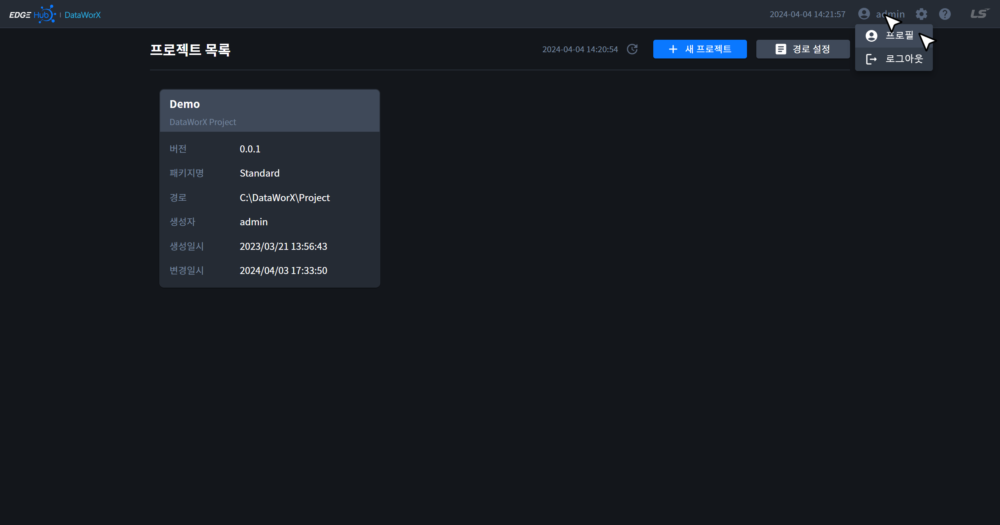
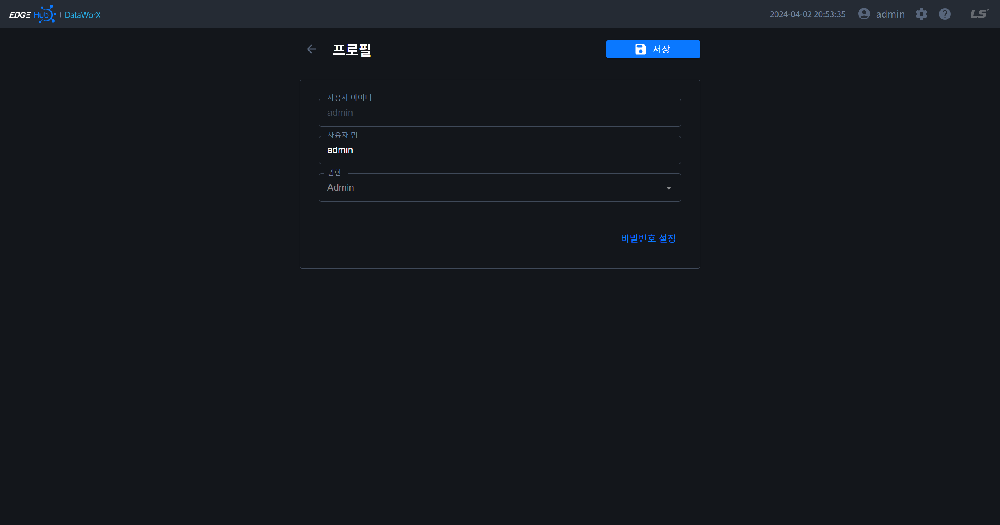
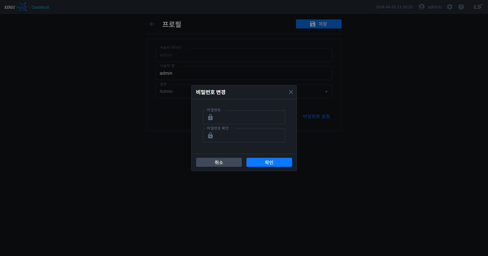

{: .no_toc }
# 프로필
로그인한 사용자의 정보를 수정할 수 있는 페이지입니다. 애플리케이션 바를 통해 해당 페이지로 이동할 수 있습니다.

- TOC
{:toc}

## 1. 사용자 정보
- 사용자 명: 영문, 한글을 사용하여 3 - 30자로 입력할 수 있습니다. 

{: .note }
아이디와 권한은 변경할 수 없습니다.

## 2. 비밀번호 설정
- 프로필 카드 하단 우측에 `비밀번호 설정` 버튼을 클릭한 후 오픈된 비밀번호 설정 모달을 통해 비밀번호를 수정할 수 있습니다. 

