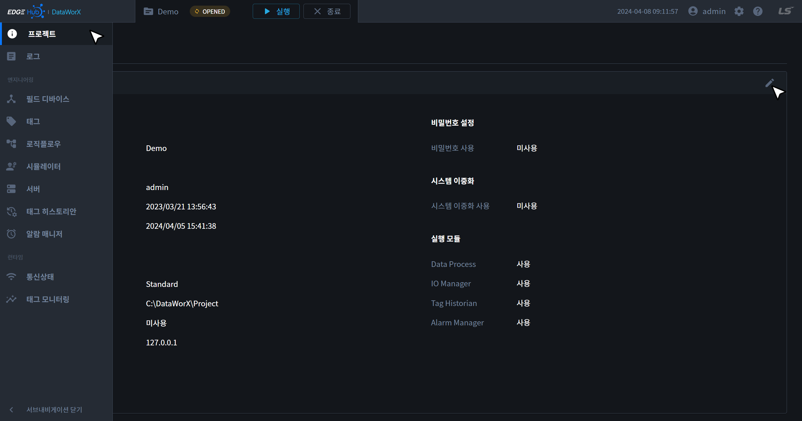
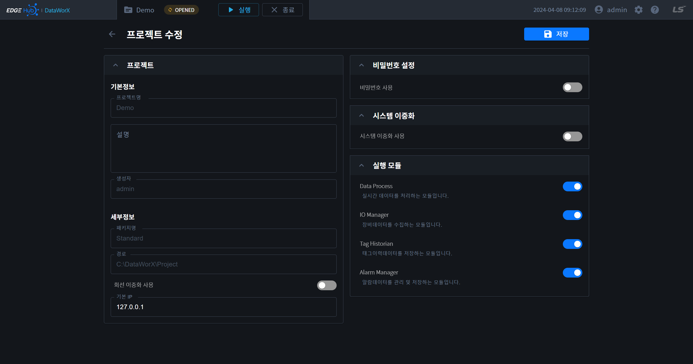

# 프로젝트 수정
현재 오픈된 프로젝트의 설정 정보를 수정할 수 있는 페이지입니다. 프로젝트 정보 페이지에서 프로젝트 정보 카드 우측 상단의 수정 버튼을 통해 해당 페이지로 이동할 수 있습니다.

{: .highlight }
프로젝트 속성에 관한 정보는 [프로젝트 추가 페이지](../add/#프로젝트-속성)를 참고 바랍니다.

{: .note }
프로젝트의 생성자, 패키지명, 경로는 변경 불가하며, 프로젝트 명은 프로젝트 목록 페이지에서 수정할 수 있습니다.(참고 - [프로젝트 명 변경](../list/#프로젝트-명-변경))