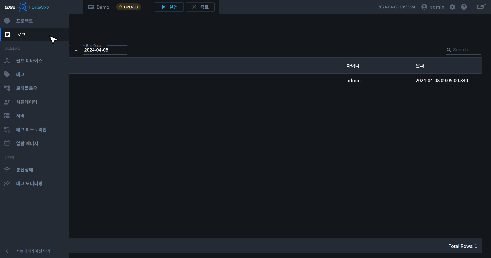
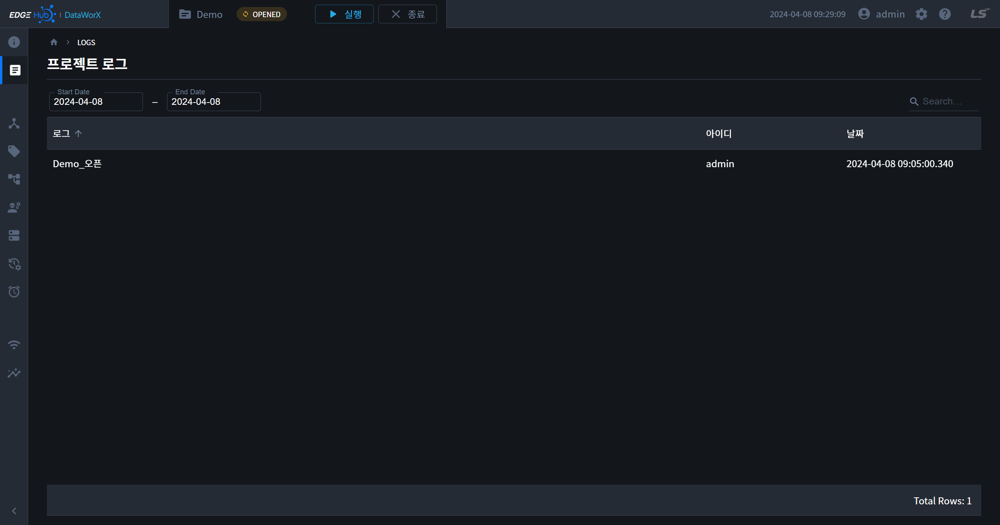
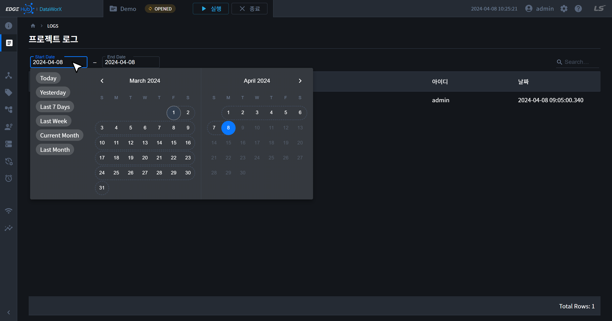

{: .no_toc }
# 프로젝트 로그
DataWorX 내 활동 로그를 확인할 수 있는 페이지입니다. 

- TOC
{:toc}

## 로그 목록
- 페이지 진입 시 날짜 범위는 오늘로 설정됩니다. 

## 로그 기간 지정
- 테이블 상단의 툴바에 위치한 날짜 필드를 클릭하면 설정된 날짜를 수정할 수 있습니다.
- 날짜 선택기에서 원하는 날짜 범위를 선택하면 해당 기간의 로그가 화면에 나타납니다.
- 날짜 선택기 좌측의 바로가기 버튼을 사용하면 특정 기간의 로그를 쉽게 확인할 수 있습니다. 제공되는 바로가기 버튼은 다음과 같습니다.

| 바로가기 버튼  | 예시 (오늘 날짜 - 2024/04/08) | 설명  |
| :------------ | :--------------------------: | :--- |
| Today         | 2024/04/08 - 2024/04/08      | 오늘 |
| Yesterday     | 2024/04/07 - 2024/04/07      | 어제 |
| Last 7 Days   | 2024/04/01 - 2024/04/08      | 7일 전 - 오늘 |
| Last Week     | 2024/03/31 - 2024/04/06      | 지난 주 일요일 - 지난주 토요일 |
| Current Month | 2024/04/01 - 2024/04/08      | 이번 달 1일 - 오늘 |
| Last Month    | 2024/03/01 - 2024/03/31      | 지난 달 |

{: .note }
미래의 날짜는 선택 불가하며, 시작날짜가 종료날짜보다 미래일 수 없습니다.

