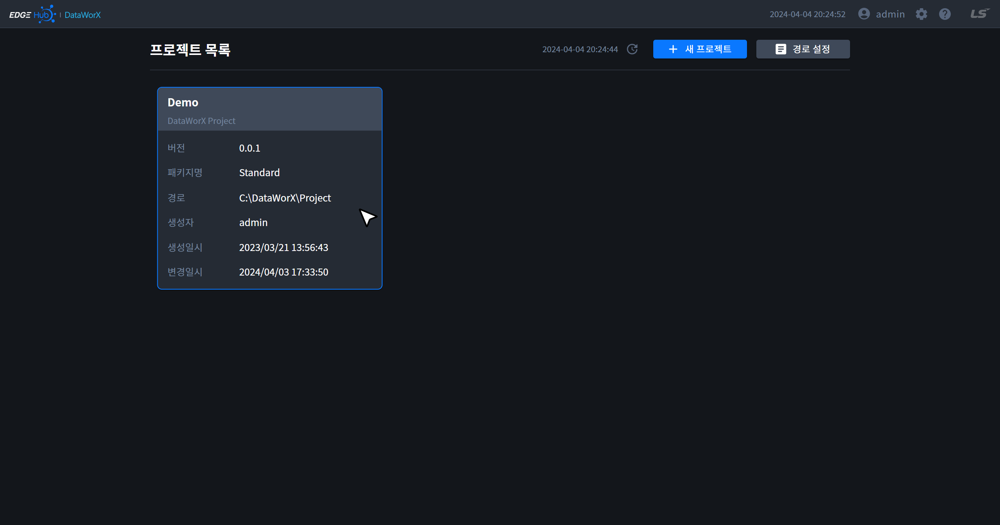
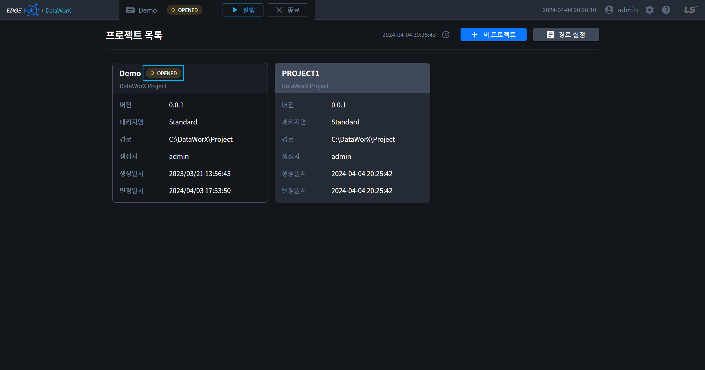
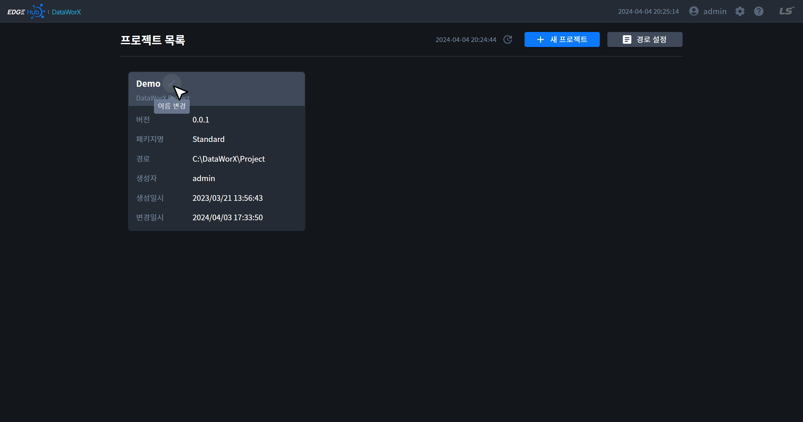
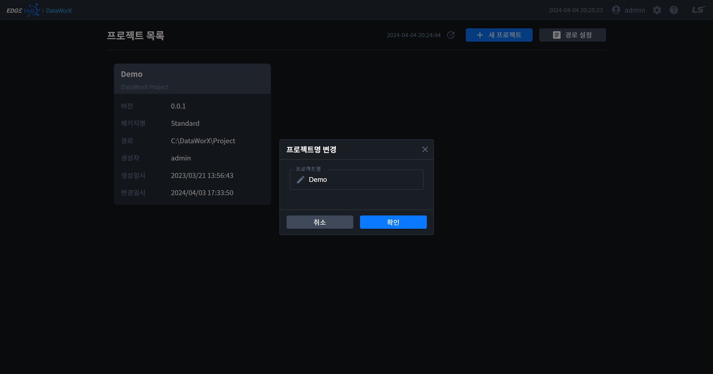
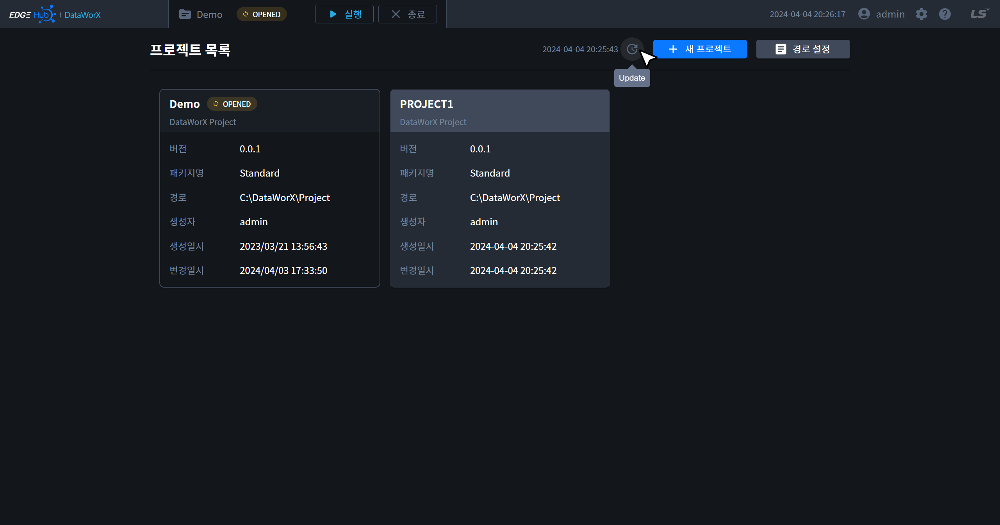
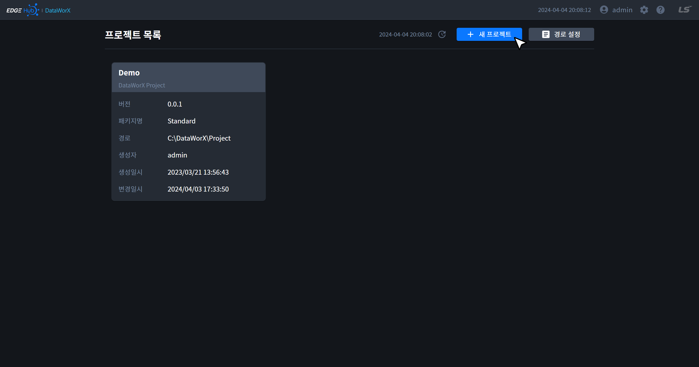
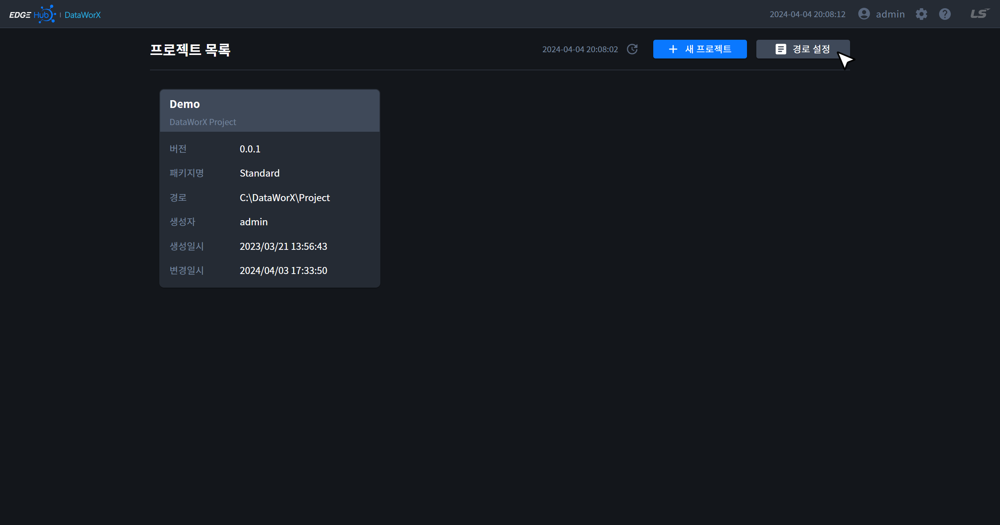

{: .no_toc }
# 프로젝트 목록
DataWorX에 생성한 프로젝트 목록을 확인할 수 있습니다. 프로젝트 목록에는 Demo 프로젝트가 포함되어 있습니다.

- TOC
{:toc}

## 1. 프로젝트 오픈
- 프로젝트 카드를 클릭하면 프로젝트를 오픈할 수 있습니다.

## 2. 프로젝트 상태
- `OPENED`/`RUNNING` 중인 프로젝트는 아래와 같이 프로젝트 명 옆에 상태가 표시됩니다.

## 3. 프로젝트 명 변경
- 프로젝트 명에 마우스를 올리면 연필 아이콘이 나타납니다. 해당 아이콘을 클릭하면 프로젝트명을 변경할 수 있습니다.
- 프로젝트 명은 공백 또는 숫자로 시작할 수 없으며, 길이는 25 Byte로 제한됩니다. 특수문자는 `-`, `_`만 허용됩니다.

{: .note }
`OPENED`/`RUNNING` 중인 프로젝트 명은 변경할 수 없습니다.

## 4. 프로젝트 목록 업데이트
- 프로젝트 목록은 아래와 같이 버튼을 클릭하면 업데이트할 수 있습니다.
- 버튼 좌측의 시간은 목록이 업데이트된 시간을 의미합니다.

## 5. 새 프로젝트
- 새 프로젝트를 추가하기 위한 페이지로 이동합니다. 자세한 내용은 [New Project](../project-add/)를 참고하시기 바랍니다.

## 6. 프로젝트 경로 설정
- 프로젝트 목록을 가져오기 위한 경로를 설정하는 페이지로 이동합니다. 자세한 내용은 [Project Path](../project-path/)를 참고하시기 바랍니다.

