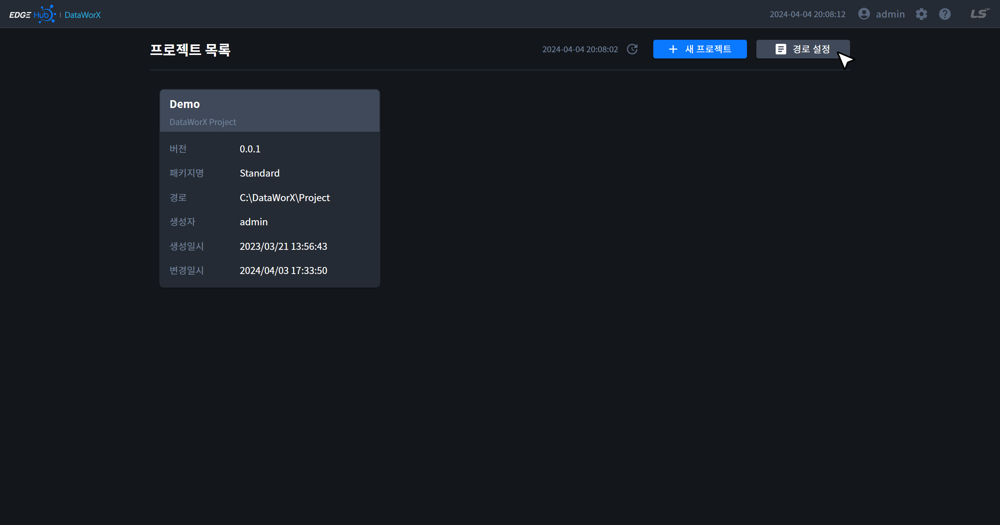
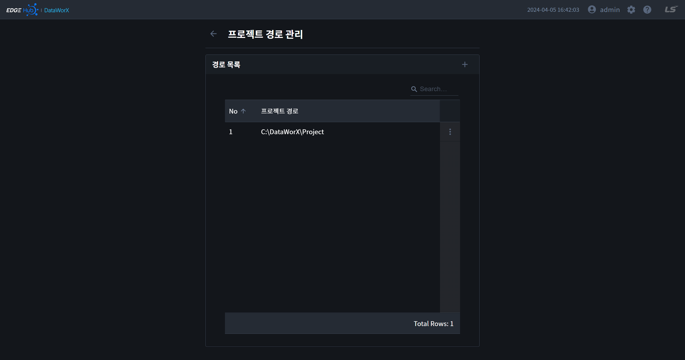
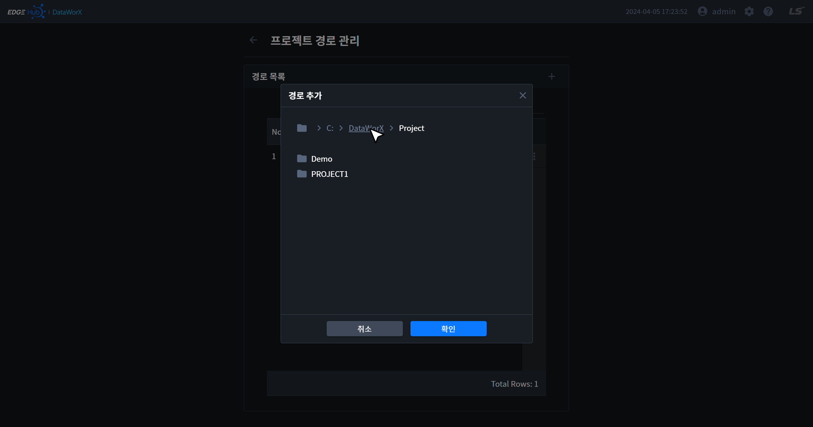
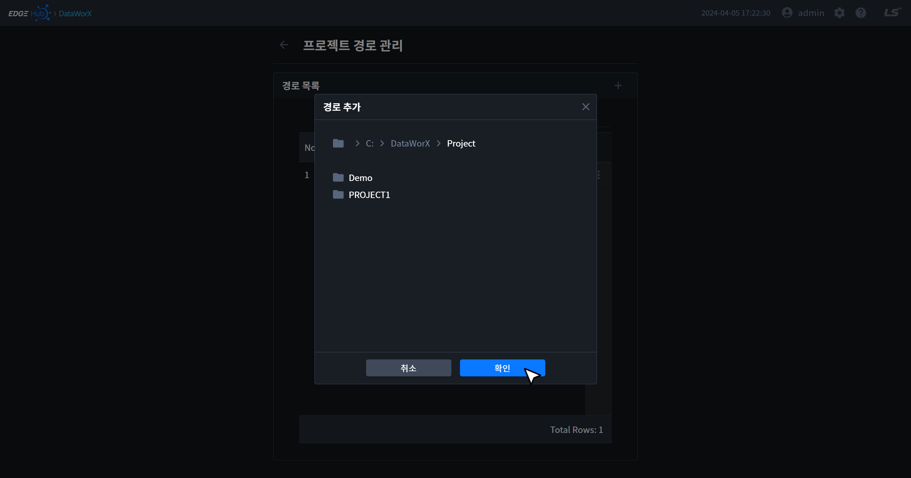
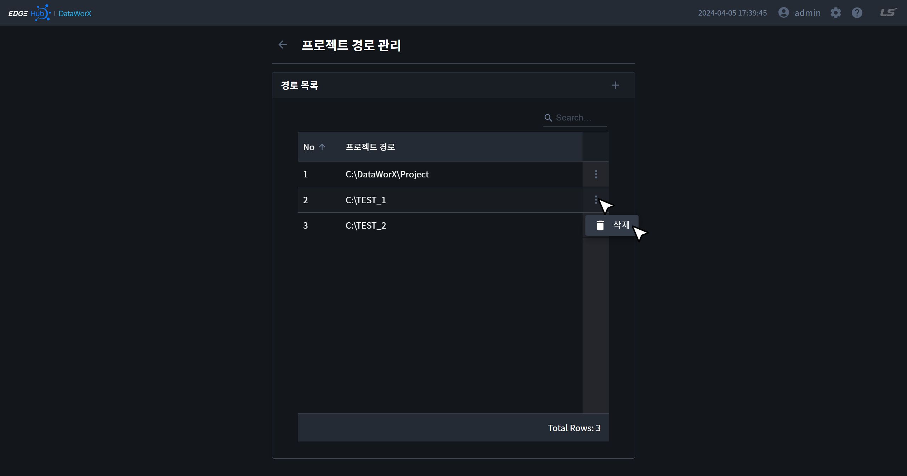
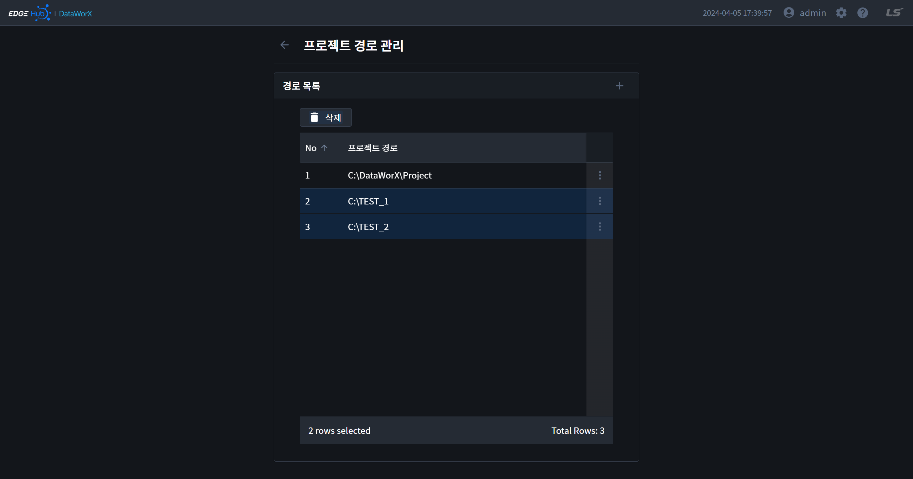

{: .no_toc }
# 프로젝트 경로
프로젝트 경로는 프로젝트의 목록을 불러오거나 프로젝트가 저장될 위치를 설정하기 위해 사용됩니다. 프로젝트 경로 페이지는 프로젝트 목록 페이지에서 버튼을 통해 이동할 수 있습니다.

- TOC
{:toc}

## 1. 경로 목록

## 2. 경로 추가
- 경로 목록 카드의 우측 상단의 `+` 버튼을 클릭하면 경로 추가 모달이 오픈됩니다.
- 모달에서 파일 탐색기와 동일한 방식으로 원하는 폴더를 찾을 수 있습니다.
- 아래와 같이 브레드크럼을 클릭하면 이전 위치로 이동할 수 있습니다.
- 원하는 위치를 찾은 경우 `확인` 버튼을 클릭하면 경로 목록 테이블에서 추가한 경로를 확인할 수 있습니다.

## 3. 경로 삭제
- 경로 목록의 메뉴 버튼을 클릭하면 경로를 삭제할 수 있습니다. 

{: .note }
수정 기능은 추후 지원 예정입니다.

{: .highlight}
`Ctrl`키와 `Shift`키를 이용해 경로를 다중 선택하여 삭제할 수 있습니다.

