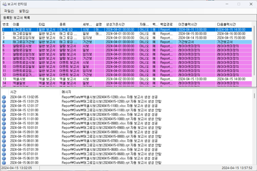

{: .no_toc }
# 보고서 런타임
보고서 런타임 트레이 아이콘의 팝업 메뉴에서 `[보고서 런타임 보이기]`를 선택하면 아래 그림과 같은 보고서 `런타임 화면`을 표시합니다. 이 화면에는 정의된 모든 보고서 정보가 표시되며, 보고서 런타임이 보고서를 생성하는 과정을 로그로 남기며 해당 로그 정보도 표시합니다.  

- TOC
{:toc}

## 등록된 보고서 목록  
`보고서 편집기`를 통해 등록된 보고서 목록을 표시합니다. `일반보고서, 엑셀보고서`를 타입으로 구별할 수 있습니다. 보고서 세부종류가 `기간보`의 경우는 `파란색`으로 표시하며 `자동 생성에서 제외`되며, 수동 생성이나 스크립트를 통해서만 보고서가 생성될 수 있습니다. 보고서 속성은 설정되었으나 `레이아웃이 없는 보고서`는 `빨간색`으로 표시하며 자동 생성에서 제외됩니다.
등록된 보고서 목록에 적용할 수 있는 동작은 다음과 같습니다.

-	보고서 레이아웃 편집을 위해 보고서 편집기를 호출합니다.
-	이미 만들어진 보고서를 보기위해 생성된 보고서 보기 화면을 호출합니다.
-	사용자가 보고자 하는 시간 대의 보고서를 생성할 수 있는 보고서 수동 생성 화면을 호출합니다.  

등록된 보고서 중에 `레이아웃이 정의되지 않으면` 보고서를 `생성할 수가 없습니다`. 또한 `기간 보고서`로 설정된 보고서는 `자동 보고서`에서 생성되지 않았습니다. `기간 보고서`는 `수동 보고서 생성`이나 그래픽 script를 통해 기간을 입력해 생성할 수 있습니다. 레이아웃이 정의되지 않았거나 `기간 보고서`의 경우는 보고서 목록에서 `붉은색`과 `파란색`으로 표시하여 사용자가 인식할 수 있습니다

## 레이아웃 편집  
보고서 목록을 선택한 후 마우스의 우측 버튼을 누르고, 표시되는 팝업 메뉴에서 `[레이아웃 편집]`을 선택하면 선택된 보고서를 보고서 편집기로 열 수 있으며 레이아웃 편집 화면이 표시됩니다.  

## 파일 조회  
현재 저장된 생성된 보고서 조회가 가능할 뿐만 아니라 `보고서 열기`, `인쇄` 및 `삭제`가 가능합니다. `보고서 목록`을 선택한 후, 마우스의 우측 버튼을 누르고, 표시되는 팝업 메뉴에서 `[파일 조회]`를 선택하면 생성된 보고서 보기 화면이 표시되며 선택된 보고서의 생성된 보고서 리스트가 조회됩니다.

생성된 보고서 보기는 아래와 같은 화면으로 표시됩니다.

1. `보고서 모델 리스트` 
  보고서 편집기를 통해 편집된 모든 보고서 모델이 표시됩니다. 보고서를 선택하면 하단의 생성된 보고서 리스트에 선택한 보고서의 생성된 보고서가 표시됩니다.  
2. `보고서 열기`  
  생성된 보고서 리스트에서 보고서를 선택후 [열기] 버튼을 누르면 보고서 뷰어가 실행되면서 선택된 보고서가 표시됩니다. 보고서 뷰어는 일반 보고서의 경우 자체 보고서 뷰어가 실행되며, 엑셀 보고서는 엑셀이 실행됩니다. 그외에 `PDF/DOC/TXT 형식`의 보고서는 해당 어플리케이션과 연결되어 실행됩니다. 엑셀이나 해당 어플리케이션이 설치되지 않았으면 보고서를 열수가 없으므로 해당 어플리케이션의 `설치 여부를 사전 체크`해야 합니다.  

    1. 일반 보고서 뷰어  
      보고서 유형이 일반 보고서로 설정된 보고서는 확장자가 `RPT인 보고서`가 생성됩니다. 보고서 열기에서 RPT 보고서 열기를 실행하면 아래와 같은 화면이 표시됩니다.  
        

      일반 보고서 뷰어에는 보고서 출력 뿐만 아니라 [내보내기] 메뉴를 통해 `PDF/XLS/DOC/TXT/TIFF` 형식의 보고서를 생성합니다.    

        

      [내보내기] 메뉴를 누르면 아래와 같은 화면이 표시되면서 원하는 형식의 보고서를 생성합니다.  

        

    2. 엑셀 보고서 뷰어  
      엑셀 보고서는 엑셀 양식을 이용해 보고서를 생성하므로 생성된 보고서는 엑셀 파일입니다. 보고서 열기에서 엑셀 보고서 열기를 실행하면 엑셀이 실행되어 선택된 보고서가 표시됩니다.  

3. `보고서 인쇄`  
  생성된 보고서 리스트에서 보고서를 선택 후 `[인쇄]` 버튼을 누르면 보고서가 프린터를 통해 인쇄됩니다. 인쇄 가능한 보고서는 RPT 형식의 일반보고서와 엑셀보고서만 해당됩니다. PDF/DOC/TXT 형식의 보고서는 해당 어플리케이션 설치 후 실행하여 인쇄가 가능합니다.  

4. `보고서 삭제`  
  생성된 보고서 리스트에서 보고서를 선택 후 `[삭제]` 버튼을 누르면 보고서가 삭제됩니다. 삭제한 보고서 내용은 로그로도 출력됩니다.  

5. `생성된 보고서 리스트`  
  화면 상단의 보고서 모델 리스트를 선택하면 하단의 생성된 보고서 리스트에 선택한 보고서의 생성된 보고서가 표시됩니다.  

## 수동 생성  
보고서 목록을 선택한 후, 마우스의 우측 버튼을 누르고, 표시되는 팝업 메뉴에서 `[수동 생성]`을 선택하면 사용자가 보고자 하는 시간 대의 보고서를 생성할 수 있는 보고서 수동 생성 화면을 표시합니다.  

보고서 수동 생성은 아래와 같은 화면으로 표시됩니다.

1. `보고서 데이터 수집 현황`  
  현재 보고서에 설정된 이력 데이터 수집모델의 데이터 저장 현황을 리스트로 표시하여 사용자가 데이터 조회 시 참고할 수 있으며 각 컬럼 설명은 다음과 같습니다.  
  1. 데이터 모델 : 데이터 수집 모델 이름  
  2. 수집주기 : 해당 수집모델의 데이터 수집 주기  
  3. 최초저장 시간 : 가장 오래된 데이터 시간  
  4. 최종저장 시간 : 가장 최근의 데이터 시간  
    알람 보고서의 경우는 리스트가 표시되지 않습니다.  
2. `새로고침`  
  리스트를 최신 정보로 갱신합니다.  
3. `요청시간 선택`  
  조회하려는 기간을 선택합니다. `시보/일보/주보/월보/년보`와 같은 `정기보고서`는 기준시간을 설정하며, `기간보고서`는 `시작시간, 종료시간`을 설정합니다.  
4. `확인`  
  요청시간대의 데이터가 개수만큼 출력되어 보고서가 생성되며 보고서 수동 생성 화면을 종료합니다. 생성된 보고서는 보고서 뷰어를 실행하여 표시합니다.  
5. `취소`  
  보고서 수동 생성 화면을 종료합니다.  

보고서 수동 생성을 위해 요청시간을 입력 후, 확인 버튼을 누르면 생성할 보고서 명을 입력 받은 화면이 나타납니다. 수동 보고서 이름은 보고서명에 날짜/시간 정보와 함께 manual이라는 이름으로 부여됩니다.  

보고서 명을 입력 후, 저장 버튼을 누르면 보고서가 생성되고 보고서 뷰어가 실행되면서 생성된 보고서 내용을 확인할 수 있습니다.

## 자동 보고서 생성  
`보고서 런타임`은 실행과 동시에 보고서 목록을 조회하여 보고서 생성시간을 체크하여 보고서 생성시간이 되면 보고서 구성정보와 보고서 레이아웃을 참고해서 해당 이력 데이터를 조회하여 보고서를 작성후 저장 및 출력을 수행합니다.  
보고서 편집기에서 `[자동 출력정보 갱신] 메뉴`를 선택하면 보고서 런타임은 `온라인 중에 변경 내용을 반영`합니다.  
보고서 `자동 생성 과정`은 보고서 런타임 하단의 로그 부분에 기록되어 추후 조회가 가능합니다.  
보고서 생성시 보고서 속성에서 지정한 출력형식에 따라 `PDF/XLS/DOC/TXT` 형식의 보고서도 같이 생성됩니다.  

