{: .no_toc }
# 서버 관리
외부 시스템에 데이터를 전달할 수 있는 서버를 생성하고 관리할 수 있습니다. 

- TOC
{:toc}

## 서버 목록
- 프로젝트에 생성된 서버의 목록을 확인할 수 있습니다.

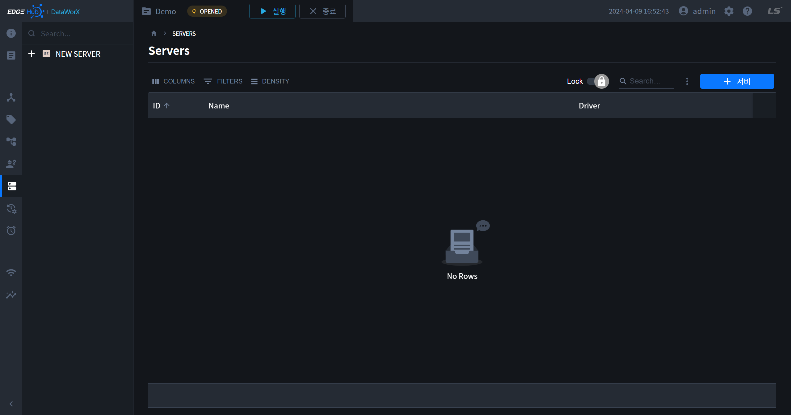

## 서버 추가

1. 테이블 우측 상단 또는 서브 내비게이션 상단의 서버 추가 버튼을 클릭합니다.

    

2. 페이지 우측에 나타난 패널의 필드를 채워 넣습니다.

3. 패널 하단의 확인 버튼을 클릭합니다.

    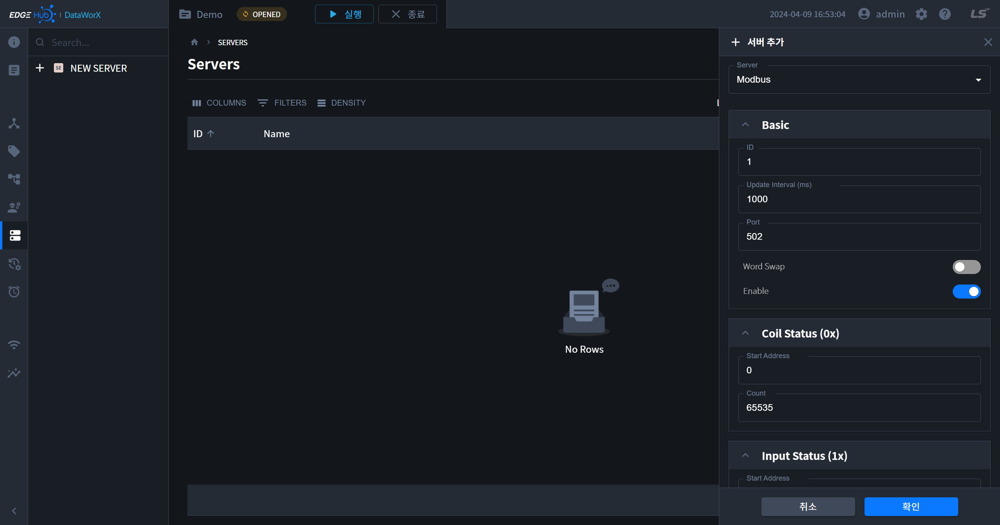

    {: .note}
    현재는 `Modbus Server`만 생성 가능합니다. 다른 프로토콜은 추후 지원 예정입니다.

4. 추가된 서버를 목록에서 확인할 수 있습니다.

    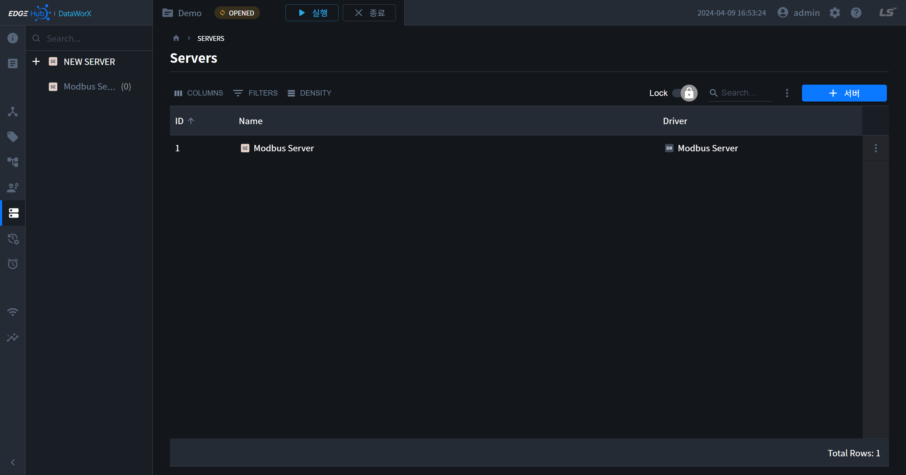

## 서버 정보
- 서버의 세부 설정 정보는 우측 패널을 통해 확인할 수 있으며, 패널은 다음과 같은 방법으로 오픈할 수 있습니다.
  - 서브 내비게이션 트리의 아이템 우측 더보기 버튼

    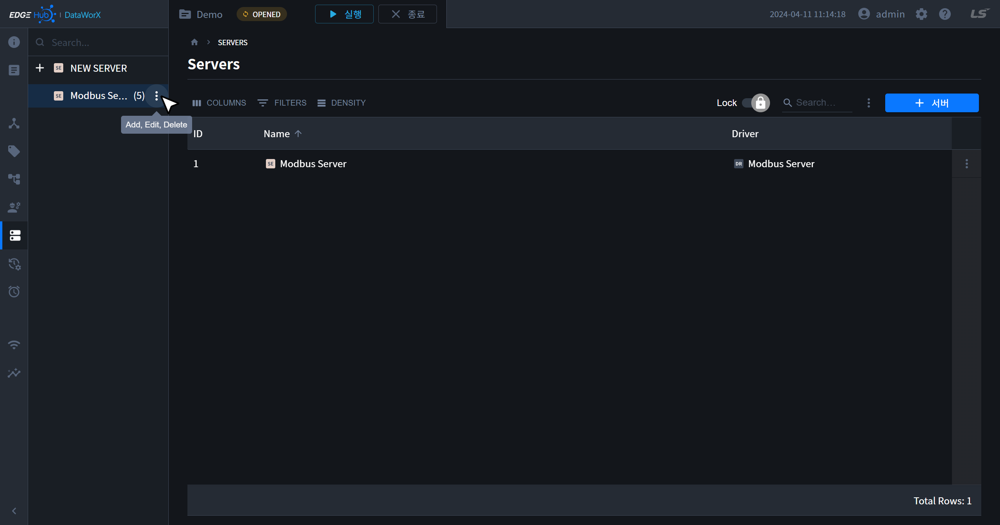
    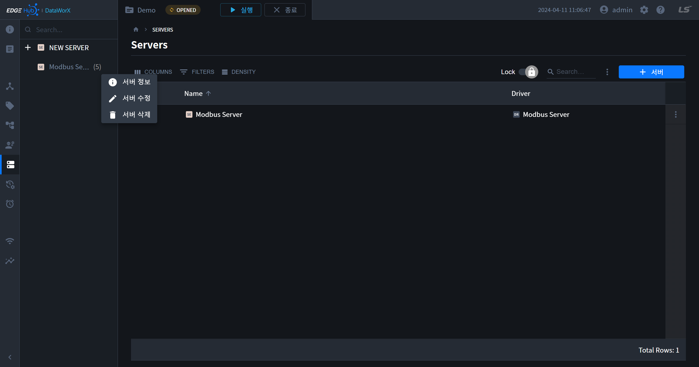

  - 테이블의 아이템 마지막 행의 더보기 버튼

    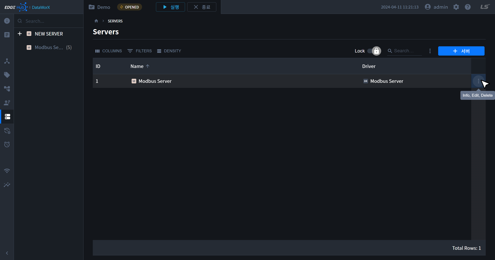
    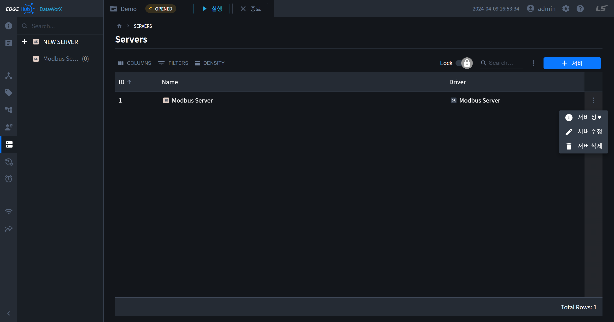
        
  - 테이블 `Lock` 모드에서 아이템 명 우측  `OPEN` 버튼
    
    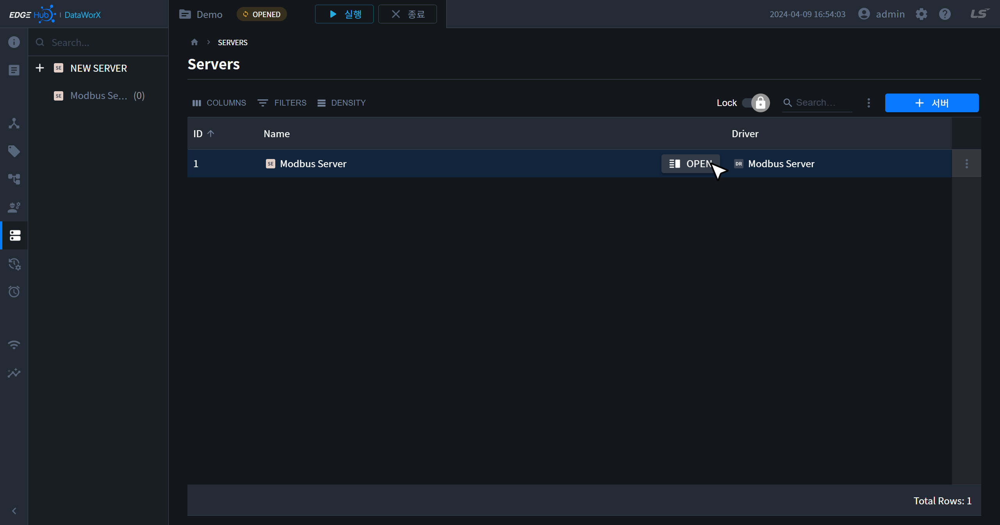

- 서버 정보 패널은 다음과 같습니다.

    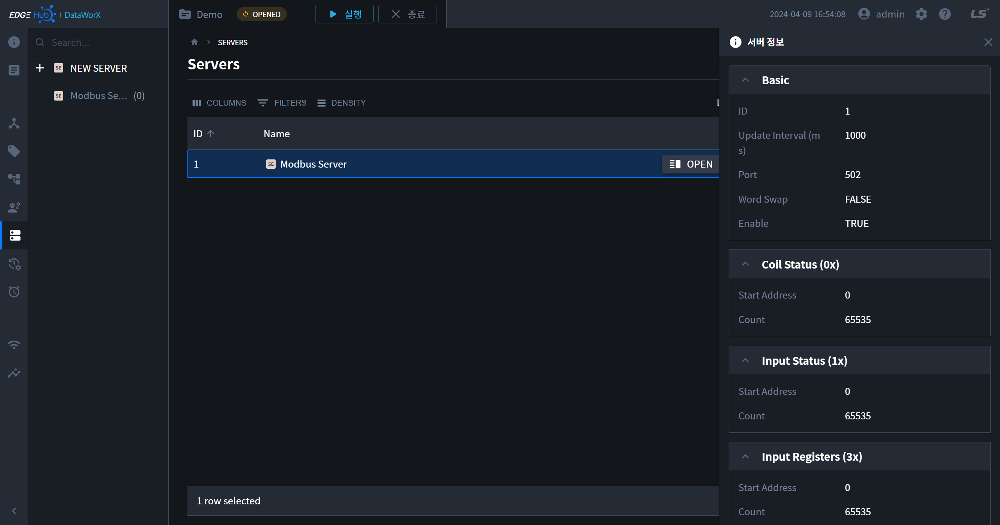

## 서버 수정
- 서버정보 수정은 우측 패널을 통해 수정 가능하며, 패널은 다음과 같은 방법으로 오픈할 수 있습니다.
  - 서브 내비게이션 트리의 아이템 우측 더보기 버튼

    
    

  - 테이블의 아이템 마지막 행의 더보기 버튼

    
    
        
  - 테이블 `Edit` 모드에서 아이템 명 우측  `OPEN` 버튼
    
    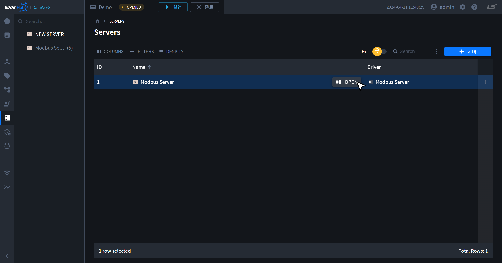

## 서버 삭제
- 서버는 다음과 같이 테이블의 더보기 버튼을 통해 삭제할 수 있습니다.

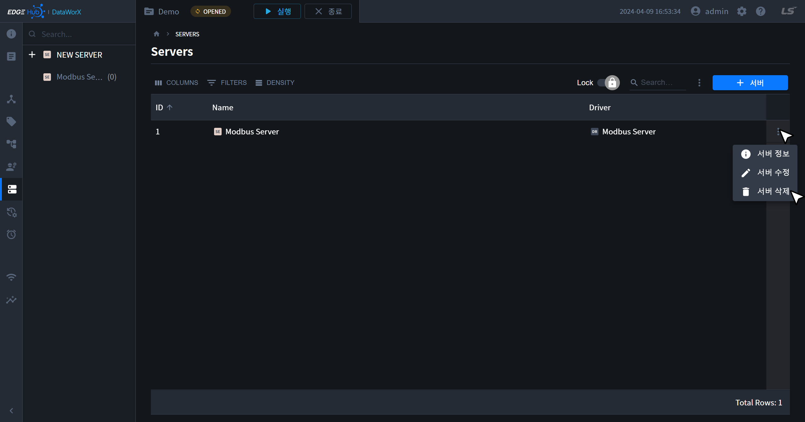
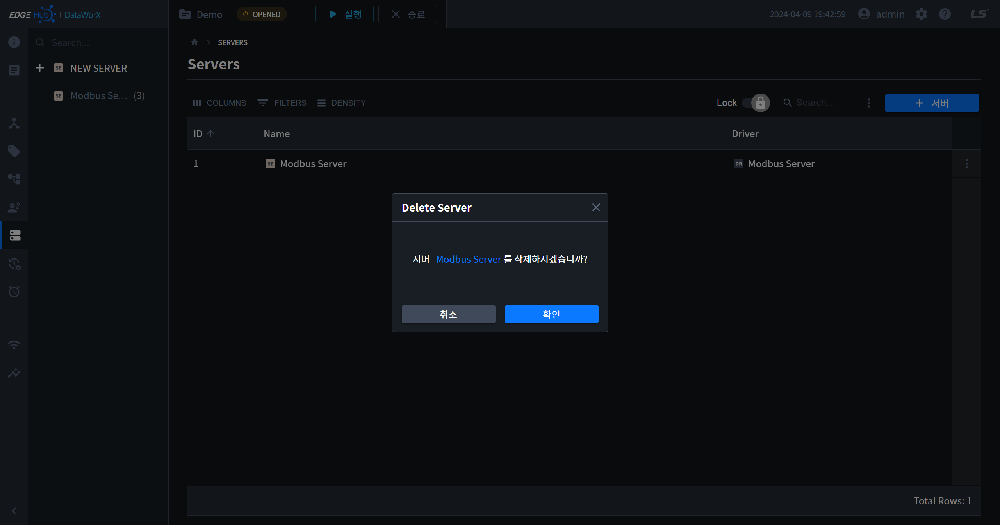

## 서버 내보내기
- DataWorX에 저장된 서버의 태그 정보를 다운로드할 수 있습니다. 다운로드되는 파일명은 `server_tags_[날짜]`입니다.

    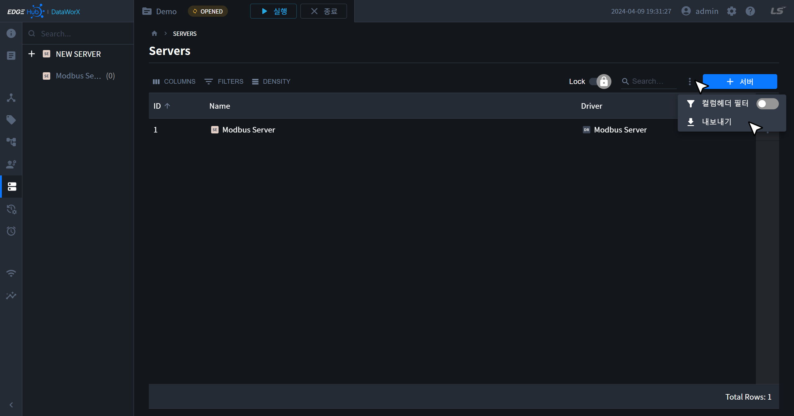

{: .note }
서버에 추가된 태그가 없으면 에러 토스트가 나타납니다.