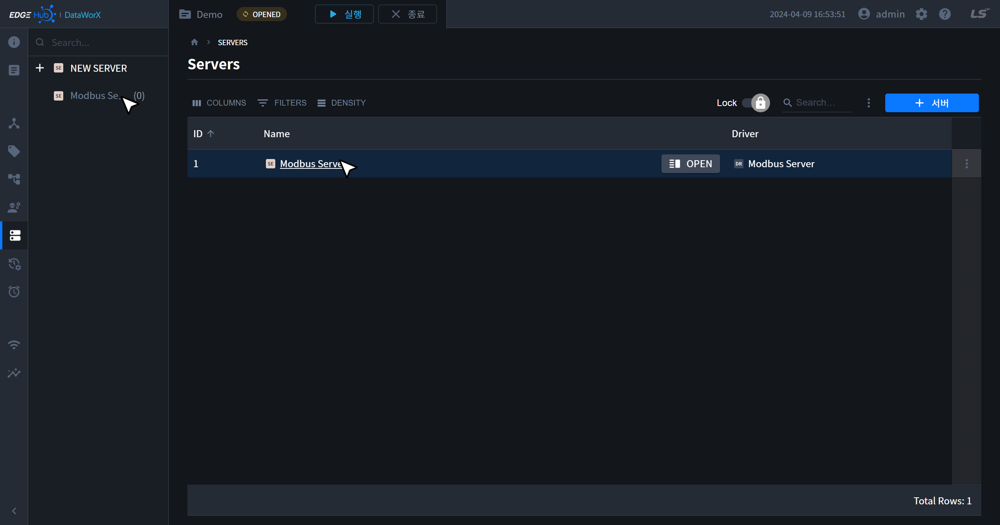
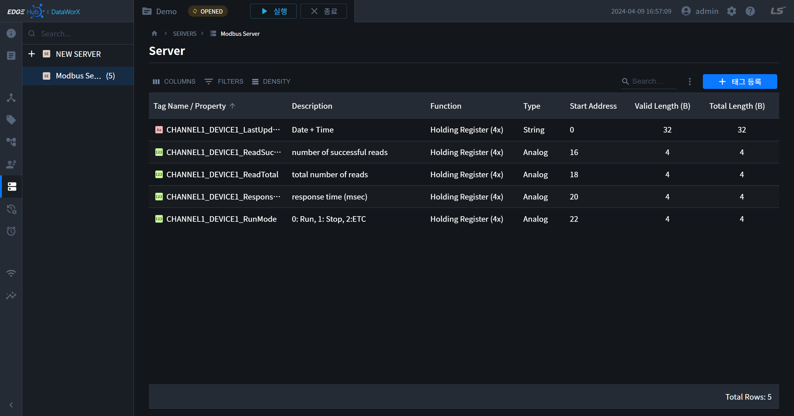
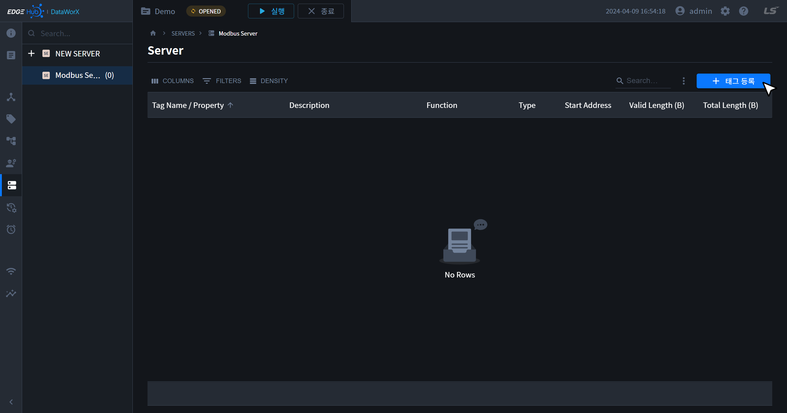
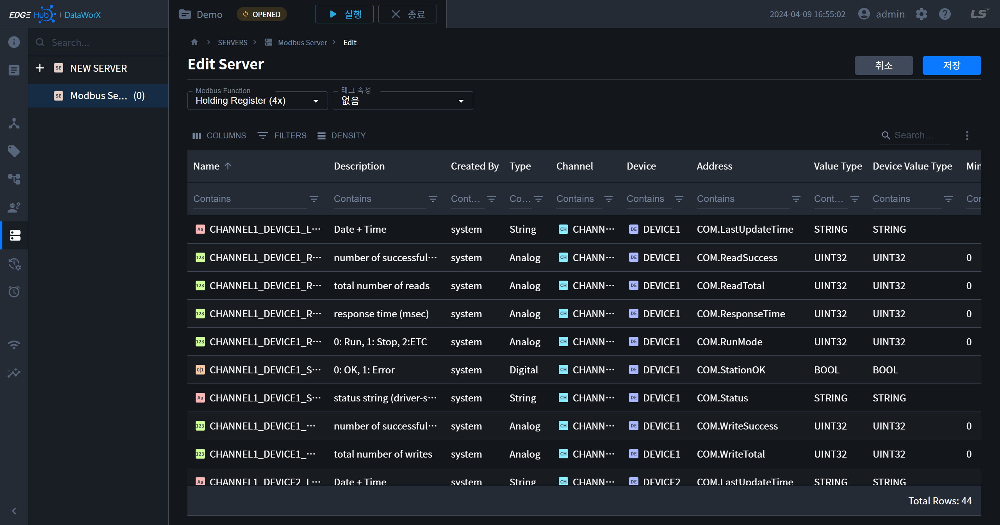
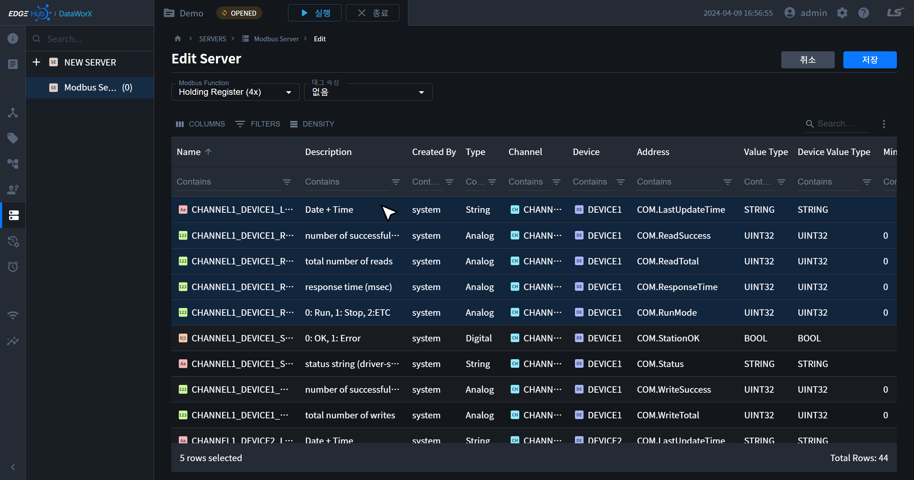
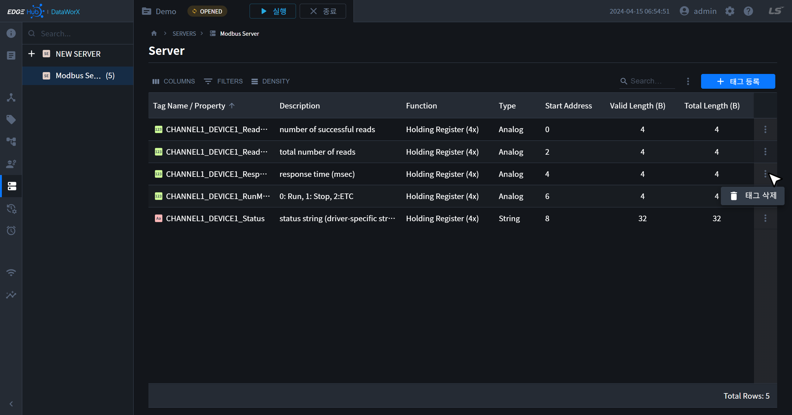
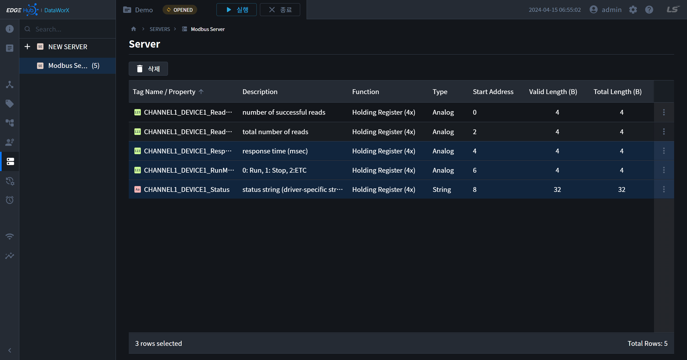
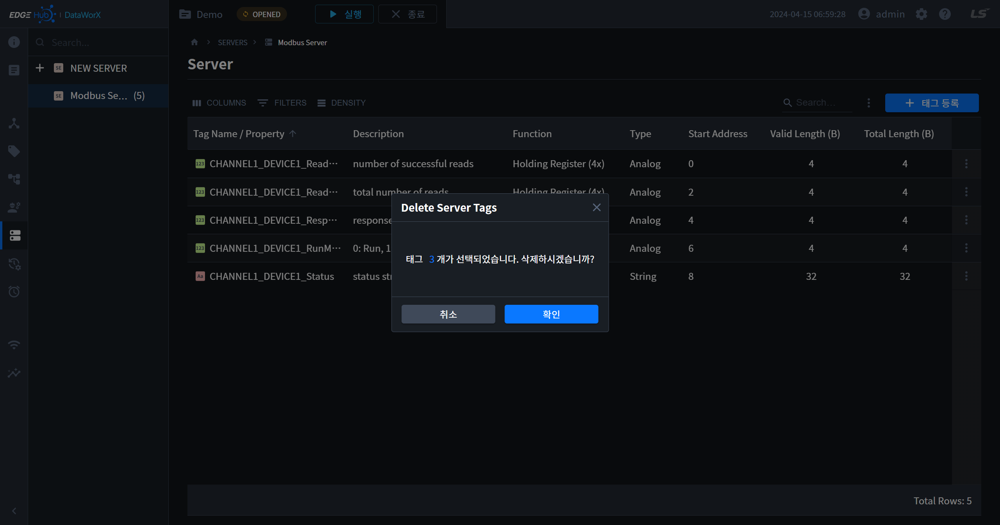

{: .no_toc }
# 서버 설정
생성한 서버에는 태그 페이지에서 생성한 태그를 등록하여 관리할 수 있습니다. 서브 내비게이션 또는 테이블의 서버명을 클릭하면 해당 페이지로 이동할 수 있습니다. 

- TOC
{:toc}

## 서버태그 목록
- 현재 서버에 추가된 태그를 나타냅니다. 

## 서버태그 등록
- 테이블 우측 상단의 `태그 등록` 버튼을 클릭하면 태그 등록 페이지로 이동할 수 있습니다.
- 테이블 상단에 있는 필드에서 서버의 특정 속성 또는 태그 속성을 변경할 수 있습니다.
- 태그는 키보드를 통해 다중 선택할 수 있습니다. 자세한 내용은 [테이블 페이지](../../../components/table/#선택)를 참고 바랍니다.
- 태그 저장 시 추가된 태그, 중복된 태그, 유효하지 않는 태그 건 수로 처리된 태그가 나타납니다.

## 서버태그 삭제
1. 태그는 테이블 우측의 더보기 메뉴의 `태그 삭제` 아이템 또는 다중 선택 시 테이블 좌측 상단에 나타나는 `삭제` 버튼을 클릭합니다.

    
    

2. 삭제를 확인하는 모달에서 `확인` 버튼을 클릭합니다.

    

