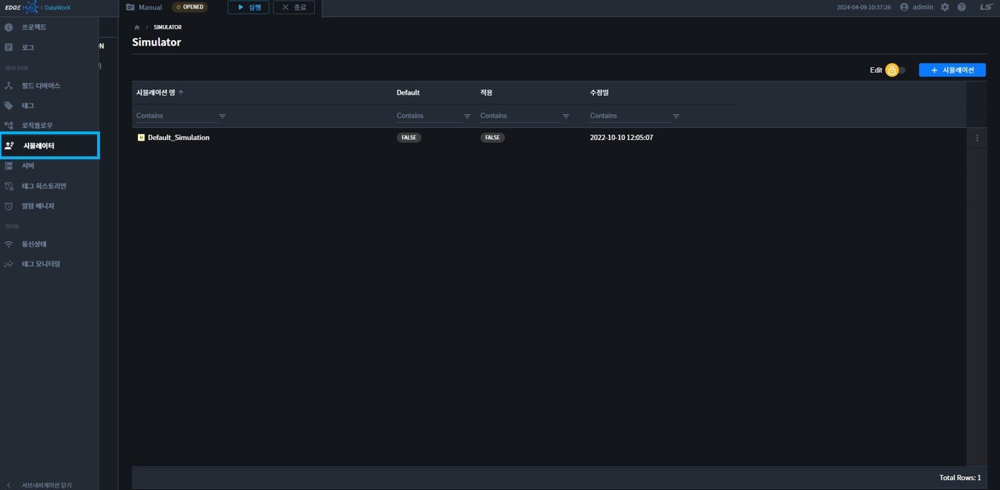

# 시뮬레이터
DataWorX에 장비가 실제로 연결 되어 있지 않아도 시뮬레이터 기능을 통해 가상의 값을 태그에 올려 줄 수 있습니다. 또한 XG5000 소프트웨어의 시뮬레이션과 연동이 되어 PLC 래더의 모니터링 값을 DataWorX 시뮬레이션에 전송할 수 있고, 반대로 DataWorX의 제어 명령을 XG5000 시뮬레이션에 보낼 수 있습니다. 시뮬레이터 메뉴에서 시뮬레이터를 생성하고 설정할 수 있습니다. 

자세한 내용은 하위 페이지를 참고 바랍니다.

