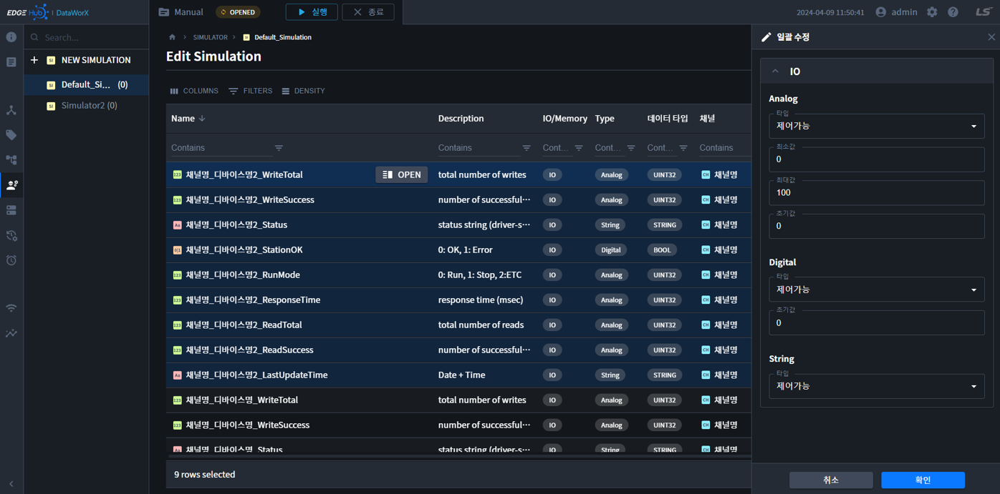

{: .no_toc }
# 시뮬레이터
DataWorX에 장비가 실제로 연결 되어 있지 않아도 시뮬레이터 기능을 통해 가상의 값을 태그에 올려 줄 수 있습니다. 또한 XG5000 소프트웨어의 시뮬레이션과 연동이 되어 PLC 래더의 모니터링 값을 DataWorX 시뮬레이션에 전송할 수 있고, 반대로 DataWorX의 제어 명령을 XG5000 시뮬레이션에 보낼 수 있습니다. 시뮬레이터 메뉴에서 시뮬레이터를 생성하고 설정할 수 있습니다.

- TOC
{:toc}

## 1. 시뮬레이터 관리  
DataWorX에서 생성한 시뮬레이터 목록을 확인할 수 있습니다. 기본적으로 Default_Simulation이 생성되어 있습니다.

### 1.1 시뮬레이터 추가  
1. 시뮬레이터는 하기 2개의 버튼으로 추가할 수 있습니다.  

    

2. 버튼을 클릭하면 오른쪽에 설정 패널이 표시됩니다.  

    

    - `시뮬레이션명`: 시뮬레이션 명을 입력합니다.  
    - `Default`: 런타임 시작 시, 시뮬레이션을 바로 적용할 경우 체크합니다. 시뮬레이터중 1개만 체크 가능합니다.

3. 확인 버튼을 누르고, 설정을 저장합니다.

### 1.2 시뮬레이터 정보  
1. 시뮬레이터 정보는 `테이블 더보기` 또는 `Toggle Lock -> OPEN`으로 열 수 있습니다.  

    

2. 버튼을 클릭하면 오른쪽에 `정보 패널`이 표시됩니다. 

    

    - `이름`: 시뮬레이션 명이 표십됩니다.  
    - `Default`: 런타임 시작 시, 시뮬레이션을 바로 적용시 체크되어 있습니다.  
    - `적용`: Project Run중, `현재 실행`되고 있는 시뮬레이터는 `true`로 표시됩니다.  
    - `수정일`: 마지막 수정시간이 표시됩니다.    

### 1.3 시뮬레이터 수정  
1. 시뮬레이터 수정은 `테이블 더보기` 또는 `Toggle Edit -> OPEN`으로 열 수 있습니다.  

    

2. 버튼을 클릭하면 오른쪽에 수정 패널이 표시됩니다.  

    

    - `시뮬레이션명`: 시뮬레이션 명을 입력합니다.  
    - `Default`: 런타임 시작 시, 시뮬레이션을 바로 적용할 경우 체크합니다. 시뮬레이터중 1개만 체크 가능합니다.

3. 확인 버튼을 누르고, 설정을 저장합니다.

### 1.4 시뮬레이터 삭제  
1. 시뮬레이터 삭제는 `테이블 더보기` 또는 테이블 리스트를 `복수개 선택` 후, 상단의 `삭제` 버튼을 클릭합니다.

    

2. 버튼을 클릭하면 가운데에 확인 모달이 표시됩니다.

    

3. 확인 버튼을 누르면, 시뮬레이터가 삭제됩니다.

### 1.5 시뮬레이터 복사  
시뮬레이션 복사는, 기존 설정을 복사하여 새로 만들때 사용합니다. 시뮬레이션 설정정보가 함께 복사됩니다. 

1. 시뮬레이터 복제는 `테이블 더보기`에서 시뮬레이션 복사 버튼을 클릭합니다.

    

2. 버튼을 클릭하면, 가운데에 설정 모달이 표시됩니다. 이름과 Default를 설정하여 복사합니다.

    

3. 확인 버튼을 누르면, 시뮬레이터가 복사됩니다.

### 1.6 시뮬레이터 런타임 적용/해제
`Project Running` 상태에서만, 활성화되는 버튼입니다. Run 상태에서 `시뮬레이터를 적용/해제` 할 수 있습니다.

## 2. 시뮬레이션 설정  
시뮬레이션 설정페이지는 `왼쪽 Tree의 시뮬레이션명` 클릭 또는 `테이블 셀 시뮬레이션명`을 클릭하여 이동합니다.

### 2.1 시뮬레이션 속성  
시뮬레이션 속성 설명은 다음과 같습니다.

| 속성      | 설명 |
|----------|----|
|Name | 태그명이 표시됩니다.|
|Description| 태그 설명이 표시됩니다.|
|IO/Memory| 입출력태그/메모리태그를 표시합니다. |
|Type| 아날로그/디지털/스트링을 표시합니다.|
|데이터 타입 | 태그의 데이터 타입을 표시합니다.|
|채널| 태그가 속한 채널명이 표시됩니다.|
|디바이스| 태그가 속한 디바이스명이 표시됩니다.|
|시뮬레이션 타입 | 시뮬레이션 발생 규칙을 선택합니다.|
|최소| 데이터 발생시 변동영역의 하한 값을 설정합니다.|
|최대| 데이터 발생시 변동영역의 상한 값을 설정합니다.|
|초기값| 시뮬레이션 규칙이 적용될 떄, 초기시작 값을 입력합니다.|
|주기| 주기(Cycle)를 가지는 시뮬레이션 타입(사인파형,톱니파형, 삼각파형, 랜덤)의 1주기 시간을 입력합니다.|

시뮬레이션 발생 규칙(시뮬레이션 타입)
- `Analog`: 제어가능, 랜덤, 사인파형, 톱니파형, 삼각파형, XG5000
- `Digital`: 제어가능, 랜덤, Change, XG5000
- `String`: 제어가능, 랜덤
- `메모리태그`: `메모리 태그`는 위의 규칙을 따르나, `XG5000`이 제외됩니다.

### 2.2 시뮬레이션 설정 수정  
1. 시뮬레이션 개별 설정은 하기 `OPEN 버튼`을 눌러 설정합니다.  

    

2. 시뮬레이션 다중 설정은 테이블 `행을 다중선택`하고, `수정 버튼`을 클릭합니다.

    

3. 시뮬레이션 설정 또는 일괄 수정설정 창이 오른쪽에 표시됩니다.

    

4. 설정 정보를 입력하고 확인버튼을 누르면, 시뮬레이션 설정정보 저장됩니다.

{: .highlight }
`CTRL + A`로 전체 선택을 사용할 수 있습니다.  
`SHIFT + Click`으로 여러개를 선택할 수 있습니다.  
`CTRL + Click`으로 다중선택할 수 있습니다.  
`첫번째 행을 클릭` => `SHIFT + END` 로 전체선택할 수 있습니다.

### 2.3 시뮬레이션 설정 해제  
1. 시뮬레이션 해제는 테이블의 행을 선택하고, `해제 버튼`을 클릭합니다.

    

2. 시뮬레이션 해제 확인 모달이 표시됩니다.

    

3. 확인 버튼을 누르면, 시뮬레이션 설정정보가 해제됩니다.

### 2.4 시뮬레이션 런타임 적용/해제  
`Project Running` 상태에서만, 활성화되는 버튼입니다. Run 상태에서 `현재 시뮬레이터를 적용/해제` 할 수 있습니다.

