{: .no_toc }
# 시뮬레이터 관리  
DataWorX에서 생성한 시뮬레이터 목록을 확인할 수 있습니다. 기본적으로 Default_Simulation이 생성되어 있습니다.

- TOC
{:toc}

## 시뮬레이터 추가  
1. 시뮬레이터는 하기 2개의 버튼으로 추가할 수 있습니다.  

    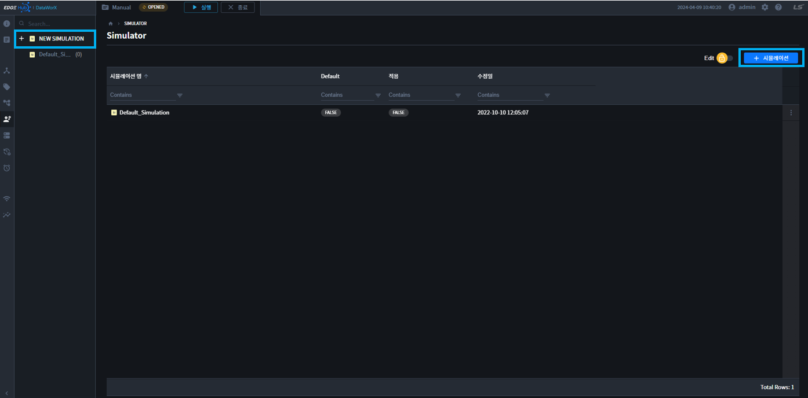

2. 버튼을 클릭하면 오른쪽에 설정 패널이 표시됩니다.  

    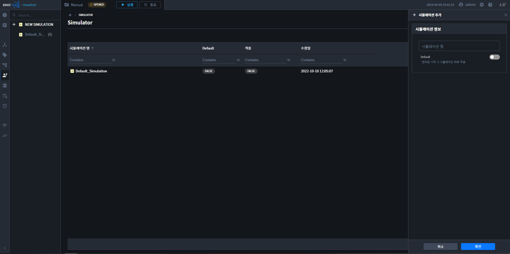

    - `시뮬레이션명`: 시뮬레이션 명을 입력합니다.  
    - `Default`: 런타임 시작 시, 시뮬레이션을 바로 적용할 경우 체크합니다. 시뮬레이터중 1개만 체크 가능합니다.

3. 확인 버튼을 누르고, 설정을 저장합니다.

## 시뮬레이터 정보  
1. 시뮬레이터 정보는 `테이블 더보기` 또는 `Toggle Lock -> OPEN`으로 열 수 있습니다.  

    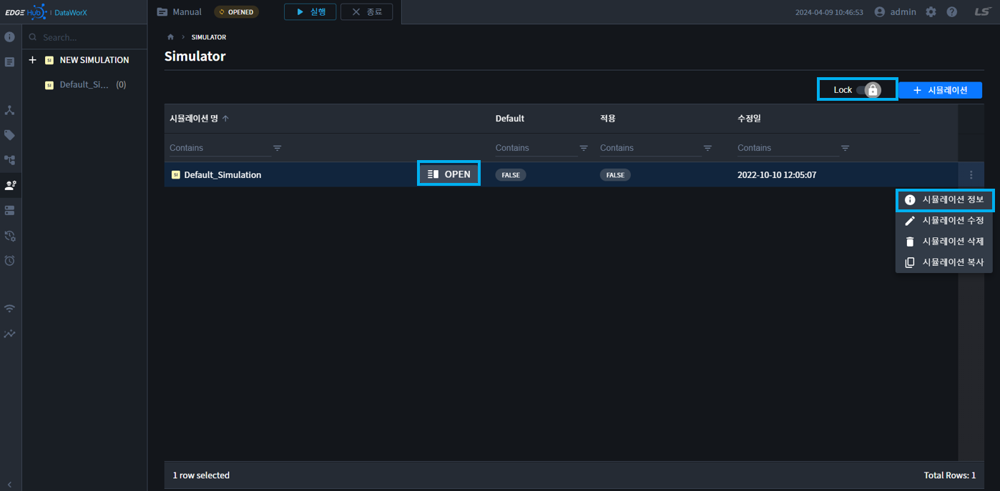

2. 버튼을 클릭하면 오른쪽에 `정보 패널`이 표시됩니다. 

    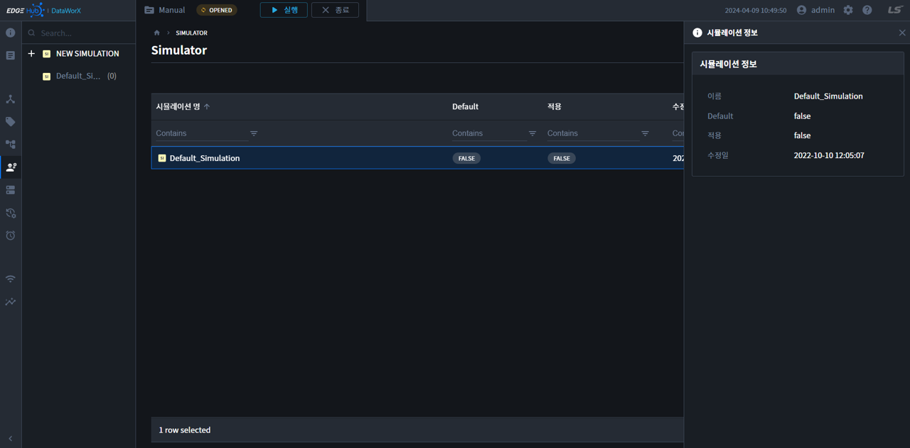

    - `이름`: 시뮬레이션 명이 표십됩니다.  
    - `Default`: 런타임 시작 시, 시뮬레이션을 바로 적용시 체크되어 있습니다.  
    - `적용`: Project Run중, `현재 실행`되고 있는 시뮬레이터는 `true`로 표시됩니다.  
    - `수정일`: 마지막 수정시간이 표시됩니다.    

## 시뮬레이터 수정  
1. 시뮬레이터 수정은 `테이블 더보기` 또는 `Toggle Edit -> OPEN`으로 열 수 있습니다.  

    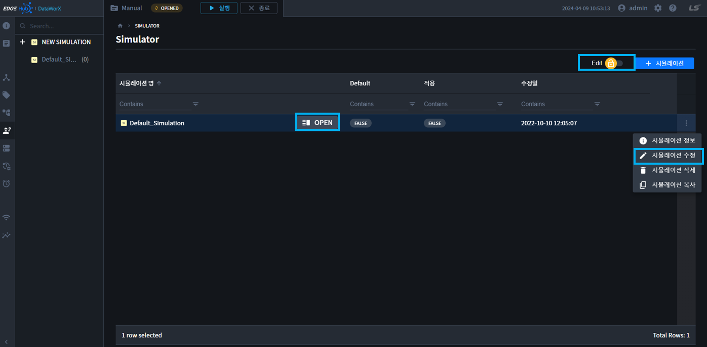

2. 버튼을 클릭하면 오른쪽에 수정 패널이 표시됩니다.  

    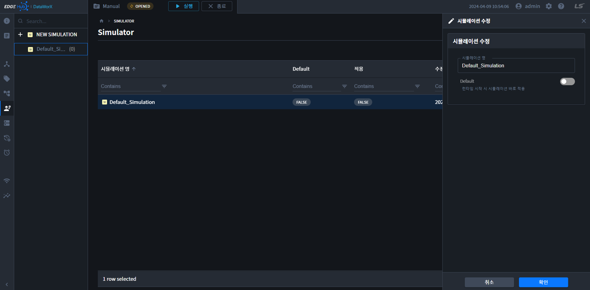

    - `시뮬레이션명`: 시뮬레이션 명을 입력합니다.  
    - `Default`: 런타임 시작 시, 시뮬레이션을 바로 적용할 경우 체크합니다. 시뮬레이터중 1개만 체크 가능합니다.

3. 확인 버튼을 누르고, 설정을 저장합니다.

## 시뮬레이터 삭제  
1. 시뮬레이터 삭제는 `테이블 더보기` 또는 테이블 리스트를 `복수개 선택` 후, 상단의 `삭제` 버튼을 클릭합니다.

    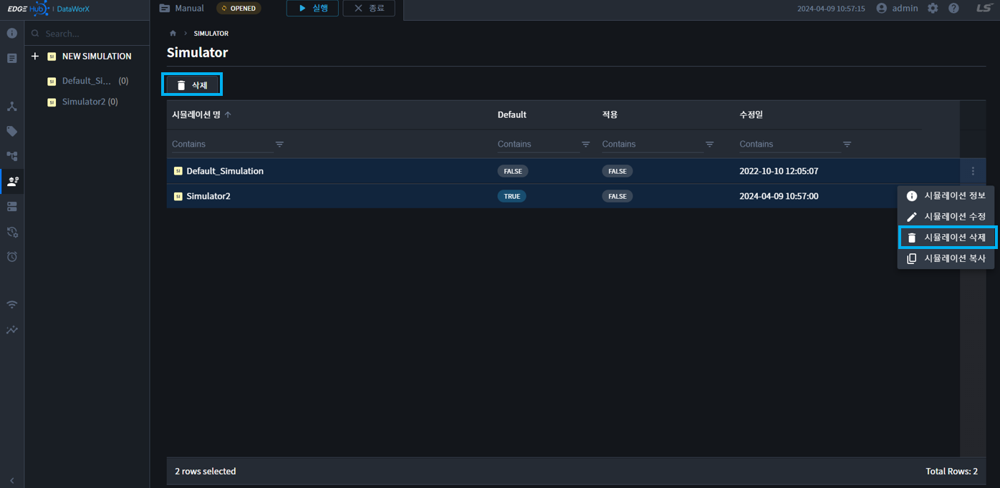

2. 버튼을 클릭하면 가운데에 확인 모달이 표시됩니다.

    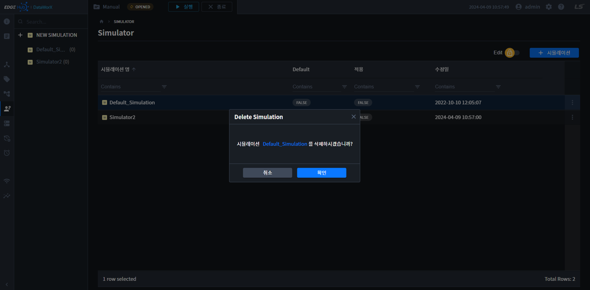

3. 확인 버튼을 누르면, 시뮬레이터가 삭제됩니다.

## 시뮬레이터 복사  
시뮬레이션 복사는, 기존 설정을 복사하여 새로 만들때 사용합니다. 시뮬레이션 설정정보가 함께 복사됩니다. 

1. 시뮬레이터 복제는 `테이블 더보기`에서 시뮬레이션 복사 버튼을 클릭합니다.

    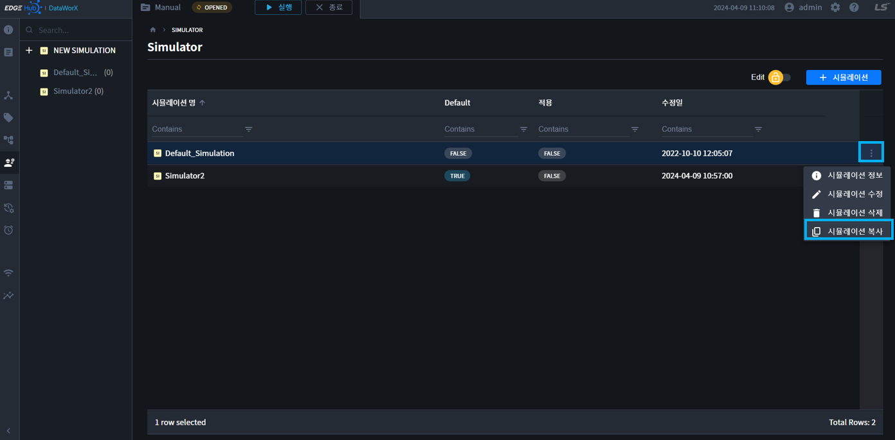

2. 버튼을 클릭하면, 가운데에 설정 모달이 표시됩니다. 이름과 Default를 설정하여 복사합니다.

    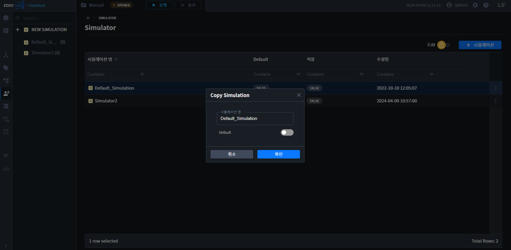

3. 확인 버튼을 누르면, 시뮬레이터가 복사됩니다.

## 시뮬레이터 적용/해제
`Project Running` 상태에서만, 활성화되는 버튼입니다. Run 상태에서 `시뮬레이터를 적용/해제` 할 수 있습니다.

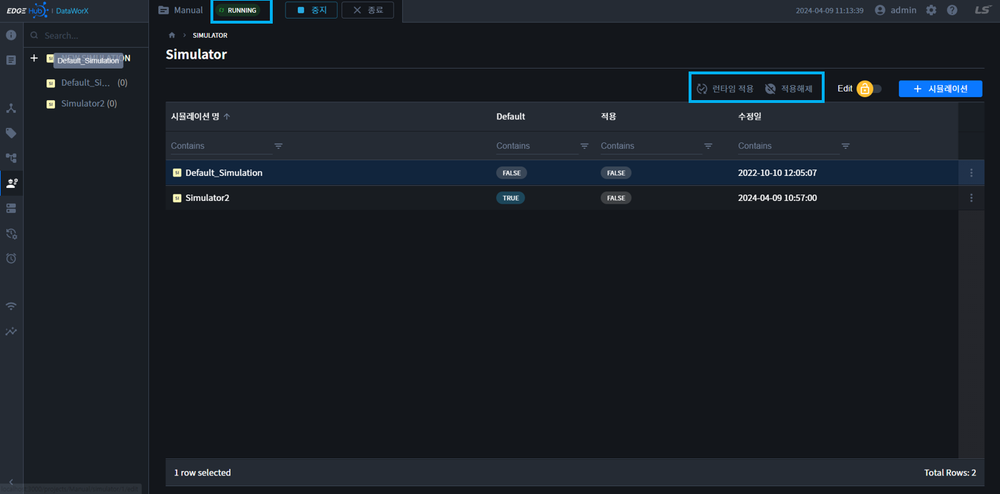
