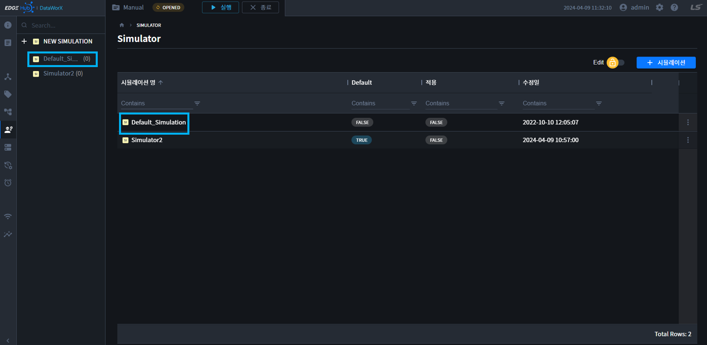
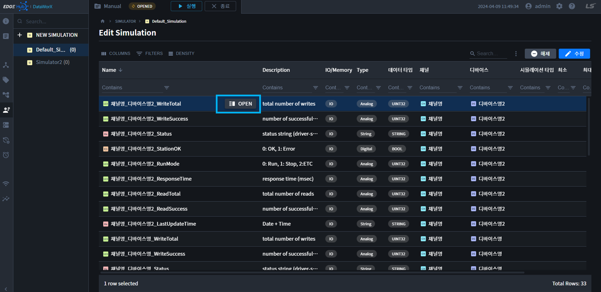
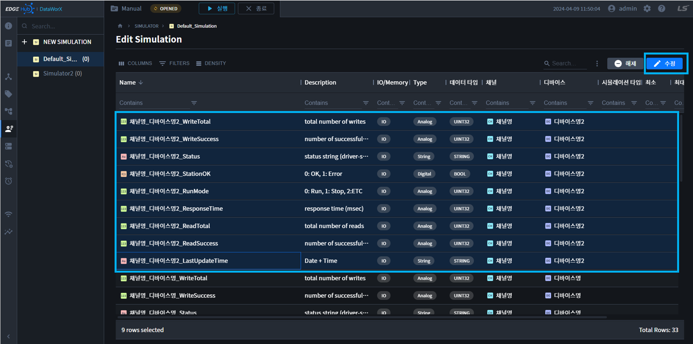
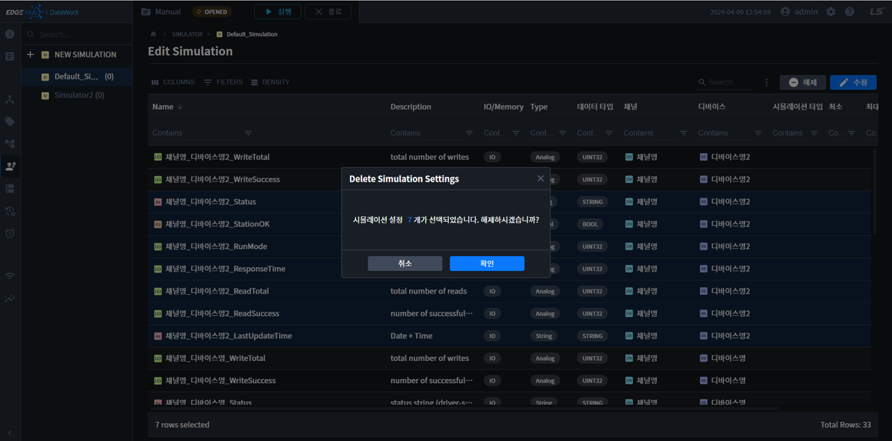

{: .no_toc }
# 시뮬레이터 설정
시뮬레이션 설정페이지는 `왼쪽 Tree의 시뮬레이션명` 클릭 또는 `테이블 셀 시뮬레이션명`을 클릭하여 이동합니다.

- TOC
{:toc}

## 시뮬레이션 속성  
시뮬레이션 속성 설명은 다음과 같습니다.

| 속성      | 설명 |
|----------|----|
|Name | 태그명이 표시됩니다.|
|Description| 태그 설명이 표시됩니다.|
|IO/Memory| 입출력태그/메모리태그를 표시합니다. |
|Type| 아날로그/디지털/스트링을 표시합니다.|
|데이터 타입 | 태그의 데이터 타입을 표시합니다.|
|채널| 태그가 속한 채널명이 표시됩니다.|
|디바이스| 태그가 속한 디바이스명이 표시됩니다.|
|시뮬레이션 타입 | 시뮬레이션 발생 규칙을 선택합니다.|
|최소| 데이터 발생시 변동영역의 하한 값을 설정합니다.|
|최대| 데이터 발생시 변동영역의 상한 값을 설정합니다.|
|초기값| 시뮬레이션 규칙이 적용될 떄, 초기시작 값을 입력합니다.|
|주기| 주기(Cycle)를 가지는 시뮬레이션 타입(사인파형,톱니파형, 삼각파형, 랜덤)의 1주기 시간을 입력합니다.|

시뮬레이션 발생 규칙(시뮬레이션 타입)
- `Analog`: 제어가능, 랜덤, 사인파형, 톱니파형, 삼각파형, XG5000
- `Digital`: 제어가능, 랜덤, Change, XG5000
- `String`: 제어가능, 랜덤
- `메모리태그`: `메모리 태그`는 위의 규칙을 따르나, `XG5000`이 제외됩니다.

## 시뮬레이션 설정 수정  
1. 시뮬레이션 개별 설정은 하기 `OPEN 버튼`을 눌러 설정합니다.  

    

2. 시뮬레이션 다중 설정은 테이블 `행을 다중선택`하고, `수정 버튼`을 클릭합니다.

    

3. 시뮬레이션 설정 또는 일괄 수정설정 창이 오른쪽에 표시됩니다.

    

4. 설정 정보를 입력하고 확인버튼을 누르면, 시뮬레이션 설정정보 저장됩니다.

{: .highlight }
`CTRL + A`로 전체 선택을 사용할 수 있습니다.  
`SHIFT + Click`으로 여러개를 선택할 수 있습니다.  
`CTRL + Click`으로 다중선택할 수 있습니다.  
`첫번째 행을 클릭` => `SHIFT + END` 로 전체선택할 수 있습니다.

## 시뮬레이션 설정 해제  
1. 시뮬레이션 해제는 테이블의 행을 선택하고, `해제 버튼`을 클릭합니다.

    

2. 시뮬레이션 해제 확인 모달이 표시됩니다.

    

3. 확인 버튼을 누르면, 시뮬레이션 설정정보가 해제됩니다.

## 시뮬레이션 적용/해제
`Project Running` 상태에서만, 활성화되는 버튼입니다. Run 상태에서 `현재 시뮬레이터를 적용/해제` 할 수 있습니다.

