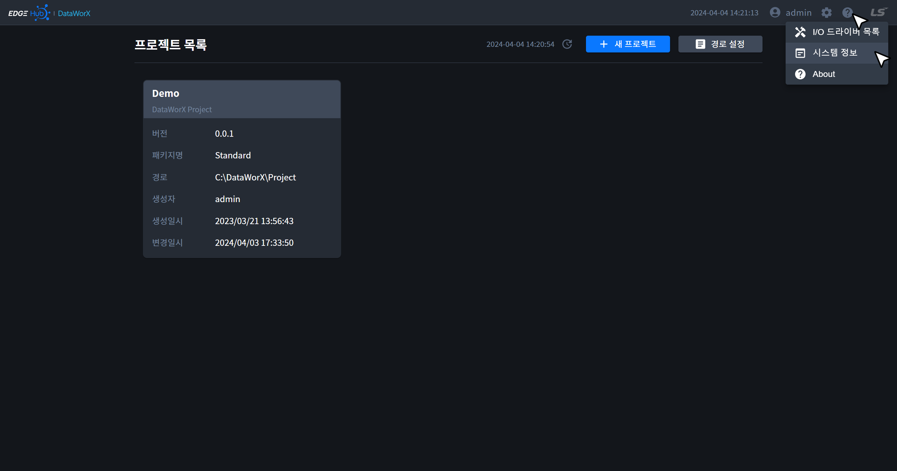
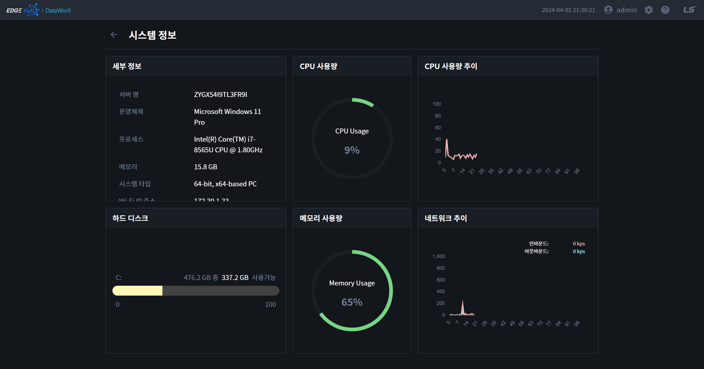

{: .no_toc }
# 시스템 정보
DataWorX가 실행되는 서버의 리소스 정보를 확인할 수 있는 페이지입니다. 애플리케이션 바를 통해 이동할 수 있습니다.

- TOC
{:toc}

## 1. 세부정보
- 서버 이름, 운영체제, CPU 종류, 메모리, 시스템 타입, IP 주소를 확인할 수 있습니다.

## 2. 하드 디스크
- 각 저장장치 별 사용량을 확인할 수 있습니다.

## 3. CPU 사용량
- CPU의 현재 사용량을 확인할 수 있습니다.

## 4. 메모리 사용량
- 메모리의 현재 사용량을 확인할 수 있습니다.

## 5. CPU 사용량 추이
- CPU의 사용량 추이를 확인할 수 있습니다.

## 6. 네트워크 추이
- 네트워크 사용량 추이를 확인할 수 있습니다.
