{: .no_toc }
# 태그 히스토리안  
로깅 관리가 필요한 주요 데이터를 사용자의 목적에 따라 데이터 로깅 모델을 생성하여 관리할 수 있습니다. 하나의 태그 데이터를 복수개의 수집모델에 할당이 가능한 구조로 되어있어 다양한 데이터 분석이 가능합니다.  

- `수집 데이터의 조회`: 트랜드, 보고서, 리스트 트랜드 등에서 데이터 조회가 가능하며, 스크립트에서 조회 가능한 API를 제공합니다.
- `자동으로 계산되는 통계/적산 데이터`: 별도의 스크립트나 어플리케이션을 사용하지 않고 통계 및 적산 데이터가 생성됩니다
- `오픈소스 데이터베이스`: 오픈소스 객체-관계형 데이터베이스 시스템인 PostgreSQL을 사용하여 사용자가 자유롭게 사용할 수 있습니다.

- TOC
{:toc}

## 1. 수집모델 종류  
태그 히스토리안 편집기에서는 런타임 기동시 이력 엔진이 수집할 수집모델을 설정할 수 있으며, 여기서 설정된 수집모델에 기반하여 데이터가 수집, 저장됩니다.

### 1.1 수집모델의 종류
수집모델의 종류는 `정주기, 통계값` 저장 그룹이 있으며, 주기적 또는 이벤트 방식으로 저장하는 수집 방법입니다.  

| 수집모델 종류     | 설명 |
|----------|----|
|정주기 | 일정한 주기마다 태그 값을 수집합니다.|
|통계값 | 설정한 태그에 대한 통계 데이터를 주기마다 생성합니다.|

수집모델의 종류에 따른 보고서 및 트랜드 등에서 조회 가능 데이터의 종류는 아래와 같습니다.  

| 수집모델 종류     | 설명 |
|----------|----|
|정주기 | 아날로그(현재값), 디지털(현재상태)|
|통계값 | 아날로그(현재값, 최소값, 최소시간, 최대값, 최대시간, 평균값), 디지털(가동 횟수, 가동 시간, 변경 횟수) |

### 1.2 정주기  
최소 수집주기는 `1초`로써 빠른 리얼타임성 `데이터 로깅`에 사용되며 주로 `트랜드` 및 `보고서`에서 순시값 조회에 사용합니다. 조회 가능한 데이터는 `현재값(아날로그)`과 `현재상태(디지털)`를 조회할 수 있습니다.  
`런타임 운전시, 정주기 수집모델은 정시`에 수집하여 저장합니다.  
예) 수집주기를 2초로 설정하였을 경우, 매 0, 2, 4초, …, 등 정시에 로깅데이터로 저장합니다.  

`수집 주기 설정`: 주기와 단위를 선택합니다. 각 단위마다 선택 가능한 주기는 다음과 같습니다.

| 단위     | 선택 가능한 주기 |
|----------|----|
|초|1, 2, 3, 4, 5, 6, 10, 12, 15, 20, 30|
|분|1, 2, 3, 4, 5, 6, 10, 12, 15, 20, 30|
|시|1, 2, 3, 4, 5, 6, 10, 12|
|일|1|

### 1.3 통계  
최소 수집주기는 `1분`으로 각종 `통계데이터를 자동연산하여 저장`합니다. 일정 기간 동안의 데이터 현황 파악을 위해 사용되며 주로 보고서나 트랜드에서 통계현황 조회에 사용합니다. 조회 가능한 데이터는 다음과 같습니다.  
`아날로그`: 현재값, 최소값, 최소시간, 최대값, 최대시간, 평균값  
`디지털`: 가동(On)횟수, 가동시간, 변화횟수  
`런타임 운전시`, 통계값 수집모델은 `매분 수집하여 연산하고 저장`합니다.  
예) 수집주기를 5분으로 설정하였고 현재 2분 20초인 경우, 2분 20초부터 3분까지의 데이터를 내부적으로 먼저 연산하고 저장한 뒤, 이후 4분, 5분에는 내부적으로 연산 후, 정시에 갱신합니다. 정시 5분 이후에는 새로운 데이터를 쌓기 시작합니다.  

`수집 주기 설정`: 주기와 단위를 선택합니다. 각 단위마다 선택 가능한 주기는 다음과 같습니다  

| 단위     | 선택 가능한 주기 |
|----------|----|
|분|1, 2, 3, 4, 5, 6, 10, 12, 15, 20, 30|
|시|1, 2, 3, 4, 5, 6, 8, 12|
|일|1 ~ 31|
|월| 1 ~ 12|

### 1.4 수집모델 저장기한
수집모델의 저장기한은 외부 설정 파일로 설정할 수 있습니다. `DataWorX 설치경로\Project\Project명\Config\ehTagHistorian.ini`파일을 열어보면, `MAINTAIN_SETTING` 설정이 있습니다.  
각 설정값에 의해 각각의 데이터를 얼마나 저장할지 설정할 수 있습니다.  

| 설정 키     | 수집타입 | 수집모델 단위 | 수집모델 저장기한 단위 |
|----------|----|----|----|
|PERIODIC_SEC_MAINTAIN_PERIOD|	정주기|	초|	일|
|PERIODIC_MIN_MAINTAIN_PERIOD|	정주기|	분|	월|
|PERIODIC_HOUR_MAINTAIN_PERIOD|	정주기|	시|	월|
|PERIODIC_DAY_MAINTAIN_PERIOD|	정주기|	일|	연|
|STATISTICS_1MIN_MAINTAIN_PERIOD|	통계|	분|	월|
|STATISTICS_NMIN_MAINTAIN_PERIOD|	통계|	분|	월|
|STATISTICS_HOUR_MAINTAIN_PERIOD|	통계|	시|	월|
|STATISTICS_DAY_MAINTAIN_PERIOD|	통계|	일|	연|
|STATISTICS_MONTH_MAINTAIN_PERIOD|	통계|	월|	연|

예를들어, `PERIODIC_MIN_MAINTAIN_PERIOD`의 값을 12로 설정할 시, 사용자가 설정한 모든 분단위 수집모델은 월 수로 현재 월 포함 직전 `12개월`치만 조회가 가능합니다.  
현재가 3월이라면 조회 가능한 데이터는 전년도 4월부터 3월까지의 데이터입니다. 설정값을 초과한 데이터는 별도로 저장됩니다.  

수집모델의 저장경로는 사용자가 PostgreSQL을 설치할 당시, 설정한 datadir 경로입니다. DataWorX에서는 기본적으로 `C:\DataWorX\bin\Historian\pgData`를 사용합니다.

## 2. 수집모델 설정  

DataWorX 메뉴 중, Tag Historian을 선택하면 아래와 같은 화면이 표시됩니다.  

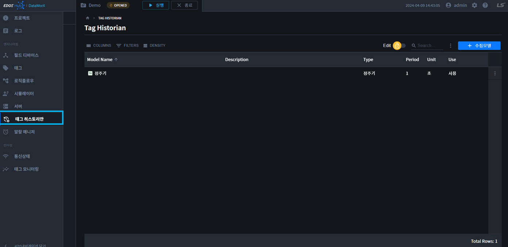

### 2.1 수집모델 속성  
`수집모델명, 설명, 수집방법, 수집주기, 단위`를 설정하며 수집모델의 `사용여부`를 설정합니다.  
수집 주기 및 단위는 `수집 방법`에 따라 입력 가능한 값이 다릅니다.  

수집모델의 속성정보는 다음과 같습니다.  

| 속성 | 설명 |
|----------|----|
|수집모델명| 수집모델 이름을 입력합니다. 최대 63글자까지 입력 가능합니다.|
|설명| 수집모델에 대한 설명을 입력합니다. 최대 63글자까지 입력 가능합니다.|
|수집방법| 정주기, 통계를 선택할 수 있습니다. |
|수집주기| 데이터 수집 주기를 설정합니다. 수집모델의 종류에 따라 수집 주기의 단위가 다르게 표시됩니다.|
|단위| 데이터 수집 주기를 단위를 설정합니다. 수집모델의 종류에 따라 수집 주기의 단위가 다르게 표시됩니다.|
|사용여부| 설정한 수집 모델의 사용 여부를 설정합니다 |

### 2.2 수집모델 추가  
1. 수집모델 추가 버튼을 클릭합니다.  

    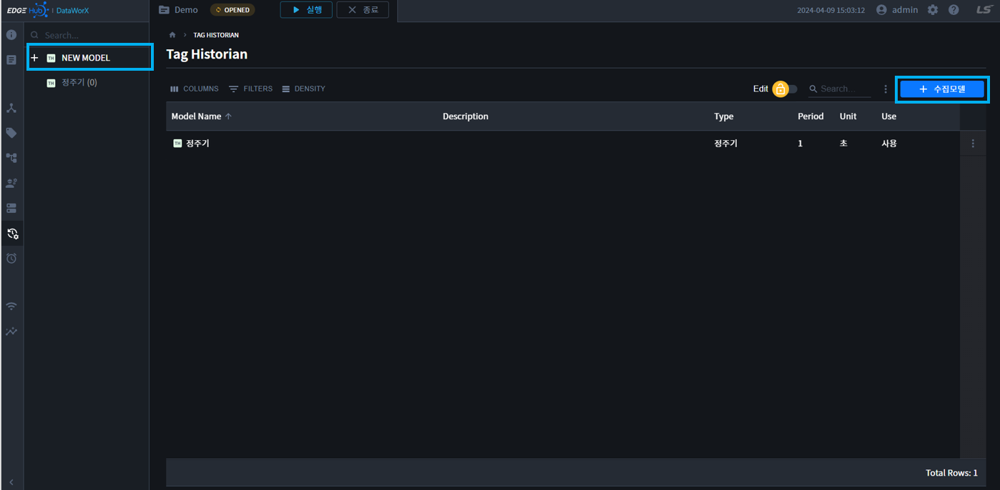

2. 수집모델 설정정보를 입력합니다.  

    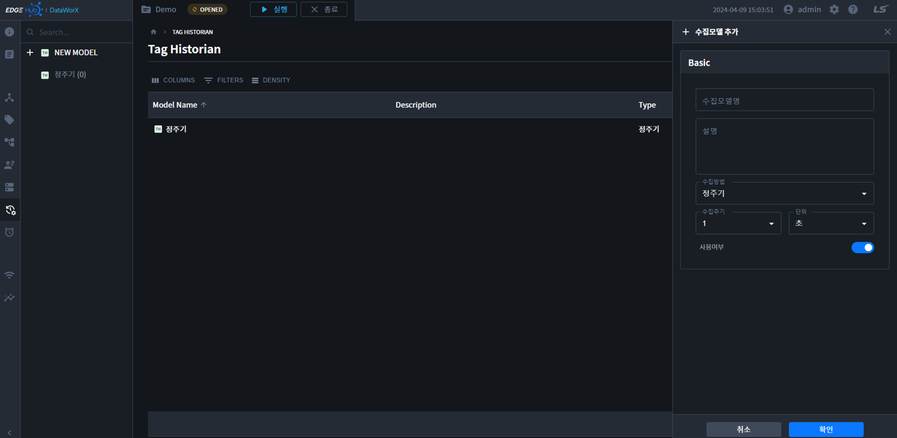

3. 확인을 누르면 수집모델이 저장됩니다.  

### 2.3 수집모델 수정
1. 수집모델 수정은 `트리 더보기` 또는 `테이블 더보기` 또는 `Toggle Edit -> OPEN`으로 열 수 있습니다.  

    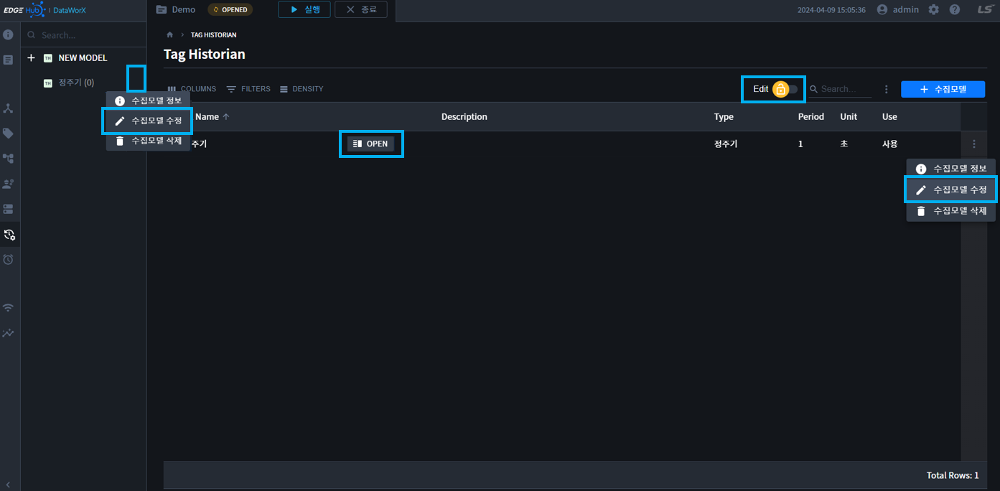

2. 수집모델 설정정보를 입력합니다.  

    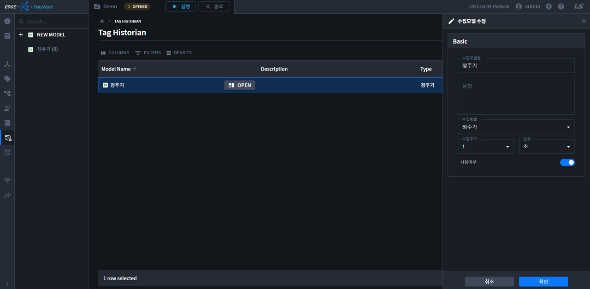

3. 확인을 누르면 수집모델이 저장됩니다.  

### 2.4 수집모델 정보  
1. 수집모델 정보는 `트리 더보기` 또는 `테이블 더보기` 또는 `Toggle Lock -> OPEN`으로 열 수 있습니다.  

    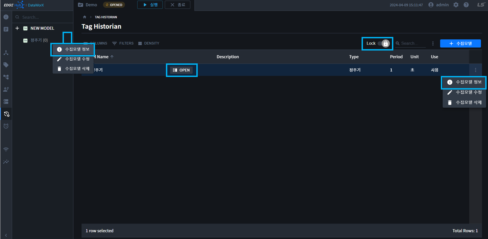

2. 수집모델 정보를 확인합니다.

    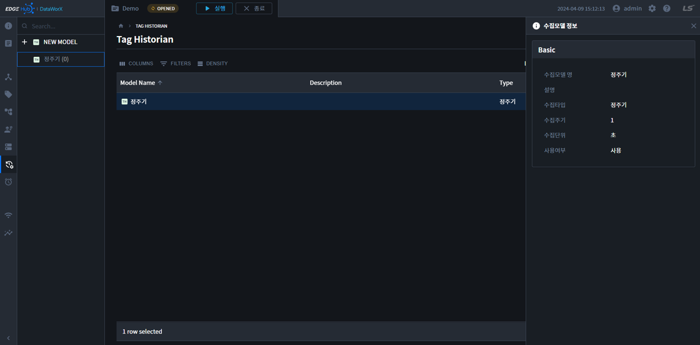

### 2.5 수집모델 삭제  
1. 수집모델 삭제는 `트리 더보기` 또는 `테이블 더보기`에서 삭제할 수 있습니다.

    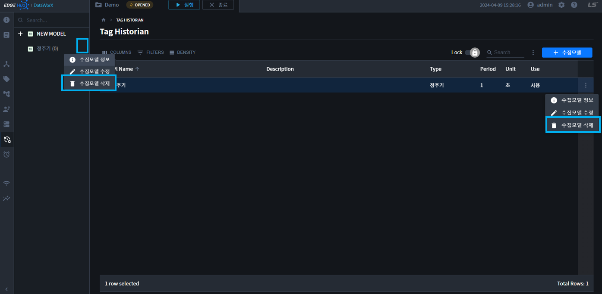

2. 버튼을 클릭하면, 삭제 확인 모달이 표시됩니다.

    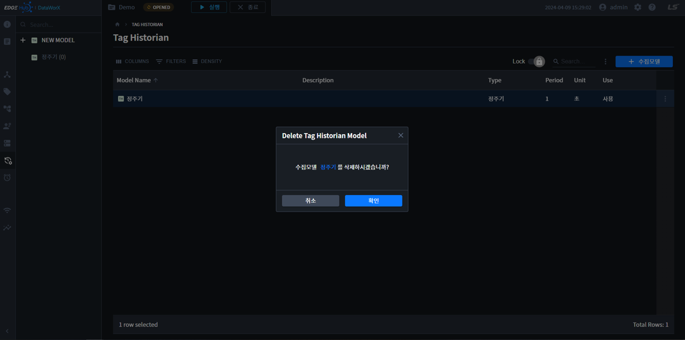

3. 확인을 누르면 수집모델이 삭제 됩니다.

## 3. 수집태그 설정  
수집모델 추가가 완료되면, 각 수집모델에 태그를 추가/삭제할 수 있습니다.  
수집태그 설정페이지는 `트리 모델명 클릭` 또는 `테이블 모델명 클릭`으로 이동할 수 있습니다.  

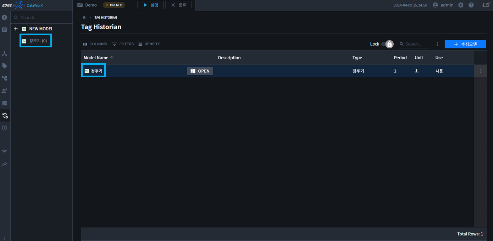

### 3.1 수집태그 추가  
1. 태그등록 버튼을 클릭합니다.

    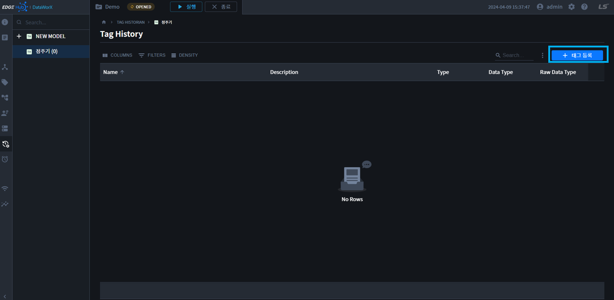

2. 태그 목록 페이지에서 등록하고 싶은 `태그들을 선택`한 후, `저장 버튼`을 클릭합니다.

    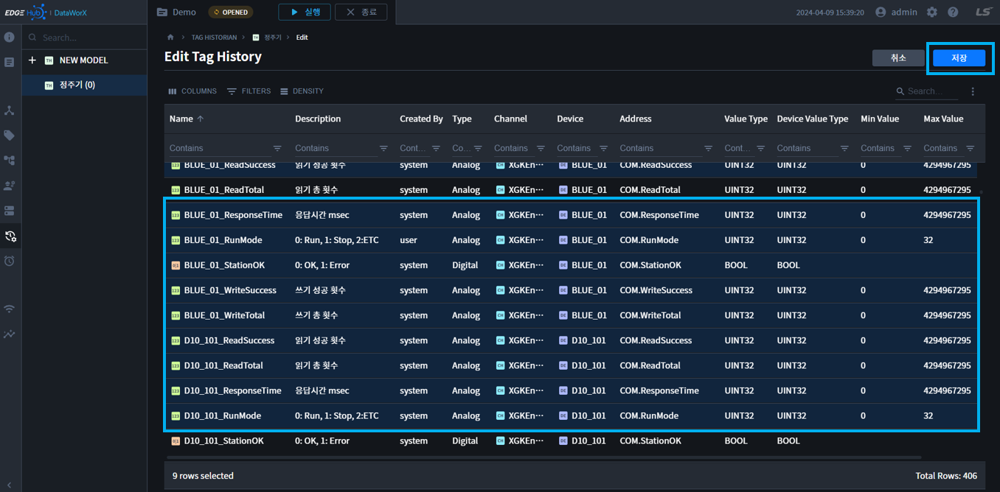

3. 태그가 등록되었음을 확인할 수 있습니다.

    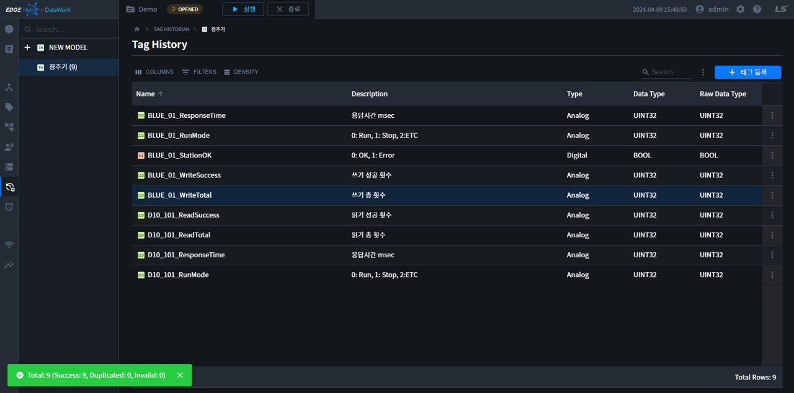

### 3.2 수집태그 삭제
1. 등록태그 삭제는 `테이블리스트 선택 + 삭제` 또는 `테이블 더보기`를 통해 삭제할 수 있습니다.  

    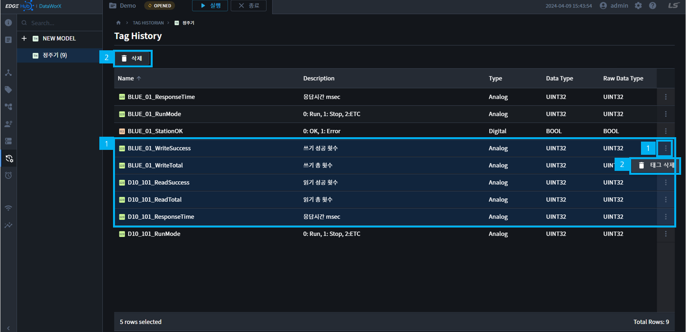

2. 버튼을 클릭하면 삭제 모달이 표시됩니다.  

    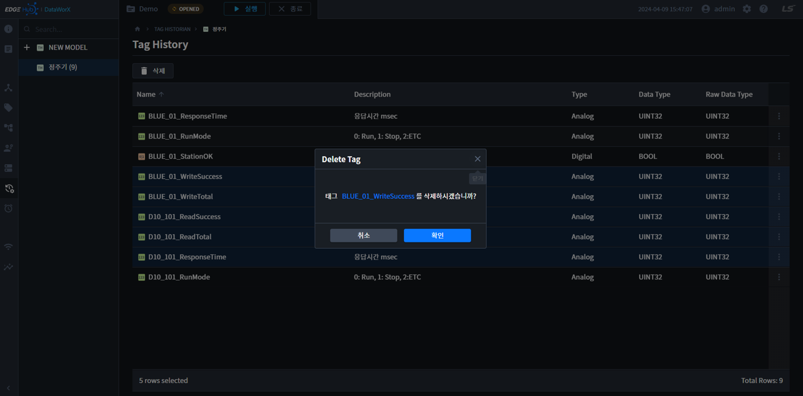

3. 확인 버튼을 클릭하면, 등록 태그가 삭제됩니다.  