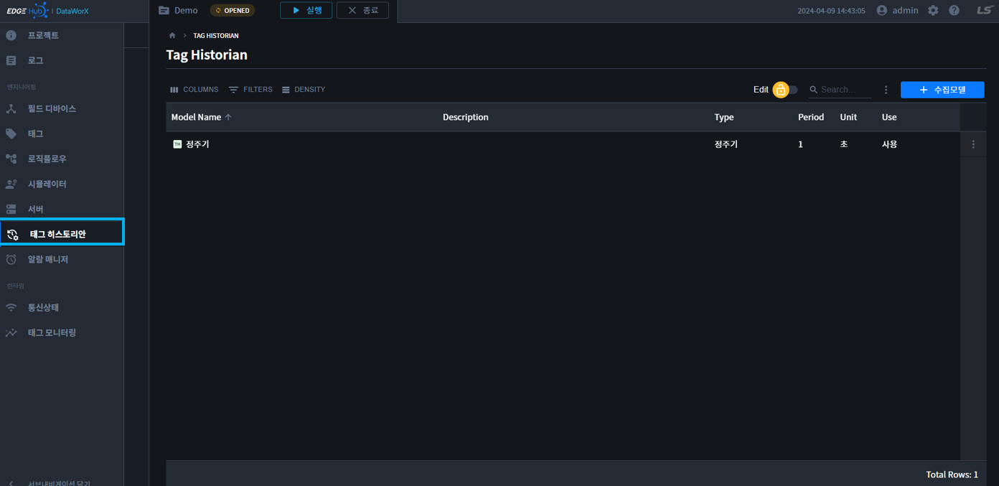
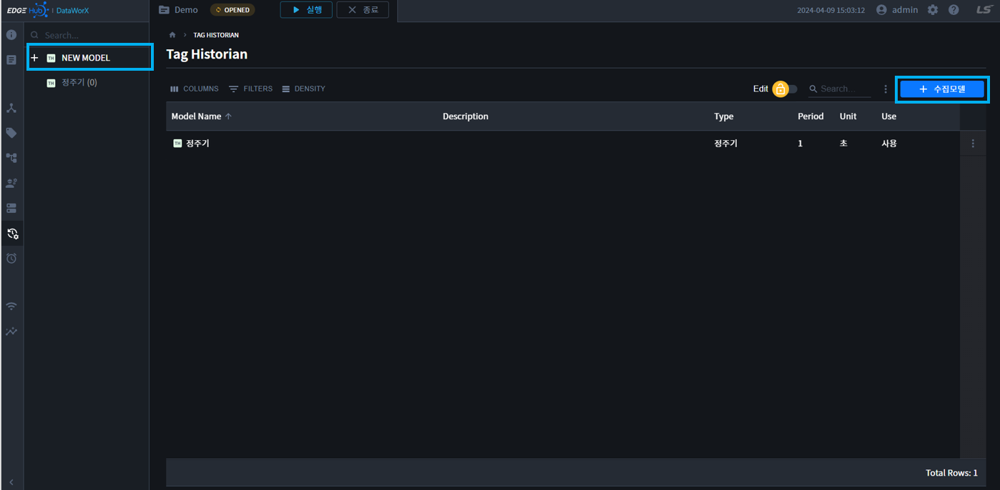
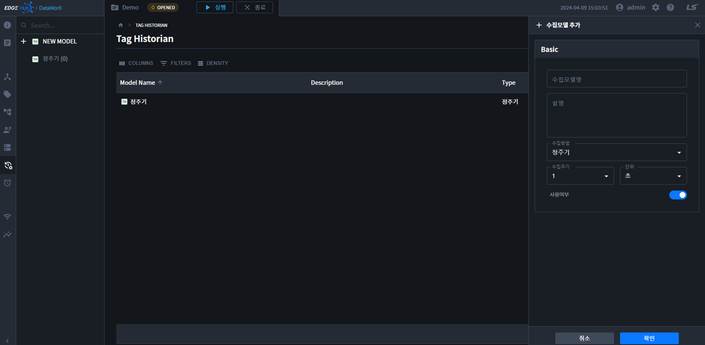
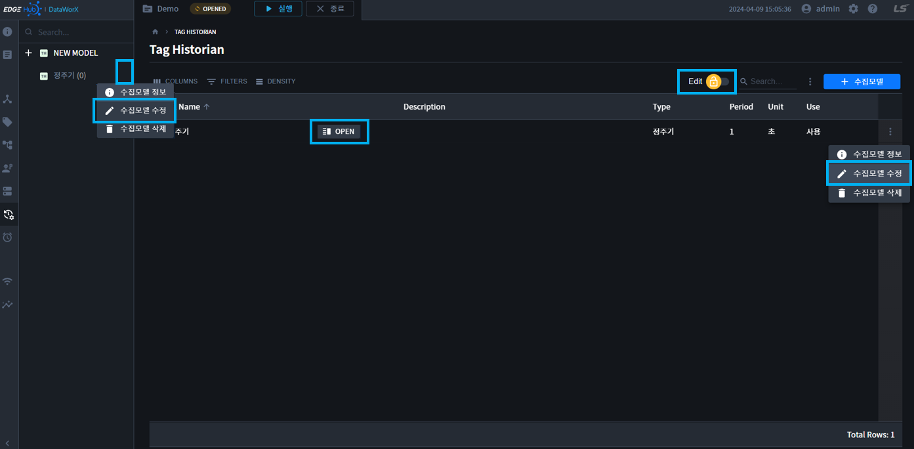
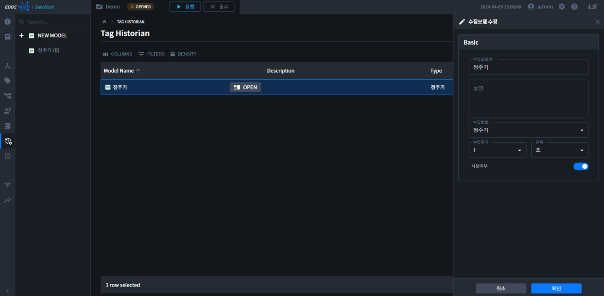
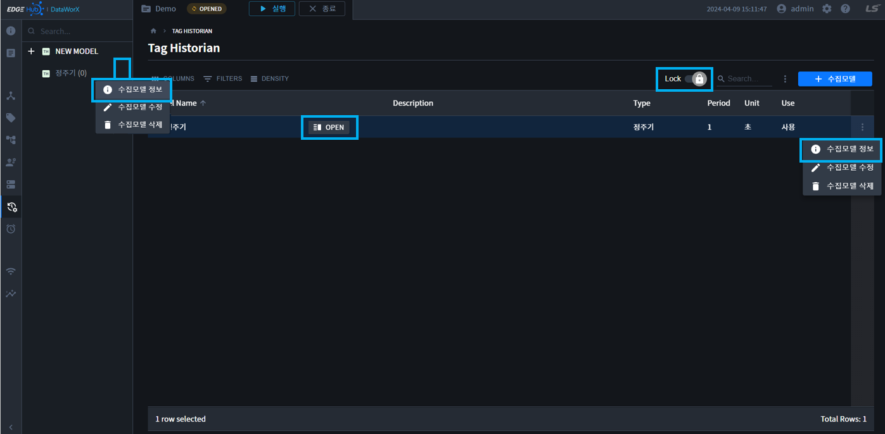
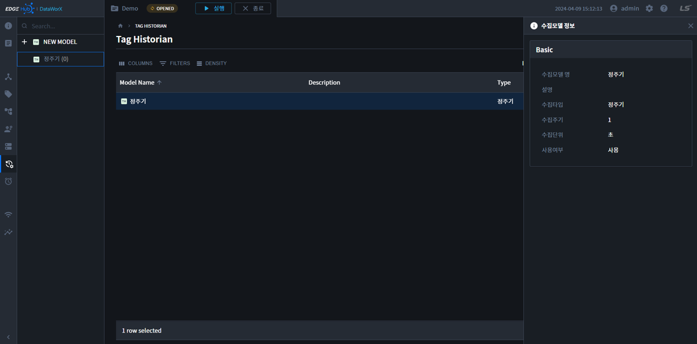
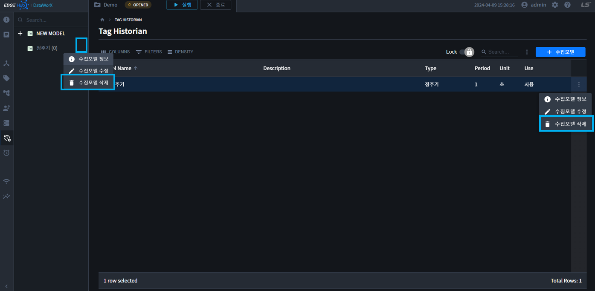
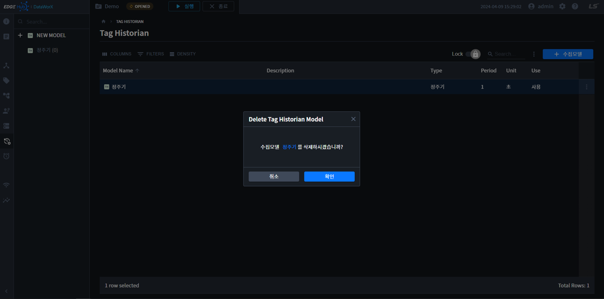

{: .no_toc }
# 수집모델 설정   
DataWorX 메뉴 중, Tag Historian을 선택하면 아래와 같은 화면이 표시됩니다.  

- TOC
{:toc}

## 수집모델 속성  
`수집모델명, 설명, 수집방법, 수집주기, 단위`를 설정하며 수집모델의 `사용여부`를 설정합니다.  
수집 주기 및 단위는 `수집 방법`에 따라 입력 가능한 값이 다릅니다.  

수집모델의 속성정보는 다음과 같습니다.  

| 속성 | 설명 |
|----------|----|
|수집모델명| 수집모델 이름을 입력합니다. 최대 63글자까지 입력 가능합니다.|
|설명| 수집모델에 대한 설명을 입력합니다. 최대 63글자까지 입력 가능합니다.|
|수집방법| 정주기, 통계를 선택할 수 있습니다. |
|수집주기| 데이터 수집 주기를 설정합니다. 수집모델의 종류에 따라 수집 주기의 단위가 다르게 표시됩니다.|
|단위| 데이터 수집 주기를 단위를 설정합니다. 수집모델의 종류에 따라 수집 주기의 단위가 다르게 표시됩니다.|
|사용여부| 설정한 수집 모델의 사용 여부를 설정합니다 |

## 수집모델 추가  
1. 수집모델 추가 버튼을 클릭합니다.  

    

2. 수집모델 설정정보를 입력합니다.  

    

3. 확인을 누르면 수집모델이 저장됩니다.  

## 수집모델 수정
1. 수집모델 수정은 `트리 더보기` 또는 `테이블 더보기` 또는 `Toggle Edit -> OPEN`으로 열 수 있습니다.  

    

2. 수집모델 설정정보를 입력합니다.  

    

3. 확인을 누르면 수집모델이 저장됩니다.  

## 수집모델 정보  
1. 수집모델 정보는 `트리 더보기` 또는 `테이블 더보기` 또는 `Toggle Lock -> OPEN`으로 열 수 있습니다.  

    

2. 수집모델 정보를 확인합니다.

    

## 수집모델 삭제  
1. 수집모델 삭제는 `트리 더보기` 또는 `테이블 더보기`에서 삭제할 수 있습니다.

    

2. 버튼을 클릭하면, 삭제 확인 모달이 표시됩니다.

    

3. 확인을 누르면 수집모델이 삭제 됩니다.

