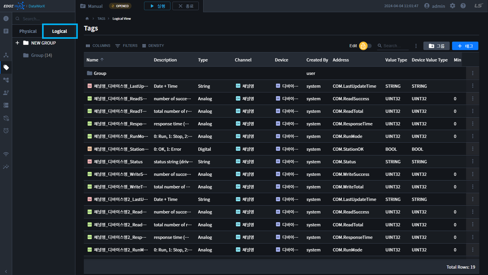
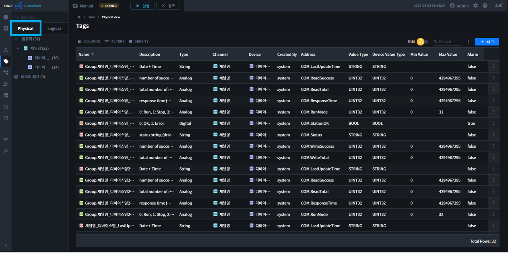

{: .no_toc }
# 태그

- TOC
{:toc}

## 1 개요  
태그 편집기는 DataWorX 시스템의 기본이 되는 태그를 등록하고 관리하는 기능을 수행하는 도구 입니다. DataWorX 시스템에서 지원하고 운영되는 모든 기능은 태그DB 에서 등록된 태그를 기반으로 하여 동작을 합니다.  
태그는 크게 현장의 기기로부터 신호를 받아 처리하게 되는 `입출력 태그`와 상위 시스템에서 필요하여 가상으로 등록하는 `메모리 태그`로 구분됩니다.  
DataWorX 에서는 태그의 정보를 속성창을 이용하여 일목요연하게 나타내며, 사용자는 손쉽게 
이를 이용하여 태그 엔지니어링 작업을 수행할 수 있습니다. 또한 Excel 파일의 입출력을 지원하여 대량의 태그 데이터를 손쉽고 빠른 시간에 등록, 관리할 수 있습니다.  

### 1.1 용어 정의  

| 용어       | 설명 |
|----------|----|
| 태그 편집기   | 엔지니어링 프로그램의 한 모듈로서 태그에 대한 각종 편집을 수행하는 모듈 입니다. |
| 아날로그 태그  | 태그의 값이 아날로그 타입인 태그를 의미하여 크게 정수형과 실수형으로 구분합니다. |
| 디지털 태그   | 태그의 값이 0 또는 1 두가지의 값을 가지는 태그 입니다. (열림/닫힘, ON/OFF) |
| 그룹    |   태그를 논리적인 계층 정보로 구성하기 위해 생성되는 가상의 태그 입니다. 탐색기의 폴더 같은 역할을 합니다. |
| 일반 태그    |  사용자가 직접 엔지니어링 하여 생성하는 모든 태그 입니다. |
| 시스템 태그   | 스테이션을 등록할 때 자동으로 생성되는 태그로서 주로 기기의 상태나 읽기 횟수 등의 기기의 고유 상태 및 운영에 관련된 태그 입니다. |
| 아날로그 알람  | 아날로그 태그에 대해서 발생하는 알람 입니다. 아날로그 태그의 값의 범위, 변화량 등에 대해 한계값을 정의한 후, 이 값을 벗어나게 되면 알람이 발생합니다. 이후 정상 범주 내에 들어올 경우 알람에 대한 해제가 발생합니다. |
| 디지털 알람   | 디지털 태그에 대해서 발생하는 알람 입니다. 디지털 태그의 값이 0, 또는 1 인경우, 변화하는 경우 등에 대해서 알람 설정을 하여 처리합니다. |
| EXCEL 파일   | MS Excel과 호환이 가능한 파일로서 태그 편집기에서 대량의 태그를 관리하기 위해서 사용합니다. |

### 1.2 태그 보기 전환

태그 편집기는 DataWorX 좌측의 메뉴 트리 항목에서 `Tag(태그)` 항목을 클릭하여 실행합니다  
태그 편집기는 보이는 형태에 따라 `그룹 태그(Logical)`와 `기기 태그(Physical)`로 보일 수 있습니다. (동일한 태그 데이터 입니다.)  

1.	그룹 태그(Logical)  
태그를 이름으로 파싱하여 논리적인 계층 구조로 보여주는 형식입니다.  
태그를 생성할 때 보여지는 논리 구조를 설계한 후 네이밍을 합니다. 부모이름을 포함한 전체 트리의 경로가 태그의 이름이 됩니다.  

{: .note }
사용자는 테이터를 등록한 태그를, 그룹화하여 태그를 관리하거나, 모니터링할 수 있습니다.  
사용자의 기호에 따라, 공장 라인별, 제품별, 특징 등으로 구분하여 관리할 수 있습니다.

2. 기기 태그(Physical)  
기기 태그는 태그의 이름과 상관없이 물리적으로 디바이스에 연결된 형태로 보여주는 형식입니다.  

## 2 태그 속성  

`태그`는 InfoU 뿐만이 아니라 상위의 DataWorX 시스템에서 현장 또는 가상의 값을 가지는 `기본적인 단위` 입니다.

{: .highlight }
✅ **태그**: 태그는 입출력태그, 메모리 태그로 구분될 수 있습니다.  
✅ **입출력 태그**: 실제 장비와 연결된 I/O 데이터는 입출력 태그로 등록할 수 있습니다.  
✅ **메모리 태그**: 사용자의 필요에 의해서 생성되는 데이터로, 메모리 태그를 등록할 수 있습니다.  
✅ **그룹**: 태그들을 관리하기 위한 폴더의 개념입니다.  

값의 종류에 따라서 `Analog, Digital, String` 태그로 구분합니다.

{: .highlight }
✅ **Analog**: 태그의 등록되는 데이터가 숫자(INT, UINT, FLOAT, DOUBLE) 등 일떄 사용됩니다.  
✅ **Digital**: 0 또는 1의 디지털 값을 가지는 경우 사용됩니다.  
✅ **String**: 문자열 데이터를 값으로 가지는 경우 사용됩니다.  

태그는 여러 속성을 가지고 있으며, 각 속성에 따라서 정의할 수 있는 항목이 한정되어 있습니다. 본 항목에서는 태그의 구분별 속성을 분류하고, 각 속성의 의미를 정의하였습니다.
아래 그림은 태그 속성창의 한 예 입니다.

태그의 속성은 크게 `공통 항목, 일반, 상세, 알람, 연산식, 태그 이벤트`의 6가지로 구분될 수 있습니다. 
`상세 탭`과 `알람 탭`은 태그 타입에 따라서 정의할 수 있는 속성이 다릅니다
그림에 보이듯이 태그의 구분에 따라서 설정 불가능한 항목은 설정에서 사라지며, 플래그에 따라 해당 속성그룹 탭이 보여지고 안보여짐을 반복합니다

### 2.1 속성 그룹  

다음은 각 속성 그룹 탭에 대한 설명입니다

### 2.1 속성  

## 3 태그 관리  
태그 리스트 위의 다음과 같은 메뉴를 통해서 태그를 추가 혹은 삭제가 가능합니다