{: .no_toc }
# 태그

- TOC
{:toc}

## 1 개요  
태그 편집기는 DataWorX 시스템의 기본이 되는 태그를 등록하고 관리하는 기능을 수행하는 도구 입니다. DataWorX 시스템에서 지원하고 운영되는 모든 기능은 태그DB 에서 등록된 태그를 기반으로 하여 동작을 합니다.  
태그는 크게 현장의 기기로부터 신호를 받아 처리하게 되는 `입출력 태그`와 상위 시스템에서 필요하여 가상으로 등록하는 `메모리 태그`로 구분됩니다.  
DataWorX 에서는 태그의 정보를 속성창을 이용하여 일목요연하게 나타내며, 사용자는 손쉽게 
이를 이용하여 태그 엔지니어링 작업을 수행할 수 있습니다. 또한 Excel 파일의 입출력을 지원하여 대량의 태그 데이터를 손쉽고 빠른 시간에 등록, 관리할 수 있습니다.  

### 1.1 용어 정의  

| 용어       | 설명 |
|----------|----|
| 태그 편집기   | 엔지니어링 프로그램의 한 모듈로서 태그에 대한 각종 편집을 수행하는 모듈 입니다. |
| 아날로그 태그  | 태그의 값이 아날로그 타입인 태그를 의미하여 크게 정수형과 실수형으로 구분합니다. |
| 디지털 태그   | 태그의 값이 0 또는 1 두가지의 값을 가지는 태그 입니다. (열림/닫힘, ON/OFF) |
| 그룹    |   태그를 논리적인 계층 정보로 구성하기 위해 생성되는 가상의 태그 입니다. 탐색기의 폴더 같은 역할을 합니다. |
| 일반 태그    |  사용자가 직접 엔지니어링 하여 생성하는 모든 태그 입니다. |
| 시스템 태그   | 스테이션을 등록할 때 자동으로 생성되는 태그로서 주로 기기의 상태나 읽기 횟수 등의 기기의 고유 상태 및 운영에 관련된 태그 입니다. |
| 아날로그 알람  | 아날로그 태그에 대해서 발생하는 알람 입니다. 아날로그 태그의 값의 범위, 변화량 등에 대해 한계값을 정의한 후, 이 값을 벗어나게 되면 알람이 발생합니다. 이후 정상 범주 내에 들어올 경우 알람에 대한 해제가 발생합니다. |
| 디지털 알람   | 디지털 태그에 대해서 발생하는 알람 입니다. 디지털 태그의 값이 0, 또는 1 인경우, 변화하는 경우 등에 대해서 알람 설정을 하여 처리합니다. |
| EXCEL 파일   | MS Excel과 호환이 가능한 파일로서 태그 편집기에서 대량의 태그를 관리하기 위해서 사용합니다. |

### 1.2 태그 보기 전환

태그 편집기는 DataWorX 좌측의 메뉴 트리 항목에서 `Tag(태그)` 항목을 클릭하여 실행합니다  
태그 편집기는 보이는 형태에 따라 `그룹 태그(Logical)`와 `기기 태그(Physical)`로 보일 수 있습니다. (동일한 태그 데이터 입니다.)  

1.	그룹 태그(Logical)  
태그를 이름으로 파싱하여 논리적인 계층 구조로 보여주는 형식입니다.  
태그를 생성할 때 보여지는 논리 구조를 설계한 후 네이밍을 합니다. 부모이름을 포함한 전체 트리의 경로가 태그의 이름이 됩니다.  
태그명을 “.” 단위로 구분하여 표현되는 트리구조로, 예를들어 태그명이 A.B.C인 경우, 그룹태그가 A, A.B 두개 생기고, A.B.C라는 일반 태그가 생성됩니다.

{: .note }
사용자는 테이터를 등록한 태그를, 그룹화하여 태그를 관리하거나, 모니터링할 수 있습니다.  
사용자의 기호에 따라, 공장 라인별, 제품별, 특징 등으로 구분하여 관리할 수 있습니다.

2. 기기 태그(Physical)  
기기 태그는 태그의 이름과 상관없이 물리적으로 디바이스에 연결된 형태로 보여주는 형식입니다.  

## 2 태그 속성  

`태그`는 InfoU 뿐만이 아니라 상위의 DataWorX 시스템에서 현장 또는 가상의 값을 가지는 `기본적인 단위` 입니다.

{: .highlight }
✅ **태그**: 태그는 입출력태그, 메모리 태그로 구분될 수 있습니다.  
✅ **입출력 태그**: 실제 장비와 연결된 I/O 데이터는 입출력 태그로 등록할 수 있습니다.  
✅ **메모리 태그**: 사용자의 필요에 의해서 생성되는 데이터로, 메모리 태그를 등록할 수 있습니다.  
✅ **그룹**: 태그들을 관리하기 위한 폴더의 개념입니다.  

값의 종류에 따라서 `Analog, Digital, String` 태그로 구분합니다.

{: .highlight }
✅ **Analog**: 태그의 등록되는 데이터가 숫자(INT, UINT, FLOAT, DOUBLE) 등 일떄 사용됩니다.  
✅ **Digital**: 0 또는 1의 디지털 값을 가지는 경우 사용됩니다.  
✅ **String**: 문자열 데이터를 값으로 가지는 경우 사용됩니다.  

태그는 여러 속성을 가지고 있으며, 각 속성에 따라서 정의할 수 있는 항목이 한정되어 있습니다. 본 항목에서는 태그의 구분별 속성을 분류하고, 각 속성의 의미를 정의하였습니다.
아래 그림은 태그 속성창의 한 예 입니다.

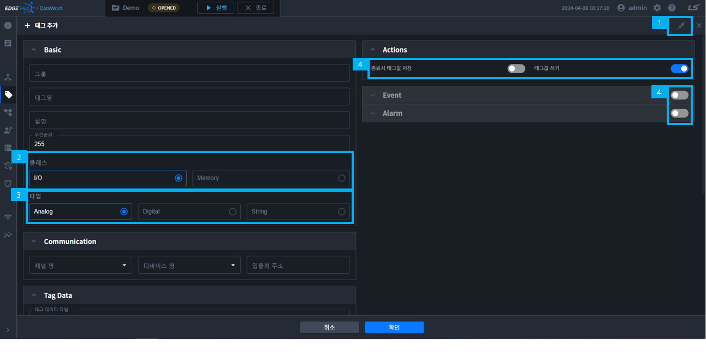

{: .highlight }
✅ **1.Size 버튼**: 사이즈 조절 버튼을 통하여, 태그 설정창 크기를 조절할 수 있습니다.  
✅ **2.클래스**: `I/O 태그`인지, `Memory 태그`인지 선택합니다. 해당 선택에 따라 설정항목이 달라집니다.  
✅ **3.타입**: 데이터 타입을 `Analog, Digital, String` 중 선택합니다. 해당 선택에 따라 설정항목이 달라집니다.  
✅ **4.토글 버튼**: 토글버튼을 On으로 변경하면, 해당 설정이 적용되거나, 추가 설정항목이 표시됩니다.  

태그의 속성은 크게 `공통 항목(Basic), 클래스, 타입, Communication, Tag Data, Raw Data, Transform, Actions, Event, Alarm, Operaion`의 11가지로 구분될 수 있습니다.   
`클래스`와 `타입`에 따라서 정의할 수 있는 속성이 다릅니다
그림에 보이듯이 태그의 구분에 따라서 설정 불가능한 항목은 설정에서 사라지며, 플래그에 따라 해당 속성그룹 탭이 보여지고 안보여짐을 반복합니다

### 2.1 속성 그룹  

다음은 각 속성 그룹 탭에 대한 설명입니다

| 속성 구분       | 설명 |
|----------|----|
| 공통(Basic)   | 태그가 공통으로 가져야 할 속성 |
| 클래스  |태그가 실제 기기에 연결되어 수집되는 태그인지, 엔지니어링 및 편의를 위해 가상으로 생성된 태그인지를 구분합니다. |
| 클래스 - I/O(입출력 태그)  | 실제 기기에 연결되어 있는 태그인 경우에 선택합니다. |
| 클래스 - Memory(메모리 태그) | 논리적으로만 사용되는 태그인 경우에 선택합니다. |
| 타입  | 태그 값의 종류를 구분합니다. |
| 타입 - Analog  | 태그 타입이 Analog 인 경우의 Analog 값 관련된 설정 가능한 속성 |
| 타입 - Digital  | 태그 타입이 Digital 인 경우의 Digital 값 관련된 설정 가능한 속성 |
| 타입 - String  | 태그 타입이 String 인 경우의 String 값 관련된 설정 가능한 속성 |
| Communication(입출력주소)  | 해당 스테이션 내의 실제적인 태그의 통신 주소를 입력합니다.  I/O(입출력 태그)일 때 사용합니다. |
| Tag Data(공업치 데이터) | 상위 시스템에서 보는 태그의 공업치 값에 대한 타입 입니다. |
| Raw Data(장비 데이터) | 기기에서 수집하는 태그값의 타입 입니다. |
| Actions | 데이터 설정 중, 플래그에 관련된 속성 |
| Event | 태그의 알람 조건이나 값의 조건에 따라 트리거를 발생하는 속성 |
| Alarm | 알람 설정에 관련된 속성. `Analog, Digital`에서 사용가능 합니다. |
| Operation | 연산식에 관련된 속성, `Memory(Aanlog, Digital)`에서 사용가능합니다. |

### 2.1 속성  

| 구분       | 속성 | 설명 |
|----------|----|----|
| 공통(Basic)  | 그룹 | 태그를 논리적인 그룹으로 관리하기 위한 이름입니다 |
| | 태그이름 | 태그에 대한 이름입니다. 프로젝트 내에서 고유한 값을 갖습니다. 다음을 제외한 키보드 입력 특수문자를 사용할 수 없습니다. # $ [ ] _ { } - |
|  | 설명 | 태그에 대한 설명입니다. |
|  | 우선순위 |태그에 대한 우선순위를 지정합니다.1:가장높음, 255:가장낮음 |
|  | 클래스(Class) | 태그가 실제 기기에 연결되어 수집되는 태그인지, 엔지니어링 및 편의를 위해 가상으로 생성된 태그인지를 구분합니다  ● I/O(입출력 태그) : 실제 기기에 연결되어 있는 태그인 경우에 선택합니다. ● Memory(메모리 태그) : 논리적으로만 사용되는 태그인 경우에 선택합니다.|
|  | 타입(Type) | 태그 값의 종류를 구분합니다.값의 특성에 따라 `Analog / Digital / String` 으로 나누어 집니다.  ● Analog : 아날로그 값을 가지는 경우에 선택합니다. ● Digital : 0 또는 1의 디지털 값을 가지는 경우에 선택합니다. ● String : 문자열 값을 가지는 경우에 선택합니다 |
| Communication(장비정보) | 채널 명 | 채널을 선택합니다. 채널은 Local PC IP와 통신드라이버 정보 등 통신에 대한 정보가 있습니다.|
| | 디바이스 명 | 통신 채널에 속하는 하위 개념으로, PLC, Inverter 등과 같은 실제적인 기기를 선택합니다 |
| | 입출력 주소 | 해당 스테이션 내의 실제적인 태그의 통신 주소를 입력합니다 |
| Tag Data(공업치 데이터) | 태그 데이터 타입 | 상위 시스템에서 보는 태그의 공업치 값에 대한 타입 입니다. 태그 값의 처리로 인하여 순수 데이터 타입과는 약간의 차이가 있을 수 있습니다.선택 가능한 값의 종류에는 다음과 같은 것이 있습니다. ●INT8: 부호있는 8 비트 정수  (-128 ~ 127) ●INT16	: 부호있는 16 비트 정수 (-32.768 ~ 32.767) ●INT32: 부호있는 32 비트 정수 (-2,147,438,648 ~ 2,147,483,647) ●UINT8: 부호없는 8 비트 정수 (0 ~ 255) ●UINT16: 부호없는 16 비트 정수 (0 ~ 65535) ●UINT32	: 부호없는 32 비트 정수 (0 ~ 4,294,967,295) ●FLOAT: 4바이트 실수 (-3.4028e+38 ~ 3.4028e+38) ●DOUBLE	: 8바이트 실수 (-1.797693e+308 ~ 1.797693e+308) **[주의]** 상위 시스템에서 태그의 데이터 타입으로 실수형을 사용할 때에는 FLOAT  타입 보다는 DOUBLE 타입을 쓰는 것이 값의 정밀도를 높일수 있어 오차를 줄일 수 있습니다.|
| | 태그 데이터 최솟값 | 태그의 공업치 값에 대한 최솟값 입니다 |
| | 태그 데이터 최댓값 | 태그의 공업치 값에 대한 최댓값 입니다 |
| | 소수점 자리 | 데이터 타입이 `Double` 또는 `Float`일 경우 소수점 이하 자리수를 표시합니다 |
| | 데드밴드 | 태그의 값이 미세하게 흔들리는 경우, 불감대 영역 범위를 설정하여 태그 값의 미세 변화를 무시할 수 있습니다 |
| | 단위 | 공업치 값에 대한 단위 입니다. |
| | 초기값 | 프로젝트 기동시 태그가 가지는 초기값 입니다. 메모리 태그의 경우에만 활성화 됩니다.  단 주의할점은, 프로젝트 종료시 저장 옵션이 활성화 되면, 본 속성인 초기값은 무시가 되고, 종료시 저장된 태그의 마지막 값이 실제적인 초기값으로 동작을 하게 됩니다.|
| Raw Data(장비 데이터) | 장비값 데이터 타입 | 기기에서 수집하는 태그값의 타입 입니다.태그 값의 처리로 인하여 순수 데이터 타입과는 약간의 차이가 있을 수 있습니다.선택 가능한 값의 종류에는 다음과 같은 것이 있습니다. ●INT8: 부호있는 8 비트 정수  (-128 ~ 127) ●INT16	: 부호있는 16 비트 정수 (-32.768 ~ 32.767) ●INT32: 부호있는 32 비트 정수 (-2,147,438,648 ~ 2,147,483,647) ●INT64: 부호있는 64 비트 정수 (-9.007.199.254.740.990 ~ 9,007,199,254,740,990) ●UINT8: 부호없는 8 비트 정수 (0 ~ 255) ●UINT16: 부호없는 16 비트 정수 (0 ~ 65535) ●UINT32		: 부호없는 32 비트 정수 (0 ~ 4,294,967,295) ●UINT64		: 부호없는 64 비트 정수 (0 ~ 9,007,199,254,740,990) ●FLOAT: 4바이트 실수 (-3.4028e+38 ~ 3.4028e+38) ●DOUBLE: 8바이트 실수 (-1.797693e+308 ~ 1.797693e+308) ●BCD8: -79 ~ 79● BCD16		: -7,999 ~ 7,999 ●BCD_32: -79,999,999 ~ 79,999,999 ●BCD_64: -7.999.999.999.999.990 ~ 7.999.999.999.999.990 ●UBCD_8: 0 ~ 99 ●UBCD_16: 0 ~ 9.999 ●UBCD_32: 0 ~ 99.999.999 ●UBCD_64: 0 ~ 9.007.199.254.740.990 ●BIT1: 0 ~ 1 ●BIT2: 0 ~ 3 ●BIT3: 0 ~ 7 ●BIT4: 0 ~ 15|
| | 장비값 데이터 최솟값 | 태그의 장비 값에 대한 최솟값 입니다 |
| | 장비값 데이터 최댓값 | 태그의 장비 값에 대한 최댓값 입니다 |
| Label | On 라벨 | Digital일 때, 1인 경우 사용할 라벨 설정을 합니다. |
| | Off 라벨 | Digital일 때, 0인 경우 사용할 라벨 설정을 합니다. |
| Transform(데이터 변환) | 변환 규칙 | 장비 값을 공업치 값으로 변경할 때에 사용되는 규칙을 설정합니다.없음,` Ratio/Bias, 비율, 비율/Offset`의 네 가지 중에서 선택할 수 있습니다. ●없음: 기기값이 그대로 공업치 값으로 변환없이 적용되는 방식 ●Ratio/Bias: 기울기/절편을 이용한 변환 방식. 		  공업치값 = (Ratio X 기기값) + Bias ●비율: 기기값과 공업치 값의 최소/최대값을 이용하여 비율로 변환하는 방식 ●비율/Offset: 위의 비율값에다가 Offset을 더한 방식|
| | Ratio | 기기값에 곱할 값 입니다 |
| | Bias | 기기값에 Ratio를 곱한 값에다 더할 값 입니다 |
| | 오프셋(Offset) | 비율 변환 결과에 더할 값 입니다 |
| Actions | 종료시 태그값 저장 | 종료시의 값을 초기값으로 사용할 때에 선택합니다. |
|  | 데이터 반전  | IO 디지털 태그의 경우에 값을 반전시킵니다. |
|  | 태그값 쓰기 | 태그를 제어할 경우 선택합니다. |
| Event | 이벤트 조건 | 태그값에 대한 이벤트로서 `없음, 값 변경시, 값 증가시, 값 감소시, 조건식 `중에서 선택합니다. |
| | 조건식1 | 태그값 이벤트에서 조건식이 선택된 경우에 조건1을 입력합니다. |
| | 연산 | 조건식2와의 AND / OR 연산조건을 설정합니다. |
| | 조건식2 | 태그값 이벤트에서 조건식이 선택된 경우에 조건2을 입력합니다. |
| Alarm(알람) | 알람 이벤트 | 알람 발생시/해제시 이벤트를 발생시킵니다. |
| | 지연시간 | 알람 발생에 대한 지연시간입니다. 알람 발생시 바로 알람이 발생하는 것이 아니라 지연시간만큼 대기 후에, 그 시점의 값을 이용하여 알람을 발생시킵니다. (기본동작 비활성화)|
| | 데드밴드 | 알람에 대한 불감대 영역입니다. 데이터 값이 알람 설정값 경계에서 미세하게 변화하는 경우, 알람 불감대를 설정하여 불필요한 알람 발생을 막을 수 있습니다.|
| | 알람 레벨 | 알람 중요도 입니다. (없음, 1~10) |
| | 알람 타입 | 아날로그 태그의 경우 `경계 알람, 변화량 알람, 이격알람` 중 선택하여 사용합니다. 디지털 태그의 경우 값에 따른 알람 발생 규칙을 설정합니다. 알람 종류로는 다음과 같은 것이 있습니다. ●OFF: 태그 값이 OFF 일때 발생합니다. ●ON: 태그 값이 ON 일때 발생합니다. ●OFF->ON: 태그 값이 OFF 에서 ON 으로 변화할 때 발생합니다. ●ON->OFF: 태그 값이 ON 에서 OFF로 변화할 때 발생합니다. ●변화시: 태그 값이 변화할 때 발생합니다.|
| | 경계알람 - HH경계 | HH 알람 설정값 입니다. 이 값은 공업치 최대값을 초과할 수 없으며 HI 값보다 커야 합니다. |
| | 경계알람 - HI경계 | HI 알람 설정값 입니다. 이 값은 HH 설정값보다 작고 LO 설정값보다 커야 합니다. |
| | 경계알람 - LO경계 | LO 알람 설정값 입니다. 이 값은 HI 설정값 보다 작고 LL 설정값보다 커야 합니다. |
| | 경계알람 - LL경계 | LL 알람 설정값 입니다. 이 값은 LO 설정값보다 작고 공업치 최소값보다 커야 합니다 |
| | 변화량알람 - 변화값 | 변화 알람을 발생시킬 변화 기준값 입니다.태그의 현재값을 과거값과 비교하여 변화값 이상으로 값이 변화하는 경우 변화 알람이 발생하게 됩니다.|
| | 이격알람 - 기준값형태 | 이격 알람을 발생시키는데 기준이 되는 기준값에 대한 타입으로 절대값과 상대값 중에 선택할 수 있습니다. |
| | 이격알람 - 기준값 | 이격값 형태를 절대값으로 설정할 경우 이격 알람 발생의 기준이 되는 절대값 입니다. |
| | 이격알람 - 기준태그 | 이격값 형태를 상대값으로 설정할 경우 이격 알람 발생의 기준이 되는 태그 이름을 입력합니다. |
| | 이격알람 - 주이격값 | 주 이격 알람값 입니다. |
| | 이격알람 - 보조이격값 | 보조 이격 알람값 입니다. |
| | 발생 메시지 | 	알람 발생시 표시되는 메시지 입니다. |
| | 복구 메시지| 알람 복구시 표시되는 메시지 입니다. |
| | 사용자 지정 메시지 1 | 사용자가 편의에 따라 정의하는 메시지1 입니다. |
| | 사용자 지정 메시지 2 | 사용자가 편의에 따라 정의하는 메시지2 입니다. |
| | 사용자 지정 메시지 3 | 사용자가 편의에 따라 정의하는 메시지3 입니다. |
| | 사용자 지정 메시지 4 | 사용자가 편의에 따라 정의하는 메시지4 입니다. |
| Operation(연산식) | 연산주기 | 연산 주기를 입력합니다. 0이 기본값이며, 0으로 설정될 경우, 연산식이 관련 태그들의 전후 관계를 설정하여 이벤트 방식으로 동작합니다.양수로 설정된 경우에는 각 태그 독립적으로 정주기로 연산식을 수행합니다|
| | 연산식 | 연산식을 입력합니다 |

## 3. 태그 / 그룹 관리  
태그 리스트 위의 다음과 같은 메뉴를 통해서 태그/그룹을 추가, 수정, 복사, 삭제, 정보확인 가능합니다.
1. 추가 버튼  
  - 해당 버튼을 통해 `그룹` 또는 `태그`를 추가할 수 있습니다.   
  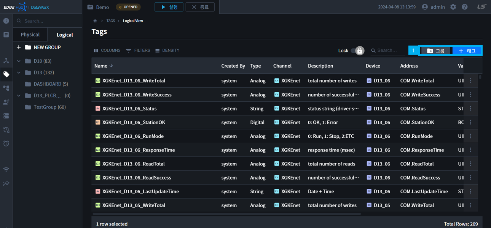

2. 테이블 더보기 버튼  
  - 더보기 메뉴에서 `정보, 수정, 삭제, 복제` 할 수 있습니다.  
  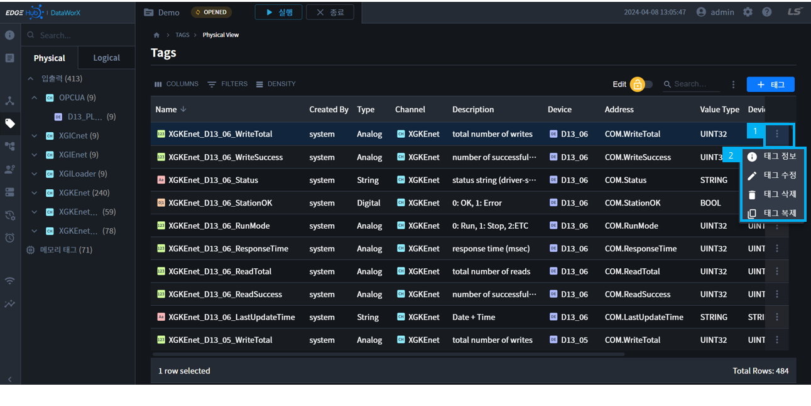

3. Toggle & OPEN  
  - Toggle이 `Edit`인 경우, `OPEN` 클릭 시, Edit창이 표시됩니다.  
  - Toggle이 `Lock`인 경우, `OPEN` 클릭 시, Info창이 표시됩니다.  
  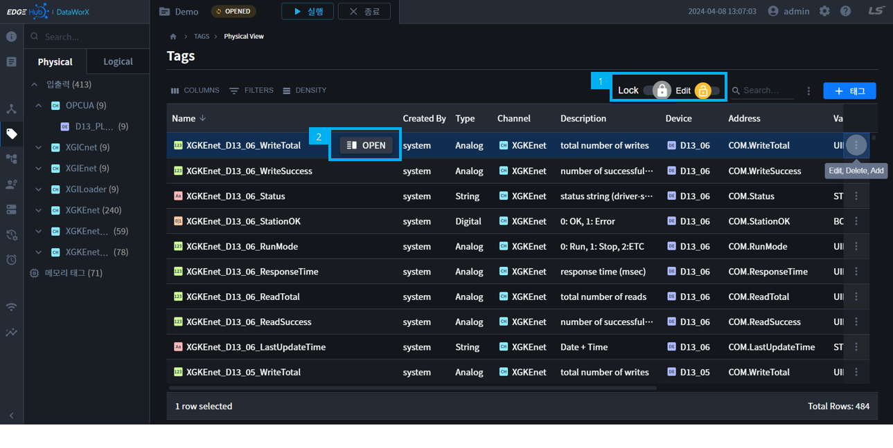

4. 트리 더보기 
  - `그룹정보, 그룹 수정, 그룹 삭제, 하위 그룹 추가, 하위 태그 추가` 사용가능 합니다.  
  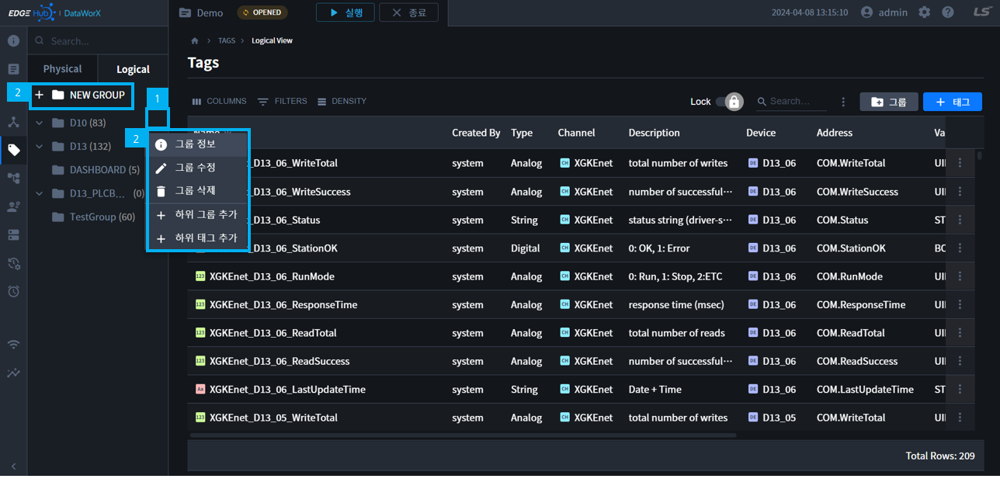

5. 리스트 삭제  
  - 복수개의 리스트를 선택하면, 삭제 버튼이 활성화 됩니다.  
  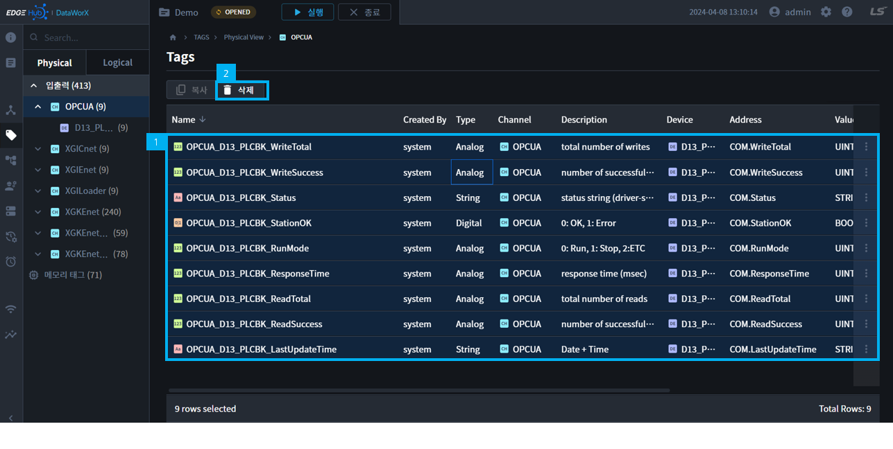

  {: .note }
  `CTRL + A`로 전체 선택을 사용할 수 있습니다.  
  `SHIFT + Click`으로 여러개를 선택할 수 있습니다.  
  `CTRL + Click`으로 다중선택할 수 있습니다.  

### 3.1 그룹 추가  
1. 그룹 `추가 버튼/데이블 더보기/트리 더보기`를 눌러 그룹을 추가할 수 있습니다.  

  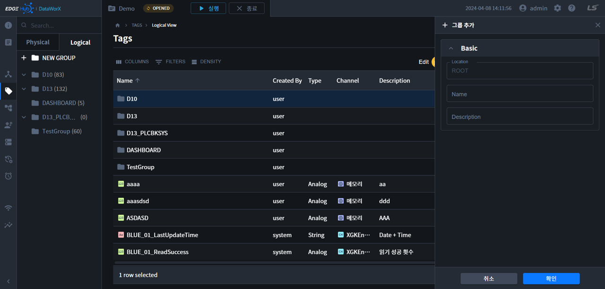

### 3.2 그룹 수정  
1. 그룹 `Toggle Edit/테이블 더보기/트리 더보기`를 눌러 그룹을 수정할 수 있습니다.  

    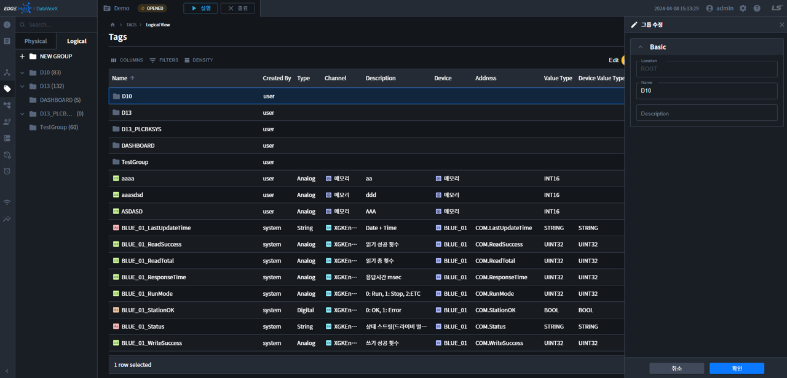

2. `확인` 버튼을 클릭하면 수정이 완료됩니다.

### 3.3 그룹 정보  
1. 그룹 `Toggle Lock/테이블 더보기/트리 더보기`를 눌러 그룹정보를 조회할 수 있습니다. 

  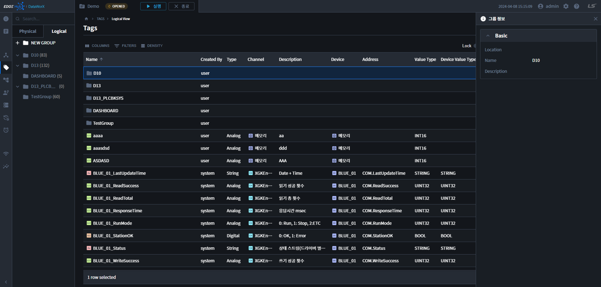

### 3.4 그룹 삭제  
1. 그룹 `리스트 삭제/데이블 더보기/트리 더보기`를 눌러 그룹을 삭제할 수 있습니다. 

2. `확인` 버튼을 클릭하면 삭제가 완료됩니다.

    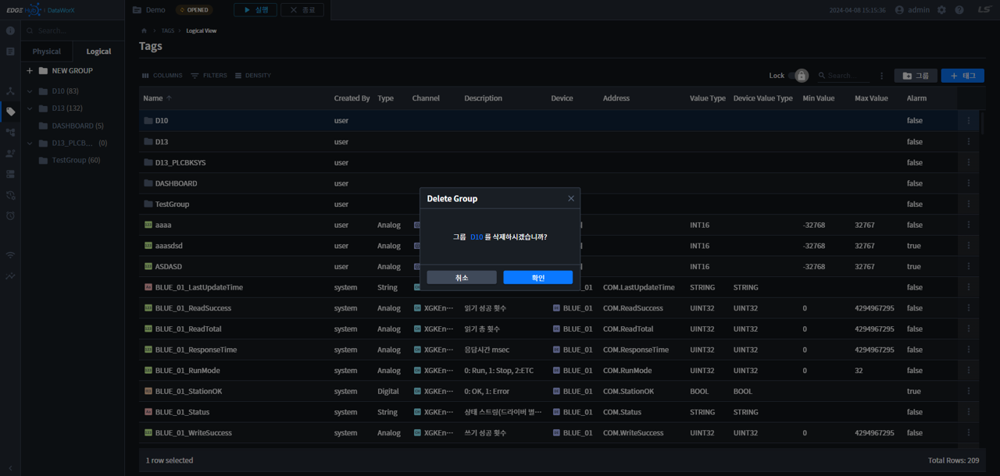

### 3.5 태그 추가  

1. 태그 `추가 버튼/데이블 더보기/트리 더보기`를 눌러 태그를 추가할 수 있습니다.  
  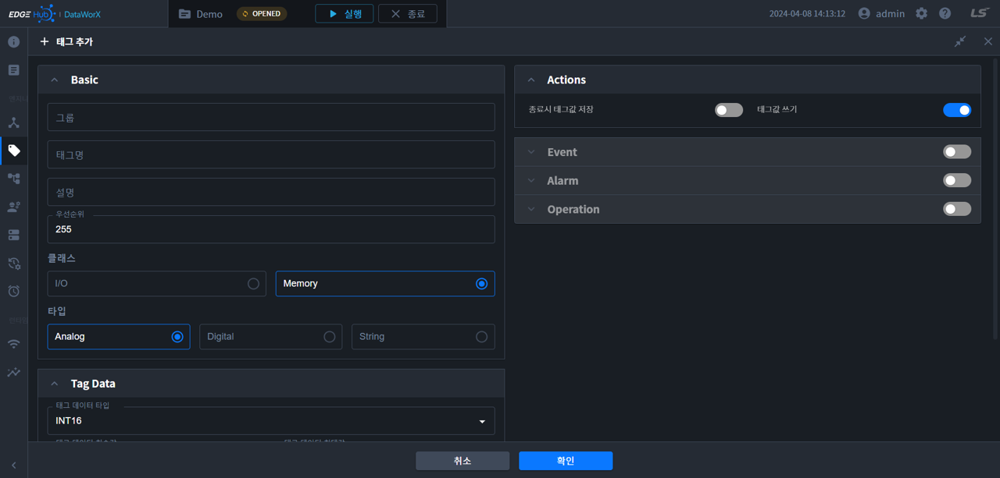  

2. 태그 타입별로 등록할 수 있습니다.  
  - Analog  
    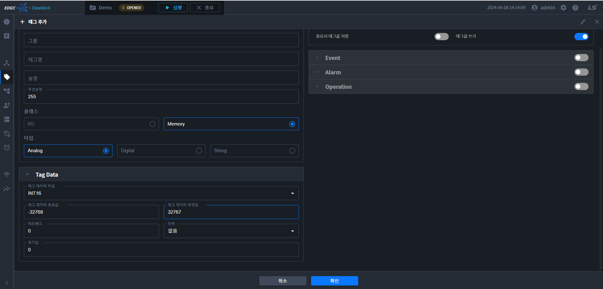  
  - Digital  
    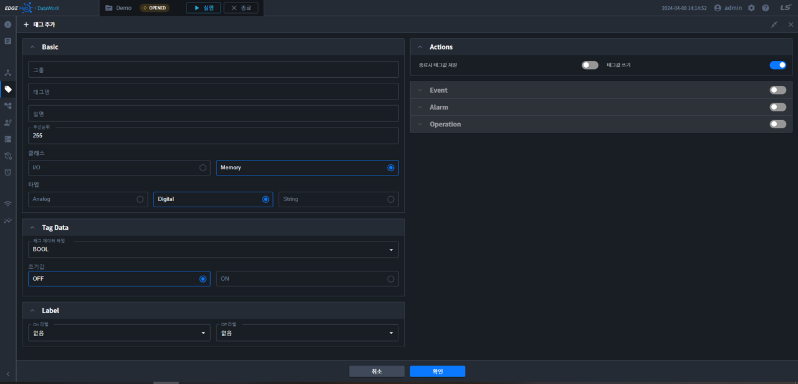  
  - String  
    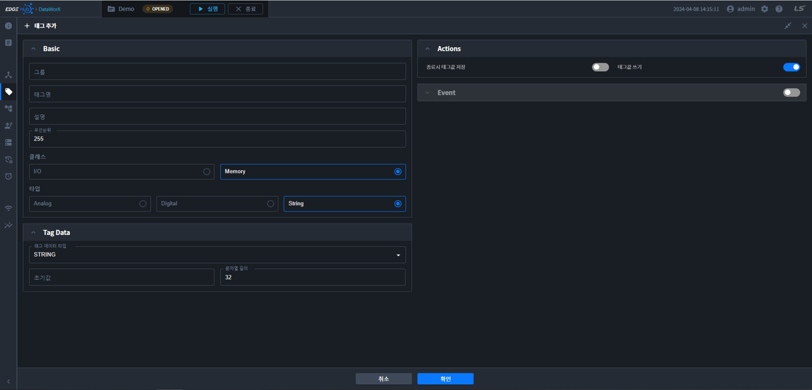  

3. Alarm Toggle 버튼을 On 하면, 하위 설정 정보가 활성화 됩니다.  
  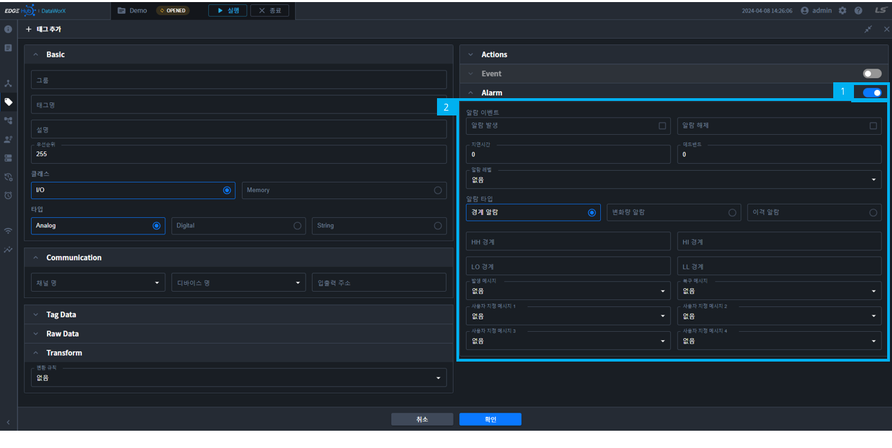  

    - 입력 제한 조건(Analog 타입 )

      | 태그 타입       | 입력가능 항목정의 |
      |----------|----|
      | 알람 이벤트 | 알람처리 플래그가 체크가 되어있어야 합니다. |
      | 지연시간 | 0이상의 숫자만 입력 가능합니다. |
      | 데드밴드 | 0이상의 숫자만 입력 가능합니다. |
      | 알람 레벨 | 선택 가능합니다. |
      | 발생 메시지 | 선택 가능합니다. |
      | 복구 메시지 | 선택 가능합니다. |
      | 사용자 지정 메시지1 | 선택 가능합니다. |
      | 사용자 지정 메시지2 | 선택 가능합니다. |
      | 사용자 지정 메시지3 | 선택 가능합니다. |
      | 사용자 지정 메시지4 | 선택 가능합니다. |
      | 경계알람 | 선택 가능합니다. |
      | HH 경계 | 숫자만 입력 가능합니다. 태그 최대값을 초과하거나, 최소값 미만일 수 없습니다. HI값이 설정되어 있는경우 HI보다 작을 수 없습니다. 태그타입이 아날로그 타입이어야 합니다.|
      | HI 경계 | 숫자만 입력 가능합니다. 태그 최대값을 초과하거나, 최소값 미만일 수 없습니다. HH값이 설정되어 있는경우 HH보다 클 수 없습니다. LO값이 설정되어 있는경우 LO값보다 작을 수 없습니다. 태그타입이 아날로그 타입이어야 합니다.|
      | LO 경계 | 숫자만 입력 가능합니다. 태그 최대값을 초과하거나, 최소값 미만일 수 없습니다. HI값이 설정되어 있는경우 HI보다 클 수 없습니다. LL값이 설정되어 있는경우 LL값보다 작을 수 없습니다. 태그타입이 아날로그 타입이어야 합니다.|
      | LL 경계 | 숫자만 입력 가능합니다. 태그 최대값을 초과하거나, 최소값 미만일 수 없습니다. LO값이 설정되어 있는경우 LO보다 클 수 없습니다. HH, HI, LO 알람값이 하나라도 존재해야 합니다. 태그타입이 아날로그 타입이어야 합니다.|
      | 변화량 알람 | Analog 타입만 설정 가능합니다. 설정은 가능하나 변화값 입력은 필수가 아닙니다.|
      | 변화값 | 0이상의 숫자만 입력 가능합니다. |
      | 이격 알람 | 선택 가능합니다. |
      | 이격 기준 | 선택 가능합니다. |
      | 기준값 | 이격 알람 선택 시 문자/숫자 포함 입력가능합니다. |
      | 주 이격값 | 1이상의 숫자만 입력 가능합니다. |
      | 보조 이격값 | 1이상의 숫자만 입력 가능합니다. 주 이격값보다 작아야 합니다. 1부터 태그 최대값까지 유효합니다.|

    - 입력 제한 조건(Digital 타입)

      | 태그 타입       | 입력가능 항목정의 |
      |----------|----|
      | 지연시간 | 0이상의 숫자만 입력 가능합니다. |
      | 데드밴드 | 0이상의 숫자만 입력 가능합니다. |
      | 알람 레벨 | 선택 가능합니다. |
      | 발생 메시지 | 선택 가능합니다. |
      | 복구 메시지 | 선택 가능합니다. |
      | 사용자 지정 메시지1 | 선택 가능합니다. |
      | 사용자 지정 메시지2 | 선택 가능합니다. |
      | 사용자 지정 메시지3 | 선택 가능합니다. |
      | 사용자 지정 메시지4 | 선택 가능합니다. |
      | 알람 타입 | 선택 가능합니다. |

4. Operation(연산식) Toggle On 하면, 하위 설정 정보가 활성화 됩니다.
  - Class가 Memory(메모리 태그)인 경우에만 설정 가능합니다.

    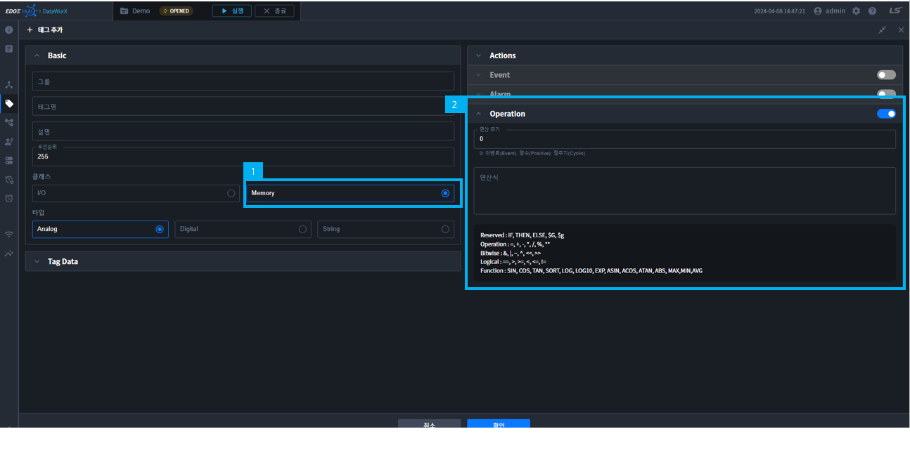  

5. Event Toggle On 하면, 하위 설정 정보가 활성화 됩니다.  
    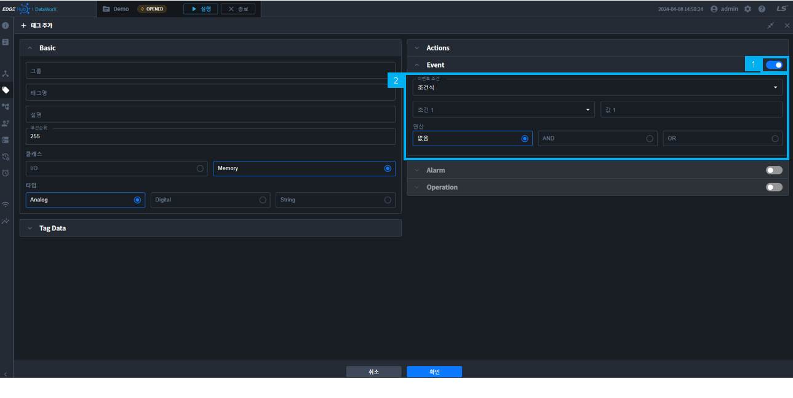  

    - 입력 제한 조건

    | 태그 타입       | 입력가능 항목정의 |
    |----------|----|
    | 조건 | 선택 가능합니다. 없음: 기본값 값 변경시: Analog/Digital/String 값 증가시: Analog/Digital 값 감소시: Analog/Digital 조건식: Analog/Digital/String|
    | 조건식1 | `조건`에서 조건식이 선택되어야 합니다.|
    | 연산자 | `조건식1`을 설정할 경우 설정 가능합니다.|
    | 조건식2 | `연산자`가 `AND, OR` 일 경우 설정 가능합니다. 콤보내용은 `조건식1`과 동일합니다. |

6. TAG 정보를 각각의 그룹별로 입력 후 `확인` 버튼을 눌러 태그 정보를 저장합니다  
  - 저장된 TAG정보는 태그관리 TREE 영역과 태그목록에 실시간 반영되어 Display 됩니다.
  - 등록된 TAG 정보는 엔지니어링에 활용되어 이후 모니터링 대상 자료로 활용됩니다.

### 3.6 태그 수정
1. 태그 `Toggle Edit/테이블 더보기/트리 더보기`를 눌러 태그를 수정할 수 있습니다.  

    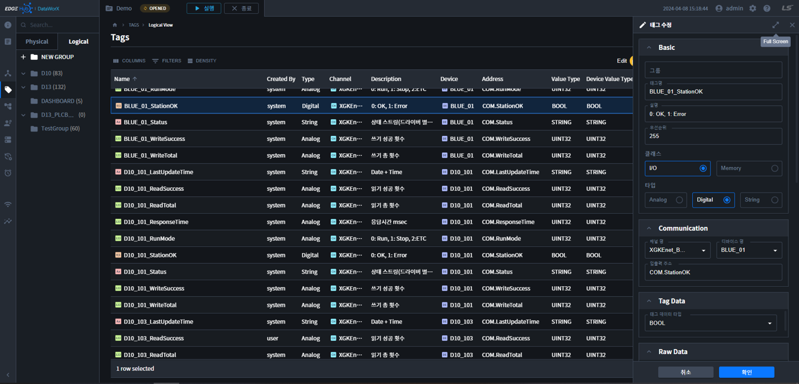

### 3.7 태그 정보
1. 태그 `Toggle Lock/테이블 더보기/트리 더보기`를 눌러 태그정보를 조회할 수 있습니다. 

    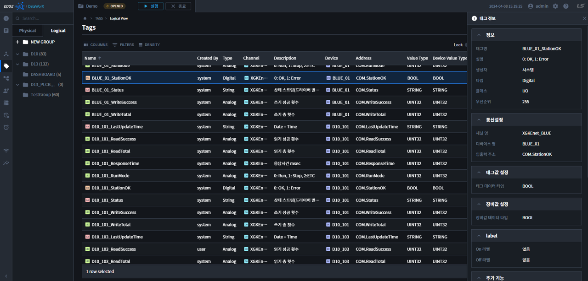

### 3.8 태그 삭제
1. 태그 `리스트 삭제/데이블 더보기/트리 더보기`를 눌러 태그를 삭제할 수 있습니다. 

    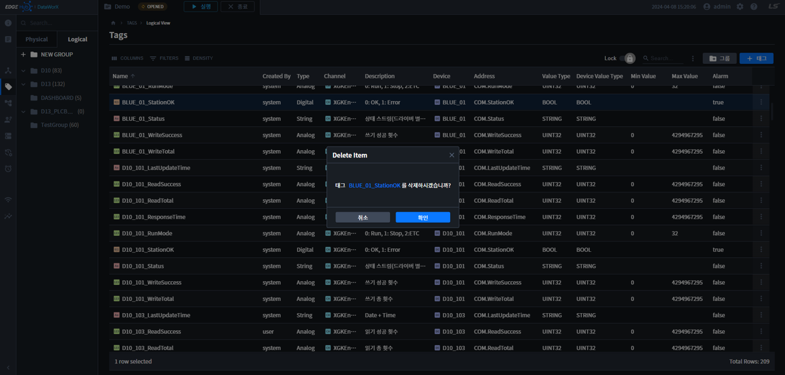

### 3.9 태그 복제
1. 태그 `테이블 더보기`에서 태그 복제 버튼을 클릭하여 태그를 복제할 수 있습니다.

2. 해당 기능을 활용하여, `기존 태그 설정정보`에서 `태그명`만 변경하여 `다른 태그로 저장`할 수 있습니다.

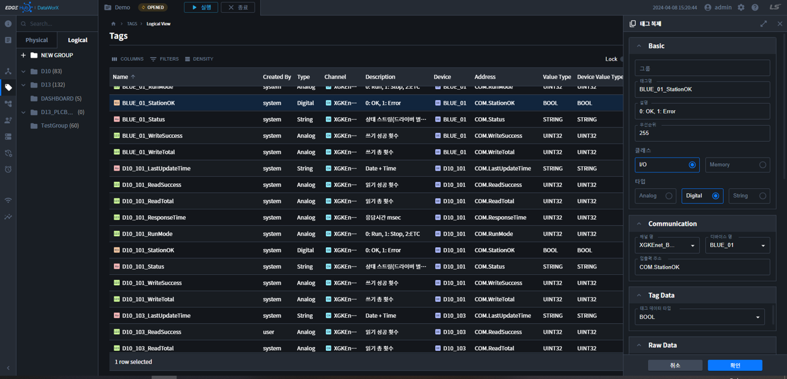

### 3.10 태그 옵션 설정  
1. 테이블 상단의 `더보기` 버튼을 클릭합니다.  

2. `태그 옵션 설정` 버튼을 클릭합니다.  

    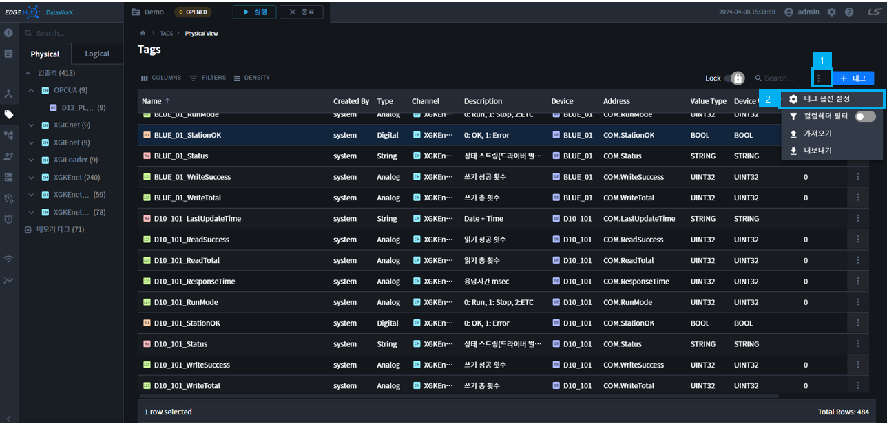

3. `ANALOG TAG DATA, DIGITAL LABELS, ALARM MESSAGES` 3가지 탭이 있습니다.  

  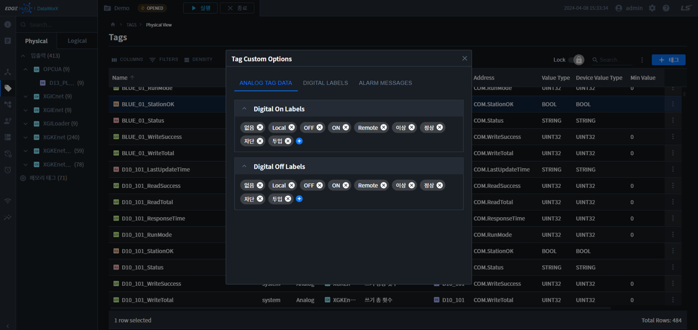

  {: .highlight }
  ✅ **ANALOG TAG DATA**: `Analog Data Units(데이터 단위)`를 추가하고 삭제할 수 있습니다.   
  ✅ **DIGITAL LABELS**: `Digital On Labels, Digital Off Labels`를 추가하고 삭제할 수 있습니다.  
  ✅ **ALARM MESSAGES**: `Alarm Occurence Messages(알람 발생 메시지), Alaram Recovery Messages(알람 복구 메시지), Alarm Custom Messages(사용자 지정 메시지)` 를 추가하고 삭제할 수 있습니다. 

## 4. 태그 복사/붙여넣기  
  태그 복사/붙여넣기는 Logical Tag에서만 가능합니다.

  
### 4.1. 태그 복사  
  태그 리스트부분에서 태그 선택 후, 테이블 상단의 `복사` 클릭 또는 `Ctrl + C` 단축키를 입력하여 복사합니다.

  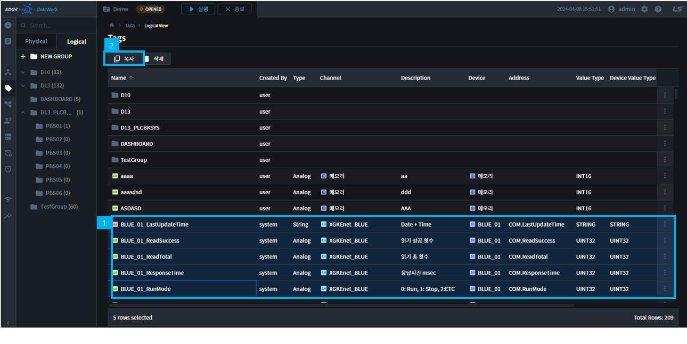

  태그리스트 선택은 다음 단축키 사용가능합니다.

  {: .note }
  `CTRL + A`로 전체 선택을 사용할 수 있습니다.  
  `SHIFT + Click`으로 여러개를 선택할 수 있습니다.  
  `CTRL + Click`으로 다중선택할 수 있습니다.  

### 4.2. 태그 붙여넣기  
  태그 서브 네비게이션에서 복사를 원하는 곳으로 이동 후, 테이블 상단의 `붙여넣기` 클릭 또는 `CTRL + V` 단축키를 입력하여 붙여넣습니다.  

  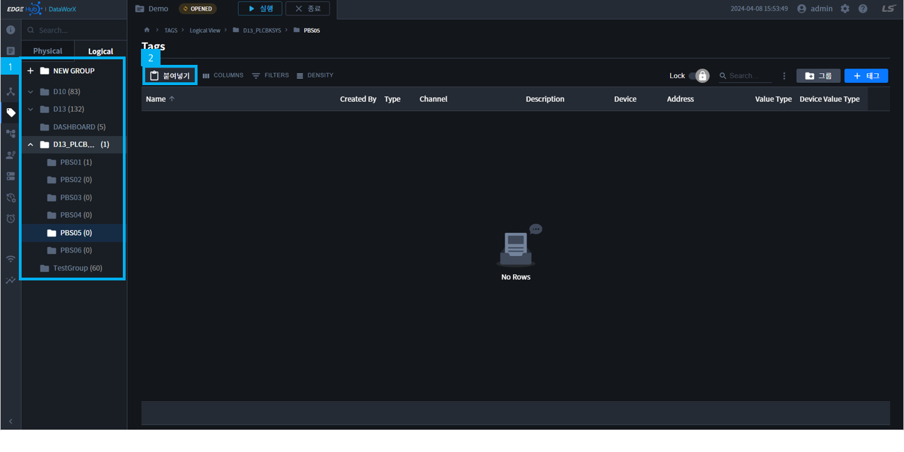

  붙여넣기 결과는 하단의 Snack Bar를 통해 확인할 수 있습니다.

  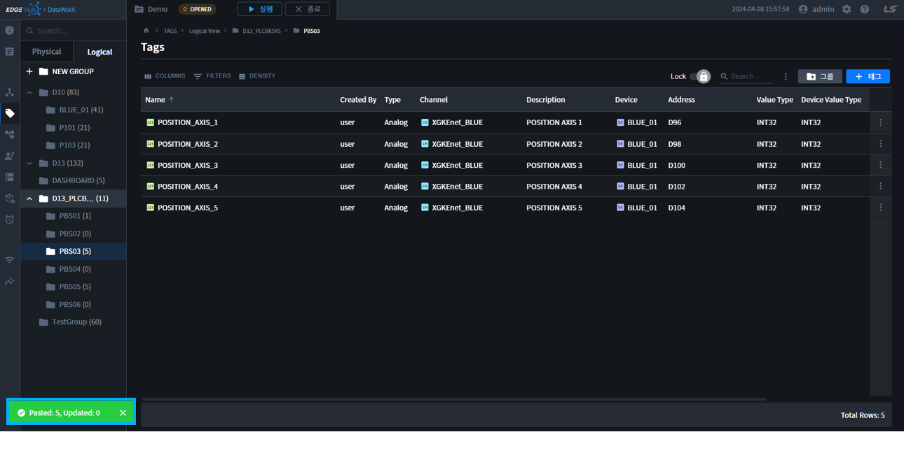

## 5. 엑셀 연계기능  
대량의 태그 작업시, Excel(xlsx)파일을 이용하여 태그를 추가하거나 수정하는 기능입니다.  
태그 리스트 상단의 `더보기 메뉴`에서 `가져오기/내보내기` 버튼을 통해 해당 기능을 수행할 수 있습니다.

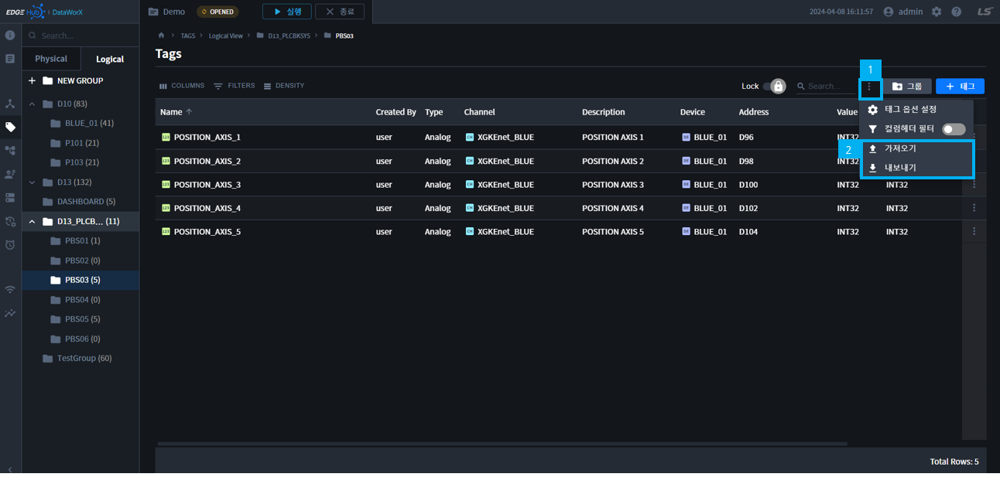

### 5.1 엑셀 내보내기  
태그 정보를 Excel(XLSX) 파일로 저장하는 기능입니다.  
파일명은 `tags_날짜_시간` 입니다.  

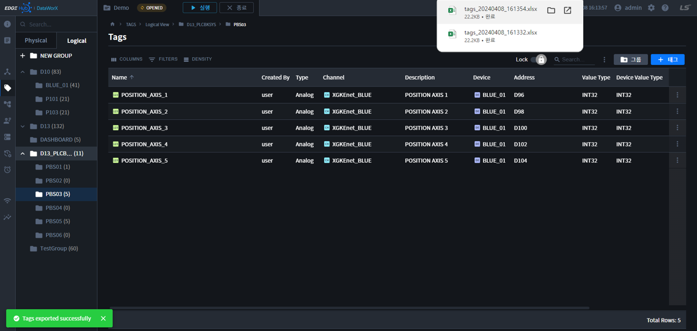

생성된 파일 예시입니다.  

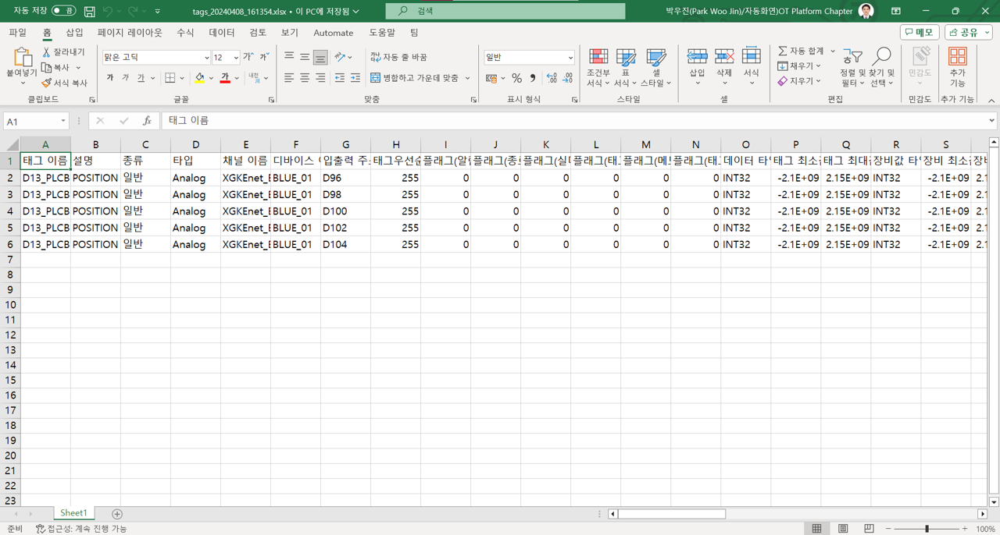

### 5.2 엑셀 가져오기  

내보내기로 저장된 Excel(XLSX) 파일을 태그 데이터로 가져오는 기능입니다.  
가져오기 버튼을 클릭하면 다음과 같이 엑셀 파일을 선택하는 대화상자가 나타납니다.  

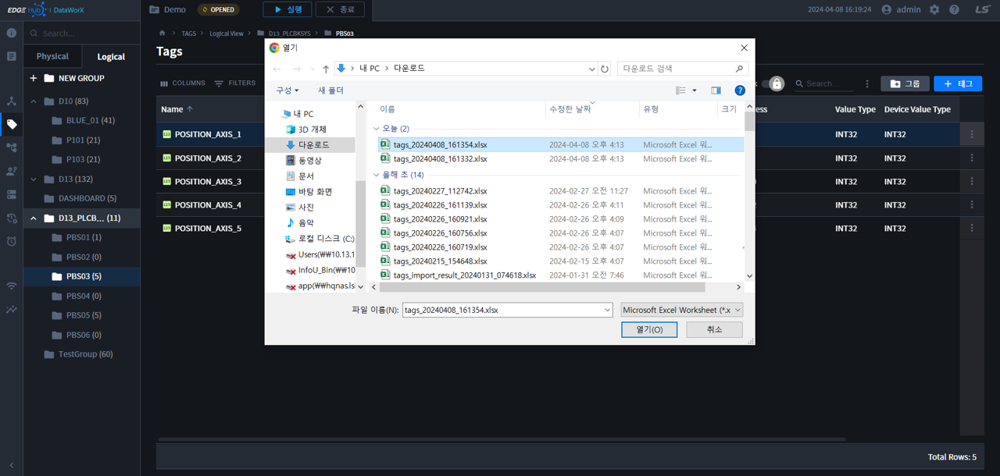

가져오기 원하는 파일을 선택한 후 `열기` 버튼을 클릭하면 Excel 파일의 데이터가 DataWorX의 태그로 저장이 됩니다.  
태그 `이름이 같은 경우`에는 `업데이트`, `다른 경우`에는 `태그 추가`가 되며 가져오기 결과는 다음과 같이 전체, 성공, 실패 개수 요약 화면으로 나타납니다.  
테이블을 확인하면, 각각의 태그가 `수정/추가`인지 확인할 수 있습니다.  

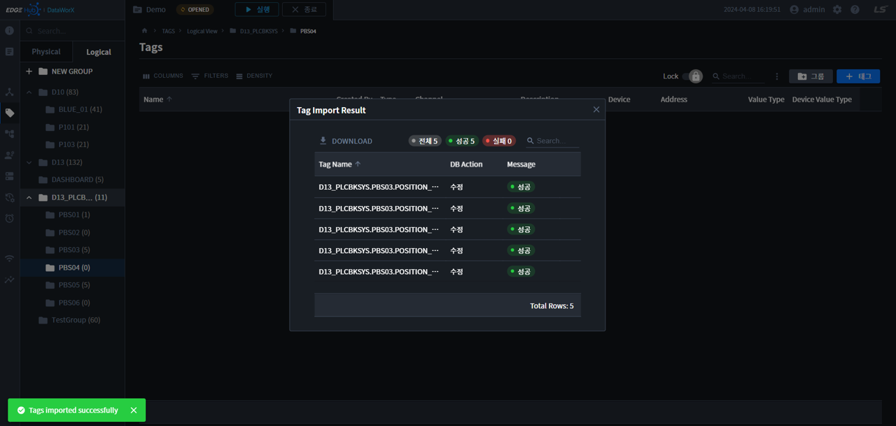

태그 가져오기 결과의 `DOWNLOAD` 버튼을 클릭하면, 결과를 엑셀 파일로 확인할 수 있습니다.

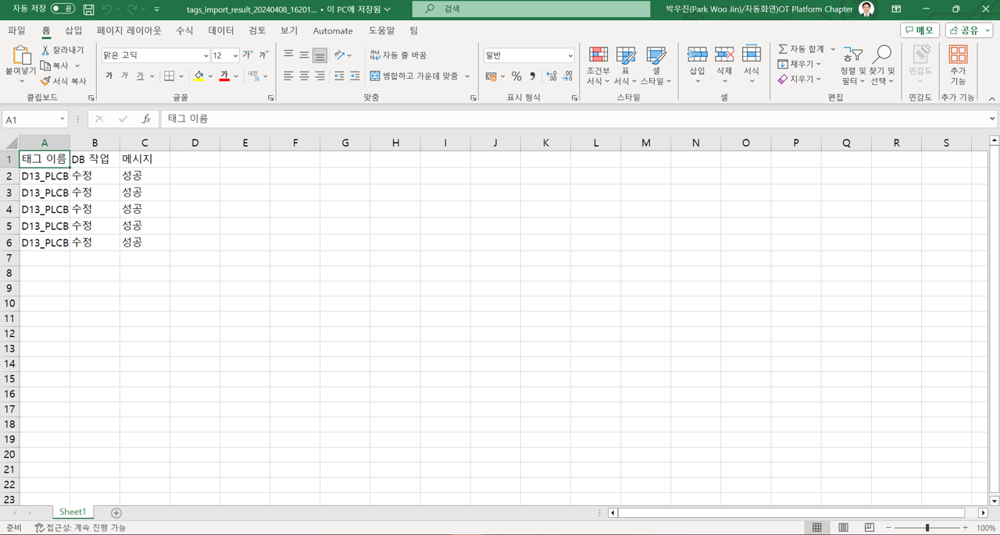

