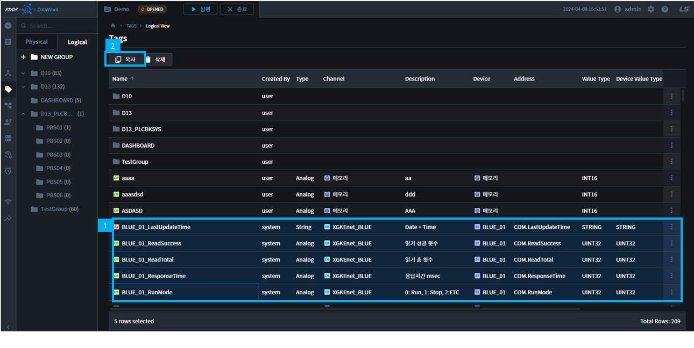
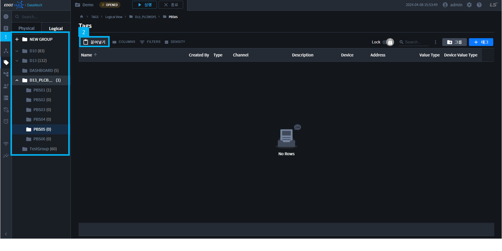
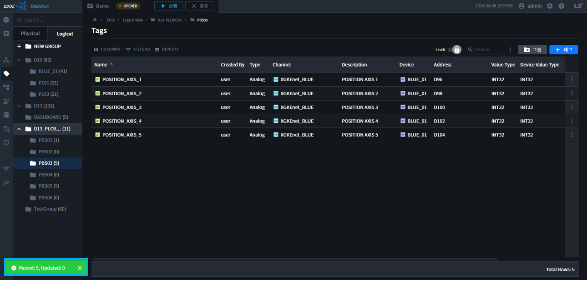
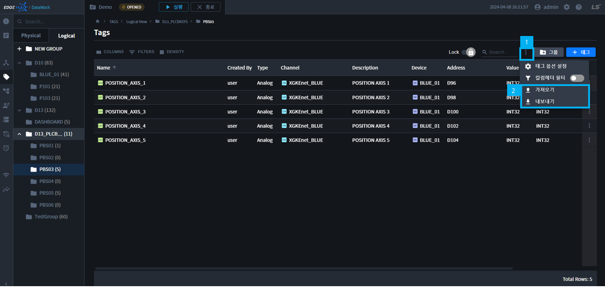
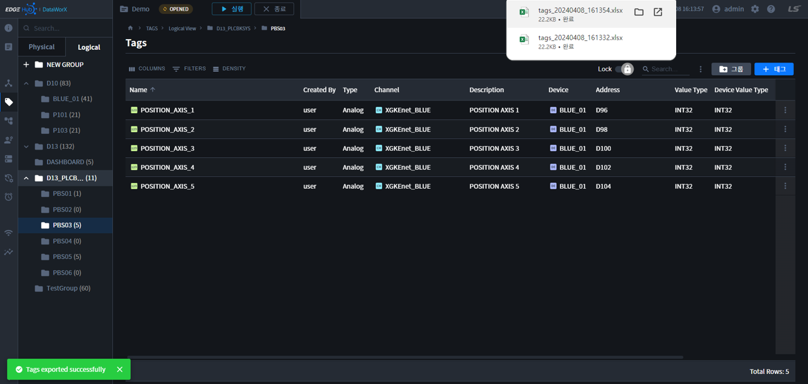
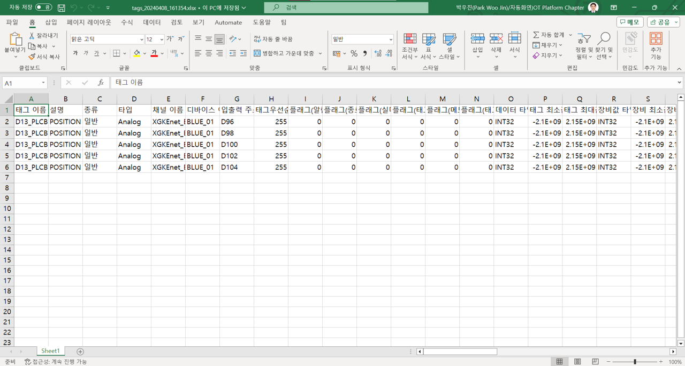
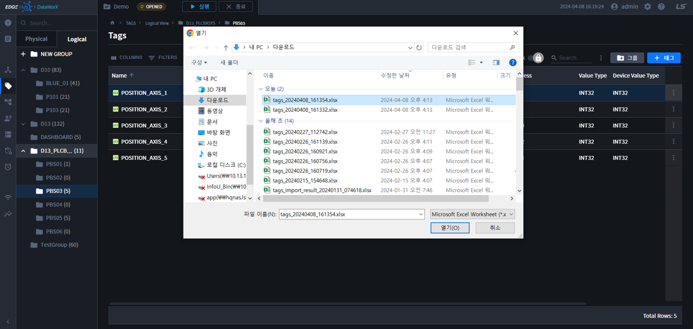
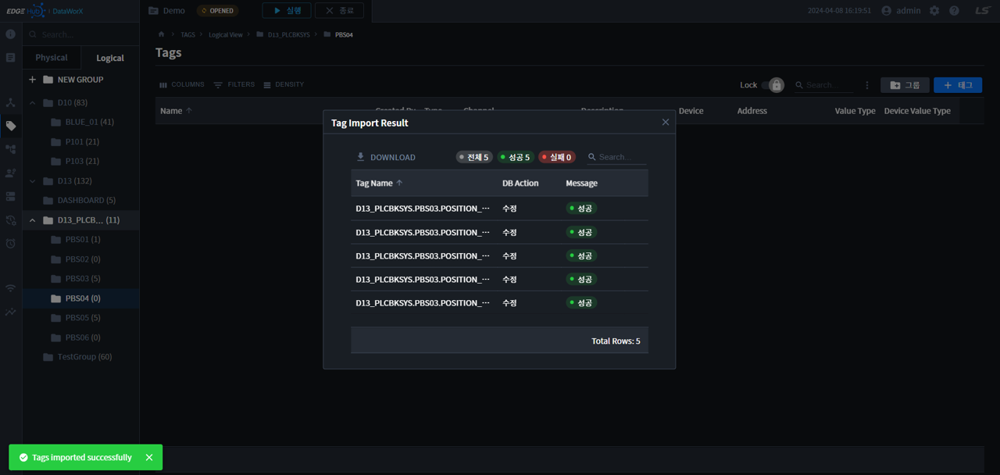
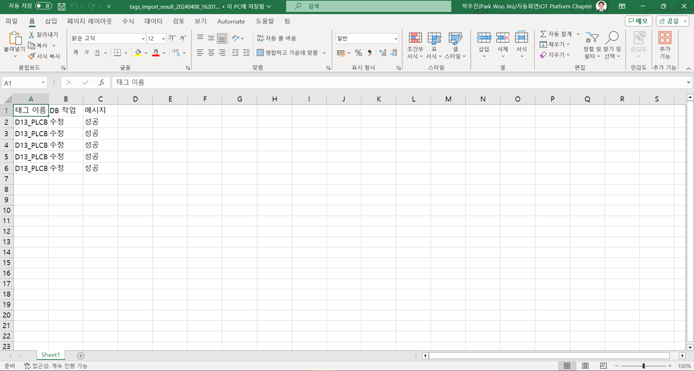

{: .no_toc }
# 태그

- TOC
{:toc}

## 태그 복사/붙여넣기  
  태그 복사/붙여넣기는 Logical Tag에서만 가능합니다.

  
### 1. 태그 복사  
  태그 리스트부분에서 태그 선택 후, 테이블 상단의 `복사` 클릭 또는 `Ctrl + C` 단축키를 입력하여 복사합니다.

  

  태그리스트 선택은 다음 단축키 사용가능합니다.

  {: .note }
  `CTRL + A`로 전체 선택을 사용할 수 있습니다.  
  `SHIFT + Click`으로 여러개를 선택할 수 있습니다.  
  `CTRL + Click`으로 다중선택할 수 있습니다.  
  `첫번째 행을 클릭` => `SHIFT + END` 로 전체선택할 수 있습니다.

### 2. 태그 붙여넣기  
  태그 서브 네비게이션에서 복사를 원하는 곳으로 이동 후, 테이블 상단의 `붙여넣기` 클릭 또는 `CTRL + V` 단축키를 입력하여 붙여넣습니다.  

  

  붙여넣기 결과는 하단의 Snack Bar를 통해 확인할 수 있습니다.

  

## 엑셀 연계기능  
대량의 태그 작업시, Excel(xlsx)파일을 이용하여 태그를 추가하거나 수정하는 기능입니다.  
태그 리스트 상단의 `더보기 메뉴`에서 `가져오기/내보내기` 버튼을 통해 해당 기능을 수행할 수 있습니다.

### 1. 엑셀 내보내기  
태그 정보를 Excel(XLSX) 파일로 저장하는 기능입니다.  
파일명은 `tags_날짜_시간` 입니다.  

생성된 파일 예시입니다.  

### 2. 엑셀 가져오기  

내보내기로 저장된 Excel(XLSX) 파일을 태그 데이터로 가져오는 기능입니다.  
가져오기 버튼을 클릭하면 다음과 같이 엑셀 파일을 선택하는 대화상자가 나타납니다.  

가져오기 원하는 파일을 선택한 후 `열기` 버튼을 클릭하면 Excel 파일의 데이터가 DataWorX의 태그로 저장이 됩니다.  
태그 `이름이 같은 경우`에는 `업데이트`, `다른 경우`에는 `태그 추가`가 되며 가져오기 결과는 다음과 같이 전체, 성공, 실패 개수 요약 화면으로 나타납니다.  
테이블을 확인하면, 각각의 태그가 `수정/추가`인지 확인할 수 있습니다.  

태그 가져오기 결과의 `DOWNLOAD` 버튼을 클릭하면, 결과를 엑셀 파일로 확인할 수 있습니다.

