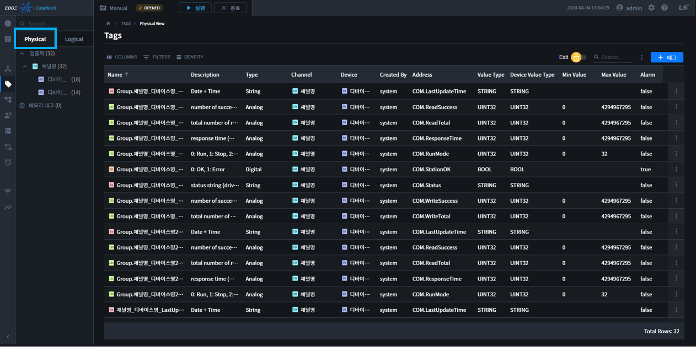
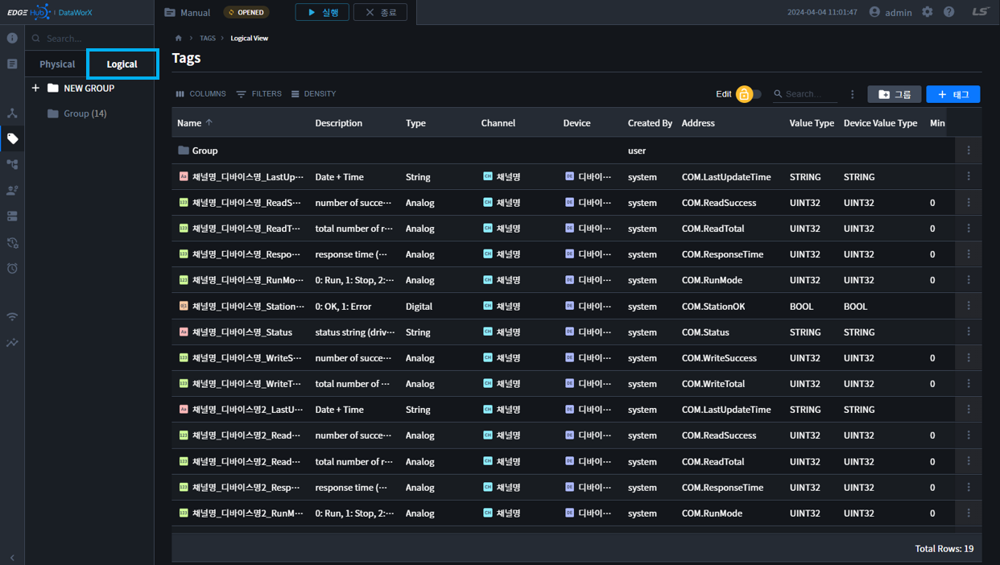

{: .no_toc }
# 태그 보기
태그를 보다 편리하게 관리할 수 있도록 물리적 보기와 논리적 보기를 제공합니다. 보기는 서브 내비게이션의 탭을 통해 변경할 수 있습니다.

- TOC
{:toc}

## 물리적 보기(Physical)  
- 태그의 이름과 상관없이 물리적으로 디바이스에 연결된 형태로 보여주는 형식입니다.  

## 논리적 보기(Logical)  
- 태그를 이름으로 파싱하여 논리적인 계층 구조로 보여주는 형식입니다.  
- 태그를 생성할 때 보여지는 논리 구조를 설계한 후 네이밍을 합니다. 부모이름을 포함한 전체 트리의 경로가 태그의 이름이 됩니다.  
- 태그명을 “.” 단위로 구분하여 표현되는 트리구조로, 예를들어 태그명이 A.B.C인 경우, 그룹태그가 A, A.B 두개 생기고, A.B.C라는 일반 태그가 생성됩니다.

{: .note }
사용자는 테이터를 등록한 태그를, 그룹화하여 태그를 관리하거나, 모니터링할 수 있습니다.  
사용자의 기호에 따라, 공장 라인별, 제품별, 특징 등으로 구분하여 관리할 수 있습니다.

